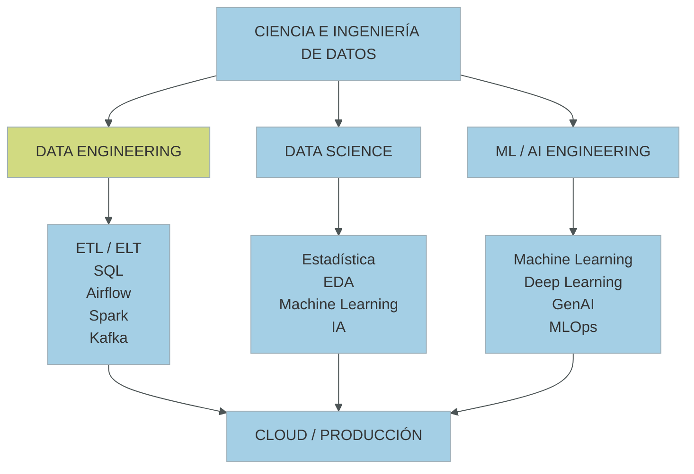
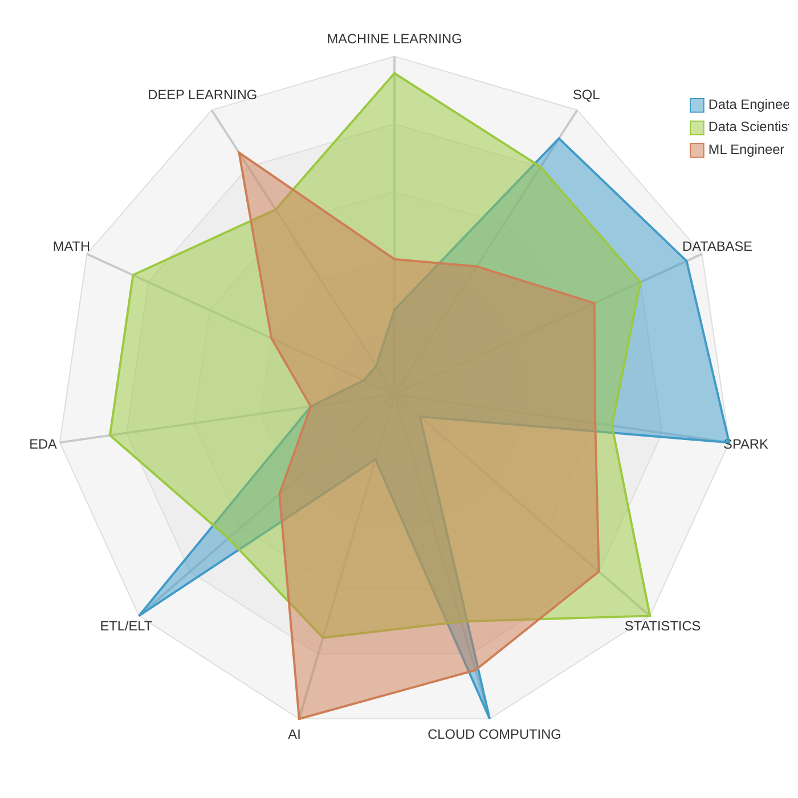
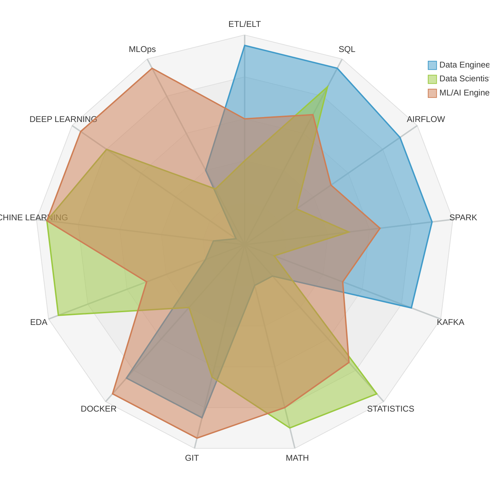
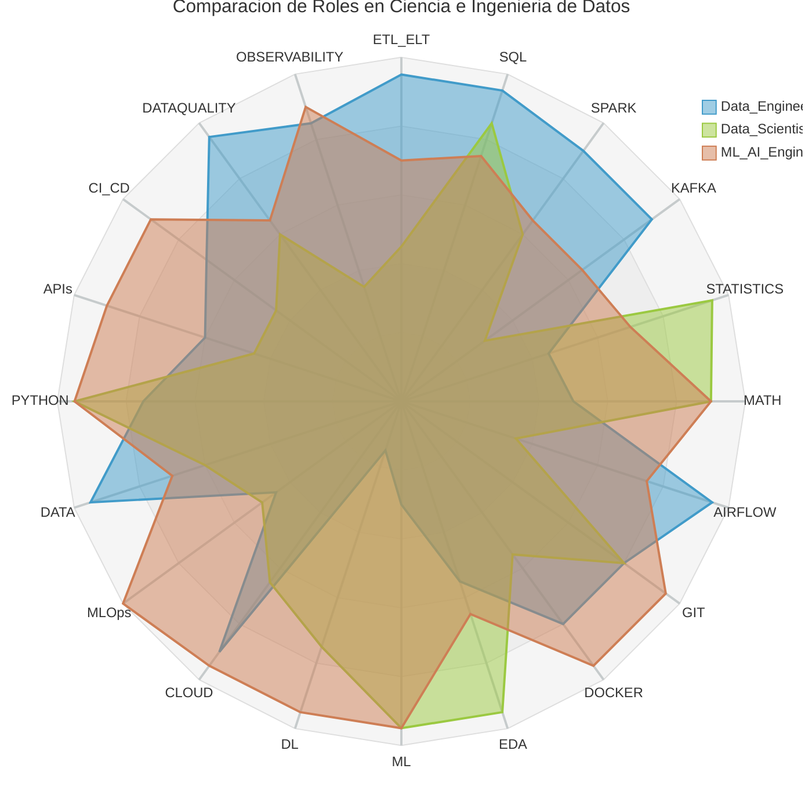
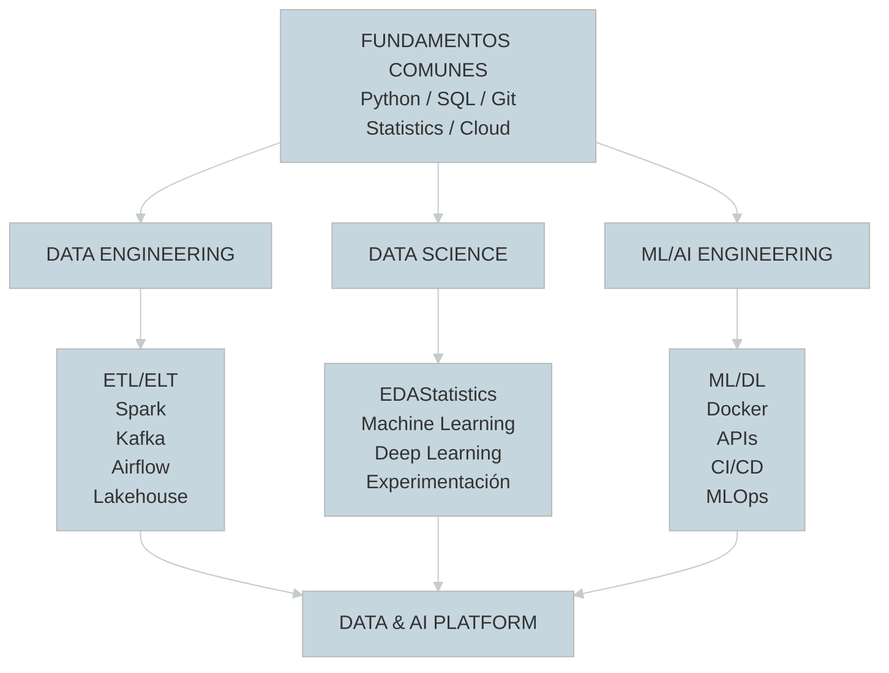

# Ciencia e Ingeniería de Datos

<center>
<figure>

<figcaption></figcaption>
</figure>
</center>

La evolución del mercado laboral ha generado una convergencia progresiva entre los perfiles de **Data Scientist, Data Engineer, Machine Learning Engineer, Analytics Engineer y AI Engineer**.

Tradicionalmente, estos perfiles se formaban de manera separada. Sin embargo, en la práctica profesional actual existe una creciente interdependencia:

* el Data Scientist necesita comprender cómo se generan, almacenan, transforman y disponibilizan los datos;
* el Data Engineer necesita comprender las características de los datasets que alimentan modelos analíticos y de Machine Learning;
* el ML Engineer necesita dominar tanto pipelines de datos como modelamiento;
* el profesional de IA necesita integrar datos, modelos, APIs, infraestructura y mecanismos de evaluación.

#### 📚 Objetivo

Formar profesionales capaces de **diseñar, desarrollar, implementar, evaluar y operar soluciones integrales de datos**, combinando fundamentos de Ciencia de Datos, Ingeniería de Datos, Machine Learning, Inteligencia Artificial, arquitectura de software, computación distribuida, cloud computing y MLOps.

No es formar especialistas aislados en herramientas, sino profesionales capaces de desarrollar el ciclo completo:


:::info[Capacidades:]
Diseñar y desarrollar soluciones de datos completas, desde la adquisición e ingestión de información hasta su procesamiento, almacenamiento, análisis, modelamiento predictivo, implementación de soluciones de inteligencia artificial y despliegue en ambientes productivos.
:::


En un entorno productivo, ambos mundos se encuentran estrechamente relacionados.

Un modelo predictivo de alto rendimiento puede ser inútil si:

* los datos no llegan correctamente;
* el pipeline no es reproducible;
* existen problemas de calidad;
* el dataset presenta data drift;
* el proceso no está automatizado;
* el modelo no puede desplegarse;
* no existe monitoreo;
* el código solamente funciona dentro de un notebook.

Por otra parte, un Data Engineer necesita comprender:

* qué variables necesita un modelo;
* cómo se genera leakage;
* cómo preparar features;
* cómo evaluar datasets;
* cómo funcionan los modelos;
* qué características debe tener un dataset analítico.

Por ello, se propone una formación **T-shaped**:

<center>

</center>
<br />
<center>
**Tools & Knowlegdes**

**TOOLS & KNOWLEDGES BY ROL (0-100)**

**TOOLS & KNOWLEDGES BY ROL (0-100)**

</center>
Los roles de **Ingeniero de Datos** y **Científico de Datos** representan dos disciplinas complementarias pero con responsabilidades, metodologías y conjuntos de herramientas profundamente diferenciados.

El patrón que emerge es bastante claro:

* **Data Engineer** → "hacer que los datos existan, fluyan y sean confiables"
Su núcleo está en ETL/ELT + SQL + Spark + Kafka + Airflow + cloud + data platforms + calidad.
* **Data Scientist** → "convertir datos en conocimiento y modelos"
Su núcleo está en estadística + matemáticas + Python + EDA + Machine Learning + Deep Learning.
* **ML/AI Engineer** → "convertir modelos en sistemas productivos"
Su núcleo está en ML/DL + Python + Docker + cloud + APIs + CI/CD + MLOps + observabilidad.

Lo más interesante es que los tres roles forman una cadena:
```text
                 DATA ENGINEERING
                        │
                        │ Datos confiables
                        ▼
                 DATA SCIENCE
                        │
                        │ Modelos / conocimiento
                        ▼
                ML / AI ENGINEERING
                        │
                        │ Sistemas productivos
                        ▼
                 Aplicaciones de IA
```
Donde hay una zona común que debería ser obligatoria:

Python + SQL + Git + Docker + Cloud + arquitectura de datos + estadística + EDA + fundamentos de ML

Y posteriormente profundizar en cada rol específico:
<center>


</center>

### Definiciones

*   **Ingeniero de Datos (*Data Engineer*):** Este rol está asociado al especialista en software y sistemas encargado de diseñar, construir, optimizar y mantener las canalizaciones de datos (*data pipelines*) y las arquitecturas de almacenamiento asociadas (como *Data Lakes*, *Data Warehouses* o *Lakehouses*). Su objetivo primordial es realizar el "trabajo invisible" de ingesta, limpieza e integración a gran escala (Big Data) para transformar datos crudos y sucios en activos de datos limpios, consistentes, particionados y gobernados, listos para ser consumidos.

*   **Científico de Datos (*Data Scientist*):** Es el especialista analítico enfocado en interrogar los datos, formular preguntas de negocio, extraer *insights* estadísticos y construir modelos predictivos o prescriptivos de Machine Learning y Deep Learning. Tradicionalmente, se le define mediante el aforismo clásico: *"Un científico de datos es alguien que sabe más de ingeniería de software que cualquier estadístico, y más de estadística que cualquier ingeniero de software"*. Su prioridad es el valor de negocio de las predicciones y la optimización de métricas de modelado.


### Diferencias

Las discrepancias entre ambos roles se estructuran en tres dimensiones clave: su enfoque en el ciclo de vida del dato, sus herramientas de trabajo y la naturaleza de sus entregables.

| Dimensión | Ingeniero de Datos | Científico de Datos |
| :--- | :--- | :--- |
| **Enfoque Principal** |**Infraestructura, confiabilidad y escalabilidad.** Se asegura de que los datos fluyan eficientemente desde las fuentes transaccionales hasta los destinos de analítica sin pérdida de datos. |**Modelado, experimentación y predicción.** Se enfoca en entender los patrones matemáticos del dato y optimizar algoritmos para tomar decisiones de negocio futuras. |
| **Etapa en el Ciclo del Dato** | **Onboarding e Ingesta.** Captura datos de sistemas de origen (APIs, bases de datos OLTP, colas de mensajería) y aplica transformaciones iniciales pesadas. | **Active Duty.** Consume los datos procesados para entrenar modelos, validar hipótesis, realizar análisis de correlación y desplegar servicios predictivos. |
| **Herramientas de Cabecera** | Motores distribuidos (Apache Spark/PySpark), orquestadores de flujos ([Apache Airflows](/docs/airflow)), bases de datos NoSQL y almacenes con transacciones ACID (Delta Lake, Apache Iceberg). | Librerías de modelado (Scikit-Learn, PyTorch, TensorFlow), manipulación local ([Pandas](/docs/pandas)), visualización ([Matplotlib](/docs/matplotlib), [Seaborn](/docs/seaborn)) y plataformas de tracking (MLflow). |
| **Propiedades Clave del Código** | **Idempotencia, tolerancia a fallos y atomicidad.** El código debe ser reproducible y capaz de reejecutarse sobre petabytes de datos sin duplicar registros. | **Iteración rápida y determinismo.** El código se ejecuta de forma iterativa y ad-hoc para buscar hiperparámetros y evaluar funciones de pérdida (*loss functions*). |

---

### Integración y Sinergia de los Roles

El éxito de los proyectos modernos de Machine Learning (MLOps) radica en cómo se estructuran las interfaces de trabajo entre ingenieros y científicos de datos para evitar silos y cuellos de botella:

#### A. El Pipeline de Datos como Contrato de Entrega
La integración más limpia ocurre cuando el ingeniero de datos expone una capa de datos procesados (comúnmente llamada capa *Silver* o *Gold* en una arquitectura Medallón). Al dejar los datos particionados, limpios y catalogados (por ejemplo, mediante Unity Catalog o un Feature Store), el científico de datos puede entrenar modelos de forma autónoma sin verse ralentizado por problemas de infraestructura.

#### B. El Problema del *Training-Serving Skew*
Cuando los científicos de datos programan de forma aislada en sus cuadernos de notas (*notebooks*) con herramientas locales (como Pandas), y luego el equipo de DevOps o ingeniería de software tiene que reescribir ese código en otro lenguaje para integrarlo a una API de producción, se produce una discrepancia de lógica conocida como **Training-Serving Skew**. 

Para integrarse correctamente, ambos roles deben trabajar bajo el concepto de **Pipelines unificados (p. ej., a través de Spark ML o Tensorflow Transform)**, donde las transformaciones de ingeniería de características (*feature engineering*) se encapsulan junto con el binario del modelo, garantizando que el preprocesamiento sea idéntico tanto en el entrenamiento asíncrono (batch) como en la inferencia en tiempo real (streaming).

#### C. Topologías de Equipos y la Ilusión del "Full-Stack"
*   **Enfoque de División de Trabajo Estricta:** El científico "lanza el modelo sobre la pared" (*throw it over the wall*) para que el ingeniero de datos u Ops lo ponga en producción. Suele fallar por falta de contexto operativo compartido.

*   **El Científico "End-to-End" (*Grumpy Unicorns*):** Se espera que el científico de datos desarrolle el modelo y configure la infraestructura distribuida de red (como clústeres de Kubernetes o flujos de Docker). Esto genera frustración porque, como señala Erik Bernhardsson: *"Esperar que un científico de datos administre infraestructura de Kubernetes es como esperar que un desarrollador de aplicaciones entienda cómo funciona el kernel de Linux"*.

*   **La Solución de Plataforma:** Los ingenieros de datos y de plataforma diseñan e implementan herramientas abstractas y plantillas centralizadas (como repositorios unificados de MLflow, almacenes de características y flujos orquestados). El científico de datos utiliza estas abstracciones para desplegar de forma segura sus modelos, maximizando la eficiencia de ambos perfiles.

---

### Ejemplo Práctico de Sinergia

El siguiente ejemplo simula cómo interactúan de manera integrada ambos roles en un pipeline analítico de producción:

#### Paso 1: Código del Ingeniero de Datos (PySpark)
*El ingeniero diseña el pipeline distribuido para procesar terabytes de transacciones de manera escalable e idempotente en el clúster de Spark, guardándolo en un formato optimizado columnar (Parquet/Delta).*

```python showLineNumbers
# data_engineering_pipeline.py
from pyspark.sql import SparkSession
import pyspark.sql.functions as F

# 1. El ingeniero inicializa la sesión distribuida asignando memoria de driver
spark = SparkSession.builder \
    .appName("IngestaYLimpiezaEscalable") \
    .config("spark.driver.memory", "8g") \
    .getOrCreate()

# 2. Ingesta inmutable de datos masivos (Capa Bronze)
df_raw = spark.read.csv("s3://raw-retail-bucket/transactions.csv", header=True, inferSchema=True)

# 3. Limpieza de nulos, tipado y estandarización (Capa Silver)
df_cleaned = df_raw.dropna(subset=["CustomerID", "Quantity"]) \
                   .withColumn("UnitPrice", F.col("UnitPrice").cast("double")) \
                   .withColumn("TotalAmount", F.col("Quantity") * F.col("UnitPrice"))

# 4. Almacenamiento optimizado para el consumo del Científico de Datos
df_cleaned.write.mode("overwrite").parquet("s3://processed-retail-bucket/clean_features.parquet")

spark.stop()
```

#### Paso 2: Código del Científico de Datos (Scikit-Learn)
*El científico de datos consume directamente el archivo limpio y estructurado por el ingeniero de datos para entrenar un clasificador, enfocándose exclusivamente en el rendimiento matemático de su modelo.*

```python showLineNumbers
# ml_science_training.py
import pandas as pd
from sklearn.model_selection import train_test_split
from sklearn.ensemble import RandomForestClassifier
import mlflow

# 1. El científico carga directamente la ruta limpia expuesta por el pipeline del ingeniero
df = pd.read_parquet("s3://processed-retail-bucket/clean_features.parquet")

# 2. Separación de atributos y etiquetas para el entrenamiento
X = df[["Quantity", "UnitPrice", "TotalAmount"]]
y = df["IsReturned"]  # Variable objetivo

X_train, X_test, y_train, y_test = train_test_split(X, y, test_size=0.2, random_state=42)

# 3. Entrenamiento y versionado del experimento usando MLflow
with mlflow.start_run():
    clf = RandomForestClassifier(n_estimators=100, max_depth=5, random_state=42)
    clf.fit(X_train, y_train)
    
    # Registro de métricas y modelo en el servidor central de tracking
    accuracy = clf.score(X_test, y_test)
    mlflow.log_metric("accuracy", accuracy)
    mlflow.sklearn.log_model(clf, "random_forest_retail")
    
    print(f"Modelo entrenado exitosamente. Precisión del modelo: {accuracy:.4f}")
```

***

## Machine Learning Engineer

El **Ingeniero de Machine Learning (ML Engineer)** es el rol que actúa como el puente definitivo en el ecosistema de datos, resolviendo la brecha que tradicionalmente ha existido entre el modelado experimental del Científico de Datos y la infraestructura robusta y escalable del Ingeniero de Datos. 

Mientras que el Científico de Datos se enfoca en descubrir patrones matemáticos y el Ingeniero de Datos en mover y limpiar la información, el **ML Engineer se especializa en la operacionalización de la Inteligencia Artificial (MLOps)**. Su objetivo es asegurar que los modelos salgan del entorno de laboratorio (como un *Jupyter Notebook*) y se conviertan en servicios de producción altamente disponibles, seguros, monitoreables y capaces de auto-adaptarse a los cambios en el mundo real.

---

### Sinergia de Roles

El desarrollo moderno de sistemas de IA requiere un enfoque multidisciplinario. El ML Engineer no trabaja de forma aislada, sino que articula las capacidades de todo el equipo de datos:

*   **El Ingeniero de Datos** suministra datos limpios y procesados (capas *Silver* y *Gold* del Lakehouse) a través de tuberías de datos (*pipelines*) masivas.
*   **El Científico de Datos** consume estos datos para realizar análisis exploratorios, diseñar la arquitectura del modelo y entrenar prototipos experimentales.
*   **El ML Engineer** toma este prototipo, empaqueta sus dependencias, optimiza su rendimiento computacional para el hardware de destino (como GPUs), e implementa la infraestructura de despliegue, monitoreo y reentrenamiento automatizado.

En esencia, el ML Engineer lidera la práctica de **MLOps**, la cual unifica tres disciplinas:

```math
MLOps = DevOps (para código) +DataOps (para datos) + ModelOps (para modelos)
```

---

### Responsabilidades Clave del ML Engineer

Un Ingeniero de ML tiene cuatro áreas fundamentales de acción bajo las metodologías de gobernanza y operaciones modernas:

#### A. Empaquetado y Gobernanza de Activos de IA
Un modelo en su estado pasivo es simplemente un archivo binario. El ML Engineer debe empaquetarlo de forma estándar para que sea portátil y reproducible en cualquier entorno de ejecución, utilizando formatos como **MLflow Models** u **ONNX**. Además, trabaja junto con herramientas como **Unity Catalog** para configurar el acceso seguro a activos de IA no tabulares (como modelos, funciones y colecciones de imágenes o audio) bajo el principio de privilegio mínimo.

#### B. Automatización y CI/CD para Machine Learning (CD4ML)
La entrega continua para Machine Learning exige automatizar todo el ciclo de vida del modelo. El ML Engineer diseña canalizaciones que se disparan automáticamente (por ejemplo, ante la llegada de nuevos datos) para reentrenar el modelo, validar que cumpla con los umbrales de precisión requeridos comparándolo con el modelo campeón anterior, y actualizar el servicio sin interrumpir la operación.

#### C. Inferencia y Model Serving (Batch y Real-Time)
El ingeniero debe elegir y configurar la arquitectura de servicio de predicciones más eficiente según las necesidades del negocio:
*   **Inferencia en Lotes (*Batch*):** Ideal para procesar grandes volúmenes de datos de manera asíncrona mediante motores como Apache Spark, donde la latencia de respuesta no es crítica (por ejemplo, segmentación semanal de clientes).
*   **Inferencia en Tiempo Real (*Online*):** Exige una latencia de milisegundos mediante el despliegue del modelo como un microservicio encapsulado en contenedores Docker y expuesto a través de endpoints de APIs REST o gRPC (como **Mosaic AI Model Serving** o **TensorFlow Serving**).

#### D. Observabilidad y Monitoreo de Deriva (*Drift*)
Una vez que el modelo está en producción, su precisión tiende a degradarse inevitablemente debido al paso del tiempo y a cambios en el comportamiento del usuario; un fenómeno conocido como **data distribution shift** o **data drift**. El ML Engineer implementa sistemas de observabilidad activa (capturando logs y telemetría en tablas de inferencia) para medir continuamente las métricas operativas (latencia, consumo de memoria) y las métricas de negocio para detectar cuándo es necesario reentrenar de forma adaptativa el sistema.

<br/>
<Tabs>
<TabItem value="mnp" label="Ejemplo" default>
<div class="alert alert--primary">
**Registro y Transición de Modelos (MLOps)**

En el día a día, el ML Engineer utiliza herramientas como **MLflow** para interactuar de manera programática con el **Model Registry**. El siguiente script ilustra cómo un ingeniero de ML interactúa con la API para registrar un nuevo modelo entrenado por el Científico de Datos, consultar su versión y promoverlo de manera segura al estado de producción.

Este enfoque estructurado e industrializado garantiza que el ciclo de vida del aprendizaje automático sea elástico, auditable y robusto frente a los desafíos inherentes a operar modelos a gran escala.
</div>
</TabItem>
<TabItem value="mnp-python" label="💻 Código">

```python showLineNumbers
"""
Ejemplo de ingeniería de producción: Registro, transición de fases 
y serving del modelo de forma programática.
"""

import mlflow
from mlflow.tracking.client import MlflowClient

# 1. Configurar la conexión con el servidor de tracking de MLOps
# El ML Engineer típicamente orquesta este servidor de forma centralizada.
mlflow.set_tracking_uri("http://servidor-mlops-produccion:8080")
client = MlflowClient()

nombre_modelo = "red_neuronal_ventas_ecommerce"
run_id = "8433bb847f514e28a73189bbab767222"  # ID de la ejecución del Científico de Datos
artifact_path = "modelo_refinado"

# 2. Registrar el modelo en el repositorio centralizado
# Esto le da un linaje lógico y trazabilidad al activo de IA
model_uri = f"runs:/{run_id}/{artifact_path}"
version_metadata = mlflow.register_model(model_uri=model_uri, name=nombre_modelo)

print(f"Modelo registrado exitosamente. Versión asignada: {version_metadata.version}")

# 3. Transición de Etapa (Stage Transition)
# El ML Engineer promueve el modelo tras pasar pruebas automáticas de calidad
client.transition_model_version_stage(
    name=nombre_modelo,
    version=version_metadata.version,
    stage="Production",  # Opciones: Staging, Production, Archived
    archive_existing_versions=True  # Archiva de forma segura el modelo campeón anterior
)

print(f"Versión {version_metadata.version} promovida de forma segura a PRODUCCIÓN.")

# 4. Invocación para Model Serving (Uso fuera de Spark)
# El ML Engineer puede ahora levantar un servidor HTTP nativo para inferencia en tiempo real
# mediante la consola del sistema o API Gateway:
# $ mlflow models serve -m "models:/red_neuronal_ventas_ecommerce/Production" -p 5001
```
</TabItem>
</Tabs><br />

***
