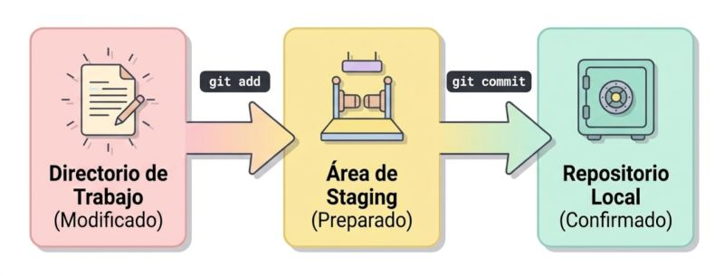

## Git control de versiones

Un **control de versiones** es un sistema técnico que **registra de manera detallada cada cambio realizado en el código fuente de un proyecto**, permitiendo mantener un histórico completo de las modificaciones, identificar quién las realizó y cuándo ocurrieron. En términos prácticos, funciona como una serie de "fotografías" o instantáneas del estado de los archivos en momentos específicos, lo que permite navegar por la evolución del proyecto como si fuera una línea del tiempo.

### Origen del sistema moderno Git

Aunque los sistemas de control de versiones existen desde hace décadas, el estándar actual, **Git**, fue **diseñado originalmente por Linus Torvalds en 2005**. Su creación surgió de una necesidad crítica durante el desarrollo del kernel de Linux: tras una disputa con la empresa propietaria de BitKeeper (el software que usaban antes), la comunidad perdió el acceso a dicha herramienta. Torvalds decidió entonces crear un sistema propio que fuera **rápido, eficiente y, sobre todo, distribuido**, superando las limitaciones de alternativas centralizadas de la época como Subversion.

### Características técnicas principales

*   **Arquitectura Distribuida:** A diferencia de los sistemas antiguos, un control de versiones distribuido aloja una **copia completa del repositorio en cada máquina local** que trabaja en el código. Esto permite trabajar sin conexión a internet y asegura que, si el servidor central falla, cualquier colaborador pueda restaurar el proyecto completo.

*   **Ramificación (Branching):** Es la capacidad de crear **líneas de desarrollo independientes** o bifurcaciones. Esto permite que un equipo trabaje en una nueva funcionalidad en una rama mientras otro corrige un error en una rama distinta, sin que sus cambios se interfieran hasta que decidan integrarlos.

*   **Confirmaciones (Commits):** Cada unidad de guardado es un **commit**, que registra los cambios exactos y les asigna un identificador único (hash). Cada commit incluye metadatos como el autor, la fecha y un mensaje descriptivo.

*   **Fusión e Integración (Merge/Rebase):** Proporciona mecanismos técnicos para **unir diferentes líneas de trabajo**, detectando automáticamente si hay conflictos cuando dos personas modifican la misma línea de un archivo y solicitando una resolución manual para garantizar la integridad del código.

### Importancia del control de versiones

El uso de estos sistemas es vital en el desarrollo de software profesional por las siguientes razones:
1.  **Seguridad y Recuperación:** Actúa como una red de seguridad. Si se introduce un error crítico, el sistema permite **revertir el proyecto a una versión anterior que funcione correctamente** de manera casi instantánea.

2.  **Colaboración Masiva:** Permite que cientos de desarrolladores trabajen en el mismo código base de forma simultánea y organizada, facilitando la sincronización de sus avances sin pérdida de información.

3.  **Trazabilidad y Auditoría:** Ofrece transparencia total. Es posible utilizar comandos técnicos (como `git blame`) para **saber exactamente quién modificó cada línea de código**, lo que ayuda a entender el contexto de decisiones pasadas y a solucionar errores con mayor rapidez.

4.  **Experimentación sin Riesgos:** Gracias a las ramas, los desarrolladores pueden probar ideas radicales o refactorizaciones complejas de forma aislada. Si el experimento falla, simplemente se descarta la rama sin haber afectado nunca la estabilidad del producto principal.


### Características principales de Git
1. **Distribuido**: Cada desarrollador tiene una copia completa del repositorio, lo que permite trabajar de manera independiente y sin conexión.
2. **Rendimiento**: Git está diseñado para ser rápido y eficiente, incluso con proyectos grandes.
3. **Ramas y fusiones**: Git facilita la creación y gestión de ramas, lo que permite a los desarrolladores trabajar en características o correcciones de errores de manera aislada antes de fusionarlas con la rama principal.
4. **Integridad de datos**: Git utiliza un sistema de hash SHA-1 para asegurar la integridad de los datos y rastrear los cambios en el código.
5. **Historial completo**: Git mantiene un historial completo de todos los cambios realizados en el código, lo que permite a los desarrolladores revertir a versiones anteriores si es necesario.


### Instalación de Git
#### instalar en Mac OS
```bash
brew install git
```
#### instalar en Windows
```bash
choco install git
```
#### instalar en Linux (Debian/Ubuntu)
```bash
sudo apt-get install git
```
#### instalar en Linux (Fedora)
```bash
sudo dnf install git
```
#### instalar en Linux (Fedora)
```bash
sudo dnf install git
```
#### instalar en Linux (Arch)
```bash
sudo pacman -S git
```

#### Verificar instalación de Git
Independientemente del sistema operativo, para verificar que Git se haya instalado correctamente, puedes ejecutar el siguiente comando en la terminal:

```bash
git --version
```

### Comandos básicos de Git
- `git init`: Inicializa un nuevo repositorio Git en el directorio actual.
- `git add .`: Agrega todos los archivos nuevos y modificados al área de preparación (staging area).
- `git commit -m "Mensaje del commit"`: Crea un commit con los cambios en el área de preparación y un mensaje descriptivo.
- `git branch -M main`: Cambia el nombre de la rama actual a "main".
- `git remote add   origin <REMOTE_REPOSITORY_URL>`: Agrega un repositorio remoto llamado "origin".
- `git push -u origin main`: Sube los cambios a la rama "main" del repositorio remoto "origin".
- `git pull`: Descarga y fusiona los cambios desde el repositorio remoto a tu rama local.
- `git status`: Muestra el estado de los archivos en el repositorio.
- `git log`: Muestra el historial de commits del repositorio.

### Flujo de trabajo típico
1. Clona el repositorio remoto (si es necesario).
2. Realiza cambios en los archivos del proyecto.
3. Usa `git add .` para agregar los cambios al área de preparación.
4. Usa `git commit -m "Mensaje del commit"` para crear un commit con los cambios.
5. Usa `git push` para subir los cambios al repositorio remoto.

<center>
<figure>

<figcaption>Todo archivo viaja por este flujo: lo editas, lo preparas, y finalmente lo guardas en el historial.</figcaption>
</figure>
</center>

```bash
git init
git add .
git commit -m "Initial commit"
git branch -M main
git remote add origin <REMOTE_REPOSITORY_URL>
git push -u origin main

# para actualizar cambios
git add .
git commit -m "Update files"
git push
```

### Ramas en Git

Una **rama (branch)** en Git es, fundamentalmente, una **línea de desarrollo independiente** que permite trabajar en diferentes partes de un proyecto al mismo tiempo sin interferir con el trabajo de los demás. Desde un punto de vista técnico, una rama no es más que un **puntero móvil** que apunta a un commit específico dentro del historial del repositorio.

Las ramas en Git permiten a los desarrolladores trabajar en diferentes características o correcciones de errores de manera aislada. Cada rama es una línea independiente de desarrollo que puede fusionarse con otras ramas cuando sea necesario.

A continuación, se detalla por qué Git las considera **"baratas"**:

*   **No hay duplicación de archivos:** A diferencia de otros sistemas de control de versiones antiguos que copiaban todos los archivos del proyecto a una nueva carpeta, en Git crear una rama no implica copiar ni clonar datos pesados.

*   **Es solo un archivo de texto:** Técnicamente, una rama es simplemente un pequeño archivo almacenado en el directorio oculto `.git/refs/heads/` que contiene únicamente el código hash (identificador único) del commit al que apunta.

*   **Operación casi instantánea:** Debido a que solo se requiere crear un archivo con una referencia de 40 caracteres, la creación de una rama es una operación extremadamente rápida y consume un espacio en disco insignificante.

*   **Actualización eficiente:** Cuando se realiza un nuevo commit en una rama, Git simplemente actualiza ese puntero para que apunte al nuevo hash del commit recién creado, lo cual sigue siendo un proceso muy ligero.

En resumen, las ramas son herramientas poderosas para **aislar el trabajo** (como probar nuevas funcionalidades o arreglar errores) de forma segura, permitiendo que el historial del proyecto diverja y luego, si es necesario, se vuelva a integrar mediante una fusión (merge).


### Puntero HEAD

El puntero **HEAD** es una de las referencias más importantes en Git, ya que funciona como un indicador de **"usted está aquí"** dentro del historial de tu repositorio. A continuación se detalla su funcionamiento y su estrecha relación con las ramas:

#### ¿Qué es el puntero HEAD?
*   **Referencia actual:** HEAD es un puntero que referencia el punto específico del historial de cambios en el que estás trabajando en ese momento. 
*   **Ubicación física:** Técnicamente, es un archivo almacenado en el directorio oculto `.git/HEAD`. Si abres este archivo, verás que normalmente contiene una referencia a una rama, por ejemplo: `ref: refs/heads/main`.
*   **Unicidad:** Solo puede haber un único HEAD en un repositorio local; representa el estado actual de tu directorio de trabajo.

#### Relación entre HEAD y las ramas
La relación entre ambos es jerárquica y dinámica:
1.  **Puntero de punteros:** Normalmente, HEAD no apunta directamente a un commit, sino que **apunta a una rama** (que a su vez es un puntero móvil que apunta a un commit).
2.  **Movimiento al cambiar de rama:** Cuando usas comandos como `git switch` o `git checkout` para cambiar de rama, Git actualiza el puntero HEAD para que apunte a la nueva rama seleccionada. Esto provoca que tu directorio de trabajo se actualice con los archivos de esa rama específica.
3.  **Actualización tras un commit:** Cuando realizas una nueva confirmación (commit), la rama en la que estás situado se mueve hacia adelante para apuntar al nuevo hash generado. Como HEAD está "enganchado" a esa rama, se mueve automáticamente junto con ella para mantenerse en la punta del historial.

#### El estado de "HEAD desprendido" (Detached HEAD)
Existe una situación especial en la que HEAD pierde su relación con las ramas:
*   Ocurre cuando haces un `checkout` directamente a un **hash de commit específico** o a una **etiqueta (tag)** en lugar de a una rama.
*   En este estado, HEAD apunta directamente a un commit y no a un nombre de rama. Aunque puedes explorar el código y hacer cambios experimentales, los nuevos commits que hagas no pertenecerán a ninguna rama y podrían ser difíciles de recuperar si cambias de lugar sin crear una rama nueva para guardarlos.

El estado de **"HEAD desprendido" (detached HEAD)** ocurre cuando el puntero HEAD de Git apunta directamente a un **commit específico** en lugar de apuntar a una rama.

Normalmente, HEAD es un puntero que indica en qué rama te encuentras (como `main` o `feature`), y esa rama, a su vez, apunta al último commit realizado en ella. Sin embargo, si decides explorar una versión antigua del proyecto o una etiqueta (tag) específica, entras en este estado especial.

#### ¿Cómo se entra en este estado?
La forma más común es utilizando el comando `git checkout` seguido de un **hash de commit** (por ejemplo: `git checkout cee84b4`) o un tag. Al hacerlo, Git te avisará con un mensaje indicando que has cambiado a un estado de 'detached HEAD'.

#### ¿Por qué se considera riesgoso?
Aunque este estado es útil para visualizar versiones anteriores o realizar experimentos rápidos, presenta riesgos importantes si decides trabajar en él:

1.  **Pérdida de commits:** Puedes realizar cambios y crear nuevos commits en este estado, pero estos **no pertenecen a ninguna rama**.

2.  **Dificultad de recuperación:** Si decides cambiar de rama (por ejemplo, con `git switch main`) sin haber guardado tu trabajo en una rama nueva, los commits que hiciste en el estado desprendido se vuelven muy difíciles de encontrar. Aunque técnicamente siguen en el historial por un tiempo, no hay una referencia (rama) que los sostenga, por lo que Git podría eliminarlos eventualmente mediante procesos internos de limpieza (garbage collection).

3.  **Historia no lineal:** Trabajar sin una rama asignada rompe el flujo de desarrollo estándar de Git, que está diseñado para funcionar mediante punteros móviles (ramas).

#### ¿Cómo salir de este estado de forma segura?
El estado de **"HEAD desprendido"** (detached HEAD) ocurre cuando el puntero HEAD apunta directamente a un identificador de commit específico (hash) en lugar de apuntar al nombre de una rama.

Para "arreglar" o salir de este estado, el procedimiento depende de si deseas conservar los cambios realizados o descartarlos:

#### 1. Si quieres guardar los cambios realizados
Si has hecho commits o modificaciones en este estado y no quieres perderlas, lo ideal es **crear una nueva rama** a partir de tu posición actual. Esto le da un nombre y una referencia estable a tu trabajo.
*   **Comando recomendado:** `git switch -c <nombre-de-la-nueva-rama>`.
*   **Alternativa:** `git checkout -b <nombre-de-la-nueva-rama>`.

Al hacer esto, HEAD dejará de estar desprendido y pasará a apuntar a la nueva rama que acabas de crear.

#### 2. Si quieres descartar los cambios y volver a una rama
Si solo estabas explorando una versión antigua y quieres regresar a tu línea de desarrollo principal (como `main` o `master`), simplemente debes **cambiar de rama**.
*   **Comando:** `git switch <nombre-de-la-rama>` o `git checkout <nombre-de-la-rama>`.

**Nota importante:** Al cambiar a otra rama sin haber guardado tu trabajo previo en una nueva, podrías perder los commits realizados en el estado desprendido, ya que no habrá ninguna rama que los referencie.

#### 3. ¿Qué pasa si ya saliste del estado y "perdiste" el trabajo?
Si regresaste a una rama y te das cuenta de que olvidaste guardar commits importantes que hiciste mientras el HEAD estaba desprendido, aún puedes recuperarlos:
*   Utiliza el comando **`git reflog`**. Este comando muestra un historial completo de todas las acciones y movimientos del puntero HEAD, permitiéndote encontrar el hash del commit "perdido" para volver a él o crear una rama a partir de él.

### Administración de ramas

#### Cambio de nombre

Es perfectamente posible **renombrar una rama** después de haberla creado. Git ofrece una forma sencilla de hacerlo sin necesidad de borrar la rama y crear una nueva desde cero.

Diferentes escenarios:

#### 1. Renombrar la rama en la que te encuentras (rama actual)
Si ya estás situado en la rama que quieres renombrar, solo necesitas ejecutar el siguiente comando:
*   **Comando:** `git branch -m <nuevo-nombre>`

#### 2. Renombrar una rama distinta
Si estás en una rama (por ejemplo, `main`) y quieres cambiar el nombre de otra rama distinta (por ejemplo, una llamada `rama-nueba`), debes especificar el nombre antiguo y el nuevo:
*   **Comando:** `git branch -m <nombre-actual> <nuevo-nombre>`
*   **Ejemplo:** `git branch -m rama-nueba rama-nueva`

El parámetro **`-m`** es la forma corta de **`--move`**, que técnicamente indica a Git que "mueva" la referencia de la rama a un nuevo identificador.

#### 3. ¿Qué pasa si la rama ya estaba en el repositorio remoto?
Si ya habías hecho un `git push` de la rama con el nombre incorrecto, el proceso requiere pasos adicionales para que el servidor (como GitHub) también refleje el cambio:
1.  **Renombrar la rama localmente** como se explicó arriba.
2.  **Eliminar la rama con el nombre antiguo** en el remoto:
    *   `git push origin --delete <nombre-antiguo>`
3.  **Subir la rama con el nombre correcto** y establecer la relación de seguimiento:
    *   `git push origin <nuevo-nombre>`

#### Caso común: De `master` a `main`
Actualmente, muchos desarrolladores utilizan este comando para migrar sus repositorios antiguos del nombre tradicional `master` al estándar inclusivo `main`. El comando utilizado en este caso es frecuentemente:
*   `git branch -m master main`

**Dato técnico:** Git es muy flexible con los nombres, pero recuerda que **los nombres de las ramas no pueden contener espacios**.

#### Crear una nueva rama 'testing' y trabajar en ella
```bash
git checkout -b testing
# hacer cambios en los archivos
git add .
git commit -m "Add testing feature"
git push -u origin testing
```


Se han realizado los cambios en la rama 'testing'
```bash
git commit -a -m 'Make a change'
```


Se han verificado los cambios en la rama 'testing' y ahora esta rama 'testing' se encuentra más actualizada que la master y queremos por tanto que se fusione con 'master'. Para ello activamos la rama 'master'.

```bash
git checkout master
```


Ahora el puntero HEAD está en la rama 'master' y todos los cambios que hagamos se aplicarán a esta rama 'master'. Las modificaciones de archivos que hemos hecho en la rama 'testing' no se ven reflejadas en la rama 'master' todavía.

Ahora fusionamos la rama 'testing' con la rama 'master'
```bash
git merge testing
```


---
#### Script para automatizar commits y push
```sh
#!/bin/sh
git add .
git commit -m "Update files"
git push
```

## Fork

Un **fork** (o bifurcación) es una **copia remota de un repositorio** que se crea dentro de tu propia cuenta de una plataforma de alojamiento como GitHub. A diferencia de un clon local, el fork vive en la nube y te otorga **permisos totales de administración**, permitiéndote evolucionar el código de forma independiente sin afectar al proyecto original.

#### ¿Cómo funciona la mecánica del fork?
El flujo de trabajo estándar para utilizar un fork sigue estos pasos técnicos:

1.  **Bifurcación:** Navegas al repositorio original en el navegador y pulsas el botón **"Fork"**. GitHub crea una réplica exacta bajo tu usuario.

2.  **Clonación local:** Para trabajar en tu ordenador, debes clonar tu fork (no el original) usando el comando `git clone <URL-de-tu-fork>`.

3.  **Desarrollo:** Realizas los cambios, añades los archivos (`git add`) y generas los puntos de guardado (`git commit`) en tu máquina local.

4.  **Sincronización remota:** Envías tus cambios de vuelta a tu fork en la nube con `git push`.

5.  **Propuesta de cambios (Pull Request):** Si deseas que tus mejoras se integren en el proyecto original, abres una **Pull Request** desde la interfaz de GitHub, comparando tu rama con la del repositorio fuente.

#### Diferencias clave y sincronización
*   **Fork vs. Clone:** Mientras que el fork crea una copia en el servidor (donde tienes permisos), el clone crea una copia en tu disco duro para trabajar físicamente en los archivos.

*   **Upstream:** Con el tiempo, el repositorio original puede recibir actualizaciones que tu fork no tiene. Para mantenerte al día, es común añadir el repositorio original como un remoto adicional llamado **upstream** (`git remote add upstream <URL-original>`) y traer sus cambios con `git pull upstream main`.

#### ¿Para qué se utiliza?
Se emplea principalmente cuando **no tienes permisos de escritura** en un proyecto pero quieres colaborar (flujo de código abierto), para **experimentar** con cambios radicales de forma segura, o para continuar el desarrollo de un proyecto que ha sido abandonado por su autor original.

### Fork y clone

La diferencia fundamental entre un **Fork** y un **Clone** radica en dónde se crea la copia del repositorio y qué permisos obtienes sobre ella. Aunque ambos procesos implican copiar un proyecto, cumplen funciones distintas dentro del flujo de trabajo de Git y GitHub.

#### Ubicación y Naturaleza
*   **Fork (Bifurcación):** Es una **copia remota** que vive en la nube, dentro de tu propia cuenta de un servicio de alojamiento como GitHub. No se descarga a tu ordenador, sino que se crea una nueva instancia del repositorio en los servidores del proveedor.

*   **Clone (Clonación):** Es una **copia local** del repositorio que se descarga físicamente a tu ordenador. Al clonar, descargas todo el historial de commits, ramas y archivos a tu disco duro para poder trabajar en ellos.

#### Permisos y Administración
*   **Fork:** Al realizarlo, el repositorio resultante te pertenece totalmente. Esto te otorga **permisos de administración** para modificar el código, crear ramas o borrar el proyecto sin afectar al repositorio original. Es la herramienta ideal para colaborar en proyectos donde no tienes permisos de escritura (como el código abierto).

*   **Clone:** Es simplemente una réplica para trabajar. Si clonas un repositorio del cual no eres dueño ni colaborador, podrás ver los archivos y hacer commits locales, pero **no podrás subirlos (hacer `push`)** al servidor original debido a la falta de permisos.

#### Propósito y Flujo de Trabajo
*   **Fork:** Se utiliza principalmente para **contribuir a proyectos ajenos** mediante Pull Requests o para utilizar un proyecto existente como base para uno nuevo de forma independiente. Mantiene un vínculo con el repositorio original (llamado a veces *upstream*), lo que permite sincronizar actualizaciones posteriores.

*   **Clone:** Se usa para **empezar a trabajar físicamente** en el código. Una vez que tienes un fork en tu cuenta de GitHub, el siguiente paso lógico es clonar *ese fork* en tu máquina local para poder editar los archivos.

##S## Resumen de diferencias clave

| Característica | Fork | Clone |
| :--- | :--- | :--- |
| **Ubicación** | Remota (Servidor/Nube) | Local (Tu ordenador) |
| **Permisos** | Totales en tu copia | Dependen de tu rol en el origen |
| **Relación** | Crea una nueva dirección/URL | Es una copia de una dirección existente |
| **Comando** | Se hace desde la interfaz web (o `gh repo fork`) | Comando `git clone <URL>` |

En un flujo colaborativo estándar, primero haces un **Fork** del proyecto en la web para tener tu propia copia con permisos y luego haces un **Clone** de esa copia a tu equipo local para desarrollar los cambios.

## Pull Request

La mecánica de funcionamiento de una **Pull Request (PR)** —también conocida como *Merge Request* en plataformas como GitLab— consiste en un flujo de trabajo diseñado para **compartir, revisar e integrar cambios** de código en un repositorio remoto. Aunque se gestionan a través de la interfaz de servicios como GitHub, son una herramienta esencial en el día a día del desarrollo con Git.

A continuación se detalla la mecánica paso a paso:

#### 1. Preparación y envío de cambios
*   **Creación de una rama:** El proceso comienza creando una **rama local** específica para la funcionalidad o corrección en la que se va a trabajar.

*   **Realización de commits:** Se añaden los cambios necesarios mediante commits en dicha rama.

*   **Push al repositorio remoto:** Se sube la rama local al servidor remoto mediante el comando `git push`. Si es una rama nueva, Git suele sugerir un comando para establecer la rama "upstream" y facilitar la creación de la PR.

#### 2. Creación de la solicitud en la plataforma
*   **Apertura de la PR:** Una vez que la rama está en el servidor, se utiliza la interfaz web de la plataforma (como GitHub) para **abrir la Pull Request**. En este paso se define la **rama de origen** (donde están los cambios) y la **rama de destino** (donde se quieren integrar, normalmente `main` o `master`).

*   **Uso de Forks:** Si el colaborador no tiene permisos de escritura en el repositorio original, debe realizar primero un **Fork** (copia del repositorio en su propia cuenta), trabajar allí y luego enviar la PR desde su Fork hacia el repositorio original.

#### 3. Revisión y Colaboración
*   **Feedback y discusión:** Los colaboradores pueden revisar el código, añadir **comentarios en líneas específicas** y solicitar cambios.

*   **Actualizaciones automáticas:** Si se realizan nuevos commits en la rama local y se vuelven a subir (`push`), la Pull Request se **actualiza automáticamente** con las nuevas modificaciones sin necesidad de abrir una solicitud nueva.

*   **Resolución de conflictos:** Si hay conflictos (cambios incompatibles entre la rama de origen y la de destino), estos deben resolverse (ya sea en local o a veces mediante la interfaz web) antes de que la plataforma permita la fusión.

#### 4. Integración y Limpieza
*   **Aprobación y Merge:** Una vez que los revisores están satisfechos, la PR se aprueba y se procede al **Merge** (fusión). Por defecto, muchas plataformas realizan un **merge "no-fast-forward"**, lo que genera un commit de fusión explícito que deja constancia histórica de la integración.

*   **Cierre y eliminación:** Tras la fusión, la PR se marca como "cerrada". Es una buena práctica **eliminar la rama remota** y la rama local para mantener el repositorio limpio.

**Nota importante:** A pesar de llevar "pull" en el nombre, las Pull Requests **no están relacionadas directamente con el comando `git pull`** de la terminal; son una funcionalidad propia de las plataformas de alojamiento para facilitar la revisión de código antes de la integración final.

### Integrar una Pull Request al repositorio original

La integración de una **Pull Request (PR)** al repositorio original es el paso final de un flujo de trabajo colaborativo en plataformas como GitHub y consiste en incorporar los cambios propuestos en una rama secundaria (o un *fork*) a la rama principal del proyecto original.

A continuación se detalla el proceso técnico y administrativo para realizar esta integración:

#### 1. Revisión y Aprobación
Antes de la integración, el propietario o los administradores del repositorio original deben revisar los cambios propuestos. Durante esta fase:
*   Se pueden realizar comentarios en líneas específicas de código para solicitar ajustes.
*   Si el colaborador añade nuevos commits para corregir lo solicitado, la PR se **actualiza automáticamente**.
*   Una vez que el trabajo es satisfactorio, un revisor con permisos debe **aprobar** la solicitud.

#### 2. Resolución de Conflictos
Si el repositorio original ha avanzado y tiene cambios en las mismas líneas que la PR, Git no podrá fusionarlos automáticamente. En este caso:
*   GitHub ofrece una herramienta visual mediante el botón **"Resolve conflicts"** para elegir qué cambios conservar directamente en la web.
*   Alternativamente, el colaborador puede resolver los conflictos de forma local en su terminal y subir los cambios actualizados.

#### 3. Ejecución de la Integración (Merge)
Cuando la PR está aprobada y no tiene conflictos, el administrador utiliza el botón **"Merge pull request"** en la interfaz de la plataforma. 
*   **Tipo de fusión:** Por defecto, la mayoría de los servicios de alojamiento realizan un **merge "no-fast-forward"** (fusión explícita). Esto significa que, aunque no haya divergencia en las historias, se crea un **commit de fusión** para que quede constancia histórica de que se integró una rama externa.
*   **Finalización:** Al confirmar el merge, la PR se marca como cerrada y los cambios ya forman parte oficialmente del código base del repositorio original.

#### 4. Limpieza y Sincronización Local
Una vez realizada la integración en la nube, se recomienda seguir estos pasos de mantenimiento:
1.  **Eliminar la rama remota:** Es una buena práctica borrar la rama de trabajo (topic branch) en el servidor para mantener el repositorio organizado.
2.  **Sincronizar el entorno local:** Tanto el administrador como el colaborador deben ejecutar un **`git pull`** en su rama principal local para descargar el nuevo commit de fusión y estar al día con el repositorio original.
3.  **Podar referencias:** Se pueden usar comandos como `git pull -p` o `git remote prune origin` para eliminar las referencias locales a ramas que ya fueron borradas en el remoto.


## Github
GitHub es una plataforma de alojamiento de código fuente y control de versiones que utiliza Git. Permite a los desarrolladores colaborar en proyectos, gestionar versiones de código y compartir su trabajo con la comunidad.

<center>
<figure>

<figcaption></figcaption>
</figure>
</center>

### Crear un repositorio en GitHub
1. Inicia sesión en tu cuenta de GitHub.
2. Haz clic en el botón "New" o "Nuevo" para crear un nuevo repositorio.
3. Proporciona un nombre para tu repositorio y una descripción opcional.
4. Elige si deseas que el repositorio sea público o privado.
5. Haz clic en "Create repository" o "Crear repositorio".

### Clonar un repositorio
```bash
git clone <REMOTE_REPOSITORY_URL>
```

:::info
... tema en desarrollo.
:::