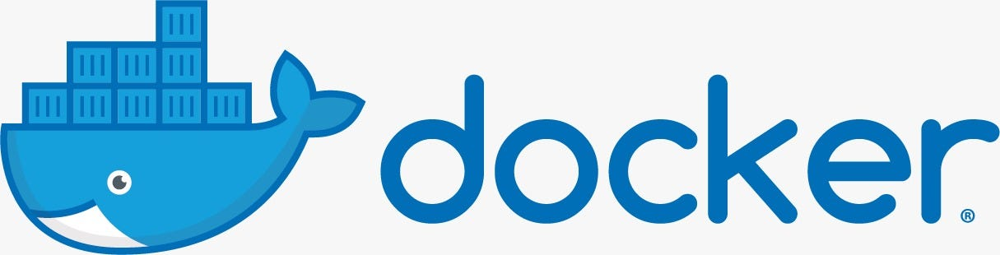

<center>
<figure>

<figcaption></figcaption>
</figure>
</center>

## Docker

**Docker** es una plataforma de código abierto diseñada para facilitar la creación, el despliegue y la ejecución de aplicaciones mediante el uso de **contenedores**. Se refiere tanto al conjunto de herramientas tecnológicas como a la empresa, **Docker, Inc.**, que inició su desarrollo en 2013.

### Instalar Docker Desktop

https://www.docker.com/products/docker-desktop/


A continuación, se detallan sus características fundamentales:

### 1. ¿Qué hace Docker?
Docker permite **empaquetar una aplicación con todos los elementos necesarios** para su funcionamiento (código fuente, bibliotecas, archivos de configuración y dependencias de software) en una unidad estándar llamada contenedor. Al incluir todo el entorno de ejecución, se garantiza que la aplicación funcione de la misma manera en cualquier infraestructura, ya sea en una computadora local, un servidor físico o en la nube.

Esto resuelve el famoso problema de **«en mi máquina funciona»**, eliminando las inconsistencias entre los entornos de desarrollo, prueba y producción.

### 2. Diferencia con las Máquinas Virtuales (VM)
A diferencia de las máquinas virtuales tradicionales, que emulan un hardware completo y requieren un sistema operativo invitado (Guest OS) por cada instancia, los contenedores Docker:
*   **Comparten el kernel** del sistema operativo del anfitrión.
*   Son mucho más **ligeros y rápidos**: se inician en milisegundos y consumen menos memoria y CPU que las VM.
*   Permiten una mayor **densidad**, es decir, se pueden ejecutar muchos más contenedores que máquinas virtuales en el mismo hardware.

### 3. ¿Cómo funciona técnicamente?
Docker utiliza una arquitectura **cliente-servidor**. El cliente de Docker (la línea de comandos o CLI) se comunica con el **Docker daemon** (un proceso en segundo plano), que es el encargado de construir, ejecutar y distribuir los contenedores.

Para lograr el aislamiento, Docker se basa en características específicas del kernel de Linux:
*   **Namespaces (Espacios de nombres):** Proporcionan aislamiento a nivel de red, procesos y sistemas de archivos, haciendo que cada contenedor vea su propio entorno separado.
*   **Control Groups (cgroups):** Permiten limitar y monitorear el uso de recursos físicos como la CPU y la memoria.

### 4. Componentes Clave
*   **Imágenes:** Son plantillas de solo lectura que contienen las instrucciones para crear un contenedor.
*   **Contenedores:** Son las instancias ejecutables y aisladas de una imagen.
*   **Docker Hub:** Un registro público donde se pueden almacenar, compartir y descargar imágenes listas para usar (como las de bases de datos o servidores web).
*   **Docker Compose:** Una herramienta para definir y ejecutar aplicaciones que requieren múltiples contenedores (microservicios) mediante un único archivo de configuración YAML.

En resumen, Docker se ha convertido en el estándar de la industria para la entrega de software moderno, permitiendo a los equipos de desarrollo y operaciones trabajar de forma más ágil y eficiente.


## Docker vs Maquina virtual

Las máquinas virtuales (VM) y los contenedores son tecnologías de aislamiento que, aunque comparten objetivos similares, presentan diferencias fundamentales en su arquitectura, gestión de recursos y velocidad.

#### Arquitectura y Kernel
La distinción técnica más importante radica en cómo interactúan con el hardware y el sistema operativo (OS):
*   **Sistema Operativo y Kernel:** Una máquina virtual incluye un **sistema operativo completo** e independiente, lo que significa que tiene su propio kernel. Por el contrario, los contenedores son más ligeros porque **comparten el kernel del sistema operativo de la máquina anfitriona**.

*   **Virtualización:** Las VMs se ejecutan sobre un software llamado **hipervisor**, que crea una capa de hardware virtualizado sobre la cual se instala el OS invitado. Los contenedores utilizan **virtualización a nivel de sistema operativo**, empleando características del kernel de Linux como **namespaces** (para aislar recursos como red y procesos) y **cgroups** (para limitar el uso de hardware).

#### Eficiencia y Uso de Recursos
Los contenedores ofrecen una optimización de recursos muy superior a las máquinas virtuales:
*   **Tamaño y Peso:** El tamaño de un contenedor suele medirse en **megabytes**, mientras que el de una VM se mide en **gigabytes**. Un contenedor nuevo puede consumir apenas unos **12 kilobytes** de espacio en disco, mientras que una VM requiere cientos o miles de megabytes para una instalación básica del OS.

*   **Consumo de RAM y CPU:** Las VMs requieren la reserva de bloques fijos de recursos para cada instancia. Los contenedores, al ser procesos que corren directamente sobre el host, comparten los recursos de manera más fluida y solo consumen lo estrictamente necesario.

*   **Densidad:** Debido a su bajo consumo, es posible ejecutar una **densidad mucho mayor de contenedores** (decenas o cientos) en un solo servidor físico en comparación con el número limitado de VMs que el mismo hardware podría soportar.

#### Velocidad de Inicio
*   **Contenedores:** Se inician de forma casi instantánea, en cuestión de **milisegundos**, ya que no necesitan arrancar un sistema operativo desde cero, sino simplemente iniciar un proceso.

*   **Máquinas Virtuales:** Pueden tardar **varios minutos** en estar operativas, pues deben realizar todo el proceso de carga y arranque del kernel y los servicios del OS invitado.

#### Aislamiento y Seguridad
*   **VM:** Ofrece un **aislamiento más robusto**, ya que el hipervisor separa las instancias a nivel de hardware, lo que reduce la superficie de ataque.

*   **Contenedor:** El aislamiento es a nivel de proceso, lo que se considera **menos fuerte** que el de una VM, ya que todos los contenedores comparten el mismo kernel del host.

#### Portabilidad y Enfoque
Mientras que las máquinas virtuales están orientadas a gestionar sistemas operativos, **Docker está orientado a las aplicaciones**. Un contenedor empaqueta la aplicación con todas sus dependencias en un artefacto estándar, permitiendo que el software funcione de manera idéntica en cualquier entorno. Cabe destacar que **un contenedor puede ejecutarse dentro de una máquina virtual**, pero no es posible hacerlo a la inversa.

En la práctica moderna, ambas tecnologías suelen **complementarse**: es común desplegar contenedores dentro de máquinas virtuales en la nube para combinar la portabilidad de Docker con la seguridad y facilidad de gestión de las VMs.

## Dockerfile

Crear una imagen de Docker mediante un **Dockerfile** es un proceso automatizado que utiliza un archivo de texto con instrucciones secuenciales para configurar el entorno de una aplicación.

A continuación se detallan los pasos y componentes principales para este proceso:

#### 1. Preparación del Dockerfile
El **Dockerfile** es el "recetario" donde se definen los pasos para generar la imagen. Por convención, el archivo se denomina simplemente `Dockerfile` sin extensión.

#### Instrucciones fundamentales:
*   **`FROM`**: Es la primera instrucción válida y define la **imagen base** sobre la que se construirá la nueva (por ejemplo, una distribución de Linux como Ubuntu o un entorno como Node.js).
*   **`WORKDIR`**: Establece el directorio de trabajo dentro de la imagen para las instrucciones siguientes.
*   **`RUN`**: Ejecuta comandos durante la construcción de la imagen (como instalar paquetes). Cada instrucción `RUN` crea una nueva **capa** en el sistema de archivos.
*   **`COPY` o `ADD`**: Copian archivos o directorios desde la máquina local (el host) hacia el sistema de archivos de la imagen.
*   **`ENV`**: Define variables de entorno permanentes dentro del contenedor.
*   **`EXPOSE`**: Informa a Docker sobre los puertos en los que la aplicación escuchará conexiones.
*   **`CMD` o `ENTRYPOINT`**: Definen el comando por defecto que se ejecutará automáticamente cuando se inicie un contenedor a partir de la imagen creada.

#### 2. Uso del archivo .dockerignore
Antes de construir la imagen, es recomendable crear un archivo **`.dockerignore`**. Similar al `.gitignore`, este archivo permite listar qué archivos o carpetas (como archivos temporales o carpetas de control de versiones) no deben enviarse al demonio de Docker durante la construcción, lo que optimiza el tamaño de la imagen y la velocidad del proceso.

#### 3. Construcción de la imagen (docker build)
Una vez redactado el Dockerfile, se utiliza el comando **`docker build`** para procesarlo y generar la imagen.

*   **Comando típico**: `docker build -t nombre_imagen:etiqueta .`.
*   **El flag `-t`**: Permite asignar un nombre (repositorio) y una etiqueta (tag) a la imagen para identificarla fácilmente (por ejemplo, `mi-app:v1.0`).
*   **El punto `.`**: Al final del comando, representa el **contexto de construcción**, indicando que Docker debe buscar el Dockerfile y los archivos necesarios en el directorio actual.

#### 4. El sistema de capas y caché
Docker construye las imágenes en **capas de solo lectura**. Cada instrucción del Dockerfile genera una nueva capa.
*   **Caché**: Si se vuelve a ejecutar el comando `build` sin haber modificado ciertas líneas del Dockerfile, Docker reutilizará las capas ya creadas anteriormente (caché), acelerando significativamente el proceso.
*   **Inmutabilidad**: Una vez finalizada la construcción, la imagen es inmutable; cualquier cambio posterior en el contenedor se guardará en una capa superior de lectura/escritura que desaparece si el contenedor se elimina, a menos que se use persistencia de datos.

#### Crear un dockerfile

Para implementar una aplicación con **Python 3.13**, **Streamlit** y una carpeta específica para datos **CSV**, puedes seguir el siguiente ejemplo de **Dockerfile** basado en las instrucciones y buenas prácticas de las fuentes:

```dockerfile showLineNumbers
# 1. Imagen base oficial de Python (usando la versión 3.13 solicitada)
# Se recomienda la etiqueta 'slim' para obtener una imagen más ligera.
FROM python:3.13-slim

# 2. Establecer el directorio de trabajo dentro del contenedor
# Esto define dónde se ejecutarán las instrucciones siguientes.
WORKDIR /app

# 3. Crear la carpeta para almacenar los datos CSV
# Se utiliza el comando RUN para crear directorios en el sistema de archivos de la imagen.
RUN mkdir -p /app/data

# 4. Definir la carpeta de datos como un volumen para persistencia (opcional pero recomendado)
# Los volúmenes permiten que los datos CSV persistan incluso si el contenedor se elimina.
VOLUME /app/data

# 5. Copiar el archivo de dependencias e instalarlas
# Primero copiamos solo requirements.txt para aprovechar la caché de Docker.
COPY requirements.txt .
RUN pip install --no-cache-dir -r requirements.txt

# 6. Copiar el resto del código de la aplicación al contenedor
COPY . .

# 7. Informar el puerto que utilizará Streamlit
# Streamlit usa por defecto el puerto 8501.
EXPOSE 8501

# 8. Comando para ejecutar la aplicación al iniciar el contenedor
# Se usa la sintaxis de array JSON, recomendada por ser más robusta.
CMD ["streamlit", "run", "app.py", "--server.port=8501", "--server.address=0.0.0.0"]
```


#### Explicación de los componentes clave:

*   **Imagen Base (`FROM`)**: Se utiliza `python:3.13-slim` para garantizar un entorno con las bibliotecas necesarias minimizando el tamaño final de la imagen.
*   **Directorio de Trabajo (`WORKDIR`)**: Define `/app` como la base para todas las operaciones de copia y ejecución, manteniendo el contenedor organizado.
*   **Gestión de Datos (`RUN` y `VOLUME`)**: La instrucción `RUN mkdir` crea físicamente la carpeta dentro de la imagen, mientras que `VOLUME` marca esa ruta para que Docker pueda montar almacenamiento persistente desde el host si es necesario.
*   **Instalación de Dependencias**: Al copiar primero el archivo `requirements.txt` y ejecutar `pip install` antes de copiar el resto del código, se evita reinstalar todas las librerías cada vez que hagas un cambio pequeño en el código de tu aplicación (aprovechamiento de capas en caché).
*   **Puerto (`EXPOSE`)**: Aunque `EXPOSE` es principalmente informativo, es esencial para documentar que la aplicación Streamlit estará escuchando en el puerto 8501.

Para construir esta imagen, guarda el código en un archivo llamado `Dockerfile` en tu carpeta de proyecto y ejecuta:
`docker build -t mi-app-streamlit .`.

### Volume

Para guardar archivos CSV (o cualquier otro dato) de forma persistente en Docker, se utilizan los **volúmenes** o los **bind mounts**. Estos mecanismos permiten que la información sobreviva incluso si el contenedor se detiene o se elimina.

Se detallan las dos formas principales de implementarlo:

#### 1. Volúmenes con nombre (Recomendado)
Los volúmenes son gestionados por Docker y se almacenan en una parte del sistema de archivos del host que Docker controla. Son ideales para bases de datos o almacenamiento de archivos internos como tus CSV.

*   **Paso 1: Crear el volumen** (opcional, Docker lo crea solo si no existe al arrancar):
    ```bash
    docker volume create csv_data
    ```
*   **Paso 2: Montarlo al ejecutar el contenedor**:
    ```bash
    docker run -d --name mi_app -v csv_data:/app/data mi_imagen
    ```
    Aquí, cualquier archivo CSV que tu aplicación guarde en `/app/data` dentro del contenedor se almacenará realmente en el volumen `csv_data` en el host.

#### 2. Bind Mounts (Mapeo de carpetas locales)
Un *bind mount* vincula una carpeta específica de tu computadora (host) con una carpeta dentro del contenedor. Es muy útil si ya tienes los archivos CSV en una carpeta local y quieres que el contenedor los lea o escriba directamente allí.

*   **Comando para ejecutarlo**:
    ```bash
    docker run -d -v /ruta/en/tu/computadora/csvs:/app/data mi_imagen
    ```
*   **Ventaja:** Puedes abrir la carpeta en tu computadora y ver/editar los archivos CSV con Excel o cualquier editor, y el contenedor verá los cambios al instante.

#### Configuración en el Dockerfile
Aunque el montaje real se hace al ejecutar el contenedor (`docker run`), es una buena práctica declarar el punto de montaje en el **Dockerfile** usando la instrucción `VOLUME`. Esto avisa a Docker que esa carpeta está destinada a la persistencia de datos.

```dockerfile
# Definir la carpeta donde la app guardará los CSV
RUN mkdir -p /app/data
VOLUME /app/data
```

#### Consideraciones clave:
*   **Independencia:** El ciclo de vida de los volúmenes es independiente del contenedor; los datos persisten aunque borres el contenedor.
*   **Uso compartido:** Varios contenedores pueden montar el mismo volumen simultáneamente para compartir los mismos archivos CSV.
*   **Seguridad:** Si no quieres que el contenedor modifique los CSV del host, puedes montarlo como "solo lectura" añadiendo `:ro` al final del comando:
    `docker run -v /ruta/local:/app/data:ro mi_imagen`.

## dockerignore

El archivo **.dockerignore** es un archivo de texto, similar al `.gitignore` de Git, que se utiliza para **excluir archivos y directorios del contexto de construcción** (build context) que se envía al demonio de Docker cuando se crea una imagen.

#### ¿Para qué sirve?
Su función principal es optimizar el proceso de creación de imágenes de las siguientes maneras:

*   **Reduce el tamaño de la imagen:** Evita que archivos innecesarios (como documentación, archivos temporales o carpetas de control de versiones) se copien permanentemente en las capas de la imagen.

*   **Acelera la construcción:** Al no tener que subir archivos pesados o irrelevantes al demonio de Docker, el comando `docker build` se ejecuta más rápido.

*   **Mejora la seguridad:** Permite excluir archivos sensibles, como claves SSH (`.pem`), archivos de configuración con secretos (`.env`) o bases de datos locales, evitando que se filtren accidentalmente dentro de la imagen pública o compartida.

*   **Optimiza la caché:** Al excluir archivos que cambian frecuentemente pero que no son necesarios para la aplicación (como registros de logs o carpetas `.git`), se evita que Docker invalide la caché de las capas innecesariamente.

#### Ejemplos comunes de archivos a excluir

Para utilizarlo, simplemente se debe crear un archivo llamado `.dockerignore` en la raíz del directorio donde se encuentra el **Dockerfile** y listar en él, línea por línea, los patrones de los archivos que se desean ignorar.

Los elementos que generalmente deberían incluirse en este archivo son:

*   **Sistemas de control de versiones:** Se recomienda excluir directorios como **`.git`**, ya que pueden ser muy pesados y no son necesarios para ejecutar la aplicación.

*   **Dependencias locales:** Archivos y carpetas como **`node_modules`** (en Node.js) o entornos virtuales de Python (**`env`**, **`venv`**) no deben copiarse, ya que las dependencias deben instalarse dentro del contenedor durante la construcción.

*   **Información sensible y secretos:** Para evitar fugas de seguridad, se deben excluir archivos que contengan credenciales o claves, como archivos **`.env`**, llaves privadas (**`*.pem`**, **`id_rsa`**) y archivos de configuración con secretos.

*   **Archivos temporales y de caché:** Es una buena práctica ignorar archivos generados automáticamente que no aportan al funcionamiento de la app, como:
    *   Caché de Python: **`**/*.pyc`** o **`__pycache__`**.
    *   Archivos temporales del sistema: **`.DS_Store`** (en macOS) o **`*.tmp`**.

*   **Resultados de compilación y pruebas:** Directorios de salida de compilaciones previas o reportes de tests, tales como **`build`**, **`dist`**, **`coverage`**, **`htmlcov`** y archivos de registro (**`*.log`**).

*   **Archivos de configuración de Docker:** En ocasiones se incluye el propio **`.dockerignore`** o los diferentes **`Dockerfile`** del proyecto para mantener la imagen limpia.

#### Reglas de sintaxis comunes
Puedes usar patrones para definir qué ignorar:
*   `*`: Coincide con cualquier cadena de caracteres (ej. `*.txt`).
*   `**`: Coincide con cualquier número de directorios (ej. `**/*.pyc`).
*   `?`: Coincide con un solo carácter.
*   `!`: Se usa para incluir un archivo específico que de otro modo sería ignorado por una regla anterior.

Implementar correctamente este archivo garantiza que la imagen final sea "minimalista", conteniendo únicamente lo estrictamente necesario para su ejecución.

## Docker Hub

https://hub.docker.com/

**Docker Hub** es el registro de contenedores oficial de Docker y funciona como una biblioteca centralizada basada en la nube para buscar, almacenar y compartir imágenes de contenedores. Es el recurso más popular de la industria, equivalente a lo que es GitHub para el código fuente, pero enfocado en imágenes de Docker.

A continuación se detalla sus funciones principales:

#### Almacenamiento y Distribución de Imágenes
Docker Hub permite gestionar repositorios donde se alojan las imágenes.
*   **Repositorios Públicos:** Son gratuitos y permiten que cualquier persona descargue y use las imágenes.
*   **Repositorios Privados:** Permiten compartir imágenes solo con usuarios específicos o miembros de una organización, lo cual es ideal para proyectos comerciales.

#### Descubrimiento de Contenido de Confianza
Sirve como un catálogo masivo para encontrar software listo para usar:
*   **Imágenes Oficiales:** Son imágenes de alta calidad (como las de Ubuntu, MySQL o Python) curadas por Docker, Inc. que garantizan seguridad, documentación actualizada y soporte para múltiples arquitecturas.
*   **Editores Verificados:** Imágenes mantenidas directamente por organizaciones reconocidas (como Microsoft, Oracle o Bitnami) que ofrecen versiones certificadas de sus productos.
*   **Imágenes de la Comunidad:** Creadas y compartidas por desarrolladores independientes para uso público.

#### Automatización de Flujos de Trabajo
Una de sus funciones más potentes es la capacidad de **Automated Builds** (Construcciones Automatizadas). Puedes conectar Docker Hub con cuentas de **GitHub o Bitbucket**, de modo que cada vez que realices un cambio en el código fuente (donde reside el Dockerfile), Docker Hub detectará el commit y reconstruirá automáticamente la imagen.

#### Colaboración y Gestión
Docker Hub facilita el trabajo en equipo a través de:
*   **Organizaciones y Equipos:** Permite crear grupos de usuarios con diferentes niveles de acceso a los repositorios privados.
*   **Webhooks:** Activan acciones en otros servicios externos cada vez que se sube una nueva versión de una imagen al registro.
*   **Escaneo de Seguridad:** En sus versiones avanzadas, analiza las imágenes en busca de vulnerabilidades antes de que se desplieguen.

#### Comandos comunes para interactuar con Docker Hub
Para utilizar este servicio desde la línea de comandos, se emplean principalmente los siguientes comandos:
*   **`docker search`**: Busca imágenes disponibles en el registro.
*   **`docker login`**: Autentica al usuario con sus credenciales de Docker Hub.
*   **`docker pull`**: Descarga una imagen desde Docker Hub a tu máquina local.
*   **`docker push`**: Sube una imagen local a tu repositorio en la nube.

En resumen, Docker Hub es el punto de encuentro central del ecosistema Docker que simplifica la entrega de aplicaciones al estandarizar cómo se comparten los paquetes de software.

### Imagen oficial

Una **imagen oficial** en Docker Hub es un recurso de alta calidad seleccionado y curado por Docker, Inc. para garantizar que su contenido sea de confianza y siga las mejores prácticas de la industria. Estas imágenes están diseñadas para proporcionar infraestructuras base esenciales (como sistemas operativos), lenguajes de programación y otros servicios fundamentales para desarrolladores y equipos de operaciones.


#### Características de las imágenes oficiales
*   **Contenido de confianza:** Son revisadas por un equipo dedicado en Docker, Inc. en colaboración con expertos en seguridad y la comunidad para asegurar que resulten seguras.
*   **Actualizaciones frecuentes:** Reciben parches de seguridad y correcciones de errores de manera periódica, lo cual es crítico para entornos de producción.
*   **Soporte multi-arquitectura:** La mayoría están diseñadas para funcionar en diversas arquitecturas de hardware (como x86_64, ARM, etc.) y diferentes sistemas operativos.
*   **Código abierto:** Su contenido debe ser de código abierto, permitiendo a los usuarios inspeccionar cómo fueron construidas.
*   **Documentación clara:** Proporcionan guías detalladas sobre cómo han sido diseñadas y cómo deben utilizarse correctamente.

#### Identificación y uso
*   **Insignia visual:** En el sitio web de Docker Hub, estas imágenes se identifican fácilmente por una insignia que dice **"Official Image"** junto al nombre del repositorio.
*   **Namespace `library`:** Técnicamente, estas imágenes pertenecen a un espacio de nombres especial llamado `library`. Por ejemplo, la ruta completa de la imagen de Python es `docker.io/library/python`.
*   **Sintaxis abreviada:** Debido a su importancia, Docker permite descargarlas omitiendo el nombre del namespace. Por ejemplo, ejecutar `docker pull ubuntu` es equivalente a `docker pull library/ubuntu`.

#### Ejemplos comunes
Las imágenes oficiales suelen ser la base sobre la cual se construyen otras imágenes personalizadas. Ejemplos destacados incluyen:
*   Sistemas operativos: **ubuntu**, **debian**, **alpine**.
*   Bases de datos: **mysql**, **mongo**, **redis**, **postgres**.
*   Servidores web y aplicaciones: **nginx**, **httpd**, **node**, **python**.

El uso de estas imágenes es altamente recomendado para minimizar riesgos de seguridad y asegurar que la base de las aplicaciones sea robusta y eficiente.

### Automatizar imagenes

Para automatizar la construcción de imágenes en **Docker Hub**, se utiliza una funcionalidad denominada **Automated Builds** (Construcciones Automatizadas). Esta característica permite conectar tu cuenta de Docker Hub con un repositorio de código fuente externo, como **GitHub** o **Bitbucket**.

A continuación, se describen los pasos y el funcionamiento de este proceso:

#### 1. Requisitos previos
Para configurar la automatización, debes tener una cuenta en Docker Hub y el código fuente de tu aplicación (incluyendo el `Dockerfile`) alojado en un repositorio de GitHub o Bitbucket. Cabe destacar que, esta característica suele estar reservada para los **planes de pago** de Docker Hub (como Pro o Team).

#### 2. Pasos para la configuración
El procedimiento general para activar la construcción automática es el siguiente:

1.  **Vincular cuentas:** En la configuración de tu cuenta de Docker Hub, debes ir a la sección de "Linked Accounts" (Cuentas vinculadas) y conectar tu perfil de GitHub o Bitbucket. Es necesario otorgar permisos de lectura y escritura para que Docker Hub pueda configurar los "webhooks" necesarios.

2.  **Crear el repositorio automatizado:** En Docker Hub, selecciona la opción **"Create Automated Build"**.

3.  **Seleccionar el repositorio de código:** Elige el repositorio específico donde se encuentra tu `Dockerfile`.

4.  **Configurar las reglas de construcción:** Puedes definir qué ramas (como `master`) o qué etiquetas (tags) de Git dispararán una nueva construcción de imagen.

#### 3. Funcionamiento del flujo de trabajo
Una vez configurado, el sistema funciona de manera autónoma:

*   **Detección de cambios:** Cada vez que realices un `git push` o una actualización en el código de tu repositorio de GitHub o Bitbucket, Docker Hub detectará el commit automáticamente.

*   **Construcción y almacenamiento:** El demonio de Docker Hub leerá el `Dockerfile`, construirá la nueva imagen y la almacenará en su registro.

*   **Historial de construcción:** Puedes monitorear el estado de las construcciones (éxito, error o pendiente) directamente desde la pestaña de "Build Details" en Docker Hub.

*   **Pruebas integradas:** Es posible configurar una serie de **tests** para que la imagen solo se publique en el repositorio si las pruebas se ejecutan con éxito.

#### Ventajas de la automatización
Este flujo de trabajo asegura que tus imágenes estén siempre actualizadas con la última versión de tu código sin necesidad de intervención manual. Además, garantiza la **trazabilidad**, permitiendo que cualquier miembro del equipo sepa exactamente cómo y cuándo se generó una imagen específica a partir de los archivos en el repositorio.

---

## AZURE

<center>
<figure>

<figcaption>Despliegue de una aplicación Python en Web app service.</figcaption>
</figure>
</center>

[Build and run a containerized Python web app locally](https://learn.microsoft.com/en-us/azure/developer/python/tutorial-containerize-deploy-python-web-app-azure-02?tabs=sample-app-git-clone%2CDjango%2Cazure-cli%2Cbash)


## AWS

[Deploy a Docker application on AWS Elastic Beanstalk with GitLab](https://aws.amazon.com/es/blogs/devops/deploy-a-docker-application-on-aws-elastic-beanstalk-with-gitlab/)