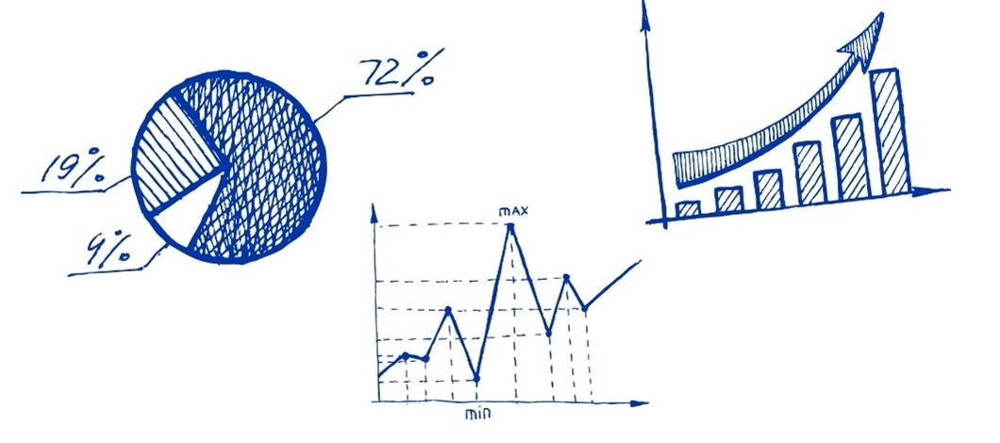

:::info
Para aprender tanto los conceptos básicos como avanzados de estadística, necesarias para la Ciencia de Datos, acceda al curso:

[**Bioestadística**](https://patricioaraneda.cl/bioestadistica/docs/intro)

:::
