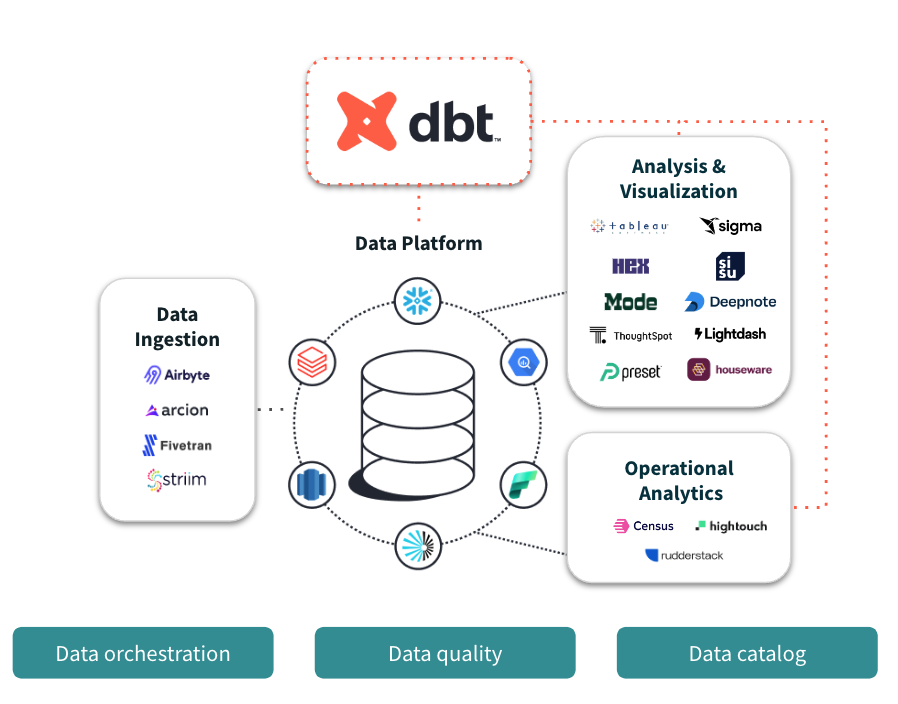

## **DBT**
https://www.getdbt.com

**dbt (Data Build Tool)** se ha consolidado como una de las herramientas de software de código abierto más importantes, redefiniendo la manera en que se estructuran y gestionan las transformaciones lógicas de datos.

<center>
<figure>

<figcaption>DBT transforma los datos directamente en la plataforma donde estos se encuentran.</figcaption>
</figure>
</center>


### ¿Qué es dbt (Data Build Tool)?

**dbt** es una herramienta de desarrollo que se enfoca exclusivamente en la **"T" (Transformación)** de los procesos **ELT (Extract, Load, Transform)**. 

A diferencia de las herramientas clásicas de ETL (Extract, Transform, Load), donde el cómputo y la transformación ocurrían en un servidor intermedio antes de cargar los datos, **dbt opera bajo la premisa de que los datos ya han sido ingeridos y depositados en su formato bruto (*raw*)** dentro de un motor de almacenamiento de alto rendimiento —como un *Data Warehouse* (Snowflake, BigQuery, Redshift) o un *Data Lakehouse* (Databricks, Apache Iceberg)—. 

Su función principal es permitir que ingenieros de datos, ingenieros de analítica (*analytics engineers*) y analistas de negocio **transformen los datos crudos en tablas limpias, enriquecidas y listas para analítica o modelado predictivo, utilizando simplemente sentencias SQL declarativas (`SELECT`)**.

---

### Principios de Operación: ¿Cómo funciona dbt bajo el capó?

dbt introduce las mejores prácticas de la **ingeniería de software** (control de versiones, modularidad, pruebas automatizadas, documentación integrada e integración continua CI/CD) al mundo del análisis de datos. Su operación se fundamenta en los siguientes pilares técnicos:

#### A. Modelos como Sentencias `SELECT` (Sin DDL/DML manual)
En dbt, cada "modelo" es simplemente un archivo con extensión `.sql` que contiene una consulta `SELECT`. El desarrollador **no escribe** sentencias de creación física de tablas o vistas (como `CREATE TABLE`, `INSERT INTO` o `MERGE`). dbt compila el código y se encarga de envolver el `SELECT` en el código DDL/DML adecuado según el motor de destino:
*   Si configuras un modelo como `view`, dbt ejecutará un `CREATE OR REPLACE VIEW`.
*   Si lo configuras como `table`, ejecutará un `CREATE TABLE AS SELECT` (CTAS).
*   Si lo configuras como `incremental`, dbt gestionará de manera inteligente las uniones y actualizaciones para procesar solo los nuevos registros, optimizando el cómputo.

#### B. Modularidad y Grafos de Dependencia (`Jinja` y la función `ref`)
Para evitar el código redundante y monolítico (código *spaghetti* de miles de líneas), dbt fomenta un enfoque modular. Las consultas SQL se enriquecen con **Jinja** (un motor de plantillas para Python). El concepto central es la macro **`{{ ref('nombre_modelo') }}`**, la cual permite que un modelo SQL haga referencia a otro modelo previo:

```sql
-- modelo_silver_ventas.sql
-- dbt se encarga de compilar esta referencia a la ruta real de la tabla en el Data Warehouse
SELECT 
    loan_id,
    cliente,
    monto_financiado * 0.15 AS impuesto
FROM {{ ref('modelo_bronze_ventas') }}
WHERE monto_financiado > 0
```

Al utilizar `ref`, dbt hace dos cosas críticas:
1.  **Resuelve el linaje y las dependencias:** dbt construye automáticamente un **Grafo Acíclico Dirigido (DAG)** de dependencias lógicas. Esto asegura que si el modelo B depende del modelo A, dbt siempre procesará y creará el modelo A antes de iniciar con el B.
2.  **Abstracción de entornos:** Permite cambiar fácilmente entre bases de datos de desarrollo (*dev*), pruebas (*testing*) o producción (*prod*) sin modificar una sola línea de código SQL, simplemente alterando el archivo de configuración de perfiles (`profiles.yml`).

#### C. Pruebas Automatizadas de Calidad de Datos (Testing)
dbt permite declarar de forma sencilla pruebas de aserción sobre tus tablas. En un archivo de configuración en formato **YAML**, puedes definir reglas de negocio para columnas específicas. dbt ejecutará de forma automática consultas SQL en segundo plano para verificar el cumplimiento de estas aserciones:

```yaml showLineNumbers
# schema.yml (Configuración de pruebas en dbt)
version: 2

models:
  - name: modelo_silver_ventas
    columns:
      - name: loan_id
        tests:
          - unique    # Valida que no existan llaves duplicadas
          - not_null  # Valida que no contenga valores nulos
```

#### D. Documentación y Linaje Autogenerados
Al ejecutar el comando `dbt docs generate`, la herramienta analiza tu código SQL, las dependencias inyectadas con Jinja y las descripciones del YAML para compilar un portal web interactivo. Este portal proporciona un **mapa interactivo del linaje de datos (Data Lineage)**, permitiendo a cualquier consumidor rastrear de dónde proviene una columna analítica y qué transformaciones sufrió a lo largo de todo el pipeline.

---

### Función de dbt en Ingeniería de Datos y MLOps

dbt juega un rol clave en la división técnica de los pipelines modernos de datos:

1.  **Soporte de la Arquitectura Medallón:** dbt es la herramienta por excelencia para procesar los datos de la **Capa Bronze a Silver** (limpieza, deduplicación y tipado) y de la **Capa Silver a Gold** (agregaciones de negocio y creación de características).

2.  **Ingeniería de Características (*Feature Engineering*) para Ciencia de Datos:** Al estructurar la lógica en dbt, los científicos de datos consumen tablas consistentes y deterministas, mitigando el riesgo de que la lógica de las variables utilizadas para entrenar un modelo difiera de las variables en producción (*training-serving skew*).

3.  **Integración con Orquestadores de Datos (Apache Airflow 3):** Aunque dbt maneja las transformaciones internas del almacén, no es un orquestador general (no puede llamar APIs externas, ni transferir archivos S3, ni ejecutar scripts de Spark). Por ello, dbt se complementa perfectamente con **Apache Airflow**. En la actualidad, herramientas avanzadas como **Astronomer Cosmos** permiten importar flujos de dbt Core dentro de Airflow de manera nativa, convirtiendo automáticamente cada modelo de dbt en una tarea individual dentro de un DAG de Airflow.

***

## **Training-serving Skew**

El **Training-Serving Skew** (o sesgo entre entrenamiento e inferencia) es una de las anomalías operativas más complejas, sutiles y costosas de diagnosticar en el ciclo de vida de producción de un sistema de Machine Learning.

Se define formalmente como la **discrepancia en el rendimiento o en el comportamiento de un modelo entre su fase de diseño y evaluación offline (entrenamiento/desarrollo) y su fase de operación en tiempo real en producción (inferencia/serving)**. El síntoma inequívoco de esta patología es un modelo que exhibe métricas de precisión extraordinarias durante el desarrollo, pero cuya efectividad decae drásticamente al ser expuesto a flujos de datos reales tras su despliegue.

Para analizarlo con rigor de nivel universitario, este fenómeno puede categorizarse en tres vertientes metodológicas y de infraestructura:

---

#### Discrepancia en las Tuberías de Procesamiento (*Preprocessing Pipeline Mismatch*)
En la mayoría de las organizaciones de datos, el pipeline para el desarrollo de un modelo está a cargo del equipo de científicos de datos, quienes procesan grandes lotes de datos históricos (*batch*) en cuadernos Jupyter u orquestadores utilizando Pandas o Apache Spark. 

Sin embargo, cuando el modelo es promovido al entorno de producción, un equipo de operaciones o de ingeniería de software a menudo tiene que reescribir e implementar esos mismos pasos de preprocesamiento en una infraestructura de baja latencia (por ejemplo, una API REST en tiempo real o un pipeline de *streaming*). Si existe la más mínima inconsistencia algorítmica o de codificación entre ambas tuberías de datos (por ejemplo, diferencias menores en cómo se procesa el texto o se codifican categorías), el modelo recibirá variables de entrada calculadas bajo una lógica distinta, degradando de inmediato la precisión de sus predicciones.

#### Desalineación en el Escalado de Características y Estadísticas Globales
El escalado de datos (como la normalización Z-score o la escala MinMax) requiere estadísticas globales calculadas de manera estricta a partir del conjunto de entrenamiento (la media, la desviación estándar, el mínimo o el máximo). 

Un error de diseño de software extremadamente común ocurre cuando, durante la inferencia, se calculan estas estadísticas de forma dinámica utilizando únicamente la petición o el lote de datos entrante en producción, en lugar de **reutilizar de manera inmutable los parámetros globales aprendidos en el entrenamiento**. Esto altera la distribución que el modelo entrenado espera interpretar, "moviendo" arbitrariamente los puntos de datos y rompiendo el alineamiento analítico.

#### Sesgos de Muestreo y No Estacionariedad (*Data Distribution Shifts*)
Es sumamente complejo curar un conjunto de entrenamiento que sea 100% representativo de la infinidad de situaciones del mundo real. Sesgos de selección en el muestreo, cambios de codificación o la aparición de datos inesperados causan que los datos reales de producción procedan de una distribución (*target distribution*) distinta a la de entrenamiento (*source distribution*).

---

### Demostración Práctica en Python: El Error del Escalador

El siguiente script en Python es una excelente pieza pedagógica que ilustra cómo una mala gestión del estado de los datos al escalar variables genera **Training-Serving Skew**, y cómo solucionarlo reutilizando los parámetros del entrenamiento.

```python showLineNumbers
import numpy as np
import pandas as pd
from sklearn.preprocessing import StandardScaler

# ==============================================================================
# FASE A: ENTRENAMIENTO (Lógica del Científico de Datos)
# ==============================================================================
# Datos de entrenamiento simulados (ej. montos de transacciones)
datos_entrenamiento = pd.DataFrame({"monto": [100.0, 150.0, 200.0, 300.0, 500.0]})

# El científico ajusta el escalador con los datos de entrenamiento
scaler_global = StandardScaler()
X_train_scaled = scaler_global.fit_transform(datos_entrenamiento)

# Parámetros aprendidos del entrenamiento (se guardan como estado inmutable)
media_train = scaler_global.mean_
desviacion_train = scaler_global.scale_

print(f"--- Entrenamiento ---")
print(f"Media calculada en entrenamiento: {media_train:.2f}")
print(f"Desviación calculada en entrenamiento: {desviacion_train:.2f}\n")


# ==============================================================================
# FASE B: INFERENCIA EN PRODUCCIÓN (Serving) - ESCENARIO CON SKEW
# ==============================================================================
# Llega una sola petición de inferencia en tiempo real
peticion_nueva = pd.DataFrame({"monto": [120.0]})

# ERROR COMÚN EN SERVING: Instanciar un nuevo escalador y ajustarlo con el dato entrante.
# Esto genera skew porque el escalador recalcula la media en base únicamente al dato de serving.
scaler_broken = StandardScaler()
try:
    X_serving_skewed = scaler_broken.fit_transform(peticion_nueva)
    # Al ser un solo dato, la desviación estándar es 0, y la variable escalada resulta erróneamente en 0.
    print(f"--- Serving con SKEW (Error de Diseño) ---")
    print(f"Monto original: {peticion_nueva['monto']}")
    print(f"Monto escalado incorrectamente: {X_serving_skewed} (¡Se perdió la escala real!)")
except Exception as e:
    print(f"Error en serving dinámico: {e}")


# ==============================================================================
# FASE C: SOLUCIÓN SIN SKEW (Reutilización de Parámetros)
# ==============================================================================
# CORRECTO: Se utiliza el método 'transform' (no 'fit_transform') del escalador global,
# aplicando estrictamente la media y desviación estándar del conjunto de entrenamiento.
X_serving_correct = scaler_global.transform(peticion_nueva)

print(f"\n--- Serving CORRECTO (Sin Skew) ---")
print(f"Monto original: {peticion_nueva['monto']}")
print(f"Monto escalado correctamente: {X_serving_correct:.4f}")
print(f"Cálculo matemático exacto: (120.0 - {media_train}) / {desviacion_train} = {((120.0 - media_train)/desviacion_train):.4f}")
```

---

### Metodologías de Mitigación

En ingeniería de producción para contrarrestar y prevenir esta desalineación sistemática, las arquitecturas modernas de MLOps implementan las siguientes estrategias:

1.  **Uso de Feature Stores (Almacenes de Características):** Como analizamos en nuestra sesión previa sobre la colaboración entre ingenieros de datos y científicos de datos, un Feature Store centralizado actúa como el puente definitivo. Almacena y expone las mismas definiciones y transformaciones lógicas de características para que tanto el pipeline offline (*batch* de entrenamiento) como el pipeline online (*streaming* de inferencia) consuman datos idénticos de manera consistente.

2.  **Acoplamiento de Preprocesamiento en el Grafo (TFT):** Al utilizar frameworks como TensorFlow Transform (TFT), las etapas de transformación se compilan de forma directa dentro de la firma física del modelo. Esto significa que el cliente en producción envía los datos en bruto (*raw data*) y el preprocesamiento matemático ocurre en el mismo nodo de cómputo donde se evalúa el modelo, garantizando simetría matemática absoluta.

3.  **La Estrategia de "Log and Wait" (Registrar y Esperar):** En lugar de recalcular las características históricas de manera asíncrona cuando se desea reentrenar el modelo, el sistema registra de manera persistente las características exactas que fueron calculadas y enviadas al modelo al momento de la inferencia en producción. Almacenar estas transacciones permite alimentar el reentrenamiento offline con la telemetría real de producción, neutralizando cualquier sesgo de pipeline.


## **Integración dbt y Airflow 3**

**Reporte Técnico: Integración Avanzada de dbt y Airflow 3 mediante el Framework Cosmos**

### La Necesidad de Integración

La evolución de la ingeniería de datos ha transitado desde la simple gestión de flujos de trabajo hacia la construcción de ecosistemas donde la orquestación y la transformación convergen para mitigar el "cuello de botella en la productividad del analista". Como se subraya en los fundamentos de la analítica a escala (*Ch. 1, p. 9*), el desafío central no reside únicamente en la capacidad de cómputo, sino en permitir que el profesional de datos se enfoque en la "iteración" y la "experimentación" en lugar de quedar atrapado en la "fontanería" técnica de los sistemas. La convergencia entre **dbt (data build tool)** y **Apache Airflow** es la respuesta estratégica a la naturaleza "desordenada" del dato crudo (*Ch. 2*), permitiendo que la limpieza, el munging y la fusión se realicen bajo una abstracción que oculte la complejidad de los sistemas distribuidos.

Tradicionalmente, la ejecución de dbt mediante el `BashOperator` ha sido el estándar, pero bajo un análisis riguroso, este enfoque resulta insuficiente para entornos de producción de misión crítica. Esta insuficiencia se manifiesta en tres dimensiones:

1. **Opacidad de las dependencias:** La lógica interna del DAG de dbt se pierde, transformándose en una "caja negra" para el orquestador.  
2. **Ilegibilidad de logs agrupados:** La centralización de logs en un solo proceso de Bash impide una depuración granular, contraviniendo el principio de observabilidad.  
3. **Fragilidad ante fallos y pérdida de productividad:** Un error en un único modelo obliga a reiniciar el proceso completo, desperdiciando recursos y tiempo de analista, lo cual es inaceptable en ciclos de vida de datos que requieren una iteración constante.

Cosmos surge para eliminar estas fricciones, permitiendo que Airflow "entienda" la estructura lógica de dbt y la ejecute de forma nativa.

### Cómo Opera Astronomer Cosmos

La importancia estratégica de Cosmos radica en delegar el *parsing* del grafo de dbt a un framework que permite a Airflow interpretar la semántica de la transformación. El modelo mental para entender esta operación es el **Spark Adaptive Query Execution (AQE)** introducido en Spark 3.0 (*Ch. 1, p. 8*). Así como el AQE adapta el plan de ejecución físico en tiempo de ejecución para reducir la complejidad de la optimización manual, Cosmos realiza un parsing dinámico (ya sea mediante el `manifest.json` o en *runtime*) para que Airflow adapte dinámicamente sus tareas a la estructura de dbt, eliminando la necesidad de definiciones manuales y estáticas.

#### Mapeo de Entidades y Topología

Cosmos traduce fielmente la ontología de dbt a entidades de Airflow, asegurando que la topología del proyecto se refleje en el orquestador:

* **Models:** Se transforman en `Tasks` individuales o `TaskGroups`, permitiendo paralelismo real.  
* **Tests:** Se integran como tareas de validación post-ejecución, garantizando la integridad antes de que los procesos dependientes consuman el dato.  
* **Seeds y Snapshots:** Se mapean como tareas de preparación y versionado histórico, respectivamente.

Este mapeo granular garantiza que, al igual que los planes físicos de Spark optimizan la ejecución de datos, Airflow pueda gestionar la re-ejecución selectiva de nodos fallidos, optimizando el uso del clúster.

### Arquitectura de Gobernanza y Observabilidad

El lanzamiento de **Airflow 3**, con su arquitectura orientada a *API Server* y un *Task SDK* renovado, establece un nuevo paradigma para la gobernanza a escala. En esta versión, la orquestación adopta el **modelo de datos paralelos** (*Ch. 2, p. 13*): así como en Spark el particionamiento de datos permite el procesamiento paralelo en múltiples ejecutores, el Task SDK de Airflow 3 permite un escalamiento horizontal de las tareas de transformación, permitiendo que cada modelo de dbt se ejecute con independencia operativa y de logs.

La integración con estándares de **OpenLineage** y sistemas de metadatos (como Unity Catalog o los mencionados en el contexto de ADAM en el *Capítulo 9*) permite una trazabilidad de punta a punta. Al conectar Airflow 3 con Cosmos, los ingenieros pueden capturar el linaje desde la ingesta hasta el modelo final, reduciendo el tiempo de inactividad. Esta arquitectura es vital para satisfacer las necesidades de **seguimiento de experimentos** y **servicio de modelos** descritas en el ciclo de vida de ML (*Ch. 11*), asegurando que cualquier anomalía en el dato pueda rastrearse hasta su origen físico.

#### Ejemplo Práctico de Código en Python (Nivel Producción)

La implementación bajo Airflow 3 y Cosmos destaca por su simplicidad declarativa, separando la lógica de negocio de la configuración de infraestructura.

```python showLineNumbers
from datetime import datetime
from pathlib import Path
from airflow.decorators import dag
from cosmos import DbtTaskGroup, ProjectConfig, ProfileConfig, ExecutionConfig
from cosmos.profiles import PostgresUserPasswordProfileMapping

# Ruta del proyecto dbt (Abstracción del sistema de archivos)

DBT_ROOT_PATH = Path("/usr/local/airflow/dbt")
DBT_PROJECT_NAME = "analytics_v3"

@dag(
    schedule_interval="@daily",
    start_date=datetime(2024, 1, 1),
    catchup=False,
    tags=['production', 'airflow3'],
)

def dbt_airflow3_integration():
    """
    Pipeline de transformación avanzado utilizando Airflow 3 Task SDK y Cosmos.
    """
    # NOTA PEDAGÓGICA: Decoupling Storage from Modeling (Ch. 9, p. 162)
    # Siguiendo los principios de sistemas distribuidos, desacoplamos el perfil de 
    # conexión (Storage) de la lógica de transformación (Modeling). 
    # Esto facilita la portabilidad entre entornos (Dev/Prod).

    profile_config = ProfileConfig(
        profile_name="modern_stack",
        target_name="prod",
        profile_mapping=PostgresUserPasswordProfileMapping(
            conn_id="warehouse_db",
            profile_args={"schema": "gold_layer"},
        ),
    )

    # NOTA: Al igual que en Spark 3.0, el modo de ejecución debe ser 
    # determinista para evitar la complejidad en el debugging de sistemas distribuidos (Ch. 1, p. 4).
    transform_data = DbtTaskGroup(
        group_id="transform_layer",
        project_config=ProjectConfig(DBT_ROOT_PATH / DBT_PROJECT_NAME),
        profile_config=profile_config,
        execution_config=ExecutionConfig(
            execution_mode="local", # O "kubernetes" para escalado horizontal
        ),
    )

dbt_airflow3_integration_dag = dbt_airflow3_integration()
```

### Mejores Prácticas en MLOps y CD4ML

Dentro del **Ciclo de Vida del Aprendizaje Automático**, la consistencia del dato entre las etapas de entrenamiento y servicio es crítica. La integración dbt-Airflow mitiga el **Training-Serving Skew** al garantizar que la ingeniería de características (*feature engineering*) sea una "fuente única de verdad".

Al utilizar Cosmos para orquestar dbt, aseguramos que la limpieza de datos —esa tarea "tediosa pero fundamental" sea reproducible. Esta arquitectura permite que herramientas como **MLflow** capturen metadatos precisos sobre la versión del dataset utilizado, conectando la observabilidad técnica con la reproducibilidad científica. En última instancia, esta integración transforma el pipeline de datos en un activo estratégico, reduciendo la fricción operativa y elevando la robustez de las aplicaciones de datos en producción.

