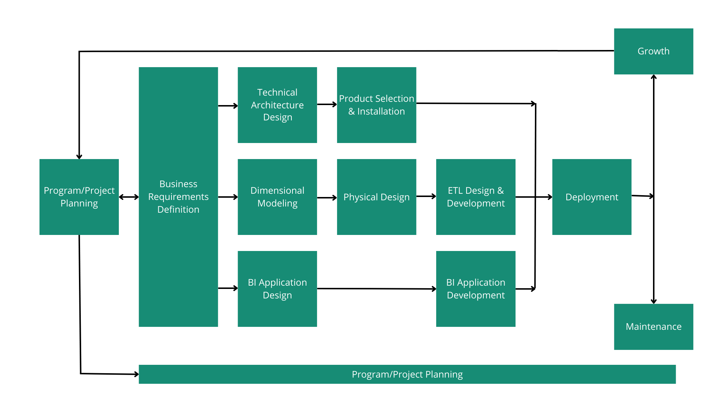

## **DBT**
https://www.getdbt.com

**dbt (Data Build Tool)** se ha consolidado como una de las herramientas de software de código abierto más importantes, redefiniendo la manera en que se estructuran y gestionan las transformaciones lógicas de datos.

<center>
<figure>

<figcaption>DBT transforma los datos directamente en la plataforma donde estos se encuentran.</figcaption>
</figure>
</center>


### ¿Qué es dbt (Data Build Tool)?

**dbt** es una herramienta de desarrollo que se enfoca exclusivamente en la **"T" (Transformación)** de los procesos **ELT (Extract, Load, Transform)**. 

A diferencia de las herramientas clásicas de ETL (Extract, Transform, Load), donde el cómputo y la transformación ocurrían en un servidor intermedio antes de cargar los datos, **dbt opera bajo la premisa de que los datos ya han sido ingeridos y depositados en su formato bruto (*raw*)** dentro de un motor de almacenamiento de alto rendimiento —como un *Data Warehouse* (Snowflake, BigQuery, Redshift) o un *Data Lakehouse* (Databricks, Apache Iceberg)—. 

Su función principal es permitir que ingenieros de datos, ingenieros de analítica (*analytics engineers*) y analistas de negocio **transformen los datos crudos en tablas limpias, enriquecidas y listas para analítica o modelado predictivo, utilizando simplemente sentencias SQL declarativas (`SELECT`)**.


### Principios de Operación

dbt introduce las mejores prácticas de la **ingeniería de software** (control de versiones, modularidad, pruebas automatizadas, documentación integrada e integración continua CI/CD) al mundo del análisis de datos. Su operación se fundamenta en los siguientes pilares técnicos:

#### A. Modelos como Sentencias `SELECT` (Sin DDL/DML manual)
En dbt, cada "modelo" es simplemente un archivo con extensión `.sql` que contiene una consulta `SELECT`. El desarrollador **no escribe** sentencias de creación física de tablas o vistas (como `CREATE TABLE`, `INSERT INTO` o `MERGE`). dbt compila el código y se encarga de envolver el `SELECT` en el código DDL/DML adecuado según el motor de destino:
*   Si configuras un modelo como `view`, dbt ejecutará un `CREATE OR REPLACE VIEW`.
*   Si lo configuras como `table`, ejecutará un `CREATE TABLE AS SELECT` (CTAS).
*   Si lo configuras como `incremental`, dbt gestionará de manera inteligente las uniones y actualizaciones para procesar solo los nuevos registros, optimizando el cómputo.

#### B. Modularidad y Grafos de Dependencia (`Jinja` y la función `ref`)
Para evitar el código redundante y monolítico (código *spaghetti* de miles de líneas), dbt fomenta un enfoque modular. Las consultas SQL se enriquecen con **Jinja** (un motor de plantillas para Python). El concepto central es la macro **`{{ ref('nombre_modelo') }}`**, la cual permite que un modelo SQL haga referencia a otro modelo previo:

```sql showLineNumbers
-- modelo_silver_ventas.sql
-- dbt se encarga de compilar esta referencia a la ruta real de la tabla en el Data Warehouse
SELECT 
    loan_id,
    cliente,
    monto_financiado * 0.15 AS impuesto
FROM {{ ref('modelo_bronze_ventas') }}
WHERE monto_financiado > 0
```

Al utilizar `ref`, dbt hace dos cosas críticas:
1.  **Resuelve el linaje y las dependencias:** dbt construye automáticamente un **Grafo Acíclico Dirigido (DAG)** de dependencias lógicas. Esto asegura que si el modelo B depende del modelo A, dbt siempre procesará y creará el modelo A antes de iniciar con el B.
2.  **Abstracción de entornos:** Permite cambiar fácilmente entre bases de datos de desarrollo (*dev*), pruebas (*testing*) o producción (*prod*) sin modificar una sola línea de código SQL, simplemente alterando el archivo de configuración de perfiles (`profiles.yml`).

#### C. Pruebas Automatizadas de Calidad de Datos (Testing)
dbt permite declarar de forma sencilla pruebas de aserción sobre tus tablas. En un archivo de configuración en formato **YAML**, puedes definir reglas de negocio para columnas específicas. dbt ejecutará de forma automática consultas SQL en segundo plano para verificar el cumplimiento de estas aserciones:

```yaml showLineNumbers
# schema.yml (Configuración de pruebas en dbt)
version: 2

models:
  - name: modelo_silver_ventas
    columns:
      - name: loan_id
        tests:
          - unique    # Valida que no existan llaves duplicadas
          - not_null  # Valida que no contenga valores nulos
```

#### D. Documentación y Linaje Autogenerados
Al ejecutar el comando `dbt docs generate`, la herramienta analiza tu código SQL, las dependencias inyectadas con Jinja y las descripciones del YAML para compilar un portal web interactivo. Este portal proporciona un **mapa interactivo del linaje de datos (Data Lineage)**, permitiendo a cualquier consumidor rastrear de dónde proviene una columna analítica y qué transformaciones sufrió a lo largo de todo el pipeline.

---

### Función de dbt en Ingeniería de Datos y MLOps

dbt juega un rol clave en la división técnica de los pipelines modernos de datos:

1.  **Soporte de la Arquitectura Medallón:** dbt es la herramienta por excelencia para procesar los datos de la **Capa Bronze a Silver** (limpieza, deduplicación y tipado) y de la **Capa Silver a Gold** (agregaciones de negocio y creación de características).

2.  **Ingeniería de Características (*Feature Engineering*) para Ciencia de Datos:** Al estructurar la lógica en dbt, los científicos de datos consumen tablas consistentes y deterministas, mitigando el riesgo de que la lógica de las variables utilizadas para entrenar un modelo difiera de las variables en producción (*training-serving skew*).

3.  **Integración con Orquestadores de Datos (Apache Airflow 3):** Aunque dbt maneja las transformaciones internas del almacén, no es un orquestador general (no puede llamar APIs externas, ni transferir archivos S3, ni ejecutar scripts de Spark). Por ello, dbt se complementa perfectamente con **Apache Airflow**. En la actualidad, herramientas avanzadas como **Astronomer Cosmos** permiten importar flujos de dbt Core dentro de Airflow de manera nativa, convirtiendo automáticamente cada modelo de dbt en una tarea individual dentro de un DAG de Airflow.


## **Training-serving Skew**

El **Training-Serving Skew** (o sesgo entre entrenamiento e inferencia) es una de las anomalías operativas más complejas, sutiles y costosas de diagnosticar en el ciclo de vida de producción de un sistema de Machine Learning.

Se define formalmente como la **discrepancia en el rendimiento o en el comportamiento de un modelo entre su fase de diseño y evaluación offline (entrenamiento/desarrollo) y su fase de operación en tiempo real en producción (inferencia/serving)**. El síntoma inequívoco de esta patología es un modelo que exhibe métricas de precisión extraordinarias durante el desarrollo, pero cuya efectividad decae drásticamente al ser expuesto a flujos de datos reales tras su despliegue.

Para analizarlo con rigor de nivel universitario, este fenómeno puede categorizarse en tres vertientes metodológicas y de infraestructura:


#### Discrepancia en las Tuberías de Procesamiento (*Preprocessing Pipeline Mismatch*)
En la mayoría de las organizaciones de datos, el pipeline para el desarrollo de un modelo está a cargo del equipo de científicos de datos, quienes procesan grandes lotes de datos históricos (*batch*) en cuadernos Jupyter u orquestadores utilizando Pandas o Apache Spark. 

Sin embargo, cuando el modelo es promovido al entorno de producción, un equipo de operaciones o de ingeniería de software a menudo tiene que reescribir e implementar esos mismos pasos de preprocesamiento en una infraestructura de baja latencia (por ejemplo, una API REST en tiempo real o un pipeline de *streaming*). Si existe la más mínima inconsistencia algorítmica o de codificación entre ambas tuberías de datos (por ejemplo, diferencias menores en cómo se procesa el texto o se codifican categorías), el modelo recibirá variables de entrada calculadas bajo una lógica distinta, degradando de inmediato la precisión de sus predicciones.

#### Desalineación en el Escalado de Características y Estadísticas Globales
El escalado de datos (como la normalización Z-score o la escala MinMax) requiere estadísticas globales calculadas de manera estricta a partir del conjunto de entrenamiento (la media, la desviación estándar, el mínimo o el máximo). 

Un error de diseño de software extremadamente común ocurre cuando, durante la inferencia, se calculan estas estadísticas de forma dinámica utilizando únicamente la petición o el lote de datos entrante en producción, en lugar de **reutilizar de manera inmutable los parámetros globales aprendidos en el entrenamiento**. Esto altera la distribución que el modelo entrenado espera interpretar, "moviendo" arbitrariamente los puntos de datos y rompiendo el alineamiento analítico.

#### Sesgos de Muestreo y No Estacionariedad (*Data Distribution Shifts*)
Es sumamente complejo curar un conjunto de entrenamiento que sea 100% representativo de la infinidad de situaciones del mundo real. Sesgos de selección en el muestreo, cambios de codificación o la aparición de datos inesperados causan que los datos reales de producción procedan de una distribución (*target distribution*) distinta a la de entrenamiento (*source distribution*).

<details>
<summary>💻 **Demostración Práctica en Python: El Error del Escalador**</summary>

El siguiente script en Python es una excelente pieza pedagógica que ilustra cómo una mala gestión del estado de los datos al escalar variables genera **Training-Serving Skew**, y cómo solucionarlo reutilizando los parámetros del entrenamiento.

```python showLineNumbers
import numpy as np
import pandas as pd
from sklearn.preprocessing import StandardScaler

# ==============================================================================
# FASE A: ENTRENAMIENTO (Lógica del Científico de Datos)
# ==============================================================================
# Datos de entrenamiento simulados (ej. montos de transacciones)
datos_entrenamiento = pd.DataFrame({"monto": [100.0, 150.0, 200.0, 300.0, 500.0]})

# El científico ajusta el escalador con los datos de entrenamiento
scaler_global = StandardScaler()
X_train_scaled = scaler_global.fit_transform(datos_entrenamiento)

# Parámetros aprendidos del entrenamiento (se guardan como estado inmutable)
media_train = scaler_global.mean_
desviacion_train = scaler_global.scale_

print(f"--- Entrenamiento ---")
print(f"Media calculada en entrenamiento: {media_train:.2f}")
print(f"Desviación calculada en entrenamiento: {desviacion_train:.2f}\n")


# ==============================================================================
# FASE B: INFERENCIA EN PRODUCCIÓN (Serving) - ESCENARIO CON SKEW
# ==============================================================================
# Llega una sola petición de inferencia en tiempo real
peticion_nueva = pd.DataFrame({"monto": [120.0]})

# ERROR COMÚN EN SERVING: Instanciar un nuevo escalador y ajustarlo con el dato entrante.
# Esto genera skew porque el escalador recalcula la media en base únicamente al dato de serving.
scaler_broken = StandardScaler()
try:
    X_serving_skewed = scaler_broken.fit_transform(peticion_nueva)
    # Al ser un solo dato, la desviación estándar es 0, y la variable escalada resulta erróneamente en 0.
    print(f"--- Serving con SKEW (Error de Diseño) ---")
    print(f"Monto original: {peticion_nueva['monto']}")
    print(f"Monto escalado incorrectamente: {X_serving_skewed} (¡Se perdió la escala real!)")
except Exception as e:
    print(f"Error en serving dinámico: {e}")


# ==============================================================================
# FASE C: SOLUCIÓN SIN SKEW (Reutilización de Parámetros)
# ==============================================================================
# CORRECTO: Se utiliza el método 'transform' (no 'fit_transform') del escalador global,
# aplicando estrictamente la media y desviación estándar del conjunto de entrenamiento.
X_serving_correct = scaler_global.transform(peticion_nueva)

print(f"\n--- Serving CORRECTO (Sin Skew) ---")
print(f"Monto original: {peticion_nueva['monto']}")
print(f"Monto escalado correctamente: {X_serving_correct:.4f}")
print(f"Cálculo matemático exacto: (120.0 - {media_train}) / {desviacion_train} = {((120.0 - media_train)/desviacion_train):.4f}")
```
</details>


### Metodologías de Mitigación

En ingeniería de producción para contrarrestar y prevenir esta desalineación sistemática, las arquitecturas modernas de MLOps implementan las siguientes estrategias:

1.  **Uso de Feature Stores (Almacenes de Características):** Como analizamos en nuestra sesión previa sobre la colaboración entre ingenieros de datos y científicos de datos, un Feature Store centralizado actúa como el puente definitivo. Almacena y expone las mismas definiciones y transformaciones lógicas de características para que tanto el pipeline offline (*batch* de entrenamiento) como el pipeline online (*streaming* de inferencia) consuman datos idénticos de manera consistente.

2.  **Acoplamiento de Preprocesamiento en el Grafo (TFT):** Al utilizar frameworks como TensorFlow Transform (TFT), las etapas de transformación se compilan de forma directa dentro de la firma física del modelo. Esto significa que el cliente en producción envía los datos en bruto (*raw data*) y el preprocesamiento matemático ocurre en el mismo nodo de cómputo donde se evalúa el modelo, garantizando simetría matemática absoluta.

3.  **La Estrategia de "Log and Wait" (Registrar y Esperar):** En lugar de recalcular las características históricas de manera asíncrona cuando se desea reentrenar el modelo, el sistema registra de manera persistente las características exactas que fueron calculadas y enviadas al modelo al momento de la inferencia en producción. Almacenar estas transacciones permite alimentar el reentrenamiento offline con la telemetría real de producción, neutralizando cualquier sesgo de pipeline.


## **Modelos Staging e Intermedios**

En el diseño de arquitecturas de datos con **dbt (Data Build Tool)**, la transición desde scripts SQL monolíticos y desordenados hacia canalizaciones estructuradas se logra mediante el principio de **modularidad**. En lugar de procesar los datos en un único paso masivo, el flujo de trabajo se descompone en capas lógicas bien definidas: 
- **Staging (Preparación)** 
- **Intermediate (Modelos Intermedios)** 
- **Marts (Entidades de Negocio)**

A continuación, se detalla la definición, propósito, límites de diseño y materialización de los **modelos de Staging** e **Intermedios**, aplicando un enfoque de ingeniería de software al modelado de datos.


### Modelos de Staging

El objetivo pedagógico de la capa de **Staging** (Capa de Preparación) es actuar como el **punto de entrada unificado e interfaz directa** con los sistemas de origen (*raw data*) ingeridos en el Data Warehouse. 

#### Definición y Propiedades de Staging:
*   **Relación 1:1:** Cada modelo de Staging corresponde estrictamente a una sola tabla de origen cruda. No se deben combinar fuentes en esta etapa.
*   **Abstracción de Origen:** Se utiliza la sintaxis **`{{ source() }}`** para mapear las tablas físicas. Esto asegura que si la ubicación o el nombre de la tabla de origen cambia en el futuro, solo se deba actualizar el archivo de configuración YAML de fuentes, protegiendo todo el pipeline downstream de roturas.
*   **Estandarización Atómica:** Su propósito es limpiar y preparar el dato a nivel atómico para que sea consumible de forma segura por las capas siguientes.

#### Transformaciones Aceptables en Staging:
1.  **Renombrado de Columnas:** Adaptar nombres crudos a convenciones estandarizadas de la organización (ej. pasar de `user_id` a `customer_id`).
2.  **Conversión y Tipado de Datos (*Type Casting*):** Forzar tipos de datos correctos de forma explícita (ej. convertir una cadena de texto de fecha a tipo `DATE` o pasar montos de tipo entero a flotante).
3.  **Cálculos Básicos no Agregados:** Conversiones simples de unidades o monedas (ej. dividir valores de centavos a dólares o de millas a kilómetros).
4.  **Categorizaciones Simples:** Creación de banderas booleanas o clasificaciones estáticas con expresiones condicionales simples de tipo `CASE WHEN`.

#### 🚫 Reglas de Diseño Estrictas en Staging:
*   **No se permiten Joins:** Está prohibido cruzar tablas en la capa de Staging para evitar cálculos redundantes y acoplamientos lógicos tempranos. Los joins pertenecen a las capas posteriores.
*   **No se permiten Agregaciones:** No se deben realizar agrupaciones (`GROUP BY`) o resúmenes de datos en esta capa. Hacerlo reduce la granularidad de la información y limita el acceso de los modelos subsecuentes a los datos históricos detallados.

#### Materialización Recomendada:
Los modelos de Staging se materializan casi exclusivamente como **vistas (`view`)**. Dado que son una capa de paso liso, el uso de vistas optimiza significativamente los costos de almacenamiento y garantiza que cualquier consulta a los modelos superiores obtenga datos completamente actualizados en tiempo de ejecución.

<details>
<summary>💻 **Ejemplo de Código SQL dbt (`stg_customers.sql`):**</summary>

```sql showLineNumbers
-- models/staging/jaffle_shop/stg_customers.sql
{{ config(materialized='view') }}

WITH source_data AS (
    -- Abstracción segura de la tabla origen mediante la macro source
    SELECT * FROM {{ source('jaffle_shop', 'customers') }}
)

SELECT
    id AS customer_id,                -- Renombrado estandarizado
    first_name AS customer_first_name,
    last_name AS customer_last_name,
    -- Limpieza y estandarización de nulos o valores por defecto
    COALESCE(email, 'sin_registro') AS customer_email,
    -- Tipado explícito de fechas
    CAST(created_at AS TIMESTAMP) AS registered_at_dt
FROM source_data
```
</details>


### Modelos Intermedios

La capa **Intermediate** (Intermediate Models) representa la zona de transición matemática y lógica donde los bloques de construcción atómicos de Staging se combinan para absorber la complejidad antes de exponer los datos a los usuarios finales en los Marts.

#### Definición y Propiedades de los Modelos Intermedios:
*   **Acoplamiento y Combinación:** Es el lugar adecuado para realizar uniones entre entidades.
*   **Abstracción de Negocio Interna:** Crean conceptos o agregaciones que tienen un profundo significado para el negocio, pero **no están destinados a ser expuestos directamente** en tableros de Business Intelligence (BI) o aplicaciones. Actúan como el "motor interno" del pipeline.
*   **Referencia Modular:** Se construyen utilizando exclusivamente la función **`{{ ref() }}`** sobre los modelos de Staging.

#### Transformaciones Aceptables en Capa Intermedia:
1.  **Joins Complejos:** Unir múltiples dimensiones preparadas en Staging (ej. cruzar clientes con sus países de origen para consolidar un perfil geográfico interno).
2.  **Agregaciones y Cambio de Granularidad:** Agrupar datos transaccionales para cambiar su nivel de detalle (ej. consolidar pagos de clientes por orden antes de enviarlos a una tabla de hechos).
3.  **Lógica Compleja de Negocio:** Cálculos matemáticos avanzados, limpieza de secuencias de eventos, o filtros multidimensionales de auditoría interna.

#### Materialización Recomendada:
Para evitar contaminar el esquema público del motor de base de datos analítica con tablas transicionales que el usuario final no debe ver, dbt recomienda materializar estos modelos como **efímeros (`ephemeral`)**.
*   **Mapeo como CTEs:** Un modelo efímero no crea ninguna estructura física (vista o tabla) en la base de datos. En su lugar, dbt interpola su código SQL directamente dentro de los modelos aguas abajo (*downstream*) que lo referencian como si fuera una Expresión de Tabla Común (CTE).
*   **Compromiso (*Trade-off*) de Depuración:** Aunque la materialización `ephemeral` mantiene limpia la base de datos, dificulta el proceso de depuración analítica (*debugging*) porque no puedes consultar la tabla intermedia de manera aislada. Si el volumen de datos o la complejidad del query penalizan el rendimiento del compilador, se pueden materializar temporalmente como vistas (`view`) en un esquema personalizado de base de datos fuera del esquema de producción principal.

<details>
<summary>💻 **Ejemplo de Código SQL dbt (`int_orders_combined.sql`):**</summary>
 
```sql showLineNumbers
-- models/intermediate/finance/int_orders_combined.sql
{{ config(materialized='ephemeral') }} -- Definición efímera por excelencia

WITH staging_orders AS (
    -- Referencia modular a los modelos de staging previos
    SELECT * FROM {{ ref('stg_jaffle_shop_orders') }}
),

staging_payments AS (
    SELECT * FROM {{ ref('stg_stripe_order_payments') }}
),

-- Cambio de granularidad: Consolidamos los pagos a nivel de orden
payments_by_order AS (
    SELECT
        order_id,
        SUM(amount) AS total_amount_paid,
        COUNT(payment_id) AS number_of_payments
    FROM staging_payments
    WHERE status = 'success' -- Regla de negocio filtrada
    GROUP BY order_id
)

-- Cruce lógico de datos con joins robustos
SELECT
    o.order_id,
    o.customer_id,
    o.order_date,
    o.status AS order_status,
    COALESCE(p.total_amount_paid, 0.0) AS mtr_total_amount_paid,
    COALESCE(p.number_of_payments, 0) AS mtr_payment_count
FROM staging_orders o
LEFT JOIN payments_by_order p ON o.order_id = p.order_id
```
</details>


### Diferencias de Diseño

| Criterio Técnico | Modelos de Staging | Modelos Intermedios |
| :--- | :--- | :--- |
| **Relación con Origen** | **1:1** con tabla cruda (*raw data*). | **N:M** (Combina múltiples modelos de Staging). |
| **Función de Referencia** | `{{ source('nombre_fuente', 'tabla') }}`. | `{{ ref('stg_nombre_modelo') }}`. |
| **Materialización** | Vistas (`view`) por defecto. | Efímero (`ephemeral`) o vista (`view`). |
| **Joins y Cruces** | **Estrictamente prohibidos**. | **Permitidos** y recomendados para modelar. |
| **Agregaciones** | **Estrictamente prohibidas**. | **Permitidas** para cambiar granos y granularidad. |
| **Exposición al Usuario** | No (es una capa técnica base). | No (es una capa intermedia interna de preparación). |


### Modelos Marts

La capa de **Marts** (o *Data Marts*) es la **última etapa del pipeline de transformación en dbt**. Mientras que la capa de **Staging** se enfoca en la limpieza técnica de las fuentes de origen y la capa **Intermediate** se encarga de resolver la complejidad interna del modelo, la capa de **Marts representa la interfaz de consumo final de datos de la organización**.

En esta capa, los datos se estructuran, consolidan y optimizan con el objetivo explícito de ser consumidos directamente por herramientas de visualización de datos (como Tableau, Power BI o Looker Studio), analistas de negocio, y flujos de entrenamiento de Machine Learning.


#### Pilares de Diseño de los Modelos de Marts

Para garantizar un diseño de nivel empresarial y alto rendimiento analítico, un modelo de Mart debe regirse por los siguientes principios técnicos:

*   **Modelado Dimensional (Metodología Kimball):** Es la zona por excelencia donde se materializan las **Tablas de Dimensiones (`dim_`)** y las **Tablas de Hechos (`fct_`)**:
    *   **Dimensiones (`dim_`):** Entidades de negocio que proveen contexto sobre el *quién, qué, dónde y cuándo* de los procesos (ej. `dim_customers`, `dim_products`, `dim_locations`). Suelen ser tablas anchas, con muchas columnas descriptivas de texto.
    *   **Hechos (`fct_`):** Eventos cuantitativos y transaccionales del negocio (ej. `fct_orders`, `fct_page_views`, `fct_monthly_financials`). Suelen ser tablas delgadas y muy largas, compuestas principalmente por claves foráneas conectadas a las dimensiones y métricas numéricas aditivas (cantidades, montos).
*   **Abstracción y Orientación al Negocio:** Los nombres de las columnas, métricas y estructuras deben hablar estrictamente el lenguaje del negocio, no el lenguaje técnico del sistema de origen.
*   **Modularidad de Referencia:** Un modelo de Mart se construye utilizando exclusivamente la función **`{{ ref() }}`** sobre modelos de Staging, modelos Intermedios o incluso otros modelos de Marts. **Bajo ninguna circunstancia un Mart debe consultar una fuente cruda (`source`) directamente**, ya que esto rompería el linaje y acoplaría el negocio a la volatilidad de los datos de origen.


#### Tipo de Materialización Recomendado

A diferencia de Staging (vistas) e Intermediate (efímeros), los modelos de Marts se materializan típicamente como **Tablas físicas (`table`)** o **Tablas Incrementales (`incremental`)**.

**¿Por qué?**

Las herramientas de Business Intelligence (BI) y los científicos de datos ejecutan constantemente consultas complejas, agregaciones e históricos sobre los Marts. Si estas tablas fueran simples vistas lógicas, cada clic en un tablero de BI forzaría al motor de base de datos a recalcular todo el pipeline desde el origen crudo, elevando exponencialmente los tiempos de latencia y los costos de cómputo en la nube. Al materializarlas como tablas físicas en el Data Warehouse, las consultas de lectura se resuelven en milisegundos.

<details>
<summary>💻 **Ejemplo Práctico de dbt SQL (`dim_customers.sql`)**</summary>

El siguiente modelo de dbt ilustra cómo consolidar una dimensión final de clientes en la capa de **Marts**, consumiendo datos estructurados previamente de un modelo de Staging y un modelo Intermedio de finanzas:

```sql showLineNumbers
-- models/marts/marketing/dim_customers.sql
{{ config(
    materialized='table',
    schema='marketing'
) }}

WITH customers AS (
    -- Importación limpia desde la capa de Staging
    SELECT * FROM {{ ref('stg_customers') }}
),

customer_orders_summary AS (
    -- Importación desde la capa intermedia (donde ya se procesó la lógica compleja)
    SELECT 
        customer_id,
        MIN(order_date) AS first_order_date,
        MAX(order_date) AS most_recent_order_date,
        COUNT(order_id) AS total_orders_placed,
        SUM(mtr_total_amount_paid) AS lifetime_value
    FROM {{ ref('int_orders_combined') }}
    WHERE order_status = 'completed'
    GROUP BY customer_id
)

-- Consolidación final de la Dimensión de Clientes
SELECT
    c.customer_id,
    c.customer_first_name,
    c.customer_last_name,
    c.customer_email,
    c.registered_at_dt,
    -- Enriquecimiento con métricas de comportamiento histórico
    COALESCE(s.total_orders_placed, 0) AS total_orders,
    COALESCE(s.lifetime_value, 0.0) AS customer_lifetime_value,
    s.first_order_date,
    s.most_recent_order_date,
    -- Creación de una característica analítica (Feature/Segmento)
    CASE 
        WHEN s.lifetime_value > 1000.0 THEN 'VIP'
        WHEN s.total_orders_placed > 5 THEN 'Recurrente'
        ELSE 'Casual'
    END AS customer_segment
FROM customers c
LEFT JOIN customer_orders_summary s ON c.customer_id = s.customer_id
```
</details>


#### El Flujo Analítico Completo (La Arquitectura de Capas de dbt)

Con la incorporación de los Marts, el pipeline de datos adquiere una estructura limpia, modular y jerárquica:

```
 Datos Crudos (Raw) ──► [ STAGING ] ──► [ INTERMEDIATE ] ──► [ MARTS ] ──► Consumo Final
   - Inmutables         - Vistas         - Efímeros           - Tablas       - BI / Dashboards
   - Desordenados       - Limpieza 1:1   - Joins complejos    - Hechos/Dim.  - Ciencia de Datos
                        - Tipado         - Agregaciones       - Métricas     - Feature Stores
```

## **Modelado Kimball**

<center>
<figure>

<figcaption>Ciclo de vida Kimball.</figcaption>
</figure>
</center>
El modelado dimensional, introducido originalmente por Ralph Kimball en su célebre obra *The Data Warehouse Toolkit* en 1996, constituye uno de los hitos metodológicos más significativos en la historia de la inteligencia de negocios y la analítica de datos. A diferencia del enfoque corporativo centralizado en tercera forma normal (3NF) propuesto por Bill Inmon, Kimball diseñó un paradigma pragmático de abajo hacia arriba (*bottom-up*) basado en *Data Marts* departamentales y en el uso de un bus de información para facilitar la exploración intuitiva y directa de datos por parte de las herramientas de Business Intelligence (BI) y los analistas finales.

En un esquema de estrella (*Star Schema*) —el diseño Kimball por excelencia— las entidades se dividen rigurosamente en dos tipos lógicos: **tablas de hechos** (*fact tables*), que capturan mediciones numéricas u observaciones transaccionales bajo una granularidad bien definida, y **tablas de dimensiones** (*dimension tables*), que contienen los atributos de texto descriptivo encargados de proveer el contexto cualitativo (el *quién, qué, dónde y cuándo*) de dichos eventos.

La llegada de **dbt (Data Build Tool)** ha revitalizado las prácticas clásicas de Kimball, elevando el diseño del modelado dimensional al estándar de la ingeniería de software moderna. Las ventajas técnicas de integrar el modelado dimensional de Kimball dentro de dbt se describen a continuación:


### Estructura en Capas Modulares 
**Desacoplamiento de Complejidad**

Una de las mayores problemáticas de la analítica de datos histórica era la construcción de modelos monolíticos estructurados en scripts SQL gigantescos de miles de líneas que resultaban imposibles de mantener o auditar. dbt destruye este patrón promoviendo un desarrollo guiado por la modularidad y la descomposición del código. 

La arquitectura de dbt organiza de forma secuencial y limpia el flujo de datos a través de tres capas que convergen hacia el diseño de Kimball:
*   **Staging Layer (Capacidad Atómica):** Actúa como el punto de contacto directo 1:1 con las fuentes de datos crudas (*raw data*). Aquí se aplican transformaciones menores e inmutables como renombrados estandarizados, conversiones básicas y tipado estricto de variables.
*   **Intermediate Layer (Capacidad de Absorción):** Es el motor lógico interno donde los bloques atómicos de Staging se combinan mediante uniones (*joins*) complejas o agregaciones previas para absorber la volatilidad de los orígenes de datos antes de exponerlos al usuario.
*   **Marts Layer (Capacidad Dimensional de Consumo):** Es el destino de producción final donde dbt expone de manera exclusiva las tablas de dimensiones (`dim_`) y de hechos (`fct_`) que componen el esquema de estrella de Kimball, quedando prohibido consumir fuentes crudas directas en esta etapa para proteger la consistencia de las métricas lógicas.

### Gobernanza de Calidad de Datos 
**Integración Referencial Automatizada (Testing)**

En las bases de datos transaccionales (OLTP), las relaciones de integridad se imponen físicamente mediante restricciones de claves primarias y claves foráneas. No obstante, en las arquitecturas modernas de Data Warehouses o Data Lakehouses, estas limitaciones de bases de datos relacionales tradicionales comúnmente no se aplican a nivel físico para no ralentizar la carga paralela masiva de grandes volúmenes de datos.

dbt resuelve esta crítica brecha de gobernanza integrando un **framework de pruebas automatizadas (*Testing*)** directo sobre el modelo de Kimball. A través de aserciones lógicas declaradas en sencillos archivos de configuración YAML, dbt ejecuta de forma nativa pruebas genéricas como **`relationships`**. Esta prueba valida automáticamente, en cada ejecución del pipeline, que cada clave foránea en una tabla de hechos (ej. la clave de un cliente en un hecho de compras) corresponda unívocamente a una clave primaria válida dentro de su respectiva tabla de dimensiones. Esto impide la propagación silenciosa de datos huérfanos antes de que afecten a los tableros analíticos.

### Reducción de Redundancia 
**con Dimensiones Conformadas (Principio DRY)**

El diseño dimensional descansa fuertemente sobre el uso de **dimensiones conformadas**, las cuales son compartidas de manera idéntica por múltiples tablas de hechos en toda la empresa para garantizar que departamentos heterogéneos utilicen las mismas definiciones y eviten definiciones inconsistentes de KPIs. 

dbt implementa este principio bajo la regla **DRY (Don't Repeat Yourself / No te repitas)** utilizando la función **`{{ ref() }}`**. Esto permite definir una dimensión clave (como una dimensión de fechas consolidada mediante el paquete `dbt_date` o una dimensión maestra de clientes) una sola vez en el código y consumirla de forma elástica en múltiples tablas de hechos independientes. Si el negocio decide modificar un atributo de clasificación de un cliente, el ingeniero de datos únicamente requiere editar un archivo SQL y dbt propaga automáticamente los cambios hacia abajo de manera determinista a lo largo de todo el Grafo Acíclico Dirigido (DAG).

### Optimización de Rendimiento 
**e Interoperabilidad en Motores de Consulta**

El esquema de estrella de Kimball está intencionadamente diseñado para reducir la cantidad de uniones (*joins*) costosas necesarias para consultar el estado del negocio al consolidar atributos denormalizados en las dimensiones, en claro contraste con esquemas altamente normalizados como el Snowflake Schema. 

Para capitalizar esta ventaja de rendimiento, dbt permite sintonizar de manera selectiva la **materialización física** de los Marts. Configurar las dimensiones y hechos para materializarse físicamente en el almacén como tablas (`table`) o tablas incrementales (`incremental`) elimina la necesidad de recalcular las complejas lógicas de negocio al vuelo cuando el usuario interactúa con un tablero de BI. 

Adicionalmente, motores de procesamiento elástico de última generación como **Apache Spark** aprovechan este diseño dimensional para optimizar la consulta física mediante **Dynamic Partition Pruning (DPP)**. Al detectar una consulta que involucra la unión de una tabla de dimensiones pequeña y una tabla de hechos particionada gigante, Spark intercepta el filtro de la dimensión (ej. filtrar ventas para un único país), construye una tabla hash de difusión en memoria clúster y la inyecta dinámicamente como filtro directo durante el escaneo del disco en la tabla de hechos. De este modo, Spark solo escanea las particiones físicas exactas que contienen los registros válidos, eludiendo la lectura de terabytes innecesarios de datos en red y memoria.

### Trazabilidad y Linaje de Datos Autogenerado
En los sistemas heredados de SQL monolítico, auditar de dónde provenía un indicador de ventas o cómo se calculó un atributo descriptivo era una labor que requería horas de ingeniería forense de código. Con dbt, al estructurar el diseño de estrella de Kimball utilizando referencias lógicas directas (`ref`), la herramienta automatiza la compilación técnica y el empaquetado de metadatos. Al ejecutar `dbt docs generate`, dbt renderiza de forma interactiva el **linaje completo de datos (Data Lineage)** en la interfaz de documentación. Esto permite a cualquier consumidor corporativo rastrear de manera inmediata y visual la ruta del dato desde la tabla transaccional de origen hasta el atributo expuesto en el data mart final.

<details>
<summary>💻 **Demostración Práctica: Hecho y Dimensión en dbt**</summary>

A continuación se ilustra la implementación técnica de una **tabla de hechos** analítica en dbt (`fct_purchase_history.sql`) en el esquema de estrella de Kimball. 

El modelo consume dimensiones maestras previas, genera llaves subrogadas inmutables para optimizar el rendimiento y emplea la técnica del `LEFT JOIN` junto con `COALESCE` para manejar con resiliencia registros huérfanos o desalineados.

```sql
-- models/marts/core/fct_purchase_history.sql
{{ config(
    materialized='table',  -- Persistencia física para optimizar tiempos de BI
    schema='core'
) }}

WITH stg_purchase_history AS (
    -- Extracción inicial de la capa de preparación (Staging)
    SELECT
        customer_id AS nk_customer_id,
        product_sku AS nk_product_sku,
        channel_id AS nk_channel_id,
        quantity AS mtr_quantity,
        discount AS mtr_discount,
        CAST(order_date AS DATE) AS dt_order_date
    FROM {{ ref("stg_purchase_history") }}
),

-- Importación modular de las tablas de dimensiones existentes en dbt
dim_customers AS (
    SELECT sk_customer, nk_customer_id FROM {{ ref("dim_customers") }}
),

dim_channels AS (
    SELECT sk_channel, nk_channel_id FROM {{ ref("dim_channels") }}
),

dim_products AS (
    SELECT sk_product, nk_product_sku, mtr_unit_price FROM {{ ref("dim_products") }}
)

-- Consolidación final de la tabla de hechos relacional
SELECT
    -- Aplicación del estándar de Kimball: Aseguramos la robustez con COALESCE frente a claves ausentes
    COALESCE(dcust.sk_customer, '-1') AS sk_customer,
    COALESCE(dchan.sk_channel, '-1') AS sk_channel,
    COALESCE(dprod.sk_product, '-1') AS sk_product,
    fct.dt_order_date AS sk_date_purchase,
    
    -- Métricas cuantitativas o hechos aditivos propiamente dichos
    fct.mtr_quantity,
    fct.mtr_discount,
    (fct.mtr_quantity * dprod.mtr_unit_price) AS mtr_total_amount_gross,
    ((fct.mtr_quantity * dprod.mtr_unit_price) - fct.mtr_discount) AS mtr_total_amount_net
FROM stg_purchase_history AS fct
-- LEFT JOIN para asegurar que ningún registro de transacciones físicas se descarte del hecho
LEFT JOIN dim_customers AS dcust ON fct.nk_customer_id = dcust.nk_customer_id
LEFT JOIN dim_channels AS dchan ON fct.nk_channel_id = dchan.nk_channel_id
LEFT JOIN dim_products AS dprod ON fct.nk_product_sku = dprod.nk_product_sku
```
</details>


#### Configuración de Gobernanza e Integración de Pruebas (`_omnichannel_marts.yml`)

El siguiente archivo YAML define de manera explícita la documentación y las aserciones de calidad (**Testing**) para garantizar la consistencia referencial del modelo anterior utilizando el test genérico **`relationships`**:

```yaml
# models/marts/core/_omnichannel_marts.yml
version: 2

models:
  - name: fct_purchase_history
    description: "Tabla de hechos central que consolida transacciones históricas de ventas por canal y cliente."
    columns:
      - name: sk_customer
        description: "Llave subrogada de la dimensión de clientes. Enlazada para auditoría."
        tests:
          - unique
          - not_null
          - relationships:
              to: ref('dim_customers')  -- Enforza y audita la integridad referencial
              field: sk_customer

      - name: sk_channel
        description: "Llave subrogada de la dimensión de canales de venta."
        tests:
          - unique
          - not_null
          - relationships:
              to: ref('dim_channels')
              field: sk_channel
```

## **Detección de fallos**

El diagnóstico y la resolución de fallos de integridad mediante **dbt (Data Build Tool)** se rigen por un principio fundamental del diseño de software: **las pruebas en dbt son aserciones escritas como consultas SQL que devuelven registros anómalos.** 

Bajo la filosofía de dbt, un test se considera exitoso si la consulta SQL subyacente devuelve **cero filas**. Si la consulta devuelve uno o más registros (por ejemplo, filas duplicadas en un test `unique` o valores nulos en un test `not_null`), dbt asume que la aserción de calidad de datos ha sido violada y marca la prueba como fallida (`FAIL`).

A continuación, se detalla de manera técnica y pedagógica el manual de ingeniería para **diagnosticar, depurar y corregir fallos de integridad** en un proyecto dbt en producción.


### El Flujo de Diagnóstico Paso a Paso

#### 1. Identificación del Fallo en la Consola (`dbt test`)
Al ejecutar el comando `dbt test`, dbt analiza todos los modelos y fuentes del proyecto, compilando y ejecutando las pruebas genéricas y singulares. Si un test encuentra registros que violan las reglas de negocio, la consola arrojará un error de tipo `FAIL` indicando la cantidad exacta de registros anómalos detectados:

```bash
19:23:38 2 of 2 START test unique_citi_trips_long_start_station_name... [RUN]
19:23:41 2 of 2 FAIL 910 unique_citi_trips_long_start_station_name...... [FAIL 910 in 2.3s]
```
*Aquí, dbt nos advierte que existen exactamente 910 registros que violan la restricción de unicidad para la columna evaluada.*

#### 2. Localización del SQL Compilado en `target/`
Intentar descifrar un error únicamente con el resumen del terminal es ineficiente. En su lugar, dbt genera de manera automática el código SQL exacto que ejecutó en el motor analítico.
*   **La ruta mágica:** dbt almacena estas consultas compiladas dentro de la carpeta **`target/compiled/`** de tu proyecto (específicamente en `target/compiled/{nombre_proyecto}/models/...`).
*   **Acceso directo:** Las últimas líneas de error en la consola de dbt siempre exponen la ruta exacta del archivo `.sql` compilado para que el desarrollador pueda abrirlo directamente en su IDE.

#### 3. Inspección y Depuración en el Data Warehouse (BigQuery / Snowflake)
Una vez localizado el archivo de prueba compilado, el ingeniero de datos debe copiar su contenido y pegarlo directamente en la consola SQL de su almacén de datos (ej. BigQuery o Snowflake). 

Al ejecutar la consulta, el motor analítico devolverá **las filas específicas del conjunto de datos que causaron el fallo**. Esto permite realizar un análisis forense del dato para responder:
*   ¿Por qué hay llaves duplicadas? (¿Faltó una regla de deduplicación en la capa de *Staging* o *Intermediate*?)
*   ¿Por qué llegaron valores nulos? (¿Se trata de un cambio imprevisto en el sistema transaccional de origen?)

#### 4. Persistencia de Errores con `--store-failures`
En bases de datos de producción con millones de registros, ejecutar queries manuales repetidamente puede resultar lento y costoso. dbt soluciona esto mediante la potente directiva **`--store-failures`**:

```bash
dbt test --store-failures
```

**¿Qué ocurre bajo el capó?**
Al pasar este parámetro, dbt crea de manera automática un esquema de auditoría en la base de datos (típicamente sufijado como **`_audit`**) y materializa los registros fallidos en una tabla dedicada para esa prueba. Esto permite que el equipo de Datos o de Aseguramiento de Calidad (QA) consulte los errores directamente mediante un simple `SELECT` sin necesidad de volver a compilar o reejecutar el pipeline de dbt:

```sql
SELECT * FROM `mi-proyecto`.`nyc_bikes_dbt_test__audit`.`unique_citi_trips_long_start_station_name`
```


### Caso de Estudio 
**Depurando un Fallo de `accepted_values`**

Supongamos que tenemos declarado el siguiente test genérico para validar que los pedidos solo tengan estados de negocio válidos:

```yaml
# models/staging/schema.yml
version: 2
models:
  - name: stg_jaffle_shop_orders
    columns:
      - name: status
        tests:
          - accepted_values:
              values: ['placed', 'shipped', 'completed', 'returned']
```

Al ejecutar `dbt test`, la prueba arroja un fallo (`FAIL`).

#### Paso 1: Abrir el SQL compilado por dbt
Navegamos a `target/compiled/` y abrimos el archivo correspondiente al test. Veremos que dbt encapsuló nuestra lógica en una expresión muy similar a la siguiente:

```sql
-- target/compiled/jaffle_shop/models/staging/schema.yml/accepted_values_stg_orders.sql
WITH all_values AS (
    SELECT
        status AS value_field,
        COUNT(*) AS n_records
    FROM `mi-proyecto`.`jaffle_shop`.`stg_jaffle_shop_orders`
    GROUP BY status
)

SELECT *
FROM all_values
WHERE value_field NOT IN (
    'placed', 'shipped', 'completed', 'returned'
)
```

#### Paso 2: Ejecutar el Query en el Data Warehouse
Al correr esta consulta en BigQuery o Snowflake, descubrimos el siguiente resultado:

| value_field | n_records |
| :--- | :--- |
| **`return_pending`** | 2 |

#### Paso 3: Diagnóstico y Corrección
El diagnóstico revela que el negocio ha introducido un nuevo estado de transacción llamado `return_pending` en el sistema origen, el cual no estaba contemplado en el archivo de aserciones de dbt. 

La corrección consiste en actualizar de manera inmutable el archivo YAML incorporando el nuevo valor aceptado:

```yaml
          - accepted_values:
              values: ['placed', 'shipped', 'completed', 'returned', 'return_pending']
```

Al volver a ejecutar `dbt test`, la consulta SQL compilada ya no devolverá registros (cero filas), logrando un estado exitoso (`PASS`) de manera inmediata.
