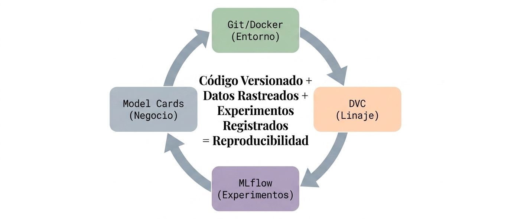
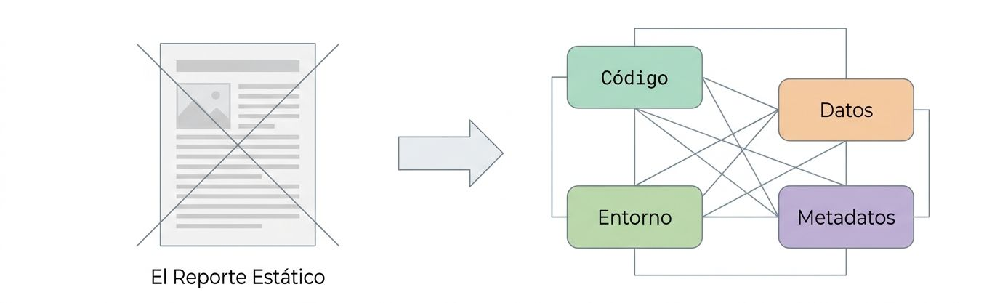
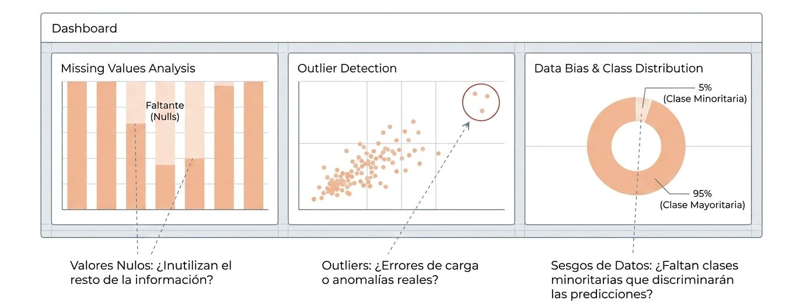
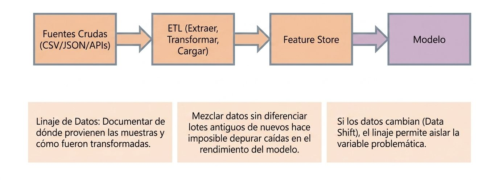

<figure>

<figcaption></figcaption>
</figure>

## Documentación y trazabilidad

La documentación y trazabilidad de un pipeline o proceso de software no se limitan a escribir comentarios en el código, sino que implican un enfoque sistémico para garantizar que los resultados sean explicables, auditables y reproducibles.

La documentación no es un paso final; es la infraestructura que sostiene todo el ciclo de vida.

<figure>

<figcaption>Documentar no es redactar un resumen final.</figcaption>
</figure>

A continuación, se detallan las mejores prácticas para generar una documentación y trazabilidad robustas:

### Garantizar la Reproducibilidad
La reproducibilidad es el pilar de la trazabilidad. No solo se debe guardar el código, sino todo el entorno que permitió generar un resultado específico.

<figure>

<figcaption>La reproducibilidad se construye desde los cimientos. Un fallo en la base invalida los niveles superiores.</figcaption>
</figure>

*   **Almacenamiento de metadatos:** Se deben guardar todos los **inputs y outputs** del modelo, junto con su configuración, dependencias de librerías (versiones exactas en archivos como `requirements.txt` o `environment.yml`), geografía y zonas horarias.

*   **Uso de rutas relativas:** El proyecto debe ser autocontenido. No se deben usar rutas de archivos absolutas, sino rutas relativas a la "raíz" del proyecto para que este pueda ejecutarse en cualquier máquina sin cambios.

*   **Fijar la aleatoriedad:** Es vital establecer semillas (*seeds*) para los generadores de números aleatorios para asegurar que los experimentos sean replicables.

<figure>

<figcaption>Documentar los hallazgos tempranos evita riesgos y sesgos.</figcaption>
</figure>

### Trazabilidad del Dato (*Data Lineage*)

La implementación de la trazabilidad del dato (**data lineage**) es un enfoque sistémico fundamental para garantizar que los resultados de un modelo sean explicables, auditables y reproducibles. Consiste en mantener un registro detallado del origen de cada muestra de datos y de las etiquetas que se le asignaron a lo largo de todo su ciclo de vida.

<figure>

<figcaption>Rastrear el origen y las transformaciones que ha sufrido el dato.</figcaption>
</figure>

El *data lineage* permite rastrear el origen y las transformaciones que ha sufrido el dato desde su nacimiento hasta el modelo final.
*   **Rastreo de origen:** Es una buena práctica registrar de dónde proviene cada muestra de datos y quién o qué proceso generó sus etiquetas. Esto es crucial para detectar sesgos o errores sistémicos si el modelo falla tras adquirir nuevos datos.

*   **Identificación de problemas:** El seguimiento del linaje ayuda a identificar problemas en la captura de datos o errores en las transformaciones intermedias (ETL).

*   **Versionamiento del dato:** Al igual que el código se versiona con Git, los datos deben versionarse con herramientas específicas como **DVC**, ya que duplicar archivos pesados manualmente no es viable.

A continuación, se presentan las mejores formas de implementarlo y un ejemplo concreto basado en las fuentes:

#### Mejores prácticas para implementar la trazabilidad del dato

1.  **Registro de metadatos exhaustivo:** No basta con guardar los datos; se deben almacenar todos los **inputs y outputs** del sistema junto con los metadatos relevantes, tales como la configuración del modelo, las dependencias de librerías, la geografía y las zonas horarias. Esto permite explicar por qué se tomó una decisión específica en el pasado.

2.  **Versionamiento de datos y código:** Es imperativo versionar tanto el código (usando **Git**) como los conjuntos de datos (usando herramientas como **DVC**). Esto es vital porque los sistemas de Machine Learning son una combinación de ambos, y el código por sí solo no permite reconstruir un experimento si los datos han cambiado.

3.  **Seguimiento de artefactos y experimentos:** Se recomienda el uso de herramientas como **MLflow, Weights & Biases o Comet.ml** para registrar los artefactos generados (como curvas de pérdida o logs) y las definiciones necesarias para recrear un experimento. 

4.  **Trazabilidad de la evolución del modelo:** En entornos de entrenamiento continuo, es necesario saber qué versión del modelo (ej. 1.1) fue la base para la siguiente (1.2) y qué datos específicos se utilizaron para esa actualización. Esto facilita la depuración si el rendimiento del sistema decae tras una actualización.

5.  **Identificación del origen de las etiquetas:** Se debe documentar quién o qué proceso generó las etiquetas de cada muestra. Esto es crucial para detectar sesgos o problemas de calidad si se combinan datos de múltiples fuentes o anotadores.

---

#### Ejemplo de aplicación

Imagine un equipo de ingeniería de datos que ha entrenado un modelo exitoso con **100,000 muestras** de alta calidad. Con el fin de mejorar el rendimiento, deciden adquirir un **millón de muestras adicionales** mediante *crowdsourcing*. Sin embargo, tras entrenar el modelo con el conjunto combinado, el rendimiento disminuye inexplicablemente.

**Sin trazabilidad (Data Lineage):**
El equipo no puede distinguir las muestras nuevas de las antiguas una vez mezcladas, lo que hace casi imposible identificar la causa de la degradación del modelo sin empezar el proceso desde cero.

**Con implementación de Data Lineage:**
Al tener implementada la trazabilidad, el equipo puede realizar las siguientes acciones de depuración:
*   **Aislar el problema:** Identifican rápidamente que el fallo ocurre principalmente en las muestras adquiridas recientemente.

*   **Identificar la causa raíz:** Al rastrear el linaje de esas muestras, descubren que el nuevo grupo de anotadores externos etiquetó los datos con una **precisión mucho menor** que el equipo original.

*   **Remediación inmediata:** Gracias al registro de origen, pueden filtrar las muestras defectuosas, revertir los datos a la versión anterior (usando **DVC**) y restaurar el modelo a su estado estable anterior (usando **MLflow**).

