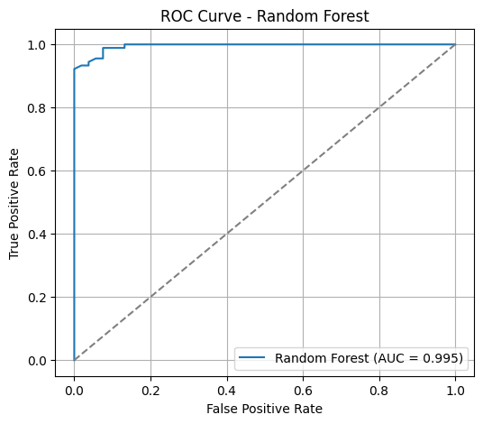
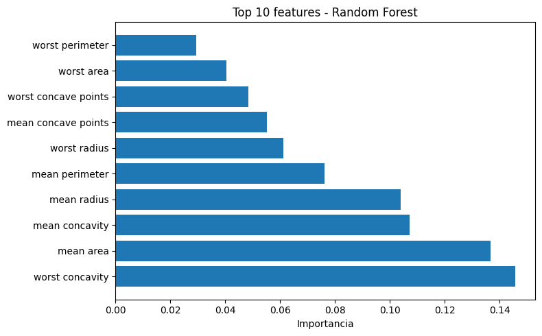
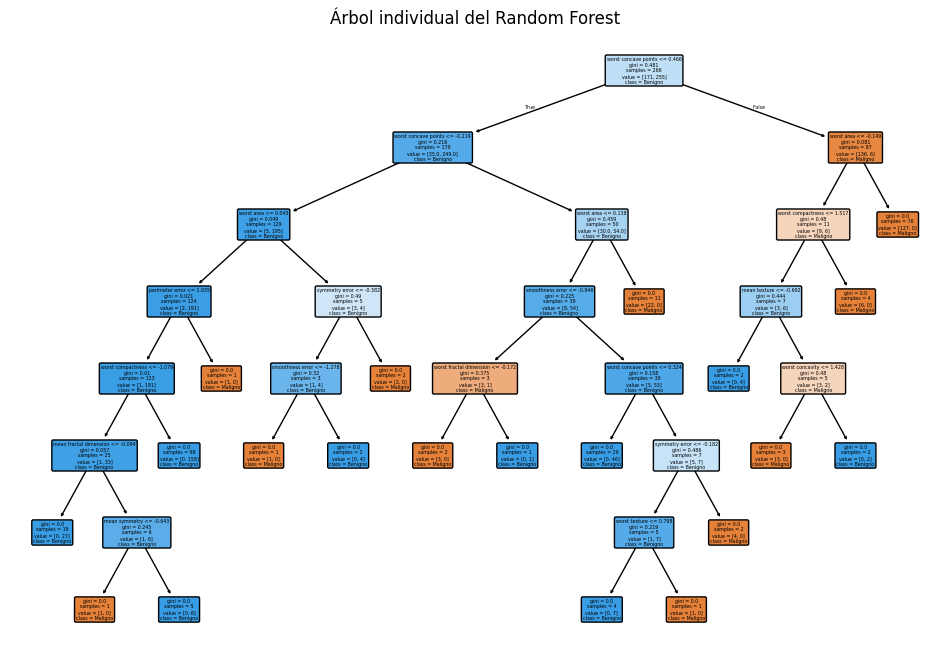
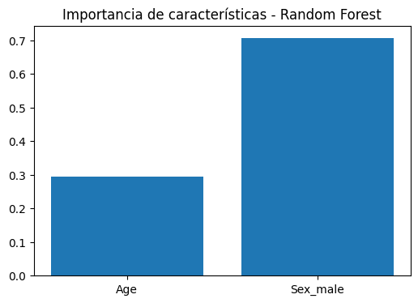

El **Random Forest** es un algoritmo de aprendizaje supervisado basado en el **ensamblado de múltiples árboles de decisión** combinando las predicciones de múltiples árboles individuales para generar un resultado final más preciso y robusto. Su objetivo es mejorar la precisión y robustez de las predicciones, tanto en tareas de clasificación como de regresión, reduciendo el sobreajuste (*overfitting*) que suelen presentar los árboles individuales.

El algoritmo de Random Forest surgió como una solución directa para mitigar una limitación clave de los Árboles de Decisión individuales: la propensión al sobreajuste (overfitting). Un solo árbol, si se le permite crecer con suficiente profundidad, puede memorizar los datos de entrenamiento (incluyendo su ruido) en lugar de aprender a generalizar la relación subyacente.

Al crear muchos árboles que trabajan en conjunto, el modelo se vuelve menos sensible a los datos ruidosos, logrando una mayor precisión y una notable resistencia al sobreajuste.

El éxito de Random Forest se basa en introducir intencionalmente una "doble aleatoriedad" durante el proceso de entrenamiento de cada árbol individual, asegurando que cada uno desarrolle una perspectiva ligeramente diferente del problema.

**¿Cómo funciona?**
- Construye un conjunto (o "bosque") de árboles de decisión independientes, cada uno entrenado sobre una muestra aleatoria (con reemplazo, *bootstrap*) de los datos originales.

- En cada nodo de cada árbol, la selección de la variable para dividir se realiza considerando solo un subconjunto aleatorio de las variables disponibles, lo que introduce diversidad entre los árboles.

- Para clasificación, cada árbol vota por una clase y la predicción final es la clase más votada (mayoría). Para regresión, se promedian las predicciones de todos los árboles.

**Ventajas principales:**
- Generalmente ofrece mayor precisión que un solo árbol de decisión.
- Es robusto frente al ruido y al sobreajuste.
- Puede manejar grandes cantidades de variables y datos.
- Permite estimar la importancia de cada variable en la predicción.

**Desventajas:**
- Menor interpretabilidad que un árbol único.
- Puede ser computacionalmente costoso con muchos árboles y datos muy grandes.

**Aplicaciones comunes:**  
Detección de fraudes, diagnóstico médico, clasificación de imágenes, predicción de abandono de clientes, análisis de crédito, entre otros.

**Resumen:**  
Random Forest es una técnica poderosa y versátil, ampliamente utilizada en la industria y la investigación por su capacidad para ofrecer predicciones precisas y estables en una amplia variedad de problemas.

## Los pasos para construir un Random Forest son:
### A. Muestreo de Datos (Bootstrapping)
En lugar de entrenar cada árbol con el conjunto de datos completo, el algoritmo utiliza una técnica llamada "muestreo de bolsa" o "bootstrapping".

Esto implica:

1. Se toma un subconjunto aleatorio del conjunto de datos original.
2. Este subconjunto se utiliza para entrenar un árbol individual.
3. Este proceso se repite, creando muchos árboles, cada uno basado en un subconjunto de datos ligeramente diferente

### B. Selección Aleatoria de Características
Cuando un árbol de decisión se está construyendo (definiendo sus nodos de división), normalmente buscaría la mejor división entre todas las características disponibles. Random Forest añade una capa extra de aleatoriedad:

1. Si el conjunto total de atributos es m, en cada división, el algoritmo solo considera un subconjunto aleatorio de k características (donde k < m).

2. El árbol debe elegir la mejor división dentro de este subconjunto limitado.
Esta variación constante en los datos de entrenamiento y las características utilizadas reduce la correlación entre los árboles y mejora la precisión general del modelo.

3. Predicción y Agregación
Una vez que se ha construido el "bosque" de n árboles, el algoritmo combina sus salidas para obtener una predicción robusta:

- **Para problemas de Clasificación**: Cada árbol "vota" por una clase. La predicción final se determina por la mayoría de los votos emitidos por todos los árboles.

- **Para problemas de Regresión**: Las salidas de todos los árboles se promedian para determinar el valor predicho final.


```python showLineNumbers
# Random Forest - clasificación sobre el dataset breast cancer (sklearn)
from sklearn.ensemble import RandomForestClassifier
from sklearn.datasets import load_breast_cancer
from sklearn.model_selection import train_test_split
from sklearn.preprocessing import StandardScaler
from sklearn.metrics import (
    accuracy_score,
    classification_report,
    confusion_matrix,
    roc_auc_score,
    roc_curve,
)
import numpy as np
import matplotlib.pyplot as plt

# Cargar datos
data = load_breast_cancer()
X_bc = data.data
y_bc = data.target
feature_names = data.feature_names

# División train/test
X_train_bc, X_test_bc, y_train_bc, y_test_bc = train_test_split(
    X_bc, y_bc, test_size=0.25, random_state=42, stratify=y_bc
)

# Escalado (opcional pero recomendado para muchos modelos)
scaler = StandardScaler()
X_train_s = scaler.fit_transform(X_train_bc)
X_test_s = scaler.transform(X_test_bc)

# Definir y entrenar el modelo
rf_clf = RandomForestClassifier(
    n_estimators=200,
    max_depth=None,
    random_state=42,
    n_jobs=-1,
    oob_score=True
)
rf_clf.fit(X_train_s, y_train_bc)

# Predicción y probabilidades
y_pred_rf = rf_clf.predict(X_test_s)
y_proba_rf = rf_clf.predict_proba(X_test_s)[:, 1]

# Métricas de evaluación
acc_rf = accuracy_score(y_test_bc, y_pred_rf)
roc_auc_rf = roc_auc_score(y_test_bc, y_proba_rf)

print(f"Accuracy (RF): {acc_rf:.4f}")
print(f"ROC AUC (RF): {roc_auc_rf:.4f}")
print("\nClassification Report (RF):")
print(classification_report(y_test_bc, y_pred_rf))
print("Confusion Matrix (RF):")
print(confusion_matrix(y_test_bc, y_pred_rf))
if hasattr(rf_clf, "oob_score_"):
    print(f"OOB Score: {rf_clf.oob_score_:.4f}")

# Curva ROC
fpr_rf, tpr_rf, _ = roc_curve(y_test_bc, y_proba_rf)
plt.figure(figsize=(6,5))
plt.plot(fpr_rf, tpr_rf, label=f'Random Forest (AUC = {roc_auc_rf:.3f})')
plt.plot([0,1], [0,1], '--', color='gray')
plt.xlabel('False Positive Rate')
plt.ylabel('True Positive Rate')
plt.title('ROC Curve - Random Forest')
plt.legend()
plt.grid(True)
plt.show()

# Importancia de características (top 10)
importances_rf = rf_clf.feature_importances_
idxs_rf = np.argsort(importances_rf)[::-1][:10]
top_feats_rf = feature_names[idxs_rf]
top_vals_rf = importances_rf[idxs_rf]

plt.figure(figsize=(8,5))
plt.barh(np.arange(len(top_feats_rf))[::-1], top_vals_rf[::-1], align='center')
plt.yticks(np.arange(len(top_feats_rf)), top_feats_rf[::-1])
plt.xlabel('Importancia')
plt.title('Top 10 features - Random Forest')
plt.tight_layout()
plt.show()

# visualización de un árbol individual del bosque
plt.figure(figsize=(12,8))
plot_tree(rf_clf.estimators_[0], feature_names=feature_names, class_names=['Maligno', 'Benigno'], filled=True, rounded=True)
plt.title('Árbol individual del Random Forest')
plt.show()
```

    Accuracy (RF): 0.9580
    ROC AUC (RF): 0.9950
    
    Classification Report (RF):
                  precision    recall  f1-score   support
    
               0       0.96      0.92      0.94        53
               1       0.96      0.98      0.97        90
    
        accuracy                           0.96       143
       macro avg       0.96      0.95      0.95       143
    weighted avg       0.96      0.96      0.96       143
    
    Confusion Matrix (RF):
    [[49  4]
     [ 2 88]]
    OOB Score: 0.9624


    

    


    

    


    

    


```python showLineNumbers
# Random Forest - clasificación sobre el dataset titanic
from sklearn.ensemble import RandomForestClassifier
from sklearn.model_selection import train_test_split
from sklearn.metrics import accuracy_score, classification_report, confusion_matrix
import pandas as pd
import numpy as np
import matplotlib.pyplot as plt
# Cargar y preparar datos
df = pd.read_csv('../data/titanic.csv')
df = df[['Survived', 'Age', 'Sex']].dropna(subset=['Survived', 'Age', 'Sex'])
# Codificar sexo (male=1, female=0)
df['Sex_male'] = df['Sex'].map({'male': 1, 'female': 0})
# Características y etiqueta
X_t = df[['Age', 'Sex_male']].values
y_t = df['Survived'].astype(int).values
# División entrenamiento/prueba
X_train, X_test, y_train, y_test = train_test_split(X_t, y_t, test_size=0.3, random_state=42, stratify=y_t)
# Entrenar Random Forest
rf_clf = RandomForestClassifier(n_estimators=100, max_depth=3, random_state=0)
rf_clf.fit(X_train, y_train)
# Evaluación
y_pred = rf_clf.predict(X_test)
print("Accuracy:", accuracy_score(y_test, y_pred))
print(classification_report(y_test, y_pred))
# Importancia de características
importances = rf_clf.feature_importances_
feature_names = ['Age', 'Sex_male']
plt.figure(figsize=(6,4))
plt.bar(feature_names, importances)
plt.title('Importancia de características - Random Forest')
plt.show()  

```

    Accuracy: 0.7865168539325843
                  precision    recall  f1-score   support
    
               0       0.80      0.87      0.83       164
               1       0.76      0.65      0.70       103
    
        accuracy                           0.79       267
       macro avg       0.78      0.76      0.77       267
    weighted avg       0.78      0.79      0.78       267
    


    

    


```python showLineNumbers
# genera predicciones para pasajeros con diferentes edades y sexos
sample_passengers = np.array([[22, 0],  # 22 años, masculino
                              [30, 1],  # 30 años, femenino
                              [40, 1],  # 40 años, femenino
                              [35, 0]]) # 35 años, masculino
predictions = rf_clf.predict(sample_passengers)
print("Predicciones de supervivencia para pasajeros de diferentes edades y sexos:")
for i, passenger in enumerate(sample_passengers):
    age, sex = passenger
    survival = 'Sobrevive' if predictions[i] == 1 else 'No Sobrevive'
    print(f"{age} años y sexo {'masculino' if sex == 1 else 'femenino'}: {survival}")
```

    Predicciones de supervivencia para pasajeros de diferentes edades y sexos:
    22 años y sexo femenino: Sobrevive
    30 años y sexo masculino: No Sobrevive
    40 años y sexo masculino: No Sobrevive
    35 años y sexo femenino: Sobrevive


---