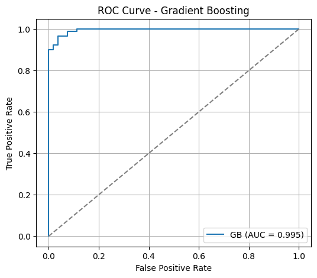
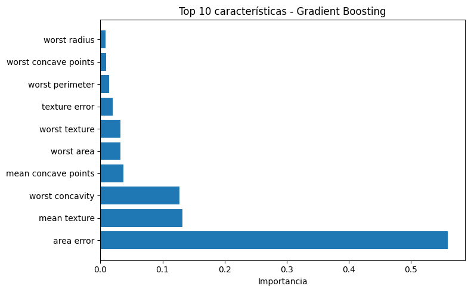
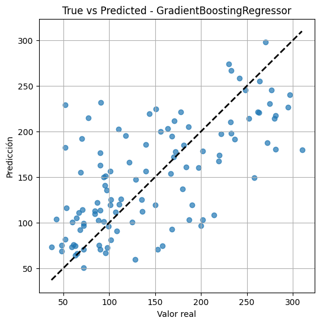
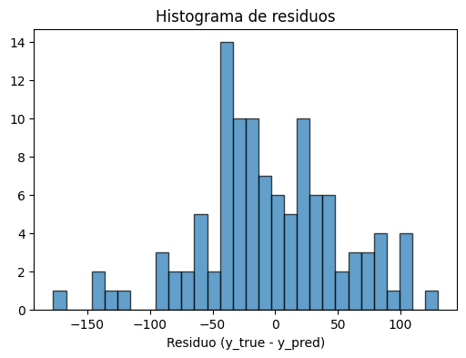
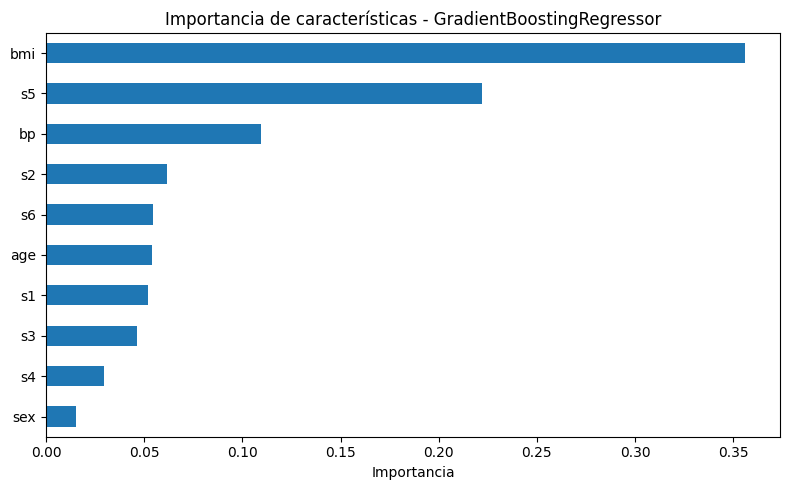

El **Gradient Boosting** (Impulso de Gradiente) es una técnica de ensamblado (*ensemble*) utilizada en machine learning para construir modelos predictivos potentes a partir de la combinación secuencial de modelos débiles, generalmente árboles de decisión poco profundos. El objetivo es mejorar la precisión corrigiendo los errores cometidos por los modelos anteriores en cada iteración.

Este algoritmo pertenece a la clase de modelos basados en árboles (Tree-Based) y se utiliza tanto para problemas de clasificación como de regresión.

La característica distintiva del gradient boosting es su enfoque de **ensamblado secuencial**, a diferencia de otros métodos (como Random Forest) que construyen modelos en paralelo.

1. **Construcción Serial**: Los árboles de decisión se construyen uno tras otro.
**
2. **Corrección de Errores: Cada nuevo árbol que se añade al modelo intenta corregir los errores o las debilidades del árbol construido inmediatamente anterior.

3. **Minimización de la Pérdida**: El método utiliza el concepto de **gradiente** (que es la pendiente de una función) para determinar la dirección en la que deben ajustarse los parámetros del modelo, con el objetivo de minimizar la función de pérdida. Este proceso es similar a cómo el algoritmo de Descenso de Gradiente (Gradient Descent) se utiliza en redes neuronales para optimizar los pesos.

## Parámetros y Ventajas
Los modelos de gradient boosting suelen utilizar árboles poco profundos (a menudo con una profundidad máxima de uno a cinco niveles) y dependen de una fuerte pre-poda, en lugar de la aleatoriedad, para controlar la complejidad.

Dos parámetros clave para sintonizar este modelo son:
- **Learning Rate (Tasa de Aprendizaje)**: Este parámetro es crucial porque controla la fuerza con la que cada nuevo árbol intenta corregir los errores cometidos por los árboles anteriores.

- **n_estimators (Número de Estimadores)**: Representa la cantidad de árboles que se construirán en la secuencia.

Los algoritmos de gradient boosting se encuentran frecuentemente entre las soluciones ganadoras de las competiciones de aprendizaje automático y se utilizan ampliamente en la industria debido a su alta precisión.


### Definición matemática: 
Gradient Boosting busca minimizar una función de pérdida $L(y, F(x))$ (por ejemplo, el error cuadrático para regresión o la log-loss para clasificación) mediante la construcción de un modelo aditivo:

$$
F_{m}(x) = F_{m-1}(x) + \gamma_m h_m(x)
$$

donde:
- $F_{m}(x)$ es el modelo en la iteración $m$,
- $F_{m-1}(x)$ es el modelo anterior,
- $h_m(x)$ es el nuevo modelo débil (por ejemplo, un árbol de decisión),
- $\gamma_m$ es el peso (tasa de aprendizaje) asignado a $h_m(x)$.

En cada iteración, $h_m(x)$ se ajusta para aproximar el gradiente negativo de la función de pérdida respecto a las predicciones actuales, es decir, el error residual:

$$
r_{im} = -\left[ \frac{\partial L(y_i, F(x_i))}{\partial F(x_i)} \right]_{F(x) = F_{m-1}(x)}
$$

El nuevo modelo $h_m(x)$ se entrena para predecir estos residuos.

**Ejemplo de uso en Python (regresión):**


```python showLineNumbers
from sklearn.ensemble import GradientBoostingRegressor
import numpy as np

# Datos de ejemplo
X = np.array([[1], [2], [3], [4], [5]])
y = np.array([2, 4, 5, 4, 5])

# Entrenamiento del modelo Gradient Boosting
gb = GradientBoostingRegressor(n_estimators=100, learning_rate=0.1, max_depth=2)
gb.fit(X, y)

# Predicción
y_pred = gb.predict(X)
print("Predicciones:", y_pred)
```

    Predicciones: [2.00411646 4.00125883 4.99461973 4.00475908 4.9952459 ]


**Aplicaciones comunes:**  
Gradient Boosting se utiliza ampliamente en tareas de regresión y clasificación, como predicción de precios, scoring crediticio, detección de fraudes y competiciones de ciencia de datos (por ejemplo, XGBoost, LightGBM y CatBoost son variantes populares). Su fortaleza radica en su alta precisión y capacidad para manejar datos heterogéneos y relaciones complejas.

Ejemplo de clasificacion con gradient boosting (breast cancer)


```python showLineNumbers
from sklearn.datasets import load_breast_cancer
from sklearn.ensemble import GradientBoostingClassifier
from sklearn.preprocessing import StandardScaler
from sklearn.model_selection import train_test_split
from sklearn.metrics import accuracy_score, classification_report, confusion_matrix, roc_auc_score, roc_curve
import numpy as np
import pandas as pd

# Gradient Boosting (clasificación) con un dataset clásico: Breast Cancer
import matplotlib.pyplot as plt

# Cargar datos
data = load_breast_cancer()
X_bc = data.data
y_bc = data.target
feature_names = data.feature_names

# División train/test
X_train_bc, X_test_bc, y_train_bc, y_test_bc = train_test_split(
    X_bc, y_bc, test_size=0.25, random_state=42, stratify=y_bc
)

# Escalado (opcional pero recomendado para muchos modelos)
scaler = StandardScaler()
X_train_s = scaler.fit_transform(X_train_bc)
X_test_s = scaler.transform(X_test_bc)

# Entrenar el modelo Gradient Boosting (clasificador)
gb_clf = GradientBoostingClassifier(
    n_estimators=200,
    learning_rate=0.1,
    max_depth=3,
    random_state=42
)
gb_clf.fit(X_train_s, y_train_bc)

# Predicciones y evaluación
y_pred = gb_clf.predict(X_test_s)
y_proba = gb_clf.predict_proba(X_test_s)[:, 1]

print("Accuracy:", round(accuracy_score(y_test_bc, y_pred), 4))
print("ROC AUC:", round(roc_auc_score(y_test_bc, y_proba), 4))
print("\nClassification Report:\n", classification_report(y_test_bc, y_pred))
print("Confusion Matrix:\n", confusion_matrix(y_test_bc, y_pred))

# Curva ROC
fpr, tpr, _ = roc_curve(y_test_bc, y_proba)
plt.figure(figsize=(6,5))
plt.plot(fpr, tpr, label=f'GB (AUC = {roc_auc_score(y_test_bc, y_proba):.3f})')
plt.plot([0,1], [0,1], '--', color='gray')
plt.xlabel('False Positive Rate')
plt.ylabel('True Positive Rate')
plt.title('ROC Curve - Gradient Boosting')
plt.legend()
plt.grid(True)
plt.show()

# Importancias de características (top 10)
importances = gb_clf.feature_importances_
idxs = np.argsort(importances)[::-1][:10]
top_feats = feature_names[idxs]
top_vals = importances[idxs]

plt.figure(figsize=(8,5))
plt.barh(np.arange(len(top_feats))[::-1], top_vals[::-1], align='center')
plt.yticks(np.arange(len(top_feats)), top_feats[::-1])
plt.xlabel('Importancia')
plt.title('Top 10 características - Gradient Boosting')
plt.tight_layout()
plt.show()
```

    Accuracy: 0.958
    ROC AUC: 0.995
    
    Classification Report:
                   precision    recall  f1-score   support
    
               0       0.98      0.91      0.94        53
               1       0.95      0.99      0.97        90
    
        accuracy                           0.96       143
       macro avg       0.96      0.95      0.95       143
    weighted avg       0.96      0.96      0.96       143
    
    Confusion Matrix:
     [[48  5]
     [ 1 89]]


    

    


    

    


Ejemplo de regresion con gradient boosting (diabetes)


```python showLineNumbers
from sklearn.datasets import load_diabetes
from sklearn.ensemble import GradientBoostingRegressor
from sklearn.model_selection import train_test_split
from sklearn.preprocessing import StandardScaler
from sklearn.metrics import mean_squared_error, r2_score
import numpy as np
import pandas as pd

# Ejemplo completo de regresión con Gradient Boosting (sklearn) usando el dataset "diabetes"
import matplotlib.pyplot as plt

# Cargar datos
data = load_diabetes()
X = data.data
y = data.target
feature_names = data.feature_names

# División train/test
X_train, X_test, y_train, y_test = train_test_split(X, y, test_size=0.25, random_state=42)

# Escalado de características (recomendado)
scaler = StandardScaler()
X_train_s = scaler.fit_transform(X_train)
X_test_s = scaler.transform(X_test)

# Definir y entrenar el modelo Gradient Boosting (regresión)
gb = GradientBoostingRegressor(n_estimators=300, learning_rate=0.05, max_depth=3, random_state=42)
gb.fit(X_train_s, y_train)

# Predicción y métricas
y_pred = gb.predict(X_test_s)
mse = mean_squared_error(y_test, y_pred)
rmse = np.sqrt(mse)
r2 = r2_score(y_test, y_pred)
print(f"MSE: {mse:.3f}    RMSE: {rmse:.3f}    R2: {r2:.3f}")

# Gráfica: True vs Predicted
plt.figure(figsize=(6,6))
plt.scatter(y_test, y_pred, alpha=0.7)
plt.plot([y_test.min(), y_test.max()], [y_test.min(), y_test.max()], 'k--', lw=2)
plt.xlabel("Valor real")
plt.ylabel("Predicción")
plt.title("True vs Predicted - GradientBoostingRegressor")
plt.grid(True)
plt.show()

# Histograma de residuos
residuals = y_test - y_pred
plt.figure(figsize=(6,4))
plt.hist(residuals, bins=30, edgecolor='k', alpha=0.7)
plt.xlabel("Residuo (y_true - y_pred)")
plt.title("Histograma de residuos")
plt.show()

# Importancias de características
fi = gb.feature_importances_
fi_series = pd.Series(fi, index=feature_names).sort_values(ascending=True)
plt.figure(figsize=(8,5))
fi_series.plot.barh()
plt.title("Importancia de características - GradientBoostingRegressor")
plt.xlabel("Importancia")
plt.tight_layout()
plt.show()
```

    MSE: 3243.543    RMSE: 56.952    R2: 0.413


    

    


    

    


    

    

