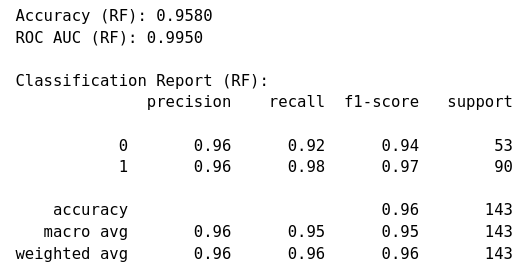
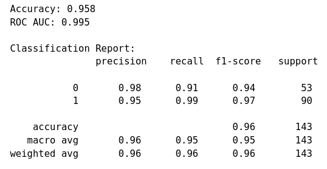
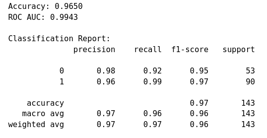

## XGBoost (Extreme Gradient Boosting)

XGBoost es una implementación avanzada del gradient boosting que lleva esta metodología un paso más allá.
- **Gradientes de Segundo Orden**: XGBoost utiliza aproximaciones más detalladas al calcular los gradientes de segundo orden de la función de pérdida para minimizarla.

- **Regularización Avanzada**: Incorpora técnicas de regularización avanzada (L1 y L2) para reducir el sobreajuste (overfitting), lo que mejora el rendimiento y la capacidad de generalización del modelo.
- **Modelo Destacado**: Tanto XGBoost como LightGBM son modelos basados en árboles que han demostrado en ciertos casos ser capaces de superar incluso a las redes neuronales.


```python showLineNumbers
# Ejemplo completo de clasificación con XGBoost (sklearn API) usando el dataset breast cancer
import sys
import subprocess
from xgboost import XGBClassifier
import xgboost as xgb
from sklearn.datasets import load_breast_cancer
from sklearn.model_selection import train_test_split
from sklearn.preprocessing import StandardScaler
import numpy as np
import pandas as pd
import matplotlib.pyplot as plt

# Intentar importar xgboost, instalar si no está disponible
#try:
#except Exception:
#    subprocess.check_call([sys.executable, "-m", "pip", "install", "xgboost"])

from sklearn.metrics import (
    accuracy_score,
    classification_report,
    confusion_matrix,
    roc_auc_score,
    roc_curve,
)


# Cargar datos
data = load_breast_cancer()
X = data.data
y = data.target
feature_names = data.feature_names

# División train/test (estratificado)
X_train, X_test, y_train, y_test = train_test_split(
    X, y, test_size=0.25, random_state=42, stratify=y
)

# Escalado (recomendado para XGBoost no es obligatorio, pero es útil para comparativas)
scaler = StandardScaler()
X_train_s = scaler.fit_transform(X_train)
X_test_s = scaler.transform(X_test)

# Definir el clasificador XGBoost (sklearn wrapper)
clf = XGBClassifier(
    n_estimators=200,
    learning_rate=0.1,
    max_depth=3,
    use_label_encoder=False,  # evita warning en versiones recientes
    eval_metric="logloss",
    random_state=42,
    n_jobs=-1,
)

# Entrenar con early stopping monitorizando el conjunto de validación (test)
# Algunas versiones del wrapper sklearn de XGBoost no aceptan `callbacks` en fit().
# Usamos el argumento compatible `early_stopping_rounds` en su lugar.
clf.fit(
    X_train_s,
    y_train,
    eval_set=[(X_test_s, y_test)],
    verbose=False,
)

# Predicciones y probabilidades
y_pred = clf.predict(X_test_s)
y_proba = clf.predict_proba(X_test_s)[:, 1]

# Métricas de evaluación
acc = accuracy_score(y_test, y_pred)
roc_auc = roc_auc_score(y_test, y_proba)
print(f"Accuracy: {acc:.4f}")
print(f"ROC AUC: {roc_auc:.4f}\n")
print("Classification Report:")
print(classification_report(y_test, y_pred))
print("Confusion Matrix:")
print(confusion_matrix(y_test, y_pred))

# Curva ROC
fpr, tpr, _ = roc_curve(y_test, y_proba)
plt.figure(figsize=(6,5))
plt.plot(fpr, tpr, label=f"XGBoost (AUC = {roc_auc:.3f})")
plt.plot([0,1], [0,1], "--", color="gray")
plt.xlabel("False Positive Rate")
plt.ylabel("True Positive Rate")
plt.title("ROC Curve - XGBoost")
plt.legend()
plt.grid(True)
plt.show()

# Importancias de características (top 10)
importances = clf.feature_importances_
idxs = np.argsort(importances)[::-1][:10]
top_feats = feature_names[idxs]
top_vals = importances[idxs]

pd.Series(top_vals, index=top_feats).sort_values().plot.barh(figsize=(8,5))
plt.title("Top 10 features - XGBoost")
plt.xlabel("Feature importance")
plt.tight_layout()
plt.show()
```


    ---------------------------------------------------------------------------

    ModuleNotFoundError                       Traceback (most recent call last)

    Cell In[22], line 4
          2 import sys
          3 import subprocess
    ----> 4 from xgboost import XGBClassifier
          5 import xgboost as xgb
          6 from sklearn.datasets import load_breast_cancer


    ModuleNotFoundError: No module named 'xgboost'


Random Forest



Gradient boosting



XGBoost


