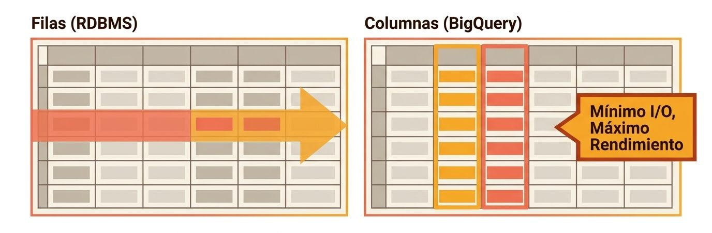
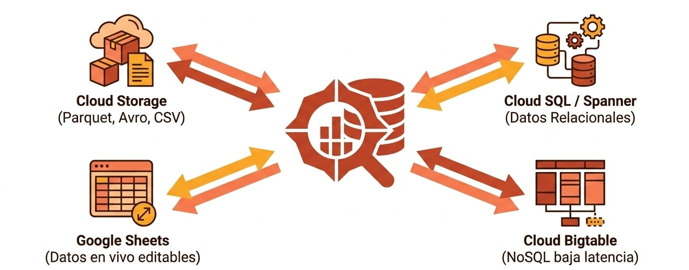
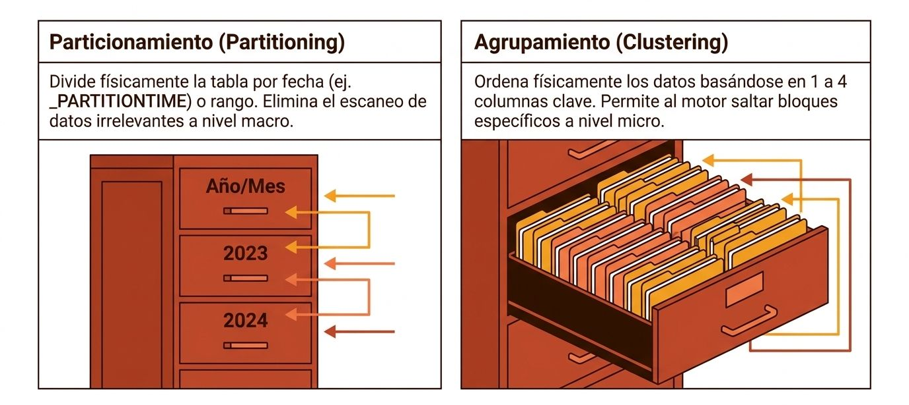
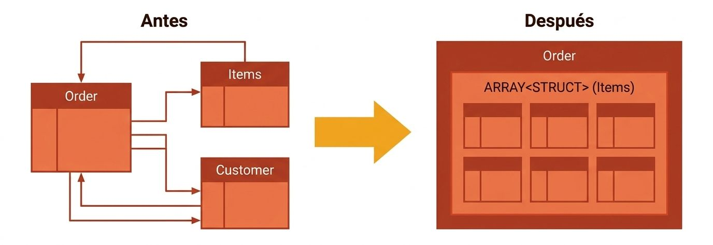

<center>
<figure>

<figcaption></figcaption>
</figure>
</center>

## **BigQuery**

**BigQuery** es un almacén de datos (data warehouse) empresarial de bajo costo, altamente escalable y completamente administrado (serverless) dentro de Google Cloud Platform (GCP). Está diseñado para que cualquier analista o ingeniero pueda procesar y analizar volúmenes masivos de datos (terabytes en segundos y petabytes en minutos) usando consultas de SQL estándar, sin tener que preocuparse por configurar o gestionar bases de datos, discos o servidores físicos.

Para entenderlo de forma simple, imagina que en lugar de leer una tabla fila por fila (como en una base de datos tradicional o en un Excel), BigQuery lee los datos columna por columna. Esto significa que si tienes una tabla con cientos de columnas pero solo necesitas saber la fecha de compra y el monto, BigQuery leerá únicamente esas dos columnas, ahorrando muchísimo tiempo y dinero. Además, separa por completo el "cerebro" que procesa las consultas de los "discos" donde se guardan los datos, lo que le permite coordinar miles de computadoras en segundos para resolver una sola pregunta de manera extremadamente eficiente.


### Operación

Para lograr un rendimiento ultra rápido a escala de petabytes sin necesidad de índices o mantenimiento, BigQuery se apoya en una arquitectura distribuida única y en varias tecnologías patentadas de Google:

#### 1. Arquitectura de Alto Nivel
*   **Separación de Cómputo y Almacenamiento**: BigQuery separa físicamente el procesamiento de la persistencia de los datos. El almacenamiento se centraliza en **Colossus** (el sistema de archivos distribuido de Google), mientras que el cómputo se escala dinámicamente mediante **"slots"** (cada slot representa un hilo de ejecución que equivale aproximadamente a medio núcleo de CPU y 1 GB de RAM). Esto permite pagar únicamente por los segundos de procesamiento utilizados.

*   **Almacenamiento Columnar y Formato Capacitor**: Los datos dentro de Colossus se guardan estructurados en un formato columnar llamado **Capacitor** formato propietario de Google. Al organizar los registros por columnas, las consultas analíticas leen exclusivamente los campos necesarios, reduciendo de forma masiva las operaciones de entrada/salida (I/O). Capacitor también utiliza sofisticadas heurísticas para reordenar filas sobre la marcha y lograr relaciones de compresión extraordinarias.

    Los sistemas de bases de datos tradicionales leen los datos fila por fila, desperdiciando I/O en campos no utilizados. BigQuery al utilizar Capacitor lee únicamente las columnas solicitadas por la consulta SQL. Si una consulta necesita 3 de 100 columnas, ignora el 97% de los datos. 

<center>
<figure>

<figcaption>Lectura de columnas con Capacitor.</figcaption>
</figure>
</center>

*   **Red de Alta Velocidad (Jupiter)**: La conexión entre los discos en Colossus y los procesadores que ejecutan la consulta se realiza mediante la red **Jupiter** de Google, la cual ofrece un ancho de banda de bisección de 1 petabit por segundo dentro del centro de datos (equivalente a 100,000 servidores comunicándose simultáneamente a 10 Gb/s). Gracias a Jupiter, la transferencia de datos entre el cómputo y el almacenamiento es instantánea, lo que evita cuellos de botella al realizar operaciones de **Shuffle** (redistribución intermedia de datos entre las etapas de una consulta).

*   **Motor de Consultas Dremel X**: El motor SQL distribuido detrás de BigQuery es **Dremel**. Divide la ejecución de las consultas en varias etapas organizadas dinámicamente en un árbol de cómputo:
    *   **Query Master**: Analiza la consulta, verifica los metadatos de las tablas, realiza la poda de particiones (ignora los datos fuera de los filtros) y genera el plan de ejecución.
    *   **Scheduler (Planificador)**: Asigna y redistribuye los slots de cómputo de manera proporcional entre las consultas concurrentes para garantizar un entorno multi-inquilino justo.
    *   **Worker Shards (Nodos de trabajo)**: Ejecutan las tareas de cómputo en paralelo utilizando contenedores gestionados por **Borg** (el sistema de orquestación de infraestructura de Google).

#### 2. Mecanismo de Operación y Flujo de Datos
BigQuery gestiona el ciclo de vida de los datos mediante tres flujos principales:
*   **Mecanismos de Ingesta de Datos**:
    *   *Cargas por lotes (Batch loads)*: Los datos se pueden cargar de forma gratuita en múltiples formatos como **Avro** (el formato binario más eficiente y expresivo), Parquet, ORC, JSON delimitado por líneas y CSV.
    *   *Inserciones en streaming (Streaming inserts)*: Permite el flujo continuo de filas una a una directamente a través de su API de REST o pipelines con Cloud Dataflow. Los datos ingresados están disponibles para consulta de inmediato (en segundos), aunque tardan hasta 90 minutos en estar habilitados para operaciones de copia o exportación.
*   **Consultas Federadas (Fuentes Externas)**: BigQuery puede consultar datos 'en su lugar de origen' sin necesidad de cargarlos a su almacenamiento nativo. Es compatible con archivos en Google Cloud Storage, bases de datos NoSQL en **Cloud Bigtable**, hojas de cálculo en **Google Drive** o bases de datos relacionales en **Cloud SQL** (a través de `EXTERNAL_QUERY` en tiempo real).

<center>
<figure>

<figcaption>Consultas federadas: un motor, múltiples fuentes. Consultas datos externos sin cargarlos primero en BigQuery.</figcaption>
</figure>
</center>

:::info
**Consultas Federadas**: un motor, múltiples fuentes. Consultas datos externos sin cargarlos primero en BigQuery. Ideal para exploración ad-hoc (ELT) o para cruzar datos históricos masivos con sistemas transaccionales en tiempo real.
:::
*   **Transacciones ACID y Time Travel**: A pesar de ser una base de datos analítica, las operaciones de BigQuery son completamente ACID. Toda la información está encriptada automáticamente en reposo y tránsito. Además, gracias a la inmutabilidad de sus archivos de almacenamiento (storage sets), BigQuery mantiene un historial de cambios de hasta 7 días en el pasado (**Time Travel**), permitiendo consultar instantáneas históricas de las tablas.

#### 3. Optimización y Capacidades Avanzadas
Para optimizar el rendimiento y disminuir drásticamente los costos de escaneo (que se cobran a razón de \$5 por TB en esquemas de pago bajo demanda), BigQuery ofrece características de primer nivel:
*   **Particionamiento de Tablas**: Segmenta físicamente las tablas en partes más pequeñas basadas en fechas, timestamps de ingesta o rangos de enteros. Al filtrar por la columna de partición en una cláusula `WHERE`, BigQuery lee únicamente las secciones necesarias y evita escanear el resto de la tabla.

*   **Clustering (Agrupamiento)**: Clasifica y ordena semisorteadamente los datos de las particiones según el valor de hasta cuatro columnas clave. Esto optimiza drásticamente las consultas con filtros muy específicos o agregaciones frecuentes.
*   **Estructuras de Datos Jerárquicas (Arrays y Structs)**: BigQuery permite almacenar datos complejos y anidados mediante tipos **STRUCT** y **ARRAY** sin necesidad de aplanar la información (denormalización estructurada). Esto incrementa enormemente el rendimiento y evita tener que realizar costosos `JOIN` entre tablas de hechos y dimensiones.

*   **BigQuery ML e integración de Inteligencia Artificial**: Permite a analistas y científicos de datos entrenar, evaluar y predecir modelos de machine learning (incluyendo regresión lineal, clasificación logística, agrupamiento k-means y modelos personalizados de TensorFlow) directamente en la base de datos utilizando comandos extendidos de SQL.

*   **Sistemas de Información Geográfica (GIS)**: Soporta de forma nativa análisis geoespacial, permitiendo realizar topologías sobre puntos, líneas y polígonos representados bajo el elipsoide de referencia WGS84.

La optimizacion dentro de BigQuery funciona en base a dos técnicas principales consistentes en dividir los grandes volumenes de datos en secciones más manejables, particionamiento y clustering.
<center>
<figure>

<figcaption></figcaption>
</figure>
</center>

## **Particionamiento**

El **particionamiento de tablas** en BigQuery es una técnica de optimización de almacenamiento que consiste en **dividir una gran tabla lógica en segmentos físicos más pequeños llamados particiones**. 

Cuando ejecutas una consulta que filtra por el campo de partición, BigQuery realiza un proceso llamado **poda de particiones (*partition pruning*)**. Esto significa que el motor de consultas analiza los metadatos de la tabla para identificar qué segmentos específicos contienen la información requerida y **lee únicamente esos archivos, ignorando por completo el resto**. Esto reduce de forma masiva la cantidad de gigabytes o terabytes escaneados, disminuyendo drásticamente el costo de la consulta y acelerando el tiempo de respuesta.


### Cómo funciona

*   **Abstracción de Tabla Ligera**: Cada partición funciona prácticamente como una tabla física independiente, con su propio espacio de almacenamiento en Colossus y su correspondiente conjunto de metadatos.

*   **Filtrado a nivel de Metadatos (Spanner)**: En BigQuery, los metadatos del almacenamiento (como las ubicaciones de los archivos y los tamaños de campo) se guardan en una base de datos distribuida (Google Spanner). Las particiones se representan en estos metadatos mediante conjuntos de almacenamiento (*storage sets*) etiquetados con un **Partition ID**.

*   **Resolución sin abrir archivos**: Cuando filtras tus datos (por ejemplo, `WHERE fecha = '2026-08-25'`), el Query Master de BigQuery consulta primero la capa de metadatos en Spanner. Gracias a un índice de Spanner, identifica inmediatamente los *storage sets* exactos que corresponden a ese Partition ID. De esta forma, el motor descarta el resto de los archivos antes de tener que abrirlos o leerlos físicamente de los discos de Colossus.


### Tipos de Particionamiento

BigQuery admite tres métodos principales para particionar una tabla:

1.  **Por Tiempo de Ingesta (*Ingestion-time partitioned*)**:
    *   BigQuery asigna los datos de manera automática a particiones diarias basándose en la fecha en que la información fue cargada o transmitida en tiempo real (*streamed*).
    *   Para hacer consultas, se utilizan las pseudocolumnas ocultas `_PARTITIONTIME` o `_PARTITIONDATE` en la cláusula `WHERE`.
    *   Los datos recién transmitidos que aún se encuentran en el búfer de streaming se retienen temporalmente en una partición especial llamada `__UNPARTITIONED__`.

2.  **Por Columna de Fecha/Hora (*Timestamp/Date partitioned*)**:
    *   La tabla se divide según los valores de una columna específica de tipo `DATE`, `TIMESTAMP` o `DATETIME` proporcionada en tus datos (por ejemplo, la fecha de creación de una transacción o un viaje).
    *   Las filas con valores nulos en esta columna se agrupan en una partición llamada `__NULL__`, y los registros cuyas fechas se sitúan fuera de los límites admitidos van a la partición `__UNPARTITIONED__`.

3.  **Por Rango de Enteros (*Integer range partitioned*)**:
    *   La tabla se divide en función de una columna numérica de tipo `INTEGER` (INT64).
    *   Al configurar este particionamiento, debes definir: la columna objetivo, el valor de inicio del rango, el valor de fin del rango y el intervalo que medirá cada partición. *(Por ejemplo, si defines un rango de 0 a 500 con un intervalo de 25, BigQuery creará exactamente 20 particiones físicas).*


### Un detalle crucial de optimización: Filtros Estáticos

Un error común que cometen muchos desarrolladores al usar tablas particionadas es aplicar funciones de extracción directamente sobre la columna de fecha en sus filtros.

Por ejemplo, si ejecutas esta consulta:
```sql showLineNumbers
SELECT start_station_name, AVG(duration)
FROM ch07eu.cycle_hire_partitioned
WHERE EXTRACT(YEAR FROM start_date) = 2015 -- ❌ NO OPTIMIZA
```
BigQuery **no podrá calcular estáticamente qué particiones podar** y terminará escaneando la tabla completa (procesando 1 GB en este conjunto de datos de prueba). 

Para que el particionamiento funcione y ahorres costos, debes escribir un filtro directo sobre la columna de partición:
```sql showLineNumbers
SELECT start_station_name, AVG(duration)
FROM ch07eu.cycle_hire_partitioned
WHERE start_date BETWEEN '2015-01-01' AND '2015-12-31' --  OPTIMIZA (Escanea solo 419 MB)
```

### Poda de particiones

**La poda de particiones (o *partition pruning*)** es el mecanismo inteligente que utiliza BigQuery para **evitar leer datos innecesarios** cuando realizas consultas sobre tablas particionadas. 

En términos sencillos: si tienes una tabla gigantesca dividida en "cajones" diarios (particiones), y tú solo preguntas por la información de un día específico, la poda de particiones consiste en que BigQuery ignora y "recorta" (poda) todos los cajones de los otros días. El motor de consultas va directamente al cajón que te interesa, evitando buscar en el resto de la base de datos.

#### Funcionamiento

Cuando envías una consulta SQL que incluye un filtro sobre la columna de partición (por ejemplo, `WHERE start_date = '2015-06-15'`), BigQuery ejecuta este proceso en varias etapas invisibles para ti:

1. **Análisis en el Query Master**: Al recibir la consulta, un componente llamado **Query Master** la analiza y extrae los filtros aplicados a las tablas.
2. **Evaluación de Metadatos**: Antes de ir a buscar los archivos físicos de datos en el sistema de almacenamiento Colossus, el Query Master se comunica con el servidor de metadatos (que corre sobre una base de datos distribuida de Google llamada Spanner).
3. **Poda en la Capa de Metadatos**: El filtro de partición se envía directamente a la base de datos de metadatos. BigQuery organiza internamente las particiones mediante bloques llamados **storage sets**, cada uno etiquetado con un identificador de partición (*Partition ID*). Gracias a un índice especial, BigQuery identifica inmediatamente qué *storage sets* corresponden al filtro y **descarta todos los demás**.
4. **Cero Lecturas Inútiles**: Como resultado de esta poda, el motor de ejecución recibe únicamente las ubicaciones de los archivos físicos que coinciden con tu filtro. BigQuery resuelve la consulta leyendo solo esos archivos y **sin necesidad de abrir o escanear una sola fila del resto de la tabla**.

#### Importancia

* **Ahorro masivo de dinero**: En el modelo de precios bajo demanda de BigQuery, pagas por la cantidad de datos escaneados. Al podar las particiones que no usas, reduces el escaneo de Terabytes a Gigabytes (o Megabytes), lo que disminuye drásticamente el costo de tu factura.
* **Velocidad de ejecución**: Al tener que leer menos datos de los discos físicos, la consulta requiere menos operaciones de entrada/salida (I/O) y se resuelve en una fracción del tiempo.

#### "Dry Run" (Prueba en seco)

Un **dry run** o prueba en seco es una funcionalidad nativa de BigQuery que te permite validar la sintaxis de una consulta SQL y obtener una estimación exacta de la cantidad de bytes que procesará antes de ejecutarla realmente. 

**Lo más importante: los dry runs son 100% gratuitos y no consumen recursos de procesamiento.**

Bajo el capó, cuando solicitas un dry run, BigQuery no accede a los discos de almacenamiento físico (Colossus) ni lee datos reales. En su lugar, el **Query Master** analiza la consulta y solicita a la base de datos de metadatos (Google Spanner) la información estructural de las tablas involucradas. Dado que BigQuery almacena el tamaño de las columnas y la información de los archivos en sus metadatos, puede calcular el tamaño exacto del escaneo de manera instantánea y gratuita.


**Código Python para simular un "Dry Run"**

Si se desarrolla una aplicación o un script de automatización en Python, se puede usar la biblioteca cliente oficial de Google Cloud para simular el dry run de esta manera:

```python showLineNumbers title="Simular un Dry Run"
from google.cloud import bigquery

# Inicializar el cliente de BigQuery
client = bigquery.Client()

# Definir la consulta sobre los viajes de bicicleta de Londres
query_text = """
SELECT 
  start_station_name, 
  AVG(duration) AS avg_duration
FROM `bigquery-public-data.london_bicycles.cycle_hire`
WHERE start_date BETWEEN '2015-01-01' AND '2015-12-31'
GROUP BY start_station_name
"""

# Configurar el trabajo para que sea únicamente una prueba en seco
job_config = bigquery.QueryJobConfig()
job_config.dry_run = True  # <- Activa el dry run sin costo

# Enviar la consulta (no se ejecutará, solo se validará)
query_job = client.query(query_text, job_config=job_config)

# Obtener y mostrar la cantidad estimada de datos a procesar
bytes_estimados = query_job.total_bytes_processed
megabytes_estimados = bytes_estimados / (1024 * 1024)

print(f"¡Dry Run Exitoso!")
print(f"Esta consulta procesará aproximadamente: {megabytes_estimados:.2f} MB ({bytes_estimados} bytes).")
```


#### Simulación Comparativa: Tabla Normal vs. Tabla Particionada

Aprovechando los datos reales del dataset de **alquiler de bicicletas de Londres (`london_bicycles.cycle_hire`)**, que cuenta con más de **24.4 millones de registros**, podemos comparar exactamente lo que reportaría el dry run en dos escenarios de consulta diferentes:

**Escenario 1: Consulta sin poda de particiones (Escaneo Completo)**

Si ejecutamos una consulta sobre la tabla original no particionada (o si usamos un filtro ineficiente que impide que BigQuery calcule estáticamente las fechas, como la función `EXTRACT`):

```sql showLineNumbers
SELECT
  start_station_name,
  AVG(duration) AS avg_duration
FROM `bigquery-public-data.london_bicycles.cycle_hire`
WHERE EXTRACT(YEAR FROM start_date) = 2015
GROUP BY start_station_name;
```
*   **Resultado del Dry Run**: **1.0 GB** procesados.
*   **¿Por qué?**: Debido a que la tabla no está particionada, o porque el motor no puede predecir el filtro antes de evaluar la función `EXTRACT`, BigQuery se ve obligado a realizar un escaneo completo (*table scan*) de la columna completa de duración y fecha para todas las filas.

**Escenario 2: Consulta optimizada con Poda de Particiones (Partition Pruning)**

Si primero creas una tabla particionada por día basada en la columna de fecha `start_date`:

```sql showLineNumbers
CREATE OR REPLACE TABLE mi_proyecto.london_bicycles.cycle_hire_partitioned
PARTITION BY DATE(start_date) AS
SELECT * FROM `bigquery-public-data.london_bicycles.cycle_hire`;
```
Y luego ejecutas una consulta utilizando un filtro de rango directo y estático (`BETWEEN`):
```sql showLineNumbers
SELECT
  start_station_name,
  AVG(duration) AS avg_duration
FROM mi_proyecto.london_bicycles.cycle_hire_partitioned
WHERE start_date BETWEEN '2015-01-01' AND '2015-12-31'
GROUP BY start_station_name;
```
*   **Resultado del Dry Run**: **419.4 MB** procesados.
*   **¿Por qué funciona?**: El Query Master de BigQuery analiza los metadatos de las particiones físicas (storage sets) antes de tocar los discos. Al ver el filtro estático de fechas, determina de inmediato qué particiones diarias corresponden al año 2015 y "poda" (ignora por completo) todas las demás particiones del almacenamiento.

#### El Ahorro de la Poda de Particiones

Gracias a la **poda de particiones**, el volumen de datos escaneados se reduce drásticamente de **1.0 GB a sólo 419.4 MB**, lo que representa un **ahorro de más del 58% en costos de consulta** (en el esquema bajo demanda) y una reducción proporcional en los tiempos de respuesta y consumo de slots de procesamiento.


### Limitaciones, Buenas Prácticas y Combinación con Clustering

*   **Límite de Particiones**: Una sola tabla en BigQuery puede tener un límite máximo de **4,000 particiones**.
*   **Riesgo de Sobreparticionamiento**: El particionamiento está diseñado para campos de **baja cardinalidad** (es decir, columnas con menos de unos pocos miles de valores distintos). Si particionas por una columna con demasiados valores únicos (como el ID de un usuario), crearás una cantidad enorme de metadatos. Esto ralentizará drásticamente las consultas que necesiten realizar un escaneo completo de la tabla, ya que BigQuery pasará más tiempo abriendo archivos de metadatos que leyendo el contenido de los discos.

*   **La Solución: Partición + Agrupamiento (Clustering)**: La mejor práctica recomendada para optimizar tablas masivas es combinar ambas técnicas. Debes particionar la tabla usando una columna de baja cardinalidad (como la fecha de evento) y posteriormente aplicar **Clustering** sobre una o más columnas de alta cardinalidad (como el ID del cliente o el nombre de una estación). Esto te permite delimitar la búsqueda primero en un rango de fechas y luego buscar rápidamente registros específicos sin tener que escanear toda la partición diaria.

*   **Filtros Obligatorios**: Puedes configurar la opción `require_partition_filter=true` al crear o alterar la tabla. Esto forzará a que cualquier usuario que intente consultar la tabla deba incluir obligatoriamente un filtro por la columna de partición, previniendo escaneos accidentales extremadamente costosos.


## **Clustering**

**El clustering (agrupamiento)** es una técnica de optimización de almacenamiento en BigQuery que organiza y ordena semisorteadamente los datos de una tabla basándose en los valores de una o más columnas clave (llamadas columnas de clustering). 

A diferencia del particionamiento (que segmenta la tabla físicamente en "cajones" independientes basados típicamente en fechas), el clustering está diseñado para columnas con **alta cardinalidad** (es decir, aquellas con un número ilimitado de valores distintos, como IDs de clientes, códigos de productos o nombres de usuario).


### funcionamiento

1.  **Ordenamiento a nivel de archivos**: Cuando cargas datos en una tabla agrupada, BigQuery ordena físicamente los registros para que los valores similares se almacenen en los mismos bloques de disco en Colossus. Es importante aclarar que los datos **no se ordenan dentro de cada archivo** (lo que ralentizaría la lectura y rompería las técnicas de compresión del formato Capacitor), sino que se distribuyen ordenadamente **entre los distintos archivos**, garantizando rangos de claves no superpuestos.

2.  **Búsqueda en Metadatos y Descarte de Bloques**: Al ejecutar una consulta con un filtro sobre la columna agrupada, el Query Master analiza los metadatos de la tabla (un archivo optimizado llamado *meta-file*). Como cada cabecera de archivo registra el valor mínimo y máximo de la clave de clustering que almacena, BigQuery puede realizar una **búsqueda binaria** ultrarrápida a nivel de metadatos. El motor identifica los archivos exactos donde residen los datos buscados y **descarta el resto sin tocarlos ni leerlos de Colossus**.

3.  **Reclustering Automático y Gratuito**: A medida que se realizan inserciones, modificaciones o flujos de streaming, el orden óptimo de los datos puede fragmentarse. Para mitigar esto, BigQuery calcula un "ratio de clustering" de forma continua y, en segundo plano, **reorganiza y reescribe los datos fragmentados de manera automática**. Este proceso se realiza utilizando recursos del sistema de Google, por lo que **no consume tus slots de procesamiento ni te genera costos**.

#### Tipos de datos soportados para Clustering
Puedes agrupar tablas utilizando columnas de tipo **`INT64`, `NUMERIC`, `STRING`, `DATE`, `GEOGRAPHY`, `TIMESTAMP` y `BOOL`**. **`FLOAT64` no es un tipo de datos admitido para clustering** y arrojará un error si intentas configurarlo.


#### Ejemplos prácticos

#### 1. El Patrón de Oro: Particionamiento + Clustering (Combinación Estrella)
La mejor práctica absoluta para optimizar tablas transaccionales masivas es segmentarlas primero por una columna temporal de baja cardinalidad (partición) y luego ordenarlas por campos de alta cardinalidad frecuentemente filtrados (clustering).

```sql showLineNumbers
CREATE OR REPLACE TABLE mi_dataset.fact_ventas
PARTITION BY DATE(fecha_transaccion)
CLUSTER BY cliente_id, tienda_id AS
SELECT * FROM `tabla_cruda_ventas`
```
*   **Caso de uso**: Si un analista busca las ventas de un cliente específico (`cliente_id = 12054`) durante un mes determinado, BigQuery primero utiliza el particionamiento para leer únicamente las particiones diarias de ese mes (poda de particiones). Posteriormente, utiliza el clustering para abrir exclusivamente los archivos que contienen el rango de ID de ese cliente dentro de las particiones activas, evitando escanear millones de registros de otros compradores.

#### 2. Optimización de uniones de tablas (Star Schema Joins)
Cuando realizas un `JOIN` entre una tabla de hechos gigantesca (como un registro de ventas) y una tabla de dimensiones pequeña (como un catálogo de clientes), el clustering acelera masivamente la operación.

```sql showLineNumbers
SELECT o.order_id, c.customer_name
FROM retail.orders AS o 
JOIN retail.customers AS c USING (customer_id)
WHERE c.customer_name = 'Jordan Tigani'
```
*   **Caso de uso**: Si la tabla `orders` está agrupada por `customer_id`, BigQuery primero evalúa el filtro en la tabla pequeña `customers` para encontrar el ID del cliente 'Jordan Tigani'. Una vez que tiene el ID, el motor va directamente a los bloques específicos de la tabla de hechos `orders` correspondientes a ese ID, saltándose el costoso proceso de escanear la tabla de hechos completa para realizar la unión.

#### 3. Agrupamiento con prefijos multi-columna (Clustering jerárquico)
BigQuery te permite agrupar una tabla utilizando hasta **cuatro columnas de clustering**. El orden en que las declaras es crítico porque BigQuery optimiza las consultas que filtran por cualquier prefijo de ese orden jerárquico.
*   *Configuración de ejemplo*: `CLUSTER BY pais, estado, ciudad`
*   **Casos de uso**:
    *   Una consulta con `WHERE pais = 'Chile'` se beneficia completamente del clustering.
    *   Una consulta con `WHERE pais = 'Chile' AND estado = 'Metropolitana'` también obtiene el beneficio total.
    *   Una consulta que filtra únicamente por `WHERE ciudad = 'Santiago'` **no experimentará ningún ahorro en bytes escaneados**, ya que se rompe el prefijo jerárquico al omitir las columnas anteriores (`pais` y `estado`).

#### 4. Columnas correlacionadas (Ahorros indirectos)
El clustering puede beneficiar a consultas que filtran por columnas que no forman parte de la clave de clustering, pero que guardan una fuerte relación o correlación física con ella.
*   **Caso de uso**: Si tienes una tabla de pedidos agrupada por un campo secuencial como `order_id`. Dado que los identificadores de pedido crecen de forma constante con el tiempo, existe una correlación directa entre el `order_id` y la fecha de transacción. Si ejecutas una consulta filtrando por un rango muy estrecho de fechas (por ejemplo, transacciones de las últimas 3 horas), BigQuery será capaz de identificar que esos registros se concentran en unos pocos archivos secuenciales de `order_id` en disco, omitiendo la lectura del resto de la tabla y ahorrando costos.

#### 5. Pruebas de exploración económica (`SELECT * LIMIT`)
Por lo general, agregar una cláusula `LIMIT` en BigQuery no reduce la cantidad de datos escaneados ni el costo en consultas sobre tablas tradicionales. Sin embargo, en tablas agrupadas (clustered), esto cambia por completo.
*   **Caso de uso**: Si ejecutas `SELECT * FROM tabla_clustered LIMIT 10`, el motor distribuido de BigQuery detiene de inmediato la lectura de los discos físicos en cuanto sus workers completan las primeras 10 filas. Esto reduce de forma drástica y no determinista los bytes escaneados, haciendo que las consultas exploratorias rápidas sean extremadamente baratas.

### Límite de columnas

En BigQuery, el límite para el clustering es de **un máximo de 4 columnas** por tabla. Esto significa que puedes elegir de una a cuatro columnas para definir el orden en el que se estructurarán físicamente tus datos dentro de los bloques de almacenamiento.

Para sacarle el mayor provecho a este límite, es muy importante tener en cuenta las siguientes reglas de diseño documentadas en tus fuentes:

*   **Tipos de datos permitidos**: Las columnas que utilices para el clustering deben ser de tipo primitivo y no repetidas (no pueden ser arrays). Los tipos de datos compatibles son `DATE`, `BOOL`, `GEOGRAPHY`, `INT64`, `NUMERIC`, `STRING` y `TIMESTAMP`. Debes evitar por completo el uso de columnas de tipo `FLOAT64`, ya que este tipo de datos **no está soportado** para el clustering y generará un error de configuración inmediatamente.
*   **La regla del prefijo (El orden importa)**: El orden en el que declaras tus columnas (de una a cuatro) define una jerarquía estricta. BigQuery solo puede optimizar y omitir bloques de datos cuando tus consultas utilicen un filtro que coincida con un **prefijo** de ese orden de columnas. Por ejemplo, si configuras un agrupamiento como `CLUSTER BY pais, estado, ciudad`, tus consultas ahorrarán costos si filtran por `pais`, o por `pais` y `estado` juntos; sin embargo, si filtras directamente por `ciudad` omitiendo las primeras columnas, no experimentarás ningún ahorro de escaneo, ya que se rompe la secuencia jerárquica.
*   **Combinación con particionamiento**: Para obtener la máxima eficiencia analítica, el clustering se define y se aplica sobre tablas que ya se encuentran particionadas, lo que te permite segmentar primero por baja cardinalidad (como fechas) y luego ordenar internamente por alta cardinalidad.

#### Ejemplo clustering multicolumna

Para ilustrar cómo diseñar un **clustering multicolumna eficaz** en un escenario real, utilizaremos un conjunto de datos transaccional clásico de comercio electrónico (e-commerce). 

Imagine una tabla llamada `customer_orders` (pedidos de clientes) que procesa millones de transacciones diarias. Los analistas y sistemas de reportes suelen consultar esta tabla aplicando filtros por **fecha de compra**, **ID del cliente**, **estado del pedido** (ej. completado, cancelado, pendiente) y, ocasionalmente, por el **ID del producto**.

A continuación, detallamos paso a paso el diseño de esta tabla utilizando la combinación estrella: **Particionamiento + Clustering Multicolumna**.


#### Paso 1: Configurar la base de la tabla (Partición por Fecha)

La columna `order_date` (fecha del pedido) es de **baja cardinalidad** (un valor por día) y es el filtro más común en los análisis temporales. Por lo tanto, el primer paso es **particionar la tabla por esta columna**. Esto segmentará físicamente los datos en "cajones" diarios.

#### Paso 2: Seleccionar y ordenar las columnas de Clustering

BigQuery permite elegir un **máximo de 4 columnas** para el agrupamiento. Para nuestro dataset transaccional, elegiremos tres columnas clave: `customer_id`, `order_status` y `product_id`.

El **orden de las columnas** en la cláusula `CLUSTER BY` es extremadamente crítico debido a la **Regla del Prefijo**. BigQuery ordenará físicamente los datos de la siguiente manera:
1. Primero, agrupa y ordena por `customer_id`.
2. Dentro de cada ID de cliente, ordena por `order_status`.
3. Dentro de cada estado, ordena por `product_id`.

Por lo tanto, declararemos el agrupamiento en este orden jerárquico: `CLUSTER BY customer_id, order_status, product_id`.


#### Paso 3: Código SQL (DDL) para Crear la Tabla Optimizada

Así se vería la sentencia SQL para materializar este diseño:

```sql showLineNumbers
CREATE OR REPLACE TABLE mi_proyecto.tienda_retail.orders_optimizada
PARTITION BY DATE(order_date)
CLUSTER BY customer_id, order_status, product_id
OPTIONS(
  require_partition_filter = true, -- Obliga a los usuarios a filtrar por fecha
  description = "Tabla de hechos de pedidos optimizada con partición diaria y clustering jerárquico"
) AS 
SELECT 
  order_id,
  order_date,
  customer_id,
  order_status,
  product_id,
  cantidad,
  monto_total
FROM `mi_proyecto.tienda_retail.raw_orders_temp`
```


#### ¿Cómo responden las consultas bajo este diseño? (Ejemplos de Uso)

Gracias a este esquema multicolumna, la eficiencia de tus consultas variará según cómo utilices los filtros:

**Caso A: Aprovechamiento Máximo (Filtro por Prefijo Completo)**
```sql showLineNumbers
SELECT product_id, SUM(cantidad) AS total_vendido
FROM mi_proyecto.tienda_retail.orders_optimizada
WHERE order_date BETWEEN '2026-08-01' AND '2026-08-31' -- Podas de partición activas
  AND customer_id = 45091                             -- Prefijo 1 de Clustering
  AND order_status = 'COMPLETED'                      -- Prefijo 2 de Clustering
GROUP BY product_id;
```
*   **¿Qué hace BigQuery?**: Primero, la poda de particiones descarta todos los días fuera de agosto de 2026. Segundo, gracias al clustering, el motor realiza una búsqueda binaria ultrarrápida a nivel de metadatos para ubicar el rango de bloques que contienen el ID de cliente `45091` y que además tienen el estado `'COMPLETED'`. Descarta el 99% de los bloques restantes de ese mes sin tocarlos, procesando una cantidad mínima de bytes.

**Caso B: Aprovechamiento Parcial (Prefijo Inicial)**
```sql showLineNumbers
SELECT order_status, COUNT(*) AS cantidad_pedidos
FROM mi_proyecto.tienda_retail.orders_optimizada
WHERE order_date = '2026-08-25'
  AND customer_id = 45091
GROUP BY order_status;
```
*   **¿Qué hace BigQuery?**: Aunque no filtramos por `order_status` ni por `product_id`, la consulta **sigue siendo sumamente eficiente**. Como utilizamos la primera columna de la jerarquía de clustering (`customer_id`), BigQuery puede saltar directamente a los archivos donde residen los datos de ese cliente específico para el día 25 de agosto.

**Caso C: Sin Optimización de Clustering (Ruptura del Prefijo)**
```sql showLineNumbers
SELECT customer_id, COUNT(*)
FROM mi_proyecto.tienda_retail.orders_optimizada
WHERE order_date = '2026-08-25'
  AND product_id = 99824 -- ❌ No se incluyó 'customer_id' ni 'order_status' en el WHERE
GROUP BY customer_id;
```
*   **¿Qué hace BigQuery?**: La poda de particiones funciona (solo lee el día 25 de agosto), pero **el clustering no aportará ningún beneficio de escaneo**. Al no incluir la primera columna de clustering (`customer_id`) en los filtros, BigQuery no puede realizar la búsqueda binaria jerárquica y se verá obligado a escanear la partición diaria completa.


#### Beneficio Adicional: Optimización en Uniones de Esquema en Estrella (Star Schema)

Si tienes una tabla pequeña de dimensiones de clientes (`customers`) y la unes con tu tabla gigante optimizada (`orders_optimizada`), BigQuery ejecutará una optimización inteligente en segundo plano:

```sql showLineNumbers
SELECT o.order_id, c.customer_name
FROM mi_proyecto.tienda_retail.orders_optimizada AS o
JOIN mi_proyecto.tienda_retail.customers AS c USING (customer_id)
WHERE c.customer_segment = 'VIP' -- Filtro en la tabla de dimensión
```
*   **Bajo el capó**: En lugar de escanear la inmensa tabla de pedidos completa para hacer el `JOIN`, BigQuery primero evalúa la tabla pequeña `customers` para extraer los IDs de los clientes con segmento `'VIP'`. Después, utiliza esos IDs resultantes para consultar de forma dirigida únicamente los bloques agrupados (clusters) correspondientes en la tabla de hechos, ahorrando tiempo de ejecución y dinero de manera drástica.


## **Clustering jerárquico**

En el contexto de **Google BigQuery**, el concepto de **"Clustering"** (o agrupamiento) y su comportamiento jerárquico puede interpretarse de dos formas completamente distintas, dependiendo de si estamos hablando de la **organización física y optimización de tus tablas** en almacenamiento, o del desarrollo de modelos de **Machine Learning (BigQuery ML)**.

A continuación se detalla cómo opera en cada caso según tus fuentes:

### El Clustering Multicolumna (Jerárquico)

Cuando diseñas tablas agrupadas (*clustered tables*), BigQuery te permite especificar **desde una hasta un máximo de cuatro columnas** en la cláusula `CLUSTER BY`. Al definir múltiples columnas, estás creando una **jerarquía estricta de ordenamiento físico** de los datos en el sistema de archivos Colossus:

*   **Cómo funciona el orden físico**: Si defines un agrupamiento como `CLUSTER BY columna1, columna2, columna3`, BigQuery ordena físicamente los bloques de almacenamiento primero por los valores de la `columna1`. Luego, dentro de cada grupo de valores idénticos de la `columna1`, los ordena internamente por la `columna2`, y así sucesivamente.

*   **La regla del prefijo**: El beneficio de rendimiento y reducción de costos de este orden jerárquico solo se activa en tus consultas si los filtros de tu cláusula `WHERE` utilizan un **prefijo de las columnas de clustering** en el orden exacto en el que fueron declaradas. Por ejemplo, si filtras por `columna1` o por `columna1` y `columna2` juntas, BigQuery puede realizar búsquedas binarias rápidas para omitir bloques innecesarios. Pero si filtras directamente por la `columna2` omitiendo la primera de la jerarquía, se rompe el prefijo y BigQuery se verá obligado a realizar un escaneo completo sin aprovechar el clustering.


### En Machine Learning (BigQuery ML)
Si tu pregunta apunta al análisis estadístico y a la creación de modelos de aprendizaje no supervisado para encontrar patrones de agrupación en tus datos:

*   **No existe un algoritmo nativo de "Clustering Jerárquico" en BQML**: Es importante aclarar que BigQuery ML **no cuenta actualmente con un algoritmo de clustering jerárquico** (aquellos que crean un dendrograma o árbol de subgrupos, como el clustering aglomerativo o divisional).

*   **K-means es la alternativa nativa**: El único algoritmo de agrupamiento que BigQuery ML soporta de forma nativa para segmentación de datos es **K-means** (`model_type='kmeans'`).

*   **Diferencia de enfoque**: A diferencia de una estructura jerárquica, el modelo K-means agrupa tus datos de forma "plana" dividiéndolos en una cantidad fija de (`k`) clústeres independientes definidos por sus centroides (las medias de sus miembros). Si requieres un análisis estrictamente jerárquico para Machine Learning, la práctica recomendada es procesar tus grandes volúmenes de datos en BigQuery y luego entrenar el modelo jerárquico utilizando entornos interactivos externos como Jupyter Notebooks o Vertex AI mediante librerías de Python o R.

*(Nota adicional: Si por "jerárquico" te refieres a estructuras de datos, BigQuery sí permite almacenar datos complejos y anidados mediante tipos **STRUCT** y **ARRAY** sin necesidad de aplanarlos, lo cual facilita guardar jerarquías en una sola fila).*


## **Datos complejos STRUCT y ARRAY**

En el diseño de bases de datos relacionales tradicionales, representar relaciones de uno a muchos (1:N) suele requerir normalizar las tablas (dividir la información en múltiples tablas conectadas por claves externas y unirlas mediante `JOIN`s) o, en su defecto, "aplanar" la estructura repitiendo los datos de nivel superior en cada fila. 

**BigQuery revoluciona este enfoque al permitir almacenar datos jerárquicos y complejos en su estado nativo y semiestructurado**. Esto se logra mediante el soporte de campos **anidados (`STRUCT`)** y **repetidos (`ARRAY`)**, gestionados eficientemente por su motor de almacenamiento columnar **Capacitor**.

<center>
<figure>

<figcaption>**Desnormalización**: Estructuras anidadas y repetidas. Para evitar los costosos JOIN de los modelos relacionales a escala de petabytes, BigQuery soporta datos jerárquicos de forma nativa mediante tipos RECORD (Structs) y ARRAY (Repetidos), con un soporte de hasta 15 niveles de anidación.</figcaption>
</figure>
</center>

### El tipo `STRUCT` (Campos Anidados)
Un **`STRUCT`** (representado como un tipo de dato `RECORD` en el esquema físico de la tabla) es un **contenedor ordenado de campos tipados con nombre**. 

*   **Cómo funciona**: Imagina un objeto o un minidocumento dentro de una sola celda. Por ejemplo, en lugar de tener columnas sueltas para la dirección de un cliente (`calle`, `ciudad`, `codigo_postal`), puedes agruparlas dentro de una sola columna estructurada llamada `direccion`.
*   **Capacidad**: BigQuery es extremadamente flexible y admite **hasta 15 niveles de anidamiento de estructuras `STRUCT`**.
*   **Acceso**: Para consultar un campo dentro de un `STRUCT`, simplemente utilizas la notación de punto (ej. `direccion.ciudad`).


### El tipo `ARRAY` (Campos Repetidos)
Un **`ARRAY`** es una **lista ordenada que contiene cero o más elementos que comparten obligatoriamente el mismo tipo de datos** (por ejemplo, una lista de enteros `ARRAY<INT64>` o de texto `ARRAY<STRING>`).

*   **Cómo funciona**: Te permite guardar **múltiples valores en una sola celda** para una misma fila sin necesidad de duplicar el resto de las columnas. Por ejemplo, los números de teléfono de un cliente o los tags de un artículo se guardan en un único registro como `['tag1', 'tag2', 'tag3']`.
*   **Restricción y solución**: BigQuery no admite directamente "arrays de arrays" (matrices multidimensionales libres). Sin embargo, puedes superar esta limitación fácilmente **creando un array de `STRUCT`s que contenga, a su vez, otro array** (`ARRAY<STRUCT<ARRAY<INT64>>>`).


### La Combinación Estrella 
Al combinar ambas estructuras ARRAY de STRUCT (Anidado y Repetido), puedes modelar entidades complejas completas dentro de una sola fila. 

Un ejemplo real de esto es el conjunto de datos público de **Google Analytics (`ga_sessions_*`)**. En su esquema:
*   `totals` es un **`STRUCT` simple** (almacena métricas fijas de la sesión como `totals.pageviews` o `totals.timeOnSite`).
*   `hits` es un **`ARRAY` de `STRUCT`s** (contiene un registro repetido de todas las interacciones de un usuario durante esa sesión: cada "hit" contiene campos anidados como `hitNumber`, `time` o `page.pageTitle`).


### Beneficios Analíticos de no aplanar los datos

*   **Múltiples niveles de granularidad en una misma tabla**: Puedes almacenar datos generales de una sesión de navegación junto con el detalle ultraespecífico de cada clic individual sin duplicar la información de la sesión para cada fila.

*   **Optimización drástica de costos y velocidad (Poda de Datos)**: Si ejecutas una consulta para analizar datos generales (por ejemplo, contar sesiones por fecha), BigQuery —al ser columnar— lee únicamente las columnas escalares de alto nivel e ignora por completo las columnas anidadas con arrays complejos. Esto reduce masivamente los bytes procesados. 
    *   *Caso de estudio*: En un modelo de huracanes, al agrupar cientos de observaciones en un array de structs por cada tormenta, el número de filas físicas se redujo de 682,000 a 14,000. Una consulta filtrando por año procesó solo **14.7 MB** frente a los **56 MB** de la tabla totalmente aplanada.

*   **Reducción de `JOINs` costosos**: Al tener los datos semiestructurados "preunidos" de forma nativa en el almacenamiento, se disminuye la necesidad de realizar costosos intercambios de datos en la red (*Shuffle*) provocados por la unión de tablas gigantes de hechos y dimensiones.


### La función `UNNEST` para consultas

Dado que un array almacena datos repetidos de forma horizontal dentro de una celda, no puedes aplicar directamente filtros comunes de SQL (como `WHERE` o `GROUP BY`) sobre sus elementos internos. Para interactuar con ellos, debes **"desanidarlos" utilizando la función `UNNEST`**.

`UNNEST` toma un array y lo convierte en filas virtuales temporales. Al colocarlo en la cláusula `FROM` junto a tu tabla original separado por una coma (la cual actúa como un `CROSS JOIN` correlacionado implícito), BigQuery asocia cada fila principal con los elementos individuales de su array:

```sql showLineNumbers
SELECT 
  visitorId,
  h.page.pageTitle AS pagina_visitada
FROM 
  `bigquery-public-data.google_analytics_sample.ga_sessions_20170801`,
  UNNEST(hits) AS h -- Desanida el ARRAY de STRUCTs "hits" y lo apoda "h"
WHERE 
  h.page.pageTitle = 'Shopping Cart' -- Filtro directo sobre el dato desanidado
```

De esta manera, BigQuery logra lo mejor de ambos mundos: la eficiencia y simplicidad de lectura de un almacenamiento jerárquico no plano, junto con la robustez expresiva del estándar SQL para analizarlo.

