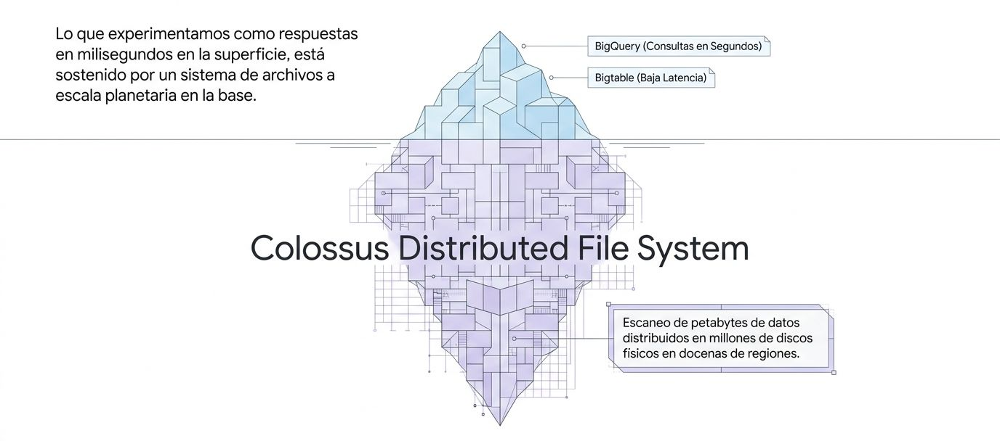
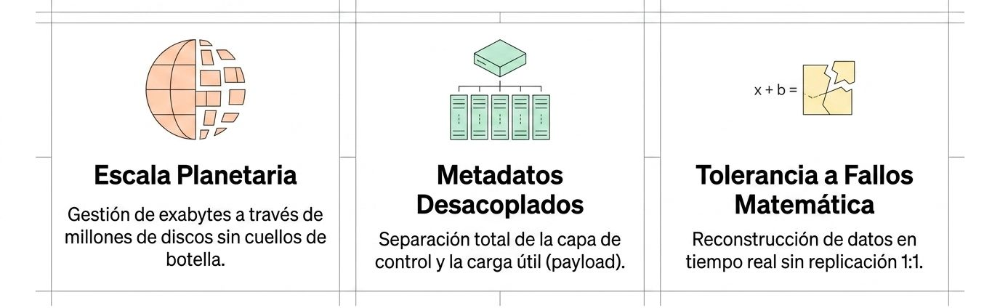
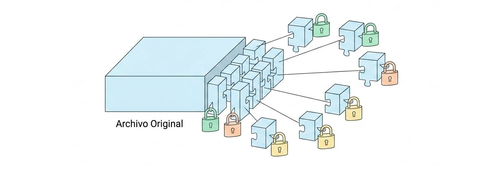
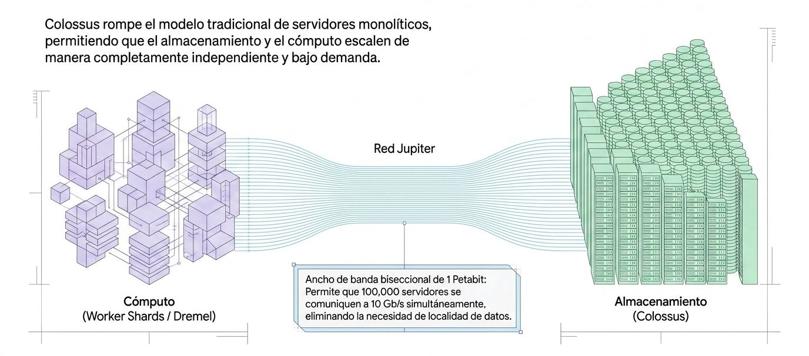
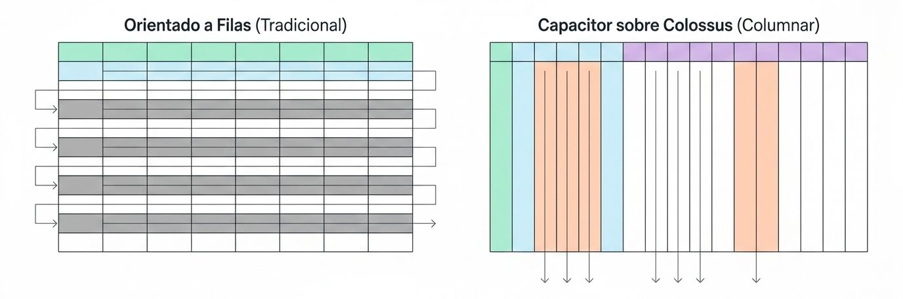

## Colossus

<figure>

<figcaption>La sensación de inmediatez sostenido por Colossus.</figcaption>
</figure>

Colossus es el sistema de archivos distribuido de Google que actúa como la capa de almacenamiento física y persistente de BigQuery.

Como BigQuery se basa en una arquitectura que desacopla por completo el cómputo del almacenamiento, los procesos de procesamiento de datos (los *slots* de cómputo que ejecutan tus consultas SQL) operan de manera independiente a la persistencia de la información, la cual se delega por completo a **Colossus**. Cada vez que cargas datos en BigQuery, estos se estructuran en archivos columnares llamados **Capacitor** y se guardan en este sistema de almacenamiento.

<figure>

<figcaption>La evolución directa del Google File System (GFS). Un sistema de almcenamiento diseñado para durabilida extrema, concurrencia masiva y escala de exabytes.</figcaption>
</figure>

Colossus funciona gracias a una serie de tecnologías y principios de diseño clave detallados en tus fuentes:

### Evolución del Google File System (GFS)
Colossus es el sucesor directo del revolucionario sistema de archivos de Google (GFS). Fue desarrollado para superar limitaciones históricas de escalabilidad, flexibilidad y confiabilidad de su predecesor, eliminando cualquier punto único de falla (*single point of failure*) gracias a un sistema de administración de metadatos mucho más avanzado y dinámico.

### Durabilidad Extrema y Codificación de Borrado (Erasure Encoding)
En un entorno con cientos de miles de discos duros físicos, es inevitable que decenas de ellos fallen todos los días. Para evitar la pérdida de información sin incurrir en el enorme costo de duplicar cada archivo completo tres veces, Colossus utiliza **erasure encoding** (codificación de borrado). 
* Este mecanismo fragmenta los archivos de datos y añade bloques de recuperación adicionales. 
* Si un disco físico muere en medio de una consulta, Colossus realiza "lecturas de recuperación" transparentes utilizando los fragmentos restantes y los bloques de paridad, asegurando que tus datos sigan 100% durables e íntegros sin interrumpir tu consulta.

### Distribución Uniforme y Rebalanceo Continuo
Colossus coordina de manera centralizada una inmensa cantidad de discos duros. El sistema distribuye automáticamente las nuevas escrituras de datos de forma equitativa entre múltiples discos y realiza un rebalanceo automático en segundo plano para mover datos "fríos" o antiguos. Esto permite que BigQuery obtenga un ancho de banda de lectura acumulado de **decenas de terabytes por segundo**, permitiéndole alimentar la red a máxima velocidad.

### Seguridad de los Datos (Encriptación en Reposo)
Colossus se encarga de proteger la privacidad física de tus datos. Toda la información almacenada se divide en bloques que se encriptan de forma automática y transparente utilizando claves **AES de 256 bits** antes de tocar los discos. Nadie que tenga acceso físico a un disco o a un servidor en el centro de datos podría leer tus tablas o registros.

En Google Cloud, la encriptación ocurre en la base. Colossus divide los archivos en fragmentos sub-archivo, encriptando cada pieza individualmente antes de distribuirla por el centro de datos.

<figure>

<figcaption>Cada fragmento posee su propia llave de encriptación de datos (DEK) única, utilizando el estándar AES-256 a nivel de infraestructura.</figcaption>
</figure>

### Rápidez
Normalmente, leer datos desde un sistema de almacenamiento externo a través de una red ralentizaría cualquier base de datos. Sin embargo, BigQuery soluciona esto conectando Colossus a sus procesadores de consulta mediante **Jupiter**, la red de alta velocidad de Google que ofrece un ancho de banda de bisección de **1 petabit por segundo**. Gracias a Jupiter, un nodo de procesamiento de BigQuery puede leer datos de Colossus en el otro extremo del centro de datos tan rápido como si el disco estuviera conectado localmente en su propio rack.

<figure>

<figcaption>El paradigma central: Separación física.</figcaption>
</figure>

### Almacenamiento optimizado

Colossus almacena los datos analíticos en "Capacitor", un formato columnar integrdo que minimiza la entrada/salida (I/O) de la red leyendo solo las fracciones exactas del disco solicitadas.

<figure>

<figcaption>Almacenamiento optimizado con el formato Capacitor.</figcaption>
</figure>

