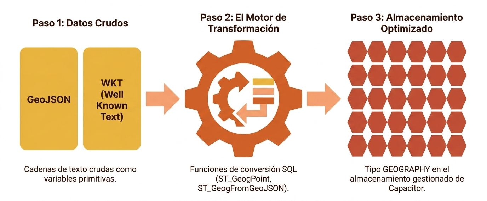
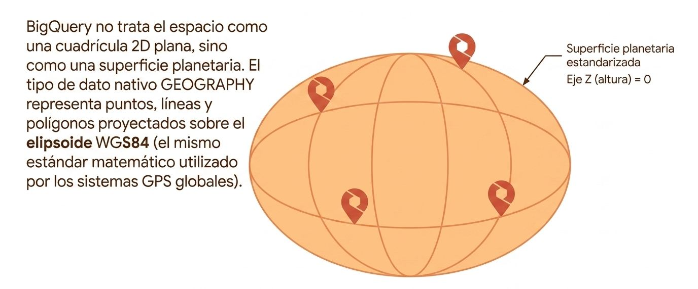
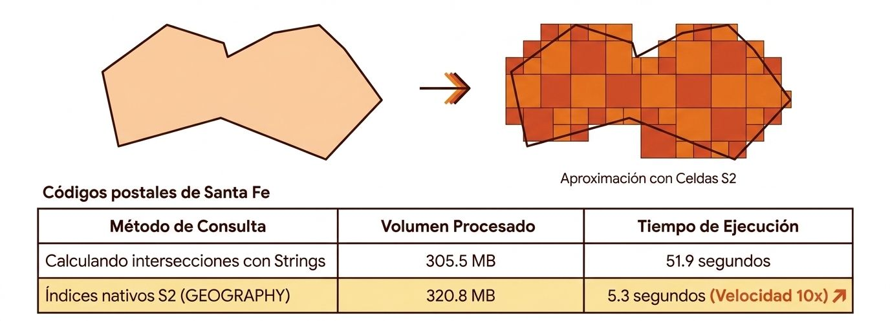
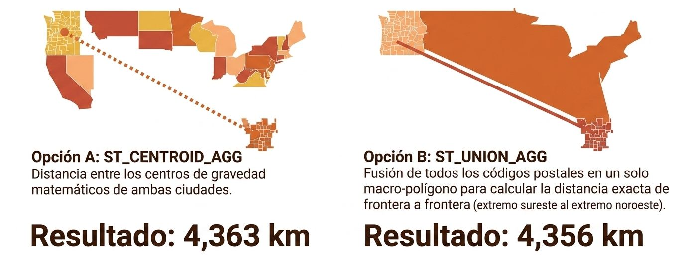

## **Antecedentes**

**BigQuery GIS (Geographic Information Systems)** es una extensión del motor de consultas estándar de BigQuery que permite almacenar, consultar y analizar datos espaciales y de ubicación directamente mediante SQL estándar. Tradicionalmente, este tipo de análisis requería herramientas y bases de datos especializadas; sin embargo, BigQuery integra estas capacidades de forma nativa para procesar volúmenes masivos de datos geográficos a escala de petabytes.

A continuación se detalla su funcionamiento, componentes y características principales:

<center>
<figure>

<figcaption>Arquitectura de ingestioin: de texto a tipos nativos.</figcaption>
</figure>
</center>

### El Tipo de Datos `GEOGRAPHY`
El núcleo de BigQuery GIS es el tipo de datos **`GEOGRAPHY`**, el cual representa puntos, líneas y polígonos sobre la superficie de la Tierra (sin asociar una altura o altitud), utilizando el elipsoide de referencia WGS84.
*   **El Elipsoide WGS84**: Las coordenadas geográficas dentro de BigQuery se modelan sobre el elipsoide de referencia **WGS84**. Dado que este es el estándar utilizado por el Sistema de Posicionamiento Global (GPS), es posible cargar y utilizar directamente las longitudes y latitudes capturadas por sensores y dispositivos móviles.


*   **Formatos de Entrada y Salida**: BigQuery admite formatos estándares como **WKT (Well-Known Text)** y **GeoJSON** para importar y exportar datos geográficos en forma de texto. Es preferible optar por GeoJSON para evitar ambigüedades respecto a la orientación de los polígonos o la traslación de coordenadas (tessellation). Las funciones como `ST_GeogFromText` y `ST_GeogFromGeoJSON` realizan las conversiones automáticas.

### Elipsoide WGS84

El **elipsoide WGS84** (World Geodetic System 1984) es una aproximación matemática de la superficie terrestre utilizada como estándar global de referencia para el posicionamiento y la cartografía. 

<center>
<figure>

<figcaption></figcaption>
</figure>
</center>

Dado que la Tierra no es una esfera perfecta, sino una masa irregular, la representación de puntos en su superficie requiere el uso de modelos esféricos y elipsoidales de aproximación. Aunque existen diferentes elipsoides de referencia que buscan optimizar la precisión en regiones específicas del planeta, el **WGS84 es el modelo que utiliza el Sistema de Posicionamiento Global (GPS)**.

#### Importancia de WGS84 en BigQuery GIS:
* **Representación de datos espaciales**: En BigQuery, las posiciones de los puntos y los vértices de las líneas y polígonos que conforman el tipo de datos espacial **`GEOGRAPHY`** se representan utilizando el elipsoide WGS84.

* **Ingesta directa sin conversiones**: Debido a que BigQuery GIS utiliza este mismo estándar global, puedes cargar datos de longitud y latitud recolectados directamente por teléfonos móviles, sensores o receptores GPS externos e insertarlos en tu base de datos sin necesidad de realizar costosas transformaciones matemáticas de coordenadas previas.


### Eficiencia y Rendimiento: Las Celdas S2
Aunque BigQuery permite trabajar con coordenadas en formato de texto o flotantes separados (`latitude`, `longitude`), la mejor práctica absoluta de rendimiento y costos es convertirlas al tipo nativo `GEOGRAPHY`. 

Evaluar matemáticas geográficas complejas para cada fila detruiría el rendimiento de cualquier consulta. BigQuery evita esto pre-calculando aproximaciones de los polígonos a través de una jerarquía de cuadrículas llamadas S2.

*   Al almacenar datos como `GEOGRAPHY`, BigQuery precalcula las llamadas **coberturas de celdas S2**. 
*   Este índice espacial interno divide la Tierra en una estructura matemática de celdas jerárquicas. Al ejecutar una consulta de intersección o distancia, el motor utiliza las celdas S2 para descartar instantáneamente bloques enteros de datos. Esto puede hacer que las consultas geoespaciales se ejecuten hasta **10 veces más rápido**.


<center>
<figure>

<figcaption>El secreto de la velocidad: celdas S2 de Google.</figcaption>
</figure>
</center>

#### Ejemplo de SQL: Creación de una Tabla con Conversión Geográfica
<Tabs>
<TabItem value="mnp" label="Ejemplo" default>
<div class="alert alert--primary">
**Creación de una Tabla con Conversión Geográfica**

Utilizaremos la sentencia DDL **`CREATE OR REPLACE TABLE`** para estructurar una nueva tabla optimizada a partir del conjunto de datos públicos de estaciones de bicicletas de Londres:

**Diseño eficiente**

1. **La regla de oro: "Longitud primero"**  
   Al utilizar la función **`ST_GeogPoint`**, BigQuery requiere que indiques **la longitud como primer parámetro y la latitud como segundo**. Invertir este orden colocaría tus coordenadas en una ubicación completamente errónea del mapa. Por ejemplo, para ubicar correctamente una estación en Londres, la longitud decimal (cercana a 0) debe preceder a la latitud de la ciudad (alrededor de 51.5).
2. **Evitar el cálculo al vuelo (On-the-fly)**  
   Si mantienes las columnas como coordenadas numéricas crudas y usas `ST_GeogPoint` directamente en tu cláusula `WHERE` o en tus consultas de visualización, BigQuery se verá obligado a calcular el objeto geográfico y sus índices espaciales **en cada fila, cada vez que ejecutes una consulta**. En conjuntos de datos masivos con millones de registros, esto degrada severamente el rendimiento y eleva el costo de procesamiento.
3. **El poder de las Celdas S2 precalculadas**  
   Al almacenar el campo de manera persistente como `GEOGRAPHY`, BigQuery precalcula internamente un índice espacial basado en **coberturas de celdas S2**. Esto permite que, al realizar búsquedas de proximidad o intersecciones espaciales, el motor de BigQuery descarte masivamente bloques de datos irrelevantes mediante un análisis rápido de metadatos, logrando que tus consultas espaciales se ejecuten **hasta 10 veces más rápido**.
</div>
</TabItem>
<TabItem value="mnp-python" label="💻 Código">

```sql showLineNumbers showLineNumbers
CREATE OR REPLACE TABLE mi_proyecto.london_bicycles.estaciones_geograficas
OPTIONS(
  description = "Tabla de estaciones de bicicletas con coordenadas optimizadas en formato GEOGRAPHY nativo"
) AS
SELECT
  id,
  name,
  bikes_count,
  -- Transformación de columnas numéricas crudas a tipo GEOGRAPHY
  ST_GeogPoint(longitude, latitude) AS ubicacion_estacion
FROM
  `bigquery-public-data.london_bicycles.cycle_stations`
```
</TabItem>
</Tabs><br />


### Funciones GIS Principales
BigQuery GIS incluye una biblioteca matemática extensa que se puede clasificar en:

*   **Funciones de Predicado (Lógicas)**: Devuelven valores booleanos (`TRUE` o `FALSE`) y se usan habitualmente en cláusulas `WHERE` o en condiciones de `JOIN`.
    *   `ST_Contains(poligono, punto)`: Evalúa si un polígono contiene geográficamente un punto u otra geometría.
    *   `ST_Intersects(geometria1, geometria2)`: Evalúa si dos objetos espaciales se cruzan o comparten algún punto en el espacio.
    *   `ST_DWithin(geometria1, geometria2, distancia_metros)`: Verifica si la distancia entre dos elementos es menor o igual a un límite en metros (útil para consultas de proximidad).

*   **Funciones de Medición**:
    *   `ST_Distance(origen, destino)`: Calcula la distancia más corta (en metros) entre dos geometrías sobre el elipsoide terrestre. Por ejemplo, permite calcular con precisión matemática determinista la distancia entre el límite geográfico de Seattle y el de Miami.

*   **Transformaciones y Agregaciones**:
    *   `ST_Union(array_geometrias)` o `ST_UNION_AGG(columna)`: Combina múltiples geografías individuales o polígonos dispersos para crear un único objeto geográfico unificado.
    *   `ST_CENTROID_AGG(columna)`: Calcula el centro geométrico (centroide) de un conjunto agrupado de elementos geográficos.

Calcular la distancia entre Seattle y Miami requiere agregar cientos de micro-polígonos (códigos postales) en macro-geometrías a nivel de ciudad. El método de transformación elegido cambia la respuesta obtenida.

<center>
<figure>

<figcaption>Agregaciones espaciales: Precisión a nivel de continente.</figcaption>
</figure>
</center>

### GIS en Machine Learning y Visualización
*   **Modelos Predictivos**: Dado que los algoritmos de Machine Learning tradicionales no interpretan directamente estructuras espaciales complejas, BigQuery ML utiliza la función `ST_GeoHash` para convertir coordenadas en **geohashes**. El geohash es una cadena de caracteres donde la similitud de caracteres al inicio del texto representa una proximidad física real en el mapa, lo cual sirve como excelente variable categórica para entrenar modelos.

*   **Visualización**: Los resultados geoespaciales se pueden exportar a **BigQuery Geo Viz** (una herramienta web interactiva para dibujar mapas) o a cuadernos de Jupyter mediante librerías de renderizado de mapas como `folium`.

## **Distance Within**

La función **`ST_DWithin` (Distance Within)** es una de las herramientas más potentes y eficientes dentro de BigQuery GIS para realizar análisis de proximidad y uniones espaciales (*spatial joins*). Devuelve un valor booleano (`TRUE` o `FALSE`) indicando si la distancia más corta entre dos elementos geográficos es menor o igual al límite que especifiques.

Toda la matemática espacial de BigQuery opera sobre el elipsoide de referencia **WGS84** (el mismo estándar que utiliza el GPS), lo que garantiza una precisión milimétrica al medir distancias sobre la superficie curvada de la Tierra.

A continuación, profundizaremos en cómo estructurar un ejemplo real utilizando datos públicos, por qué esta función es óptima para el rendimiento de BigQuery y cómo aplicarías este patrón en tus propias tablas corporativas.

### Ejemplos

#### Ejemplo 1: Estaciones de Bicicletas vs. Códigos Postales

<Tabs>
<TabItem value="mnp" label="Ejemplo" default>
<div class="alert alert--primary">
**Estaciones de Bicicletas vs. Códigos Postales**

Imagina que deseas saber qué códigos postales de Nueva York están mejor atendidos por el sistema de transporte compartido (Citibike), buscando cuántas estaciones de bicicletas se encuentran a **menos de 1 kilómetro (1,000 metros)** del área de cada código postal.

Para lograrlo de manera ultraeficiente, ejecutamos la siguiente consulta de unión espacial.

**Desglose paso a paso de los componentes de la consulta:**

1.  **`z.zcta_geom`**: Es una columna de tipo nativo `GEOGRAPHY` que representa el polígono (área física) de cada código postal en los Estados Unidos.
2.  **`ST_GeogPoint(s.longitude, s.latitude)`**: Como la tabla de Citibike almacena la ubicación en columnas numéricas flotantes tradicionales (`longitude` y `latitude`), usamos esta función para construir un punto geográfico nativo de tipo `GEOGRAPHY` en tiempo de ejecución. *Nota crítica de diseño:* En BigQuery GIS, al declarar un punto geográfico, **la longitud siempre debe indicarse primero**.
3.  **`1000`**: Es el radio de búsqueda expresado estrictamente en **metros** (1 km).
4.  **La Cláusula `FROM` separada por comas**: Actúa como un `CROSS JOIN` correlacionado implícito. Aunque parece un cruce masivo fila por fila, el optimizador de BigQuery utiliza una indexación espacial avanzada para resolverlo instantáneamente.
</div>
</TabItem>
<TabItem value="mnp-python" label="💻 Código">

```sql showLineNumbers showLineNumbers
SELECT
  z.zip_code,
  COUNT(*) AS num_estaciones_cercanas
FROM
  `bigquery-public-data.new_york.citibike_stations` AS s,
  `bigquery-public-data.geo_us_boundaries.us_zip_codes` AS z
WHERE
  ST_DWithin(
    z.zcta_geom,
    ST_GeogPoint(s.longitude, s.latitude),
    1000 -- Distancia límite de 1 km expresada en metros
  )
GROUP BY z.zip_code
ORDER BY num_estaciones_cercanas DESC
LIMIT 5
```
</TabItem>
</Tabs><br />


#### Ejemplo 2: Aplicación en Escenarios Corporativos

<Tabs>
<TabItem value="mnp" label="Antecedentes" default>
<div class="alert alert--primary">
**Aplicación en Escenarios Corporativos (Spatial Join entre POIs y Paradas de Metro)**

Si gestionas tu propio almacén de datos y has seguido la mejor práctica de almacenar tus ubicaciones directamente como tipo de datos `GEOGRAPHY` (en lugar de strings o floats sueltos) en tus pipelines de carga, una unión espacial corporativa para relacionar **Puntos de Interés (POIs)** con **Zonificaciones de Transporte** (ej. paradas de metro) se vería así.

**Ventajas de este enfoque corporativo:**

*   **Ahorro de Cómputo**: Al usar `ST_DWithin` en la cláusula `ON` del `JOIN`, BigQuery filtra los bloques espaciales que no se cruzan antes de calcular la distancia matemática.
*   **Precisión**: El cálculo final de `ST_Distance` se aplica únicamente sobre los registros prefiltrados para obtener el valor exacto en metros de manera eficiente.
*   **Legibilidad**: Al no tener que convertir flotantes sobre la marcha con `ST_GeogPoint`, el código es limpio, mantenible y aprovecha la compresión del almacenamiento columnar.
</div>
</TabItem>
<TabItem value="mnp-python" label="💻 Código">

```sql showLineNumbers showLineNumbers
SELECT 
  poi.nombre_local AS punto_interes,
  zt.nombre_estacion AS estacion_metro,
  -- Calculamos la distancia exacta solo para los registros que ya pasaron el filtro rápido de 1 km
  ROUND(ST_Distance(poi.location, zt.location), 2) AS distancia_exacta_metros
FROM 
  `mi_proyecto.geo_data.puntos_interes` AS poi
JOIN 
  `mi_proyecto.geo_data.zonas_transporte` AS zt
ON 
  ST_DWithin(poi.location, zt.location, 1000) -- Unión espacial optimizada
ORDER BY 
  distancia_exacta_metros ASC
```
</TabItem>
</Tabs><br />


### Secreto de Rendimiento: `ST_DWithin` frente a `ST_Distance`

Un error común de diseño al buscar elementos cercanos es escribir filtros calculando la distancia exacta:
```sql showLineNumbers
-- ❌ PRÁCTICA INEFICIENTE Y COSTOSA
WHERE ST_Distance(z.zcta_geom, ST_GeogPoint(s.longitude, s.latitude)) <= 1000
```
**¿Por qué es ineficiente?** `ST_Distance` obliga a BigQuery a realizar cálculos matemáticos flotantes complejos y exactos para medir la distancia real entre cada par posible de registros de ambas tablas, lo que dispara el consumo de slots de procesamiento y el tiempo de respuesta.

**¿Por qué `ST_DWithin` es tan rápido?** Cuando almacenas tus columnas como tipos geográficos nativos (`GEOGRAPHY`), BigQuery precalcula las llamadas **coberturas de celdas S2** (una cuadrícula matemática jerárquica que envuelve la Tierra). `ST_DWithin` aprovecha estos metadatos para realizar un descarte espacial rápido a nivel de celdas S2, ignorando de inmediato los bloques de datos de zonas que están físicamente lejos sin calcular distancias numéricas exactas. Esto hace que tus consultas espaciales masivas se ejecuten hasta **10 veces más rápido**.


## **Ejemplo de implementación**

Implementar **BigQuery GIS (Geographic Information Systems)** te permite almacenar, transformar y realizar consultas analíticas sobre datos espaciales a escala de petabytes utilizando el el estándar SQL de BigQuery.

A continuación, se presenta una guía completa y documentada que responde a lo siguiente: primero, cómo importar datos en formato **GeoJSON**; segundo, cómo estructurar una base de datos geográfica; y tercero, cómo realizar consultas optimizadas para calcular distancias y relaciones espaciales.


### Parte 1: importar datos GeoJSON a BigQuery

El formato **GeoJSON** es el estándar de texto recomendado para trabajar con geometrías en BigQuery, superando a otros formatos como WKT (Well-Known Text). Esto se debe a que GeoJSON **elimina cualquier ambigüedad** sobre si un polígono representa el área "interior" o "exterior", y evita que las coordenadas se desplacen ligeramente (hasta 10 metros) debido a procesos de teselación requeridos al analizar WKT. 

:::info[*Nota de migración:*] 
Si los datos geográficos se encuentran en otros formatos propietarios (como Shapefiles), se recomienda utilizar la herramienta de código abierto `ogr2ogr` para convertirlos a GeoJSON antes de subirlos a BigQuery.
:::

Existen dos métodos principales para importar estos datos:

#### Método A: Carga Nativa de Archivos GeoJSON Delimitados por Nueva Línea (GeoJSONL)
BigQuery admite la ingesta directa de archivos JSON delimitados por nueva línea (`NEWLINE_DELIMITED_JSON`) donde cada línea representa una característica (*Feature*) de GeoJSON.

Se puede ejecutar la importación utilizando la herramienta de línea de comandos `bq load` o mediante la consola de GCP:

```bash
bq --location=US load \
  --source_format=NEWLINE_DELIMITED_JSON \
  --json_extension=GEOJSON \
  --autodetect \
  mi_dataset.tabla_geografica \
  gs://mi-bucket-storage/datos_georreferenciados.geojson
```
*   **`--json_extension=GEOJSON`**: Indica al cargador de BigQuery que procese la estructura de geometría GeoJSON y la convierta automáticamente en el tipo de datos nativo **`GEOGRAPHY`** en la tabla de destino.

#### Método B: Ingesta como Texto Crudo + Conversión con SQL (Enfoque ELT)
Si importas tus datos GeoJSON dentro de un campo de texto tradicional (`STRING`) en una tabla temporal de *staging*, puedes realizar la conversión de manera sumamente sencilla en SQL utilizando la función **`ST_GeogFromGeoJSON`**:

```sql showLineNumbers
CREATE OR REPLACE TABLE mi_dataset.tabla_geografica_final AS
SELECT
  id_registro,
  nombre_zona,
  -- Convierte el string GeoJSON en un objeto GEOGRAPHY nativo
  ST_GeogFromGeoJSON(geojson_raw_string) AS geometria_establecida
FROM
  mi_dataset.tabla_staging;
```


### Parte 2: Ejemplo Completo de Implementación GIS (DDL)

Para este caso práctico, diseñamos un escenario corporativo donde una empresa desea analizar la cercanía de sus **Clientes Premium** respecto a la ubicación física de sus **Sucursales de Tiendas**.

Toda la matemática espacial de BigQuery GIS se modela sobre el elipsoide de referencia **WGS84** (el estándar geodésico que utiliza el sistema GPS). Esto te permite tomar coordenadas de latitud y longitud directamente de dispositivos móviles o sensores e insertarlas sin transformaciones complejas de proyección.

#### Paso 1: Crear la tabla de Clientes Premium
Estructuramos la tabla definiendo la columna de ubicación con el tipo de datos **`GEOGRAPHY`**:

```sql showLineNumbers
CREATE OR REPLACE TABLE mi_dataset.clientes_premium (
  cliente_id INT64 OPTIONS(description="ID único del cliente"),
  nombre STRING,
  ubicacion GEOGRAPHY OPTIONS(description="Punto geográfico de la residencia del cliente")
)
OPTIONS(
  description="Tabla de clientes premium con coordenadas geográficas nativas"
);
```

#### Paso 2: Insertar datos de prueba (Puntos)
Cuando definas puntos de manera manual utilizando la función `ST_GeogPoint`, recuerda la regla de oro: **la longitud siempre debe declararse como el primer parámetro, seguida de la latitud**. 

```sql showLineNumbers
INSERT INTO mi_dataset.clientes_premium (cliente_id, nombre, ubicacion)
VALUES
  (1, 'Sofía', ST_GeogPoint(-0.148105, 51.514759)),     -- Marylebone, Londres
  (2, 'Mateo', ST_GeogPoint(-0.173060, 51.505014)),     -- Hyde Park, Londres
  (3, 'Valentina', ST_GeogPoint(-0.115853, 51.486779)); -- Vauxhall, Londres
```

#### Paso 3: Crear e insertar la tabla de Sucursales
```sql showLineNumbers
CREATE OR REPLACE TABLE mi_dataset.sucursales_tiendas (
  sucursal_id INT64,
  nombre_sucursal STRING,
  coordenadas_sucursal GEOGRAPHY
);

INSERT INTO mi_dataset.sucursales_tiendas (sucursal_id, nombre_sucursal, coordenadas_sucursal)
VALUES
  (101, 'Centro de Distribución Londres', ST_GeogPoint(-0.158456, 51.502953)); -- Albert Gate
```


### Parte 3: Ejemplos de Consultas para Calcular Distancias

#### Consulta 1: Calcular la Distancia Exacta (`ST_Distance`)
La función **`ST_Distance`** calcula la distancia más corta (en metros) entre dos geografías sobre la superficie elipsoidal de la Tierra. En esta consulta, calculamos la distancia exacta de cada cliente hacia la sucursal y la expresamos en kilómetros dividiendo el resultado entre 1,000:

```sql showLineNumbers
SELECT 
  c.nombre AS nombre_cliente,
  s.nombre_sucursal,
  -- ST_Distance devuelve metros; dividimos entre 1000 para obtener kilómetros
  ROUND(ST_Distance(c.ubicacion, s.coordenadas_sucursal) / 1000, 2) AS distancia_exacta_km
FROM 
  mi_dataset.clientes_premium AS c
CROSS JOIN 
  mi_dataset.sucursales_tiendas AS s;
```

#### Consulta 2: Filtrado por Radio de Proximidad Optimizado (`ST_DWithin`)
*Esta es la mejor práctica de rendimiento recomendada por Google.* Si solo necesitas filtrar registros que estén dentro de un radio de influencia (por ejemplo, **a menos de 2 kilómetros o 2,000 metros**), debes usar **`ST_DWithin`** en lugar de filtrar con un operador matemático sobre `ST_Distance`.

Al almacenar los datos como tipo `GEOGRAPHY`, BigQuery precalcula las llamadas **coberturas de celdas S2**. `ST_DWithin` aprovecha estos metadatos espaciales para descartar instantáneamente bloques enteros de datos que están físicamente distantes, evitando costosos cálculos matemáticos flotantes fila por fila en la CPU y logrando que la consulta se ejecute **hasta 10 veces más rápido**.

```sql showLineNumbers
SELECT 
  c.nombre AS cliente_cercano,
  s.nombre_sucursal,
  ROUND(ST_Distance(c.ubicacion, s.coordenadas_sucursal), 1) AS distancia_metros
FROM 
  mi_dataset.clientes_premium AS c,
  mi_dataset.sucursales_tiendas AS s
WHERE 
  -- Filtro de proximidad rápido de 2 km (2000 metros)
  ST_DWithin(c.ubicacion, s.coordenadas_sucursal, 2000);
```

#### Consulta 3: Centroide Geográfico de Clientes (`ST_CENTROID_AGG`)
Si la empresa desea abrir una nueva sucursal y necesita calcular el centro de gravedad (centroide de masa) de todos los domicilios de sus clientes premium actuales, puede agrupar todos los puntos mediante una agregación espacial y extraer el centroide en formato de texto legible:

```sql showLineNumbers
SELECT 
  -- ST_CENTROID_AGG calcula el punto medio exacto de la masa de clientes
  -- ST_AsText convierte la geometría resultante a formato WKT para lectura humana
  ST_AsText(ST_CENTROID_AGG(ubicacion)) AS coordenadas_centroide_optimo
FROM 
  mi_dataset.clientes_premium;
```
