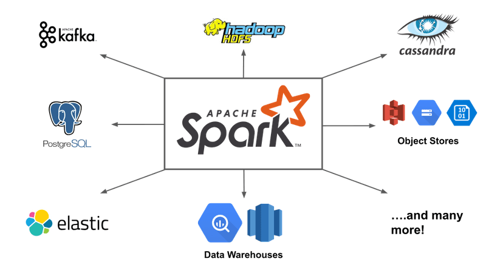
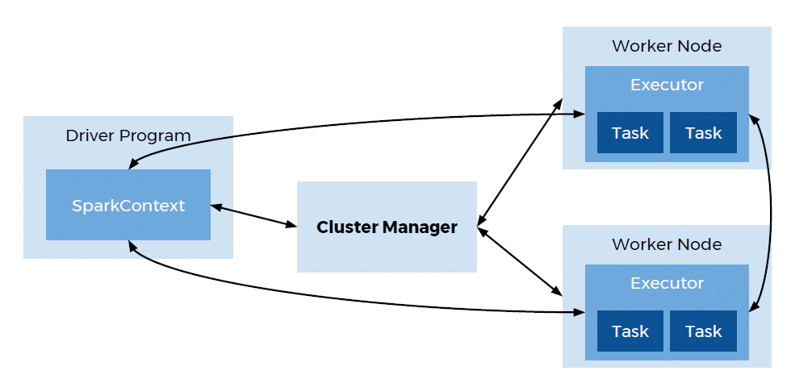
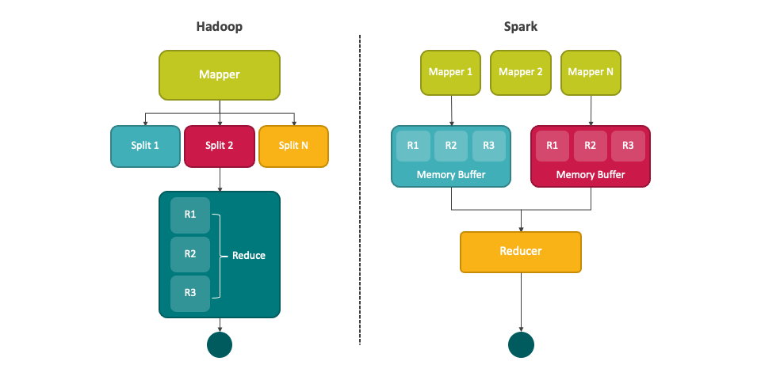

<center>
<figure>

<figcaption></figcaption>
</figure>
</center>


# Apache Spark
https://spark.apache.org/docs/latest/index.html

**Apache Spark** es un **motor de análisis unificado** diseñado para el procesamiento de datos a gran escala que permite coordinar la ejecución de tareas sobre datos distribuidos en un clúster de computadoras. Se define como una solución de computación en memoria que ofrece velocidades de procesamiento significativamente superiores a los modelos tradicionales basados en disco.

#### Antecedentes y Origen
*   **Creación:** El proyecto nació en **2009** en el laboratorio AMP de la Universidad de California, Berkeley, iniciado por **Matei Zaharia** como parte del proyecto de investigación Mesos.

*   **Propósito inicial:** Surgió para abordar las limitaciones del framework **Hadoop MapReduce**, el cual era ineficiente para consultas interactivas o algoritmos iterativos debido a que escribía datos intermedios en el disco de forma persistente entre las fases de procesamiento.

*   **Evolución:** En 2013, el proyecto fue donado a la **Apache Software Foundation**, convirtiéndose rápidamente en uno de los proyectos de código abierto más activos de la fundación.

<center>
<figure>

<figcaption></figcaption>
</figure>
</center>

#### Arquitectura Fundamental
Spark utiliza una arquitectura de tipo **maestro-esclavo** compuesta por los siguientes elementos clave:
*   **Driver Program (Programa conductor):** Es el corazón de la aplicación; ejecuta la función principal (`main()`), mantiene información sobre el estado de la aplicación, y es responsable de analizar, distribuir y programar el trabajo a través de los ejecutores.

*   **Cluster Manager (Administrador de clúster):** Controla las máquinas físicas y asigna recursos a las aplicaciones; Spark soporta administradores como **YARN**, **Mesos**, **Kubernetes** y su propio administrador **Standalone**.

*   **Executors (Ejecutores):** Procesos que corren en los nodos trabajadores (worker nodes) que ejecutan las tareas asignadas por el driver y almacenan los datos en memoria o disco.

<center>
<figure>

<figcaption></figcaption>
</figure>
</center>

#### Detalles y Capacidades Clave
*   **Velocidad extrema:** Debido a sus capacidades de **computación en memoria**, Spark puede ser hasta 100 veces más rápido que Hadoop MapReduce para procesamiento en RAM y 10 veces más rápido en disco.

*   **Evaluación perezosa (Lazy Evaluation):** Spark no ejecuta las transformaciones de inmediato, sino que construye un plan de operaciones (un grafo acíclico dirigido o **DAG**) y solo realiza el cómputo cuando se invoca una **acción** (como contar o guardar datos), lo que permite optimizar el flujo de trabajo completo.

*   **Ecosistema Unificado:** Spark no solo procesa datos por lotes, sino que incluye bibliotecas integradas para diversas tareas:
    *   **Spark SQL:** Para procesamiento de datos estructurados mediante consultas tipo SQL.
    *   **Spark Streaming / Structured Streaming:** Para el procesamiento de flujos de datos en tiempo real.
    *   **MLlib:** Una biblioteca completa para tareas de aprendizaje automático escalable.
    *   **GraphX:** Para el procesamiento y análisis de grafos y redes.

*   **Abstracciones de Datos:** Inicialmente se basó en los **RDD** (Resilient Distributed Datasets), que son colecciones distribuidas de objetos tolerantes a fallos; posteriormente evolucionó hacia APIs estructuradas más eficientes como **DataFrames** y **Datasets**.

Spark es actualmente considerado el "sistema operativo" para Big Data, integrándose de forma nativa en plataformas modernas como **Azure Synapse Analytics**, **Databricks** y **AWS EMR**.


## **Interacción entre Spark y Hadoop** 

Spark y Hadoop interactúan de manera complementaria en el ecosistema Big Data, donde Spark suele actuar como el motor de procesamiento de alto rendimiento mientras aprovecha la infraestructura de almacenamiento y gestión de recursos de Hadoop.

<center>
<figure>

<figcaption></figcaption>
</figure>
</center>

A continuación se detallan las principales formas en que estas tecnologías colaboran:

### Gestión de Recursos (YARN)
Spark puede ejecutarse sobre **YARN** (*Yet Another Resource Negotiator*), que es el sistema de gestión de recursos de Hadoop. 
*   **Convivencia:** YARN permite que aplicaciones de Spark y de Hadoop MapReduce se ejecuten **simultáneamente** en los mismos nodos de un clúster.
*   **Orquestación:** En este modelo, YARN se encarga de asignar "contenedores" (unidades de CPU y memoria) para que Spark ejecute sus tareas.

### Almacenamiento de Datos (HDFS)
Aunque Spark no tiene un sistema de almacenamiento propio, está diseñado para trabajar estrechamente con **HDFS** (*Hadoop Distributed File System*).
*   **Acceso Nativo:** Spark puede leer y escribir datos directamente en HDFS en diversos formatos como texto, SequenceFiles, Parquet y Avro.
*   **Localidad de Datos:** Al trabajar con HDFS, Spark intenta programar las tareas en los nodos donde los datos residen físicamente, minimizando el tráfico de red y mejorando el rendimiento.

### Reemplazo de MapReduce
Spark es considerado el **sucesor de Hadoop MapReduce**.
*   **Velocidad:** Spark es significativamente más rápido (hasta 100 veces más en memoria y 10 veces en disco) porque reduce las operaciones de lectura/escritura en disco que MapReduce realiza entre cada etapa de procesamiento.
*   **Simplicidad:** Mientras que MapReduce obliga a dividir cualquier problema en solo dos etapas (*Map* y *Reduce*) Spark permite flujos de trabajo más complejos y expresivos mediante un Grafo Acíclico Dirigido (DAG).

## **Evaluación perezosa**

La **evaluación perezosa** (*lazy evaluation*) es una de las características más críticas de Apache Spark para lograr su alta velocidad de procesamiento, ya que permite que el motor **retrase la ejecución de las transformaciones** hasta que sea estrictamente necesario devolver un resultado mediante una acción.

Esta estrategia ayuda a optimizar las consultas de las siguientes maneras:

*   **Optimización del plan de ejecución:** Al no ejecutar las instrucciones una por una, Spark puede construir un **grafo acíclico dirigido (DAG)** que representa todo el flujo de trabajo. Esto permite al optimizador (como Catalyst) **ver el conjunto completo de tareas** y reorganizarlas, eliminar pasos innecesarios o combinar operaciones múltiples en un solo paso físico (técnica llamada *pipelining*).

*   **Reducción del uso de memoria y almacenamiento:** Almacenar la lista de instrucciones consume mucho menos espacio que materializar y guardar **resultados de datos intermedios**. Spark solo procesa los datos necesarios para satisfacer la acción final, evitando "explotar" el almacenamiento con marcos de datos que no se volverán a utilizar.

*   **Filtrado inteligente (*Predicate Pushdown*):** Spark puede optimizar el flujo de datos empujando los filtros (operaciones `where`) directamente hacia la fuente de datos. Por ejemplo, si se define un filtro al final de una serie de transformaciones, Spark es lo suficientemente inteligente como para **aplicar ese filtro al leer los archivos originales**, evitando la carga innecesaria de millones de registros que luego serían descartados.

*   **Eficiencia en el tráfico de red:** La evaluación perezosa permite a Spark planificar las tareas de modo que se **minimice el intercambio de datos entre nodos** (*shuffling*), el cual es uno de los procesos más costosos en computación distribuida.

*   **Tolerancia a fallos mediante el linaje:** Spark mantiene la información de **linaje de cada RDD**, que es esencialmente la receta de cómo se creó. Gracias a que las transformaciones son perezosas y están almacenadas, si un nodo del clúster falla, Spark puede **reconstruir automáticamente solo las particiones de datos perdidas** siguiendo las instrucciones de su linaje desde la raíz.

En resumen, la evaluación perezosa permite que Spark pase de ser un ejecutor ciego de comandos a un **optimizador inteligente** que busca la ruta más eficiente para procesar grandes volúmenes de datos antes de mover un solo byte.

### Interoperabilidad con el Ecosistema
Spark se integra con otras herramientas nacidas en Hadoop:
*   **Hive:** Spark SQL es compatible con Apache Hive, permitiendo a los usuarios ejecutar consultas SQL sobre tablas de Hive y acceder a su "metastore" sin necesidad de migrar los datos.

*   **HBase:** Spark puede utilizar bases de datos NoSQL de Hadoop como HBase para realizar análisis a gran escala.

En conclusión, la interacción entre ambos permite que las organizaciones utilicen la **estabilidad y escalabilidad de almacenamiento de Hadoop** junto con la **velocidad y versatilidad de procesamiento de Spark**.


## Diferencias entre RDDs, DataFrames y Delta Lake

Las diferencias fundamentales entre RDDs, DataFrames y Delta Lake radican en su **nivel de abstracción**, su **estructura de datos** y su **función** dentro del ecosistema de análisis (siendo los dos primeros abstracciones de datos en memoria y el último una capa de almacenamiento).

#### RDD (Resilient Distributed Dataset)
Es la abstracción de datos más fundamental de Apache Spark.
*   **Naturaleza:** Es una colección distribuida de objetos que permite el procesamiento en paralelo en un clúster.
*   **Estructura:** Son **opacos**, lo que significa que Spark no conoce la estructura interna de los datos que contienen (pueden ser objetos de Python, listas, diccionarios, etc.).
*   **Nivel de Abstracción:** Es un **API de bajo nivel**. El usuario debe indicar explícitamente "cómo" hacer las cosas mediante funciones de programación funcional como `map`, `filter` y `reduce`.
*   **Optimización:** Spark tiene dificultades para optimizar los RDDs porque no entiende qué hay dentro de los objetos, lo que suele resultar en un rendimiento inferior comparado con las APIs estructuradas.

#### DataFrame
Es una API estructurada de alto nivel que se construye sobre los RDDs.
*   **Naturaleza:** Representa una tabla de datos con filas y columnas, similar conceptualmente a una tabla en una base de datos relacional o a un dataframe en Pandas o R.
*   **Estructura:** Son **conscientes del esquema** (schema-aware); conocen los nombres y tipos de las columnas. Esto permite un enfoque de manipulación **orientado a columnas**.
*   **Nivel de Abstracción:** Ofrece un lenguaje de dominio específico (DSL) mucho más fácil de usar que los RDDs y permite realizar consultas tipo SQL.
*   **Optimización:** Gracias a que Spark conoce la estructura de los datos, utiliza el optimizador **Catalyst** para generar planes de ejecución físicos altamente eficientes.

#### Delta Lake
A diferencia de los RDDs y DataFrames, Delta Lake no es una estructura de datos en memoria, sino una **capa de almacenamiento de código abierto**.
*   **Naturaleza:** Es un formato de tabla que aporta confiabilidad a los lagos de datos (Data Lakes), combinando la escalabilidad de estos con las capacidades de gestión de un Data Warehouse.
*   **Estructura:** Se basa en archivos **Parquet**, pero añade un **registro de transacciones** (Transaction Log o Delta Log) en una subcarpeta llamada `_delta_log`.
*   **Características Clave (que no poseen RDDs ni DataFrames por sí solos):**
    *   **Transacciones ACID:** Garantiza que las operaciones (inserciones, actualizaciones, borrados) sean atómicas y consistentes.
    *   **Viaje en el tiempo (Time Travel):** Permite consultar versiones anteriores de la tabla gracias al historial mantenido en el log.
    *   **Cumplimiento de Esquema (Schema Enforcement):** Evita que se escriban datos que no coincidan con la estructura definida, previniendo la corrupción del dato.
    *   **Operaciones DML:** Permite realizar `UPDATE`, `DELETE` y `MERGE` (upserts) de forma nativa sobre archivos en el almacenamiento.

#### Tabla Comparativa Resumida

| Característica | RDD | DataFrame | Delta Lake |
| :--- | :--- | :--- | :--- |
| **Tipo** | Abstracción de datos en memoria. | Abstracción de datos en memoria. | Capa de almacenamiento (disco/nube). |
| **Estructura** | Sin esquema (opaco). | Estructurado (columnas con nombre). | Estructurado y versionado (Parquet + Log). |
| **API** | Bajo nivel (funcional). | Alto nivel (SQL / DSL). | API de tabla y comandos de gestión. |
| **Optimización** | Manual / Limitada. | Automática (Catalyst). | Almacenamiento eficiente (Data skipping, Z-Order). |
| **Garantías ACID** | No (volátil en memoria). | No (volátil en memoria). | **Sí** (Persistente). |

En resumen, los **RDDs** son para control total a bajo nivel, los **DataFrames** son el estándar moderno para procesamiento eficiente y estructurado en Spark, y **Delta Lake** es la tecnología que permite que esos DataFrames se guarden de forma segura, transaccional y con historial en el almacenamiento permanente.

## Spark y Azure Synapse en análisis de datos

La relación entre **Apache Spark** y **Azure Synapse Analytics** no es de competencia directa, sino de integración, ya que Spark es uno de los componentes fundamentales dentro del ecosistema de Azure Synapse.

A continuación se presenta una comparación detallada:

#### Definición y Propósito
*   **Apache Spark:** Es un motor de análisis unificado diseñado para el procesamiento de datos a gran escala. Se centra en la computación en memoria para ofrecer alta velocidad en tareas de datos masivos (Big Data).
*   **Azure Synapse:** Es un servicio de análisis ilimitado que fusiona el almacenamiento de datos empresariales (Data Warehouse) con el análisis de Big Data. Su objetivo es proporcionar una experiencia unificada para ingerir, preparar, administrar y servir datos para necesidades de BI y aprendizaje automático.

#### Componentes de Cómputo
*   **Spark:** Incluye módulos específicos como **Spark SQL** (datos estructurados), **Spark Streaming** (tiempo real), **MLlib** (aprendizaje automático) y **GraphX** (análisis de grafos).
*   **Azure Synapse:** Ofrece diversos entornos de ejecución (runtimes) en un solo lugar:
    *   **SQL pools (Dedicados y Sin servidor):** Para análisis basado en T-SQL.
    *   **Spark pools:** Integración nativa de Apache Spark optimizada para ingeniería de datos y ML.
    *   **Synapse Pipelines:** Para la integración y orquestación de datos sin código.

#### Facilidad de Uso y Experiencia de Usuario
*   **Spark:** Proporciona APIs ricas en lenguajes como **Python (PySpark)**, **Scala**, **Java**, **SQL** y **R**. Los desarrolladores suelen interactuar con él a través de shells o cuadernos (notebooks).
*   **Azure Synapse:** Introduce **Synapse Studio**, una interfaz web unificada que permite a ingenieros, científicos y analistas de datos realizar todas sus tareas (exploración, preparación, orquestación y visualización) en un solo entorno. Además de los lenguajes de Spark, Synapse añade soporte para **.NET (C#)** en sus cuadernos de Spark.

#### Integración y Ecosistema
*   **Spark:** Se integra bien con diversas fuentes de datos como HDFS, S3, NoSQL (Cassandra, MongoDB) y Kafka.
*   **Azure Synapse:** Ofrece una integración profunda con otros servicios de Microsoft:
    *   **Power BI:** Permite crear y visualizar informes directamente desde el espacio de trabajo de Synapse.
    *   **Azure Machine Learning:** Facilita la aplicación de modelos de ML a las aplicaciones inteligentes.
    *   **Azure Data Lake Storage Gen2:** Utilizado como almacenamiento primario para un análisis rentable.

### Tabla Comparativa Resumida

| Característica | Apache Spark | Azure Synapse Analytics |
| :--- | :--- | :--- |
| **Naturaleza** | Motor de procesamiento distribuido. | Plataforma de análisis unificada. |
| **Modelos de Cómputo** | Procesamiento en memoria. | SQL (Dedicado/Serverless) y Spark. |
| **Integración de Datos** | A través de bibliotecas y conectores externos. | Synapse Pipelines con más de 90 conectores nativos. |
| **BI y Visualización** | Requiere herramientas externas. | Integración nativa con Power BI. |
| **Administración** | Requiere gestionar el clúster (YARN, Mesos). | Totalmente administrado; permite pausa automática para ahorrar costes. |

En conclusión, mientras que **Apache Spark** es la herramienta de procesamiento de alto rendimiento para científicos e ingenieros, **Azure Synapse** es la plataforma que envuelve este motor junto con capacidades de SQL y herramientas de orquestación, facilitando una solución de análisis de extremo a extremo.

## **Apache Spark vs Pandas**

El contraste entre **Pandas** y **Apache Spark** (especialmente a través de su API en Python, **PySpark**) representa uno de los cambios de paradigma más ilustrativos dentro de la Ciencia e Ingeniería de Datos: la transición del procesamiento local en un único nodo hacia el cómputo distribuido a gran escala (*Big Data*). 

Aunque ambos frameworks utilizan el concepto lógico de "DataFrame" para organizar datos en filas y columnas estructuradas, la arquitectura física y las filosofías de ejecución de ambas herramientas bajo el capó son fundamentalmente diferentes.

---

### Dimensiones Técnicas de Comparación

#### A. Arquitectura de Cómputo (Mono-nodo vs. Clúster Distribuido)
*   **Pandas (Single-Node):** Está diseñado estrictamente para ejecutarse en una sola máquina utilizando un único núcleo del procesador por defecto. Su capacidad operativa está estrictamente limitada por la memoria RAM física disponible en ese servidor. Si un conjunto de datos excede este límite de hardware, Pandas interrumpe el proceso arrojando un fallo de falta de memoria (*OutOfMemory Exception*).

*   **Apache Spark (Distributed Computing):** Es un motor de procesamiento paralelo distribuido en memoria. Spark agrupa y coordina los recursos de un clúster de múltiples computadoras (nodos trabajadores o *Workers* que ejecutan procesos *Executors*) coordinados por un nodo maestro administrador (*Driver*). El almacenamiento y cómputo de un Spark DataFrame se fragmenta en **particiones físicas** lógicas distribuidas por la red, lo que permite procesar volúmenes masivos de datos (escala de petabytes) escalando horizontalmente de manera lineal.

#### B. Modelo de Evaluación (Inmediato vs. Perezoso)
*   **Pandas (Eager Evaluation / Evaluación Inmediata):** Cada línea de código o manipulación de datos se ejecuta de forma impaciente e inmediata al ser declarada en el intérprete de Python. Esto obliga a Pandas a procesar y manifestar en memoria RAM copias de tablas y estructuras intermedias consecutivas, limitando la eficiencia de recursos físicos.

*   **Spark (Lazy Evaluation / Evaluación Perezosa):** Cuando el desarrollador define transformaciones sobre un DataFrame (como lecturas de datos, filtros, uniones o proyecciones), Spark no realiza ningún cálculo computacional inmediato. En su lugar, el nodo controlador (*Driver*) registra estas instrucciones lógicas de forma inmutable, construyendo una bitácora histórica conocida como **lineaje de datos** o **Grafo Acíclico Dirigido (DAG)**. El procesamiento físico se dispara únicamente cuando se ejecuta una **acción** explícita (como `.count()`, `.show()`, o `.write()`). Esto permite al optimizador de consultas de Spark (**Catalyst**) analizar el grafo completo de transformaciones lógicas y compilar un plan físico reordenado y optimizado de bytecode para ejecutarlo en el clúster.

#### C. Representación de Datos en Memoria (Arreglos NumPy vs. Tungsten Off-Heap)
*   **Pandas:** Organiza internamente sus columnas como arreglos de **NumPy** locales en memoria RAM.

*   **Spark:** Organiza sus DataFrames bajo un esquema formal relacional basado en renglones genéricos `Row`. Físicamente, Spark emplea el motor de ejecución **Tungsten**, el cual almacena la información estructurada en bloques binarios contiguos en memoria "off-heap" (fuera de la pila o *heap* de la Máquina Virtual de Java). Al interactuar con el formato compacto de Tungsten mediante **Encoders** serializados de alto desempeño, Spark disminuye drásticamente el costo de instanciación de objetos de la JVM y el impacto por recolección de basura (*Garbage Collection*), garantizando el mismo rendimiento de ejecución en Python (PySpark) que en lenguajes nativos de la JVM como Scala o Java.

#### D. Propósito y Ecosistema
*   **Pandas:** Es una librería especializada para análisis exploratorio rápido, preprocesamiento local, limpieza de datos y modelado estadístico en memoria de un solo computador.

*   **Spark:** Es un ecosistema analítico unificado para procesamiento y operaciones masivas. Un solo programa distribuido en Spark puede unificar la ingesta de bases de datos relacionales o NoSQL, flujos continuos en tiempo real mediante **Structured Streaming**, algoritmos predictivos con **MLlib** y análisis relacionales complejos con Spark SQL.


### Tabla Comparativa General

| Criterio Técnico | Pandas | Apache Spark (PySpark DataFrame) |
| :--- | :--- | :--- |
| **Paradigma** | Escalamiento vertical (*Scale-Up* / Local) | Escalamiento horizontal (*Scale-Out* / Distribuido) |
| **Restricción de Datos** | Límite físico de la memoria RAM local | Clúster elástico virtualmente ilimitado (Petabytes) |
| **Mecanismo de Evaluación** | Inmediata / Impaciente (*Eager Evaluation*) | Perezosa (*Lazy Evaluation*) |
| **Optimizador de Consultas** | No posee optimizador global de instrucciones | **Catalyst Optimizer** (Genera planes físicos eficientes) |
| **Formatos Soportados** | Formatos locales estándar (CSV, Excel, JSON) | Formatos de Big Data avanzados (Parquet, Delta, ORC) |
| **Soporte SQL** | Requiere APIs de terceras partes o SQL parcial | Cumplimiento nativo con el estándar **ANSI SQL:2003** |
| **Tiempo Real (Streaming)** | No soportado nativamente | **Structured Streaming** nativo (Tablas infinitas) |


### Sinergia e Interoperabilidad

En la práctica profesional, la estrategia óptima no consiste en elegir uno sobre otro de forma absoluta, sino en la cooperación unificada: *"PySpark and Pandas"*.

#### Inferencia y Visualización Segura (`toPandas`)
Un flujo de trabajo común consiste en delegar a **Apache Spark** las operaciones pesadas de agregación, agrupamiento y cruces lógicos sobre terabytes de datos distribuidos. Tras consolidar el conjunto de datos a una dimensión agregada pequeña (p. ej., un resumen de transacciones mensuales por región), se utiliza el método **`toPandas()`** para recopilar de forma segura ese subconjunto localmente en la memoria del controlador (*Driver*). Sobre este DataFrame ligero de Pandas se aplican libremente librerías locales de visualización de Python como Matplotlib, Seaborn o Plotly.

:::warning[**Advertencia de Ingeniería:**]
 Ejecutar `.toPandas()` o `.collect()` sobre un Spark DataFrame gigante sin agregaciones previas obligará al Driver de Spark a jalar todas las particiones del clúster a un único proceso Python, agotando inmediatamente la RAM local del Driver y provocando una caída total de la aplicación por *OutOfMemory*.
 :::

#### Aceleración de Traspaso con Apache Arrow
Para acelerar la serialización de datos entre los ejecutores de la JVM de Spark y los procesos de Python durante las conversiones con `toPandas()`, es una excelente práctica de MLOps activar la integración con **Apache Arrow**, lo que permite transferir datos binarios estructurados en columnas con cero costo redundante de traducción de objetos.

#### Pandas API en Spark (Anteriormente Koalas)
A partir de Apache Spark 3.2.0, se integró el proyecto **Koalas** de forma nativa bajo el espacio de nombres `pyspark.pandas`. Esto permite a analistas formados exclusivamente en Pandas ejecutar su código heredado sin apenas modificaciones sintácticas, mientras Spark se encarga de traducir esas instrucciones de forma transparente a transformaciones de Catalyst optimizadas para ejecutarse en el clúster de Spark.

---

#### Demostración Práctica en Python

<Tabs>
<TabItem value="mnp" label="Ejemplo" default>
<div class="alert alert--primary">
**Pandas vs Spark**

El siguiente script de Python contrasta visualmente cómo se programa una misma rutina básica de ingesta, filtrado de variables e indicador estadístico mensual en ambas herramientas, mostrando la sintaxis imperativa de Pandas versus la sintaxis declarativa (Lazy) de PySpark:
</div>
</TabItem>
<TabItem value="mnp-python" label="💻 Código">

```python showLineNumbers

# ==============================================================================
# ENFOQUE 1: PANDAS (Procesamiento Mono-nodo en RAM Local)
# ==============================================================================
import pandas as pd

# La lectura es inmediata (Eager) y carga TODO el archivo CSV localmente en RAM
df_pandas = pd.read_csv("ventas_retail.csv")

# Filtrado secuencial inmediato
df_pandas_filtrado = df_pandas[df_pandas["monto"] > 100.0]

# Agregación y visualización inmediata del DataFrame intermedio en memoria
reporte_pandas = df_pandas_filtrado.groupby("categoria")["monto"].sum().reset_index()
print("--- Reporte Pandas (Local) ---")
print(reporte_pandas.head(3))


# ==============================================================================
# ENFOQUE 2: PYSPARK (Procesamiento Distribuido y Perezoso en Clúster)
# ==============================================================================
from pyspark.sql import SparkSession
import pyspark.sql.functions as F

# Inicialización segura de la sesión distribuida de Spark
spark = SparkSession.builder \
    .appName("Comparativa_Pandas_vs_Spark") \
    .master("local[*]") \
    .getOrCreate()

# La lectura es perezosa (Lazy). Spark solo valida el esquema, no lee los datos físicos.
df_spark = spark.read.format("csv").option("header", "true").option("inferSchema", "true").load("ventas_retail.csv")

# Declaración de transformaciones lógicas (Inmutables, agregadas al DAG)
df_spark_filtrado = df_spark.where(F.col("monto") > 100.0)
df_reporte_spark = df_spark_filtrado.groupBy("categoria").agg(F.sum("monto").alias("monto_total"))

# ACCIÓN: .show() o .collect() fuerzan a Catalyst a optimizar y ejecutar el plano físico en el clúster
print("--- Reporte PySpark (Acción Disparada en el Clúster) ---")
df_reporte_spark.show(3)

# Cerrar sesión distribuida
spark.stop()
```

</TabItem>
</Tabs>

## **Apache Arrow**

Como adelantábamos brevemente en nuestra comparación entre **Spark** y **Pandas**, **Apache Arrow** es una de las tecnologías de infraestructura más revolucionarias en el procesamiento moderno de datos a gran escala. 


**Apache Arrow** es una plataforma de desarrollo de código abierto para analítica *in-memory* que define un **formato estándar de almacenamiento de datos en memoria, de tipo columnar, independiente de cualquier lenguaje de programación**. 

Antes de la existencia de Arrow, cada motor de ejecución (Spark, Pandas, bases de datos relacionales, sistemas en C++ o Java) representaba los datos en la memoria RAM utilizando sus propias estructuras internas y propietarios. Cuando se requería enviar datos entre dos sistemas —por ejemplo, traspasar datos desde la Máquina Virtual de Java (JVM) de Apache Spark hacia el intérprete de Python para utilizarlos en un DataFrame de Pandas—, los datos debían sufrir un proceso extremadamente costoso conocido como **serialización y deserialización**. Los datos estructurados se convertían a un formato intermedio plano (como búferes de bytes, JSON o archivos Pickle de Python) para viajar por la red o por canales de comunicación entre procesos (IPC) y reconstruirse al otro lado, consumiendo valiosos ciclos de CPU y memoria RAM redundante.

Apache Arrow resuelve esta ineficiencia unificando la representación física en memoria. Al utilizar el formato de Arrow, **tanto el proceso en Java como el proceso en Python pueden leer y escribir directamente sobre la misma estructura binaria de memoria compartida, eliminando por completo el costo de serialización**.


### Arquitectura Física

La eficiencia de Apache Arrow se fundamenta en dos principios de diseño de bajo nivel:

#### 1. Representación Columnar en RAM
Al igual que formatos de almacenamiento físico en disco como Apache Parquet, Arrow organiza los datos de forma columnar en la memoria RAM. En lugar de agrupar consecutivamente los campos de una misma fila (formato *row-major*), Arrow agrupa de manera contigua en memoria todos los valores pertenecientes a una misma columna. Esto permite aprovechar las capacidades de vectorización de las CPUs modernas (instrucciones **SIMD** - *Single Instruction, Multiple Data*), procesando múltiples valores de una columna en un solo ciclo de reloj.

#### 2. Lotes de Registros (*RecordBatches*)
Los datos en Arrow no se manejan fila por fila. Se estructuran en **`RecordBatch`**, que representan colecciones lógicas de columnas del mismo tamaño que se transfieren de forma contigua. Un `RecordBatch` contiene tanto el esquema de tipos como los punteros directos a los bloques de memoria física contiguos, lo que facilita una transferencia asíncrona e ininterrumpida entre procesos.


### Función Crítica (en PySpark)

En entornos de **Apache Spark**, Apache Arrow actúa como el catalizador de rendimiento que reduce las limitaciones inherentes de usar un lenguaje interpretado (Python) sobre un motor distribuido nativo de la JVM (Scala). Sus funciones principales se dividen en tres áreas operacionales:

#### A. Aceleración Masiva de `toPandas()` y `createDataFrame()`
Cuando un ingeniero de datos ejecuta `.toPandas()` para recopilar un Spark DataFrame en el nodo controlador (*Driver*) para análisis local o graficación, Spark debe exportar los datos fuera de la JVM de Java hacia el entorno de Python. 
* **Sin Arrow:** Spark serializa los datos fila por fila en colecciones de tuplas de Python mediante un puente de red local (`Py4J`). Este proceso es lento y duplica el consumo de memoria, provocando fallos por falta de memoria (*OutOfMemory Exceptions*) con facilidad.
* **Con Arrow (vía PyArrow):** Los datos en la JVM se convierten directamente en lotes de Arrow y se envían de forma columnar al intérprete de Python, donde Pandas los consume de inmediato, reduciendo los tiempos de transferencia en órdenes de magnitud.

#### B. Optimización de Pandas UDFs (Vectorized User-Defined Functions)
Las UDFs tradicionales de Python operan registro por registro, lo que introduce un cuello de botella masivo debido a la constante interacción entre la JVM y Python. 
Al utilizar **Pandas UDFs** (decorador `@pandas_udf`), Spark aprovecha Apache Arrow para agrupar las particiones de datos en series de Pandas (`pd.Series` o `pd.DataFrame`). Arrow transfiere estos bloques de datos en un solo viaje binario de alta velocidad, permitiendo que la función de Python se ejecute de manera vectorial y con un rendimiento prácticamente idéntico al de una UDF nativa escrita en Scala o Java.

#### C. Integración en el Ecosistema Lakehouse (Formatos Libres)
En arquitecturas de datos avanzadas, Arrow facilita la conexión rápida de herramientas escritas en Rust (como `delta-rs` o motores de consulta de alta velocidad como `DataFusion`) para interactuar directamente con tablas de tipo **Delta Lake** o **Apache Iceberg** de forma local y de bajo consumo.


#### Ejemplo de Configuración y Uso en PySpark
<Tabs>
<TabItem value="mnp" label="Ejemplo" default>
<div class="alert alert--primary">
**Uso de Apache Arrow**

Para beneficiarse del rendimiento de Apache Arrow en los desarrollos de ingeniería de datos, debes asegurarte de que la biblioteca **`pyarrow`** esté instalada en el entorno y habilitar la opción de configuración correspondiente dentro de tu sesión distribuida de Spark:
</div>
</TabItem>
<TabItem value="mnp-python" label="💻 Código">

```python showLineNumbers title="Configuración y uso de Apache Arrow"

"""
Demostración de Ingeniería de Datos: Configuración y uso de Apache Arrow 
para acelerar la interoperabilidad entre PySpark y Pandas.
"""

from pyspark.sql import SparkSession
import pyspark.sql.functions as F
import pandas as pd
import time

# 1. Inicialización de la sesión de Spark con soporte explícito para Apache Arrow
# En versiones modernas de Spark, esta configuración viene optimizada por defecto,
# pero es una excelente práctica de producción declararla de forma explícita.
spark = SparkSession.builder \
    .appName("Optimizacion_Apache_Arrow") \
    .master("local[*]") \
    .config("spark.sql.execution.arrow.pyspark.enabled", "true") \
    .getOrCreate()

# Generamos un DataFrame distribuido de simulación con millones de registros
print(">>> Generando datos sintéticos en el clúster...")
df_distribuido = spark.range(0, 10_000_000) \
                      .withColumn("valor_calculado", F.col("id") * 1.5) \
                      .withColumn("categoria", F.when(F.col("id") % 2 == 0, "PAR").otherwise("IMPAR"))

# Cacheamos el conjunto en memoria para aislar únicamente el tiempo de conversión
df_distribuido.cache()
df_distribuido.count()

# 2. Conversión a Pandas optimizada por Apache Arrow
print(">>> Transfiriendo datos distribuidos (JVM) a un DataFrame de Pandas local...")
inicio_conversion = time.time()

# Gracias a la configuración 'spark.sql.execution.arrow.pyspark.enabled',
# la conversión no se hace fila por fila, sino transfiriendo RecordBatches binarios de Arrow.
df_pandas_local = df_distribuido.toPandas()

fin_conversion = time.time()
print(f"✓ Conversión de 10 millones de filas completada en: {fin_conversion - inicio_conversion:.4f} segundos.")
print(f"• Tipo de objeto resultante en Python: {type(df_pandas_local)}")
print(f"• Consumo físico de filas: {df_pandas_local.shape:,}\n")

# 3. Demostración de una Pandas UDF (Vectorizada mediante Arrow)
# El estudiante define una función matemática compleja usando sintaxis directa de Pandas,
# pero se ejecutará de forma distribuida en los nodos de Spark.
from pyspark.sql.functions import pandas_udf

@pandas_udf("double")
def calcular_impuesto_vectorizado(montos: pd.Series) -> pd.Series:
    """
    Arrow divide la columna Spark en pd.Series, las procesa a velocidad C
    mediante NumPy en Python, y devuelve el pd.Series resultante a la JVM.
    """
    return montos * 0.19

# Aplicamos la UDF de forma transparente sobre la columna distribuida
df_con_impuesto = df_distribuido.withColumn("impuesto", calcular_impuesto_vectorizado("valor_calculado"))

print("=== Muestra del DataFrame procesado con UDF Vectorizada (Arrow) ===")
df_con_impuesto.select("id", "valor_calculado", "impuesto").show(5)

spark.stop()
```
</TabItem>
</Tabs>
