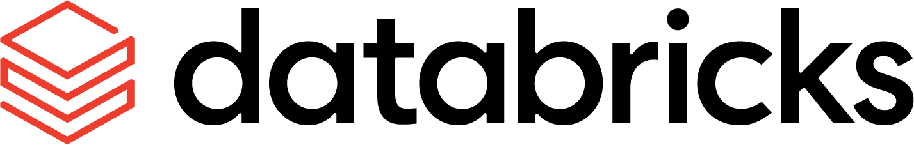

<center>
<figure>

<figcaption></figcaption>
</figure>
</center>

## **¿Qué es?**

**Databricks** es una **Plataforma de Inteligencia de Datos** unificada y optimizada para la nube. Su función principal es implementar la arquitectura de **Data Lakehouse**, un modelo híbrido que integra la apertura, escalabilidad y bajo costo de un *data lake* con la confiabilidad, estructura y rendimiento de un *data warehouse* tradicional. Esto permite unificar en un único entorno las tareas de ingeniería de datos, analítica de negocio (BI), transmisión en tiempo real y machine learning (IA).

De esta manera, proporciona un espacio de trabajo colaborativo donde diferentes perfiles técnicos pueden programar usando lenguajes como Python, SQL, Scala y R.

:::info
* [Databricks home page](https://www.databricks.com/learn/training/certification)
* [Databricks Certification and Badging](https://www.databricks.com/learn/training/certification)
:::

### ¿Cómo funciona Databricks?

El funcionamiento técnico de Databricks se basa en tres pilares arquitectónicos:

#### 1. Separación de Planos (Control y Datos)
Para garantizar la seguridad de la información, el sistema divide su operación en dos entornos independientes:
*   **Plano de Control (*Control Plane*):** Es administrado por Databricks en su propia infraestructura de nube. Aloja los servicios esenciales de la plataforma, como la interfaz web de usuario, el gestor de clústeres, los cuadernos (*notebooks*) y el programador de flujos de trabajo (*workflows*).
*   **Plano de Datos (*Data Plane*):** Reside exclusivamente en la cuenta de nube del cliente (Azure, AWS o GCP). Aquí es donde se procesan físicamente los datos mediante servidores y donde se almacena la información. Gracias a este diseño, **los datos del cliente nunca se transfieren al plano de control de Databricks**.

#### 2. Desacoplamiento de Cómputo y Almacenamiento
A diferencia de las bases de datos tradicionales, el almacenamiento de la información es independiente del cómputo que la procesa:
*   **Almacenamiento (Delta Lake):** Los datos brutos y procesados se guardan en el almacenamiento de objetos de la nube (como Amazon S3 o Azure ADLS). Se utiliza el formato **Delta Lake**, el cual organiza los datos en archivos Parquet tradicionales pero añade un registro de transacciones (*transaction log*) en formato JSON. Este registro actúa como fuente de verdad y proporciona garantías ACID (atomicidad, consistencia, aislamiento y durabilidad), evitando que los datos se corrompan ante fallas o escrituras simultáneas.
*   **Cómputo (Apache Spark):** El procesamiento se realiza a través de clústeres elásticos que ejecutan **Apache Spark**. Estos clústeres constan de un nodo maestro llamado **Driver** (que actúa como el cerebro, planificando el trabajo y coordinando las tareas) y múltiples nodos esclavos llamados **Workers** (los ejecutores que procesan bloques de datos en paralelo y directamente en memoria para maximizar la velocidad).

#### 3. Gobernanza Unificada (Unity Catalog)
Para controlar quién tiene acceso a qué, Databricks integra **Unity Catalog**, un catálogo de metadatos centralizado a nivel de cuenta (y no de espacio de trabajo individual). Unity Catalog gestiona los permisos de tablas, archivos y modelos de manera centralizada. 

En lugar de que los clústeres hereden accesos permanentes a la nube, Unity Catalog implementa un modelo de **vending de credenciales** (*credential vending*): valida el permiso del usuario ante una consulta y le entrega al clúster una clave temporal de corto alcance para que lea directamente el archivo correspondiente en el almacenamiento seguro de la nube.

***

## **La arquitectura de medallón**

La **arquitectura de medallón** (también conocida como *arquitectura multi-hop*) es un patrón de diseño que organiza los datos de manera lógica en diferentes capas de refinamiento progresivo. Su objetivo principal es mejorar de forma incremental la estructura, la calidad y la usabilidad de la información a medida que fluye por el sistema. Además, garantiza la transaccionalidad ACID en cada paso del proceso, evitando la lectura de datos inconsistentes.

Esta arquitectura se divide en tres capas fundamentales:

#### Capa Bronze (Datos Crudos / Raw Ingestion)
*   **Su función:** Es el punto de partida de la ingesta de datos en el Lakehouse. Aquí se recibe y almacena la información proveniente de los sistemas de origen (como bases de datos transaccionales, archivos planos, logs o colas de mensajería en tiempo real).

*   **Cómo opera:** Los datos se guardan en su formato original y más puro, sin aplicarles transformaciones ni modificaciones. Al actuar como una réplica exacta de las fuentes, la capa Bronze garantiza que no haya pérdida de información, lo que simplifica la auditoría, asegura la trazabilidad (*data lineage*) y permite recrear o corregir las tablas siguientes si ocurre un error en el futuro.

#### Capa Silver (Datos Limpios e Integrados / Cleansed & Enriched)
*   **Su función:** En esta etapa intermedia, los datos crudos de la capa Bronze se someten a procesos intensivos de transformación para mejorar sustancialmente su calidad y utilidad analítica.

*   **Cómo opera:** Se aplican tareas de **limpieza, normalización, validación y eliminación de duplicados**. Además, es la etapa donde ocurre la **integración de datos**: se cruzan y enriquecen distintas tablas (por ejemplo, uniendo una tabla de transacciones con un catálogo maestro de clientes) para ofrecer una visión consolidada, coherente y confiable de la operación.

#### Capa Gold (Datos de Negocio / Curated & Aggregated)
*   **Su función:** Es la capa final del medallón, donde la información alcanza su estado más refinado, estructurado y listo para el consumo del usuario de negocio.

*   **Cómo opera:** En lugar de detallar registros individuales, las tablas de esta capa contienen **datos agregados, consolidados y resumidos** para responder a necesidades estratégicas de la empresa (como reportes de ingresos mensuales, indicadores clave de rendimiento [KPIs] o perfiles consolidados de clientes). Los datos se organizan en esquemas optimizados para lecturas rápidas (*read-optimized*), alimentando directamente herramientas de Business Intelligence (BI), tableros interactivos o flujos de modelado para Machine Learning e Inteligencia Artificial.


### Ventajas del sistema medallón
1.  **Simplicidad y claridad:** Proporciona un modelo de datos intuitivo y fácil de mantener al separar los roles de cada tabla en la canalización.
2.  **Reconstrucción robusta:** Si se detecta un error de lógica en las capas avanzadas, no es necesario volver a extraer datos de las fuentes originales externas; basta con eliminar las tablas afectadas y reprocesar el flujo de datos completo a partir de la información histórica e inmutable de la capa Bronze.
3.  **Cómputo incremental:** Facilita la carga y actualización de datos a medida que llegan, reduciendo costes y tiempos de procesamiento al evitar reprocesamientos totales innecesarios.

<details>
<summary>Ejemplo de un script práctico en **PySpark** que simula el flujo completo de la **arquitectura de medallón**.</summary>

El ejemplo utiliza datos de transacciones de comercio electrónico en formato JSON crudo para ilustrar la transición incremental: de la ingesta pura sin modificar (**Bronze**), pasando por la limpieza, tipado y enriquecimiento (**Silver**), hasta la agregación final para consumo analítico (**Gold**).

Para maximizar la legibilidad y mantener el código limpio de variables intermedias innecesarias, se aplica la práctica recomendada de **encadenamiento de métodos (*method chaining*)**.

```python showLineNumbers
from pyspark.sql import SparkSession
import pyspark.sql.functions as F
from pyspark.sql.types import StructType, StructField, StringType, IntegerType, DoubleType

# 0. INICIALIZACIÓN DE LA SESIÓN DE SPARK
spark = SparkSession.builder \
    .appName("MedallionArchitectureDemo") \
    .getOrCreate()

# ==============================================================================
# 1. CAPA BRONZE: Ingesta Cruda (Raw Ingestion)
# ==============================================================================
# Simulamos la llegada de registros JSON crudos (con nulos, tipos inconsistentes y duplicados)
raw_payloads = [
    ('{"transaction_id": 101, "customer_id": "C01", "amount": "150.50", "date": "06/08/2026"}',),
    ('{"transaction_id": 102, "customer_id": "C02", "amount": null, "date": "06/08/2026"}',), # Contiene nulo
    ('{"transaction_id": 103, "customer_id": "C01", "amount": "99.90", "date": "07/08/2026"}',),
    ('{"transaction_id": 101, "customer_id": "C01", "amount": "150.50", "date": "06/08/2026"}',), # Registro Duplicado
]

# Creamos el DataFrame simulando la lectura directa de un archivo crudo
bronze_raw_df = spark.createDataFrame(raw_payloads, ["value"])

# Estructuramos la capa Bronze añadiendo metadatos clave para trazabilidad (Data Lineage)
bronze_df = bronze_raw_df \
    .withColumn("arrival_time", F.current_timestamp()) \
    .withColumn("source_file", F.lit("transactions_api_feed.json"))

print("=== CAPA BRONZE: DATOS CRUDOS E INMUTABLES ===")
bronze_df.show(truncate=False)


# ==============================================================================
# 2. CAPA SILVER: Limpieza, Validación y Enriquecimiento
# ==============================================================================
# Definimos el esquema esperado para parsear el string JSON
json_schema = StructType([
    StructField("transaction_id", IntegerType(), True),
    StructField("customer_id", StringType(), True),
    StructField("amount", StringType(), True), # Ingerido como texto en origen
    StructField("date", StringType(), True)
])

# Creamos una tabla estática para el proceso de enriquecimiento (Lookup)
customers_data = [("C01", "Alicia Gomez"), ("C02", "Roberto Morales")]
customers_lookup_df = spark.createDataFrame(customers_data, ["customer_id", "customer_name"])

# Procesamiento Silver: Extracción, desduplicación, limpieza de nulos, tipado y join
silver_df = bronze_df \
    .withColumn("parsed", F.from_json(F.col("value"), json_schema)) \
    .select("parsed.*", "arrival_time", "source_file") \
    .dropDuplicates(["transaction_id"]) \
    .dropna(subset=["amount"]) \
    .withColumn("amount", F.col("amount").cast(DoubleType())) \
    .withColumn("transaction_date", F.to_date(F.col("date"), "dd/MM/yyyy")) \
    .drop("date") \
    .join(customers_lookup_df, on="customer_id", how="inner") # Enriquecimiento

print("\n=== CAPA SILVER: DATOS LIMPIOS Y ENRIQUECIDOS ===")
silver_df.show(truncate=False)


# ==============================================================================
# 3. CAPA GOLD: Consolidación y Métricas de Negocio (Business Aggregations)
# ==============================================================================
# Agregamos las métricas clave optimizadas para el consumo analítico directo
gold_df = silver_df \
    .groupBy("customer_id", "customer_name") \
    .agg(
        F.sum("amount").alias("total_purchased"), # Suma total
        F.count("transaction_id").alias("transaction_count") # Frecuencia
    )

print("\n=== CAPA GOLD: TABLAS DE NEGOCIO (VISTAS ANALÍTICAS) ===")
gold_df.show(truncate=False)
```

#### Explicación técnica del flujo en Spark:

1.  **Capa Bronze (Ingesta):** Los datos se almacenan de manera inmutable tal y como provienen del origen. Al agregar `arrival_time` e `input_file_name` (en este caso simulado como `source_file`), garantizamos la **trazabilidad de auditoría** por si fuera necesario reconstruir el flujo de datos desde cero.
2.  **Capa Silver (Procesamiento):** En esta etapa se ejecuta la **estandarización y calidad del dato**. Utilizamos `from_json` para estructurar la carga útil, descartamos los registros duplicados con `dropDuplicates` y removemos filas con valores nulos críticos con `dropna`. Finalmente, mediante un *Inner Join* con una dimensión de clientes, logramos el **enriquecimiento** del set transaccional.
3.  **Capa Gold (Agregación):** En lugar de conservar el nivel de detalle de cada transacción, esta capa calcula **KPIs agregados** (como la suma de ventas y la cuenta total de transacciones por cliente). Este almacenamiento está optimizado para alimentar de forma veloz a herramientas de reportería o tableros de inteligencia de negocio.


</details>

## **Arquitectura del Procesamiento Distribuido**

La arquitectura de Apache Spark representa la culminación de una evolución crítica sobre sistemas de legado como MapReduce. Mientras que los modelos anteriores sufrían de una rigidez operativa basada en accesos constantes a disco para resultados intermedios, Spark nació bajo la filosofía de hacer que la programación distribuida se sienta como "programación regular", abstrayendo la complejidad del sistema subyacente. En el ecosistema Databricks, esta visión se materializa mediante un desacoplamiento estratégico entre el cómputo y el almacenamiento. Este diseño permite una escalabilidad horizontal elástica donde los recursos de procesamiento pueden ajustarse dinámicamente según la demanda, sin las restricciones físicas de la persistencia de datos local, optimizando así el costo y la eficiencia operativa.

#### Roles Fundamentales y Orquestación del Clúster

Para gestionar la complejidad del cómputo paralelo, Spark implementa una estructura jerárquica de procesos:

* **El Driver:** Es el orquestador central y "cerebro" de la aplicación. Su responsabilidad es crítica: instanciar la `SparkSession`, transformar el código del usuario en un plan lógico y, finalmente, generar el **Grafo Acíclico Dirigido (DAG)**. Gestiona los metadatos y monitorea la salud de los trabajadores mediante mecanismos de *heartbeat*.  
* **Los Executors:** Procesos que operan en los nodos *Worker* dentro de la Máquina Virtual de Java (JVM). Son responsables de ejecutar tareas y almacenar datos en memoria o disco. La paralelización se logra ejecutando múltiples hilos por núcleo (core), maximizando el aprovechamiento del hardware.  
* **Cluster Managers:** Evalúan y asignan recursos dinámicamente según el entorno:  
  * **Standalone:** Gestor simplificado integrado en Spark, ideal para entornos de desarrollo y pruebas de concepto.  
  * **YARN:** El estándar de legado en infraestructuras Hadoop, robusto para la compartición de recursos multi-inquilino.  
  * **Kubernetes:** La opción preferencial para arquitecturas modernas de microservicios por su orquestación nativa en la nube y flexibilidad de contenedores.

**Capa de Valor:** La interacción entre el Driver y los Executors está diseñada para maximizar la **localidad de datos**. Al enviar el código hacia donde residen los datos, Spark minimiza el uso del ancho de banda de red, reduciendo drásticamente la latencia en el procesamiento de grandes volúmenes de información y permitiendo una escalabilidad lineal.

Esta estructura física del clúster es el soporte necesario para el despliegue del plan lógico de ejecución que define el flujo operativo de Spark.

#### Modelo de Ejecución y Flujo de Trabajo (DAG, Transformaciones y Acciones)

El núcleo de la inteligencia de Spark reside en el **DAG (Directed Acyclic Graph)**, que actúa como el plano maestro de ejecución. A diferencia de otros sistemas, el DAG permite a Spark visualizar la secuencia completa de operaciones antes de que ocurran, facilitando una optimización estratégica que mejora tanto la resiliencia (mediante el linaje de datos) como el rendimiento global de las consultas.

#### Mecanismos de Ejecución y Optimización

Spark separa estrictamente la definición del trabajo (plan lógico) de su ejecución final (plan físico):

1. **Evaluación Perezosa (Lazy Evaluation):** Spark difiere cualquier computación hasta que se invoca una **Acción** (como `count()`, `collect()` o `save()`). Este retraso estratégico permite que el **Catalyst Optimizer** analice el DAG completo y realice optimizaciones globales, como el filtrado en la fuente (*predicate pushdown*).  
2. **Resiliencia y Linaje:** El DAG registra cada paso, permitiendo que Spark reconstruya particiones perdidas en caso de fallo, garantizando la tolerancia a fallos sin necesidad de replicación constante de datos.

#### Clasificación de Transformaciones

| Tipo de Transformación | Movimiento de Datos | Ejemplos | Impacto en el Rendimiento |
| :---- | :---- | :---- | :---- |
| **Estrecha (Narrow)** | Ninguno (Local al nodo) | `map`, `filter`, `union` | Alta eficiencia; procesamiento en paralelo sin bloqueos de red. |
| **Ancha (Wide / Shuffle)** | Alto (Requiere *Shuffle*) | `groupBy`, `join`, `distinct` | Costosa; implica serialización, transferencia de red y escritura en disco. |

**Capa de Valor:** El "costo del shuffle" representa el principal cuello de botella en sistemas distribuidos. En las transformaciones anchas, el shuffle no solo redistribuye datos, sino que actúa como un punto de control en el linaje del DAG. Para mitigar su impacto en la latencia, el arquitecto debe favorecer estrategias de pre-particionamiento o *broadcast joins* para evitar el intercambio masivo de datos entre nodos.

La lógica de estas transformaciones se traduce físicamente en la unidad mínima de paralelismo de Spark: la partición.

#### Gestión y Optimización de Particiones

El particionamiento es la unidad atómica de paralelismo. Una estrategia deficiente en este nivel es la causa principal de los cuellos de botella y errores en producción. Si los datos no se distribuyen equitativamente, aparecen los **"stragglers" (nodos rezagados)**, provocados por el **"data skew" (sesgo de datos)**, donde un núcleo trabaja mientras el resto del clúster espera.

**Dinámica Técnica del Particionamiento**

* **Relación Memoria-Almacenamiento:** Existe una correspondencia directa entre los bloques físicos de almacenamiento y las particiones lógicas en la memoria del Executor. Cada partición es procesada por un hilo de ejecución en un núcleo físico.  
* **Gestión de Particiones:**  
  * `repartition()`: Induce un *full shuffle* para redistribuir los datos de manera uniforme en un número específico de particiones.  
  * `coalesce()`: Reduce el número de particiones de forma eficiente, evitando el shuffle al combinar particiones existentes en el mismo nodo.

**Sintonía Fina: `spark.sql.shuffle.partitions`**

Por defecto, este parámetro está configurado en **200**. Este valor es frecuentemente inadecuado para cargas de trabajo modernas: resulta excesivo para conjuntos de datos pequeños (causando saturación por gestión de tareas) e insuficiente para procesamientos en escala de Terabytes (causando desbordamientos de memoria u **OOM**). El ajuste preciso de este parámetro es vital para balancear el aprovechamiento de los núcleos y evitar la fragmentación del trabajo.

**Capa de Valor:** Un particionamiento equilibrado garantiza que todos los núcleos del clúster se utilicen al 100%, eliminando tiempos muertos. La eficiencia de estas particiones depende, en última instancia, de la jerarquía de memoria del Executor.

#### Gestión de Memoria y Rendimiento Físico

Para un Arquitecto de Datos, la gestión de la memoria del Executor es fundamental para mitigar el impacto negativo de la Recolección de Basura (*Garbage Collection*) de Java, que puede detener la ejecución de tareas críticas.

**Segmentación y Jerarquía de Memoria**

La memoria del Executor se segmenta estratégicamente:

1. **Execution Memory:** Utilizada para computación intensiva en shuffles y joins.  
2. **Storage Memory:** Dedicada a la persistencia y almacenamiento en caché (`cache()` y `persist()`).  
3. **Reserved Memory:** Reservada para el funcionamiento interno y metadatos del motor.

**Proyecto Tungsten y Encoders**

El **Project Tungsten** optimiza el uso de CPU mediante:

* **Formato Binario "Off-heap":** Almacena datos fuera de la memoria gestionada por la JVM, permitiendo una mayor escalabilidad horizontal en nodos con alta densidad de RAM y resolviendo el cuello de botella tradicional de la JVM.  
* **Direccionamiento por Punteros:** Opera directamente sobre bytes binarios, evitando la creación de objetos Java costosos.  
* **Encoders:** Actúan como serializadores ultra-eficientes entre los objetos de la JVM y el formato binario de Tungsten, optimizando la latencia de serialización.

**Capa de Valor:** El uso de memoria "off-heap" es la solución arquitectónica para procesos con alta rotación de objetos, permitiendo que Spark maneje volúmenes masivos de datos sin las pausas críticas de latencia del GC.

Aunque estas optimizaciones son potentes en Spark *Open Source*, Databricks las lleva al límite mediante capas de aceleración exclusivas como Photon.

#### Optimizaciones Exclusivas del Entorno Databricks

Databricks se presenta como una capa de optimización avanzada (Spark 3.0+) que automatiza la sintonía fina. Un hito relevante es que **Spark 3.0 es casi dos veces más rápido que Spark 2.4** en el benchmark TPC-DS, gracias a estas innovaciones.

**Motor Photon y Ejecución Adaptativa**

* **Motor Photon:** Es un motor de ejecución **vectorizado** escrito en C++. A diferencia del procesamiento fila por fila de la JVM, Photon procesa bloques de datos nativamente, superando las limitaciones físicas de la arquitectura Java y acelerando consultas SQL masivas.  
* **Adaptive Query Execution (AQE):** Activado por defecto desde Spark 3.2+, AQE re-optimiza el plan de ejecución en tiempo real:  
  1. **Coalescencia de particiones post-shuffle:** Une particiones pequeñas automáticamente.  
  2. **Conversión de Joins:** Cambia dinámicamente de *SortMergeJoin* a *BroadcastHashJoin*.  
  3. **Resolución de Skew:** Divide automáticamente particiones sesgadas para eliminar *stragglers*.  
* **Poda Dinámica de Particiones (DPP):** Optimiza esquemas en estrella evitando el "Full Table Scan" en tablas de hechos, reduciendo drásticamente los costos de I/O de red y disco.

**Gobernanza y Arquitectura de Acceso**

Databricks integra **Unity Catalog** para la gobernanza centralizada y **Spark Connect**, que utiliza contenedores para aislar los entornos de ejecución en modo compartido, garantizando seguridad y eficiencia en entornos multi-usuario.

**Capa de Valor:** Estas características transforman el rol del ingeniero de datos, permitiéndole evolucionar de la micro-gestión manual de parámetros a la arquitectura de flujos de valor automatizados y de alto rendimiento.

**Conclusión Técnica:** El procesamiento distribuido alcanza su cénit cuando la arquitectura lógica del DAG y la evaluación perezosa convergen con la potencia del motor vectorizado Photon y la inteligencia adaptativa de AQE en Databricks. Esta alineación garantiza la máxima eficiencia operativa y escalabilidad en el procesamiento de datos a escala planetaria.

## **Databricks vs Snowflake**

La comparación entre **Databricks** y **Snowflake** dentro del paradigma **Data Lakehouse** constituye uno de los debates de arquitectura de datos más representativos de la informática distribuida contemporánea. Ambos sistemas persiguen el mismo fin: unificar la escalabilidad de almacenamiento de bajo costo del *data lake* con el rendimiento, consistencia y gobierno transaccional del *data warehouse*. Sin embargo, sus filosofías de diseño, orígenes de ingeniería y mecanismos de operación difieren de manera sustancial.

A continuación, se detalla un análisis arquitectónico comparativo estructurado para su comprensión en un nivel académico y profesional.


### El Núcleo de la Filosofía Lakehouse

La diferencia fundamental entre ambas plataformas radica en la dirección de su evolución (*Bottom-Up* vs. *Top-Down*):

*   **Databricks (*Bottom-Up*):** Nació desde el mundo del Big Data de código abierto (creado por los desarrolladores originales de **Apache Spark**). Su estrategia fue tomar un lago de datos altamente flexible pero desordenado y aplicarle una capa de confiabilidad transaccional in situ (**Delta Lake**).
*   **Snowflake (*Top-Down*):** Nació como un motor de almacenamiento analítico (*data warehouse*) propietario en la nube. Su estrategia ha sido expandir su base transaccional e indexada hacia el exterior, integrando progresivamente compatibilidad con formatos abiertos para actuar sobre lagos de datos externos.

Ambas plataformas implementan de forma nativa la **separación absoluta de cómputo y almacenamiento**, permitiendo que ambos componentes escalen de manera independiente y elástica para reducir costes operativos.


### Capa de Almacenamiento y Formatos de Datos

El diseño físico de cómo se persisten y estructuran los archivos define la interoperabilidad de ambos sistemas:

```
[ ARQUITECTURA DATABRICKS LAKEHOUSE ]
┌────────────────────────────────────────────────────────┐
│                        Workspace                       │
├────────────────────────────────────────────────────────┤
│                      Unity Catalog                     │
├────────────────────────────────────────────────────────┤
│          Cómputo (Spark / Photon C++ Engine)           │
├────────────────────────────────────────────────────────┤
│           Delta Lake (ACID sobre Parquet)              │
├────────────────────────────────────────────────────────┤
│          Almacenamiento (S3, ADLS Gen2, GCS)           │
└────────────────────────────────────────────────────────┘

[ ARQUITECTURA SNOWFLAKE HYBRID LAKEHOUSE ]
┌────────────────────────────────────────────────────────┐
│                     Snowflake SQL                      │
├────────────────────────────────────────────────────────┤
│               Snowflake Horizon Catalog                │
├────────────────────────────────────────────────────────┤
│             Cómputo (Virtual Warehouses)               │
├────────────────────────────────────────────────────────┤
│      Almacenamiento Interno (Proprietario) / External   │
│             Tables (Apache Iceberg / Parquet)          │
└────────────────────────────────────────────────────────┘
```

#### Databricks (Delta Lake)
*   **Estructura:** Utiliza por defecto el formato abierto **Delta Lake**, el cual se compone de archivos de datos altamente optimizados en **Apache Parquet** junto con un registro transaccional secuencial basado en archivos JSON (`_delta_log`).
*   **Garantías:** Provee transacciones **ACID**, consistencia estricta en escrituras concurrentes, validación/enforzamiento de esquemas, y viaje en el tiempo (*Time Travel*).
*   **Apertura:** Databricks cuenta con el estándar **UniForm (Universal Format)**, el cual genera metadatos compatibles con Apache Iceberg y Apache Hudi al mismo tiempo que escribe Delta. Esto permite que otros motores lean la misma copia física del dato sin duplicarla.

#### Snowflake (Tablas de Almacenamiento e Iceberg)
*   **Estructura Tradicional:** Almacena los datos en un formato propietario altamente optimizado y cifrado de forma interna, gestionado completamente por los microservicios de Snowflake.
*   **Soporte de Formatos Abiertos:** Para consolidar su arquitectura Lakehouse sin forzar al usuario a un bloqueo de proveedor (*vendor lock-in*), Snowflake soporta la creación de tablas externas basadas en **Apache Iceberg**.
*   **Interoperabilidad:** Snowflake puede actuar directamente sobre metadatos de Iceberg alojados en almacenes de objetos del cliente. Además, se integra con el catálogo abierto de Unity Catalog mediante APIs de catálogo REST de Iceberg para leer conjuntos de datos.


### Capa de Cómputo e Interoperabilidad de Lenguajes

La flexibilidad para procesar datos es uno de los mayores contrastes técnicos entre ambos proveedores:

*   **Databricks:** Su motor de ejecución principal es un entorno administrado de **Apache Spark**. Para acelerar las cargas de trabajo SQL e igualar el rendimiento de los almacenes analíticos tradicionales, Databricks desarrolló **Photon**, un motor de consultas vectorizado de alto rendimiento escrito completamente en **C++**. Soporta de forma nativa e integrada flujos de desarrollo multilenguaje en **Python (PySpark), SQL, Scala y R**.
*   **Snowflake:** Utiliza su propio motor SQL cerrado, masivamente paralelo y altamente optimizado para consultas analíticas veloces a gran escala. Aunque históricamente estuvo restringido a SQL, Snowflake ha incorporado soporte para ejecutar Python, Java y Scala a través de **Snowpark**, permitiendo a los desarrolladores estructurar flujos de datos sin salir de su ecosistema de seguridad.


### Gobernanza y Seguridad Unificada

La seguridad en un Data Lakehouse debe asegurar tanto las tablas estructuradas como las de tipo no estructurado (como archivos PDF, imágenes o audio) y los modelos de IA:

*   **Databricks (Unity Catalog):** Introduce un gobierno unificado de datos e Inteligencia Artificial. Bajo un espacio de nombres de tres niveles (`catalog.schema.table_or_volume`), Unity Catalog controla accesos tanto a tablas y vistas tradicionales como a archivos crudos en volúmenes lógicos, funciones de usuario y modelos de Machine Learning registrados con **MLflow**. 
    *   **Lakeguard y Aislamiento:** Mediante la tecnología **Lakeguard**, Databricks aísla el cómputo de los usuarios en contenedores seguros (*sandboxing*) y utiliza **Spark Connect** para habilitar una arquitectura cliente-servidor robusta en clústeres compartidos, eliminando la sobre-exposición de credenciales.
*   **Snowflake (Horizon):** Ofrece un portal de gobernanza de datos y cumplimiento regulatorio. Permite auditar linaje de datos, control de accesos basados en roles (RBAC) y políticas de enmascaramiento de datos. Se enfoca principalmente en la seguridad del catálogo relacional tradicional de tablas estructuradas y semiestructuradas, extendiéndose recientemente a través de Snowflake Horizon a formatos analíticos abiertos como Iceberg.


### Resumen Comparativo de Capacidades Técnicas

| Dimensión Técnica | Databricks Lakehouse | Snowflake Hybrid Lakehouse |
| :--- | :--- | :--- |
| **Enfoque de Datos** | **Código abierto por defecto.** Delta Lake es open-source, portable y sin vendor lock-in. | **Ecosistema propietario.** Ofrece rendimiento premium con código propietario, adoptando Iceberg para apertura. |
| **Gobernanza Unificada** | **Unity Catalog** (Gobernanza de Datos, Archivos, APIs y Modelos de ML centralizada). | **Snowflake Horizon** (Seguridad orientada a bases de datos y compartición nativa de datos). |
| **Casos de Uso Primarios** | Ingesta masiva, pipelines de ETL/ELT complejos, Machine Learning de gran escala, procesamiento en tiempo real. | Business Intelligence (BI) acelerado, consultas SQL analíticas ad-hoc ágiles, compartición de datos comerciales. |
| **Soporte de IA y ML** | Integración nativa profunda con **MLflow** (Model Registry y Tracking), y optimización para PyTorch/TensorFlow en runtimes dedicados. | Integraciones externas a través de Snowpark y extensiones nativas SQL de Machine Learning para científicos de datos. |
| **Intercambio de Datos** | **Delta Sharing:** Protocolo de intercambio de datos aberto, seguro, multicloud y multiplataforma sin copia física. | **Snowflake Data Sharing:** Extremadamente robusto e inmediato, pero tradicionalmente restringido a que el receptor pertenezca a la plataforma. |

