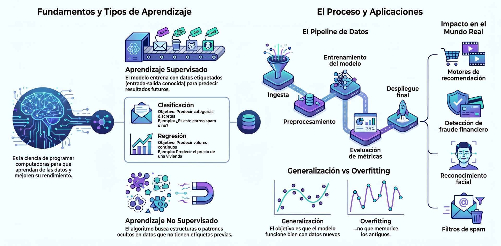

## ¿Qué es el Machine Learning?
El **Machine Learning** (Aprendizaje Automático) es un subcampo de la Inteligencia Artificial que se centra en la construcción de programas de computadora que **mejoran automáticamente su rendimiento adquiriendo experiencia**. En lugar de que un programador escriba reglas explícitas, los algoritmos de ML extraen patrones y tendencias de grandes volúmenes de datos para comprender qué nos dicen y realizar predicciones.

Técnicamente, se dice que un programa aprende de la experiencia **E** con respecto a una clase de tareas **T** y una medida de desempeño **P**, si su desempeño en las tareas en T, medido por P, mejora con la experiencia E.

## Tipos de Machine Learning

*   **Aprendizaje Supervisado:** Es el proceso de construir un modelo basado en **datos de entrenamiento etiquetados**. El usuario proporciona pares de entradas y salidas deseadas, y el algoritmo aprende una función para producir la salida correcta ante entradas nuevas. Sus dos pilares son la **clasificación** (predecir etiquetas discretas) y la **regresión** (predecir valores continuos).

*   **Aprendizaje No Supervisado:** En este enfoque, el algoritmo analiza **datos no etiquetados** sin interferencia humana previa. El objetivo es descubrir estructuras ocultas, tendencias o grupos naturales (clusters) dentro de los datos. Se utiliza principalmente para la **segmentación** y la **reducción de dimensionalidad**.

*   **Aprendizaje por Refuerzo:** Es un método donde un **agente inteligente** aprende a tomar decisiones interactuando con un entorno dinámico. No se le dice qué acciones tomar, sino que debe descubrir cuáles generan la **máxima recompensa** a través del ensayo y error.

## Aplicaciones del Machine Learning

*   **Visión por Computadora:** Utiliza redes neuronales (como las CNN) para procesar píxeles e imitar el córtex visual humano. Permite el reconocimiento de objetos, detección de rostros, interpretación de imágenes médicas (MRI/CT) y la navegación de coches autónomos.
*   **Procesamiento de Lenguaje Natural (NLP):** Se encarga de la lectura y comprensión del lenguaje humano, hablado o escrito, mediante computadoras. Incluye tareas como la traducción automática, resúmenes de texto, reconocimiento de voz y la creación de asistentes virtuales como Siri o Alexa.
*   **Recomendadores:** Motores que sugieren productos o contenido (como Netflix, Spotify o Amazon) analizando el historial y las preferencias individuales para personalizar la experiencia del usuario.
*   **Detección de Fraudes:** Aplicación de aprendizaje no supervisado para identificar **anomalías** o patrones de acceso inusuales en transacciones bancarias o de tarjetas de crédito que se desvían de la norma.
*   **Análisis de Sentimientos:** Subcampo del NLP (u minería de opinión) que busca extraer el estado de ánimo o la polaridad (positivo, negativo o neutral) de un texto, como reseñas de productos o comentarios en redes sociales.

## Desafíos y Consideraciones Éticas

*   **Sesgo en los Datos:** Los modelos solo pueden ser tan buenos como los datos con los que se entrenan. Si los datos de entrada están incompletos o reflejan prejuicios humanos (como seleccionar mayoritariamente imágenes de un solo tipo), el modelo aprenderá **patrones sesgados** y discriminará en sus predicciones.
*   **Privacidad y Seguridad:** Existe un desafío crítico en diseñar sistemas que permitan servicios personalizados sin comprometer la **confidencialidad** y seguridad de los datos de los usuarios. El uso de metadatos y la recopilación masiva de información plantea dilemas sobre la propiedad de los datos.
*   **Transparencia y Explicabilidad:** Muchos modelos avanzados (como las Redes Neuronales) son considerados **"cajas negras"** debido a que su estructura interna es difícil de interpretar para un humano. Es vital que un usuario pueda seguir el raciocinio de una decisión, especialmente en diagnósticos médicos o finanzas.
*   **Impacto Social y Laboral:** Las tecnologías de automatización de la "Industria 4.0" están transformando la producción, el comercio y la forma en que socializamos, lo que genera preocupaciones sobre el desplazamiento laboral y la evolución de la naturaleza del trabajo.
*   **Responsabilidad en el Uso del ML:** El analista tiene la responsabilidad ética de entender qué hace el programa con los datos. Se ha propuesto el uso de auditorías por terceros y revisiones éticas como parte de la planificación de proyectos de ciencia de datos.
*   **Regulación y Normativas:** Es necesario el cumplimiento de leyes que gobiernan el manejo de datos, como el **GDPR** (Reglamento General de Protección de Datos), para garantizar una gestión justa y legal de la información personal.