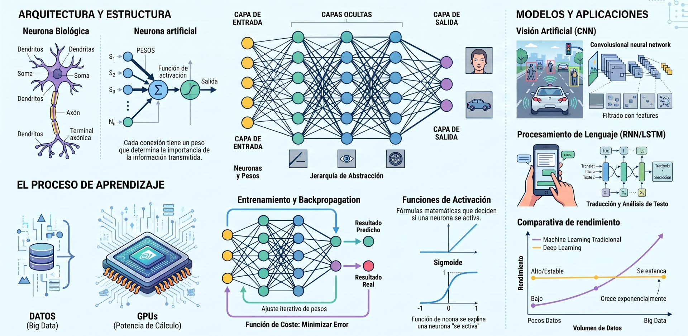

## **Deep Learning**

El Deep Learning representa una evolución fundamental dentro del campo del Machine Learning (ML). Mientras que el ML tradicional ha demostrado ser extraordinariamente poderoso, su éxito a menudo depende de un proceso manual y minucioso conocido como ingeniería de características (feature engineering). En este paradigma, el científico de datos debe seleccionar y transformar cuidadosamente las variables de entrada para que el algoritmo pueda aprender de manera efectiva. El Deep Learning, por el contrario, se distingue por su capacidad para aprender representaciones jerárquicas y complejas directamente desde los datos brutos. Esta habilidad, conocida como aprendizaje de características (feature learning), permite a los modelos descubrir y organizar patrones, desde los más simples hasta los más abstractos, de forma automática.

**Una Jerarquía de Inteligencia**

Para comprender el lugar que ocupa el Deep Learning, es útil visualizarlo dentro de una jerarquía de conceptos interrelacionados.

1. Inteligencia Artificial (IA): Nacida en la década de 1950, la IA es el campo más amplio. Su objetivo es automatizar tareas intelectuales que normalmente son realizadas por humanos. La IA abarca desde los sistemas expertos basados en reglas codificadas a mano hasta los enfoques modernos de aprendizaje automático.

2. Machine Learning (ML): Es un subcampo de la IA que se aleja de las reglas explícitas. En su lugar, el ML se basa en algoritmos que aprenden patrones y reglas directamente a partir de datos de ejemplo. Proporciona a las computadoras la capacidad de aprender sin ser programadas explícitamente para cada tarea.

3. Deep Learning (DL): Es una técnica específica dentro del Machine Learning que se especializa en el aprendizaje de representaciones de datos. Utiliza arquitecturas de redes neuronales "profundas" (con múltiples capas) para aprender de forma incremental representaciones cada vez más complejas, lo que lo hace excepcionalmente adecuado para problemas de percepción como la visión por computadora y el reconocimiento de voz.

Es precisamente esta especialización en el aprendizaje de representaciones lo que dota al Deep Learning de una promesa única, manifestada en varias ventajas clave sobre los enfoques tradicionales.

* Escalabilidad: A diferencia de muchos algoritmos de ML tradicionales cuyo rendimiento se estanca, los modelos de Deep Learning mejoran consistentemente con más datos, modelos más grandes y mayor capacidad de cómputo.

* Aprendizaje Automático de Características: Elimina en gran medida la necesidad de la ingeniería de características manual. El modelo aprende la jerarquía de características más relevante para la tarea directamente de los datos brutos, ya sean píxeles en una imagen, palabras en un texto o valores en una serie temporal.

* Rendimiento de Vanguardia: Ha logrado resultados revolucionarios en dominios históricamente difíciles, como la clasificación de imágenes, la traducción automática y el reconocimiento de voz, superando a menudo el rendimiento humano en tareas específicas.

Pero para apreciar realmente la magia detrás de estos logros, debemos abrir el capó y examinar el motor que lo impulsa: la anatomía de una red neuronal.

## **Preparación de Datos**

Para ser claro: un modelo de Deep Learning, por más sofisticado que sea, es inútil si se alimenta con datos de mala calidad. La fase de preparación de datos no es un simple preámbulo, sino el cimiento sobre el cual se construye todo el proyecto. Ignorarla es la receta más segura para el fracaso. Los modelos no pueden procesar texto, imágenes o series temporales en su forma original; primero deben ser transformados en estructuras numéricas estandarizadas.

### Tensores
**El Lenguaje de las Redes Neuronales**

Todos los frameworks modernos de machine learning, como TensorFlow y PyTorch, utilizan tensores como su estructura de datos básica. Un tensor es un contenedor de datos numéricos, esencialmente una generalización de matrices a un número arbitrario de dimensiones (también llamadas ejes o rango). Pensemos en los datos que manejamos a diario: una serie temporal de precios de acciones es un vector (tensor de rango 1), una imagen en escala de grises es una matriz de píxeles (tensor de rango 2), y una imagen a color (con canales Rojo, Verde y Azul) es un tensor de rango 3. Los tensores son simplemente la forma de empaquetar estos datos para que la red los entienda.

* Escalar (Tensor de rango 0): Un único número.
* Vector (Tensor de rango 1): Un array de números.
* Matriz (Tensor de rango 2): Un array de vectores.

### Datos de Texto

Preparar datos de texto para una tarea como el análisis de sentimiento de reseñas de películas implica varios pasos clave para convertir el lenguaje humano en una representación numérica que una red pueda entender.

1. Limpieza y Tokenización: El primer paso es limpiar el texto, eliminando la puntuación y los caracteres no alfabéticos. Luego, el texto se divide en unidades más pequeñas llamadas tokens (generalmente palabras).

2. Desarrollo de un Vocabulario: Se crea un conjunto de todas las palabras únicas presentes en los datos de entrenamiento. A menudo, las palabras muy comunes que no aportan significado (como "el", "es", "en"), conocidas como stop words, y los tokens demasiado cortos (p. ej., de un solo carácter) se filtran para reducir el ruido.

3. Codificación de Texto: Las palabras se convierten en representaciones numéricas. Un enfoque clásico es el modelo Bag-of-Words, donde cada documento se representa como un vector que cuenta la frecuencia de cada palabra del vocabulario (usando CountVectorizer) o su importancia relativa (usando TfidfVectorizer).

### El Poder de los Word Embeddings

Aunque el modelo Bag-of-Words es útil, ignora el orden y el contexto de las palabras. Los word embeddings son una mejora significativa, ya que representan palabras como vectores densos, de baja dimensión y aprendidos a partir de los datos. La principal ventaja de los embeddings es que capturan relaciones semánticas: palabras con significados similares tendrán vectores cercanos en el espacio de embedding. Es común utilizar embeddings pre-entrenados en corpus de texto masivos, como GloVe, que ya contienen un rico conocimiento semántico del lenguaje.

### Datos de Series Temporales

Para que una red neuronal pueda predecir valores futuros en una serie temporal, la secuencia de datos debe transformarse en un problema de aprendizaje supervisado. Esto se logra creando muestras de entrada y salida a partir de la secuencia original. Por ejemplo, en una serie temporal univariante, se puede usar una ventana de tiempo para generar pares de (entrada, salida):

* Entrada (X): Una secuencia de n pasos de tiempo (por ejemplo, [10, 20, 30]).
* Salida (y): El valor en el siguiente paso de tiempo (en este caso, 40).

Este proceso se desliza a lo largo de toda la serie para generar un conjunto de datos con el que la red puede aprender la relación entre los pasos pasados y el siguiente paso.

Con nuestro combustible de datos ya refinado y listo, podemos por fin alimentar las potentes arquitecturas especializadas que han sido diseñadas para extraer patrones de cada tipo de información.

## **Arquitecturas Fundamentales** 

No existe una única arquitectura de red neuronal que sirva para todos los problemas. A lo largo de los años, la investigación ha dado lugar a arquitecturas especializadas que son particularmente efectivas para tipos específicos de datos y tareas. Comprender las arquitecturas fundamentales es clave para seleccionar la herramienta adecuada para cada desafío.

## **Entrenamiento y Evaluación**

El entrenamiento de un modelo de Deep Learning es un proceso iterativo que consiste en ajustar los parámetros del modelo para minimizar un error medible. Sin embargo, un buen rendimiento en los datos de entrenamiento no es suficiente; el objetivo final es la generalización, es decir, la capacidad del modelo para funcionar bien en datos nuevos que no ha visto antes. Por ello, una evaluación rigurosa es tan fundamental como el propio entrenamiento.

### El Bucle de Entrenamiento

El algoritmo de entrenamiento más común es el descenso de gradiente estocástico por mini-lotes (mini-batch stochastic gradient descent). Este proceso se repite para cada lote de datos hasta que el modelo converge. Cada iteración del bucle consta de los siguientes pasos:

1. Muestreo: Se selecciona un pequeño lote (mini-batch) de datos de entrenamiento y sus etiquetas correspondientes.

2. Paso hacia Adelante (Forward Pass): El lote de datos se pasa a través de la red para obtener las predicciones del modelo.

3. Cálculo de la Pérdida: Se calcula el valor de la pérdida, que mide qué tan lejos están las predicciones (y_pred) de los objetivos reales (y).

4. Paso hacia Atrás (Backward Pass): Se calcula el gradiente de la pérdida con respecto a cada uno de los parámetros (pesos) de la red. Este es el paso de backpropagation.

5. Actualización de Pesos: Los pesos del modelo se ajustan ligeramente en la dirección opuesta al gradiente, utilizando el optimizador.

### El Desafío del Sobreajuste

El sobreajuste (overfitting) es el principal enemigo en el machine learning. Ocurre cuando un modelo se desempeña excepcionalmente bien en los datos de entrenamiento pero falla al generalizar a datos nuevos. Para combatir el sobreajuste, se utilizan técnicas de regularización:

* **Regularización L2 (Weight Decay)**: Penaliza la complejidad del modelo añadiendo un coste a la función de pérdida asociado a tener pesos grandes. Esto incentiva a la red a mantener sus pesos pequeños, lo que conduce a un modelo más simple.

* **Dropout**: Durante el entrenamiento, "apaga" (pone a cero) aleatoriamente una fracción de las neuronas de una capa. Esto obliga a la red a aprender representaciones más robustas, ya que no puede depender de ninguna neurona individual.

En mi experiencia, Dropout es una de las primeras herramientas a las que recurro cuando un modelo denso muestra signos claros de sobreajuste. Es computacionalmente barato y a menudo sorprendentemente efectivo. La regularización L2, por su parte, es una salvaguarda más sutil y constante contra la complejidad excesiva del modelo.

### Métricas de Evaluación

Para evaluar de manera fiable la capacidad de generalización de un modelo, los datos se dividen típicamente en tres conjuntos: entrenamiento, validación y prueba. La evaluación final del modelo se realiza sobre el conjunto de prueba para obtener una estimación imparcial de su rendimiento. Las métricas utilizadas para evaluar el rendimiento dependen del tipo de tarea:

| Tipo de Tarea	| Métricas Comunes |
|---  |---  |
| Clasificación	| Accuracy, Precision, Recall, F1-Score |
| Regresión |	Root Mean Squared Error (RMSE) |
| Generación de Texto |	BLEU Score |
| | |

Una vez que hemos dominado este ciclo fundamental de entrenamiento y validación, estamos listos para ascender a un nuevo nivel de sofisticación, explorando las técnicas y herramientas avanzadas que definen la práctica moderna del Deep Learning.

## **Conceptos Avanzados**

Más allá de los fundamentos, el campo del Deep Learning está en constante evolución, con técnicas avanzadas y un ecosistema de herramientas que permiten alcanzar resultados de vanguardia con mayor eficiencia. Estos conceptos son cruciales para pasar de construir modelos competentes a desarrollar soluciones verdaderamente innovadoras.

### Aprendizaje por Transferencia

El aprendizaje por transferencia (Transfer Learning) es una de las técnicas más impactantes y eficientes en el Deep Learning. Como científicos de datos, nuestro recurso más valioso es el tiempo. El aprendizaje por transferencia es la encarnación del principio de 'no reinventar la rueda'. Aprovechamos el conocimiento destilado de modelos entrenados durante semanas en clústeres de GPUs para resolver nuestro problema específico, a menudo con una fracción del tiempo y los datos. La idea es utilizar un modelo pre-entrenado en un gran conjunto de datos, como VGG16 entrenado en ImageNet, como punto de partida. Las dos estrategias principales son:

* Extracción de Características: Se utilizan las capas convolucionales del modelo pre-entrenado como un extractor de características fijo y solo se entrena un nuevo clasificador en la parte superior.

* Ajuste Fino (Fine-Tuning): Se "descongelan" algunas de las capas superiores del modelo pre-entrenado y se re-entrenan con una tasa de aprendizaje muy baja en el nuevo conjunto de datos.

### Modelos Generativos

Mientras que los modelos discriminativos (como los clasificadores) aprenden a diferenciar entre clases, los modelos generativos aprenden la distribución de los datos y pueden generar muestras completamente nuevas. Dos de las arquitecturas más populares son los Autoencoders Variacionales (VAEs) y las Redes Generativas Adversarias (GANs). Estos modelos pueden generar datos sintéticos que se asemejan a los datos de entrenamiento, como imágenes realistas de rostros que no existen.

### El Ecosistema de Deep Learning

El desarrollo práctico del Deep Learning se apoya en un robusto ecosistema de software y hardware.

* Frameworks: Las bibliotecas de software clave son TensorFlow, Keras (una API de alto nivel sobre TensorFlow) y PyTorch.

* Hardware: El entrenamiento de modelos es computacionalmente intensivo. Las Unidades de Procesamiento Gráfico (GPUs), especialmente las de NVIDIA con su plataforma CUDA, son esenciales para acelerar drásticamente los cálculos.

* Plataformas en la Nube: Servicios como Google Cloud Platform (GCP) y Amazon Web Services (AWS) ofrecen acceso bajo demanda a hardware potente, eliminando la necesidad de una gran inversión inicial en infraestructura.

Con estas herramientas y conceptos avanzados en nuestro arsenal, hemos completado nuestro recorrido por el paisaje del Deep Learning, desde sus cimientos teóricos hasta su aplicación en el mundo real.

## **Integrando en Ciencia de Datos**

Hemos recorrido el panorama del Deep Learning, desde su concepción como un paradigma de aprendizaje de representaciones hasta su implementación práctica a través de un ecosistema maduro de herramientas. Los conceptos clave —los tensores como lenguaje universal, las arquitecturas especializadas como las CNNs para la visión y las RNNs para las secuencias, el riguroso proceso de entrenamiento y evaluación para asegurar la generalización, y las técnicas avanzadas como el aprendizaje por transferencia— constituyen el núcleo de esta disciplina.

El Deep Learning ha equipado a los científicos de datos con un conjunto de herramientas sin precedentes para resolver problemas complejos de reconocimiento de patrones. Su impacto transformador se extiende a través de dominios que van desde la visión por computadora y el procesamiento del lenguaje natural hasta el análisis de series temporales y el descubrimiento científico. Al automatizar el aprendizaje de características y escalar con la abundancia de datos y cómputo, el Deep Learning no solo ha superado los benchmarks existentes, sino que ha abierto nuevas fronteras en la innovación, permitiendo abordar desafíos que antes se consideraban inalcanzables.
