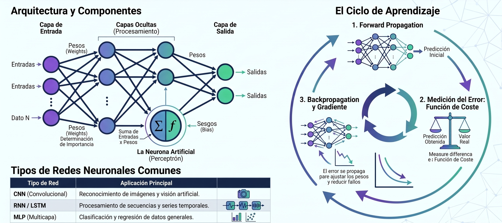

## **Anatomía de una Red Neuronal**

A pesar de su aparente complejidad, las redes neuronales se construyen a partir de un conjunto de componentes simples e interconectados. Comprender la anatomía de una red es una habilidad estratégica para cualquier científico de datos, ya que permite no solo diseñar arquitecturas efectivas, sino también diagnosticar y depurar modelos cuando su rendimiento no es el esperado. Los elementos clave que configuran el aprendizaje de una red son las capas, las funciones de activación, las funciones de pérdida y los optimizadores.

2.1 Capas: Los Ladrillos del Modelo

La capa es el bloque de construcción fundamental de las redes neuronales. Funcionalmente, una capa es un módulo de procesamiento de datos que toma uno o más tensores (arrays multidimensionales) como entrada y produce uno o más tensores como salida. La mayoría de las capas, como las capas densas (Dense) o convolucionales (Conv2D), son parametrizadas por "pesos". Estos pesos, que son tensores aprendidos a través de la exposición a los datos de entrenamiento, contienen el "conocimiento" del modelo.

### Funciones de Activación 
**Introduciendo la No Linealidad**

Cada capa densa o convolucional en una red neuronal implementa una transformación lineal. Si apiláramos capas lineales una tras otra, la red completa seguiría siendo capaz de aprender únicamente funciones lineales. Para permitir que el modelo aprenda patrones complejos y no lineales, se aplican funciones de activación después de las transformaciones lineales. Sin funciones de activación, una red neuronal profunda, sin importar cuántas capas tenga, se comportaría como una simple regresión lineal. Las funciones de activación son los 'interruptores' que le dan a la red la capacidad de aprender relaciones complejas, como las curvas y recovecos presentes en datos del mundo real.

| Función de Activación	| Propósito Principal |
|:---|:---|
| Sigmoid	| Comprime los valores de entrada en un rango entre 0 y 1. Es particularmente útil en la capa de salida de un modelo de clasificación binaria para interpretar la salida como una probabilidad. |
| ReLU (Rectified Linear Unit) | Una de las funciones de activación más populares y eficientes. Devuelve 0 si la entrada es negativa y la propia entrada si es positiva. Su simplicidad ayuda a combatir el problema del desvanecimiento del gradiente. |
|  |  |

### Funciones de Pérdida y Optimizadores
**Cómo Aprende la Red**

El aprendizaje es un ciclo de retroalimentación continuo, orquestado por dos componentes inseparables: la función de pérdida, que actúa como el "crítico" que evalúa el rendimiento del modelo, y el optimizador, que es el "entrenador" que ajusta los pesos para mejorar ese rendimiento.

* **Funciones de Pérdida (Loss Functions)**: Miden la discrepancia entre las predicciones del modelo (y_pred) y los valores reales (y). El valor de la pérdida (un escalar) es la señal que el modelo utiliza para corregir sus pesos. La elección de la función de pérdida está directamente ligada al tipo de problema (por ejemplo, binary_crossentropy para clasificación binaria, mse para regresión).

* **Optimizadores**: Implementan el mecanismo mediante el cual la red actualiza sus pesos para minimizar la función de pérdida. El concepto subyacente es el Descenso de Gradiente Estocástico (SGD), donde los pesos se ajustan ligeramente en la dirección opuesta al gradiente de la pérdida. En la práctica, se utilizan optimizadores más avanzados como RMSprop o Adam, que adaptan la tasa de aprendizaje para una convergencia más rápida y estable.

Ahora que hemos ensamblado el esqueleto de nuestra red, es hora de hablar del combustible que la hará funcionar: los datos. Y como veremos, la preparación de este combustible es tanto un arte como una ciencia.

## **Redes Neuronales Convolucionales (CNNs)**

**Las Redes Neuronales Convolucionales (CNNs)** son el estándar de oro para las tareas de visión por computadora, como la clasificación de imágenes. La genialidad de las CNNs radica en dos principios: la localidad de la información (los píxeles cercanos están más relacionados entre sí) y la invariancia traslacional (un gato sigue siendo un gato, esté en la esquina superior izquierda o en el centro de la imagen). Las capas convolucionales y de agrupación explotan estos principios de forma nativa, haciendo que el aprendizaje sea increíblemente eficiente para datos espaciales. Sus componentes clave son:

* Capas Convolucionales (Conv2D): En lugar de conectar cada neurona de entrada con cada neurona de salida, las capas convolucionales aplican un conjunto de filtros a la imagen de entrada. Cada filtro está especializado en detectar una característica específica, como bordes o texturas. Al deslizar estos filtros por toda la imagen, la capa crea "mapas de características" que indican dónde se encontraron dichos patrones.

* Capas de Agrupación (MaxPooling2D): Estas capas se utilizan típicamente después de las capas convolucionales para reducir la dimensionalidad espacial (ancho y alto) de los mapas de características. Esto hace que la representación sea más manejable computacionalmente y más robusta a pequeñas traslaciones del objeto en la imagen.

La combinación de capas convolucionales y de agrupación permite a la red aprender una jerarquía de características visuales, desde las más simples (líneas y colores) en las primeras capas hasta las más complejas (objetos completos) en las capas más profundas.

## **Redes Neuronales Recurrentes (RNNs)**

Las Redes Neuronales Recurrentes (RNNs) están diseñadas para procesar datos donde el orden es importante, como el texto o las series temporales. A diferencia de las redes feedforward, las RNNs tienen un "bucle" interno que les permite mantener una "memoria". Esta 'memoria' se puede visualizar como un estado interno que la red actualiza en cada paso de tiempo, similar a cómo un humano lee una oración palabra por palabra, manteniendo en su mente el contexto de lo que ha leído hasta el momento. Sin embargo, las RNNs simples tienen dificultades para aprender dependencias a largo plazo. Para solucionar este problema, se desarrollaron variantes más avanzadas:

* **LSTM (Long Short-Term Memory)**: Introduce un mecanismo de "compuertas" que permite a la red aprender qué información es importante recordar, qué olvidar y cómo exponer el estado a largo plazo.

* **GRU (Gated Recurrent Unit)**: Es una versión simplificada de la LSTM que también utiliza compuertas pero es computacionalmente más eficiente, ofreciendo un rendimiento similar en muchas tareas.

## **La Arquitectura Encoder-Decoder**
*Tareas de Secuencia a Secuencia**

La arquitectura Encoder-Decoder es un paradigma poderoso para tareas que implican la transformación de una secuencia de entrada en una secuencia de salida, como la traducción automática o la generación de pies de foto para imágenes. Consta de dos componentes principales, generalmente implementados con RNNs (como LSTM o GRU):

1. **El Encoder**: Procesa la secuencia de entrada paso a paso y la comprime en un vector de contexto de longitud fija. Este vector, a veces llamado "thought vector", pretende capturar la esencia de la secuencia de entrada. Este 'vector de pensamiento' es una hazaña de compresión de información: la red debe destilar el significado completo de una oración, sin importar su longitud, en un único vector denso y de longitud fija. Es la esencia de la secuencia de entrada, lista para ser 'desempaquetada' por el decodificador.

2. **El Decoder**: Toma el vector de contexto como su estado inicial y genera la secuencia de salida paso a paso.

Pero una arquitectura, sin importar cuán elegante sea, es solo un plano. Para darle vida, debemos someterla al riguroso proceso de entrenamiento y evaluación, donde realmente aprende a cumplir su propósito.