## **Árboles de decisión**


Los **árboles de decisión** son modelos predictivos utilizados tanto para tareas de clasificación como de regresión en el aprendizaje supervisado. Su estructura se asemeja a un árbol, donde cada nodo interno representa una pregunta o condición sobre una variable de entrada, cada rama corresponde a una respuesta posible, y cada hoja representa una predicción o resultado final.

Su nombre proviene de su estructura, que se asemeja a un diagrama de flujo o un árbol invertido, y se utiliza tanto para problemas de clasificación como de regresión.

Un árbol de decisión divide recursivamente el espacio de características en regiones homogéneas respecto a la variable objetivo. El proceso de construcción consiste en seleccionar, en cada nodo, la variable y el umbral que mejor separan los datos según algún criterio de pureza (por ejemplo, *Gini*, *entropía* para clasificación, o *varianza* para regresión).

Los modelos de árboles de decisión se engloban dentro de una clase conocida como algoritmos **CART** (Classification and Regression Trees).

**Concepto y Estructura: La Lógica de la Pregunta**

El objetivo principal de un Árbol de Decisión es aprender una secuencia de preguntas tipo "SI ESTO, ENTONCES AQUELLO" que conduzcan a la predicción correcta de la manera más eficiente posible. El algoritmo construye esta estructura jerárquica dividiendo el conjunto de datos de entrada en subconjuntos cada vez más "puros" o homogéneos.

<center>
<figure>
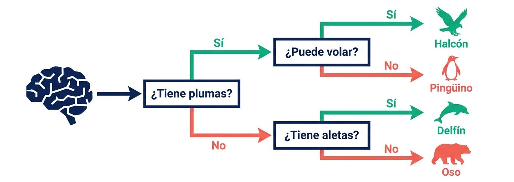
<figcaption>La mente humana clasifica información haciendo secuencias de preguntas binarias. Esta es la base matemática exacta del algoritmo de Machine Learning.</figcaption>
</figure>
</center>

### Elementos Clave del Árbol

La estructura de un árbol permite representar una lógica de decisión clara:

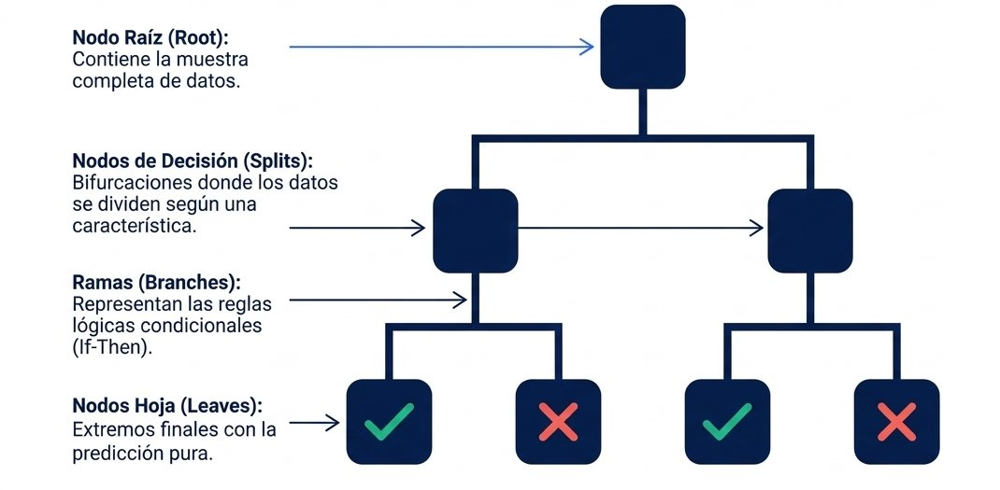

| Elemento | Descripción |
|---|---|
| **Nodo Raíz** (Root Node) | El punto de partida que contiene todo el conjunto de datos. La primera división importante se realiza aquí. |
| **Nodos de Decisión** (Decision Nodes) | Puntos intermedios donde se evalúa una condición o "test" sobre un atributo (p. ej., "¿Es la Edad menor que 12?"). |
| **Ramas/Sub-árboles** | Conectan los nodos de decisión y representan el camino que se toma al responder la pregunta. |
| **Nodos Terminales** o **Hojas** (Leaf Nodes) | Los nodos finales que no se dividen más. Contienen la predicción final o la etiqueta de clasificación (p. ej., "Sobrevive" o "No Sobrevive"). |


### Funcionamiento

Cuando el algoritmo construye el árbol, debe decidir, entre todos los atributos de entrada (como edad, sexo, ingreso, etc.), cuál es el mejor para dividir los datos en cada etapa. El "mejor" atributo es aquel que logra la partición más limpia o pura, minimizando la incertidumbre sobre la categoría de la salida.

Para lograr esto, el algoritmo utiliza medidas de **impureza** para evaluar la calidad de cada posible división. Las dos métricas más comunes son el **Índice de Gini** y la **Ganancia de Información** (basada en Entropía)

### El Índice de Gini

El **Índice de Gini** (o más formalmente, **Impureza de Gini**, *Gini Impurity*) es la métrica de dispersión o función de coste matemática por defecto en algoritmos de árboles de decisión para clasificación, notablemente en **CART** (*Classification and Regression Trees*) y en librerías como Scikit-Learn y PySpark MLlib.

<center>
<figure>
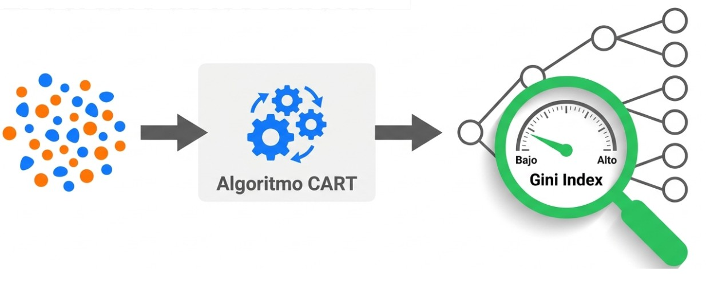
<figcaption>Es el motor matemático que usan algoritmos como CART en los Árboles de decisión para determinar la mejor forma de dividir y clasificar datos.</figcaption>
</figure>
</center>

El **Índice de Gini** mide la probabilidad de que un elemento elegido al azar de un subconjunto sea clasificado incorrectamente si su clase se selecciona aleatoriamente en proporción a la distribución de clases en ese subconjunto.

:::info[Objetivo]
El algoritmo busca elegir divisiones que **minimicen** el Índice de Gini. Un valor de 0 indica una pureza total (todos los elementos pertenecen a una sola clase), mientras que un valor más cercano a 1 (o 0.5 para clasificación binaria) indica una mezcla de clases.
:::

<center>
<figure>
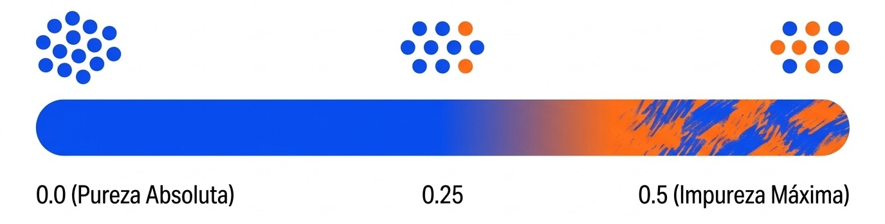
<figcaption>En una clasificación binaria, el valor nunca supera el 0.5 (el peor escenario posible) ni desciende de 0 (el objetivo ideal.)</figcaption>
</figure>
</center>

#### Definición Teórica y Significado

La impureza de Gini cuantifica el **grado de impureza, incertidumbre o desorden de las clases dentro de un nodo o subconjunto de datos**.

De forma probabilística, representa la **probabilidad de que un elemento elegido al azar del nodo sea clasificado de forma incorrecta si se le asigna aleatoriamente una etiqueta de acuerdo con la distribución de clases en dicho nodo**.

*   **Nodo puro (mínima impureza, $I_G = 0$):** Todas las observaciones del nodo pertenecen a una única clase (100% homogéneo).
*   **Nodo máximamente impuro:** Las instancias se encuentran repartidas de forma perfectamente equitativa entre todas las clases (por ejemplo, en un problema binario 50%-50%, la impureza de Gini alcanza su valor máximo de **0.5**). En problemas generales con $K$ clases equiprobables, el valor máximo es $1 - \frac{1}{K}$.

#### Formulación Matemática

Para un nodo o partición $t$ que contiene observaciones distribuidas a lo largo de $C$ clases, la **Impureza de Gini $I_G(t)$** se calcula como:

```math
I_G(t) = 1 - \sum_{i=1}^{C} p_i^2
```

Donde:
*   $C$ es el número total de clases del problema.
*   $p_i$ es la proporción o probabilidad empírica de observar la clase $i$ dentro de ese nodo (es decir, $p_i = \frac{N_{t, i}}{N_t}$, donde $N_{t, i}$ es el recuento de muestras de la clase $i$ y $N_t$ es el total de muestras en el nodo).

**Proceso:** Al calcular el Gini para cada posible división, el algoritmo elige la característica y el valor de corte que resulten en la mayor reducción de la impureza (es decir, el menor valor de Gini ponderado en los nodos hijos)

<center>
<figure>
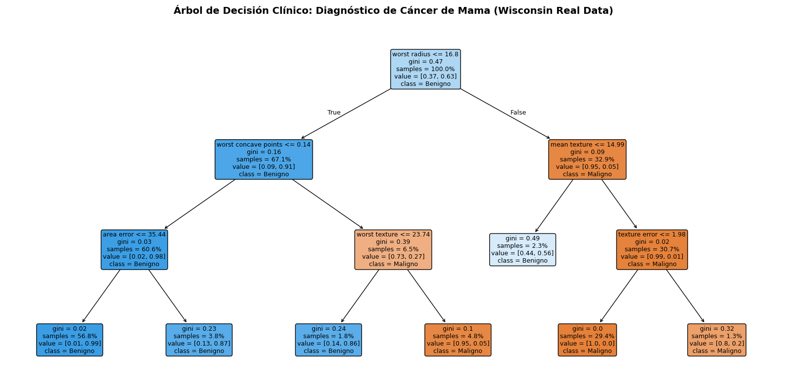
<figcaption>Es probabilidad. Restamos a 1 la suma de al proporciónal cuadrado de cada clase presente en el grupo.</figcaption>
</figure>
</center>

Para clasificación, el árbol busca particiones que minimicen una función de impureza $I$ en cada nodo $t$:

$$
I(t) = \sum_{k=1}^K p_{k}(1 - p_{k})
$$

donde $p_{k}$ es la proporción de muestras de la clase $k$ en el nodo $t$ (índice de Gini).  
Para regresión, se suele minimizar la suma de los errores cuadrados (varianza):

$$
I(t) = \frac{1}{N_t} \sum_{i \in t} (y_i - \bar{y}_t)^2
$$

donde $N_t$ es el número de muestras en el nodo $t$ y $\bar{y}_t$ es el valor medio de la variable objetivo en ese nodo.

El árbol se construye de manera recursiva hasta que se cumple un criterio de parada (profundidad máxima, número mínimo de muestras, etc.).

#### Mecánica en la Construcción del Árbol 
**(La Función de Coste de División)**

<center>
<figure>
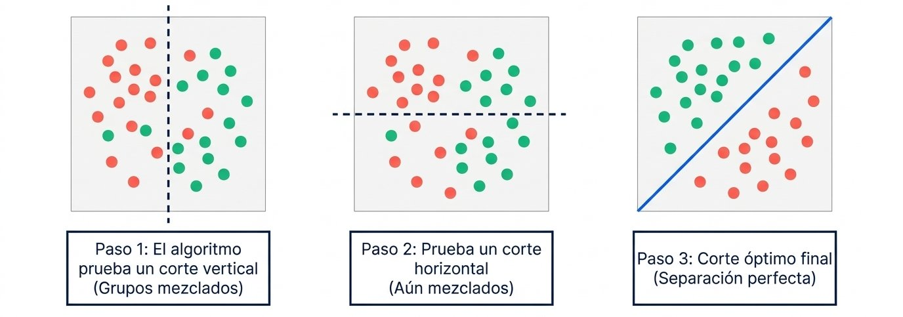
<figcaption>**Cómo aprende. Búsqueda codiciosa.** Evalúa todas las características iterativamente para elegir la mejor separación matmática inmediata.</figcaption>
</figure>
</center>

El algoritmo CART utiliza un enfoque voraz (*greedy*) conocido como partición binaria recursiva (*recursive binary splitting*). Para decidir qué característica $k$ y qué punto de corte o umbral $t_k$ utilizar para ramificar un nodo padre, el algoritmo evalúa la **reducción neta de impureza** o la **impureza ponderada de los nodos hijos**:

```math
J(k, t_k) = \frac{N_{\text{izq}}}{N_{\text{padre}}} I_G(D_{\text{izq}}) + \frac{N_{\text{der}}}{N_{\text{padre}}} I_G(D_{\text{der}})
```

Donde:
*   $N_{\text{padre}}$, $N_{\text{izq}}$ y $N_{\text{der}}$ son las cantidades de instancias en el nodo padre y en los subconjuntos izquierdo y derecho resultantes del corte.
*   $I_G(D_{\text{izq}})$ e $I_G(D_{\text{der}})$ son las impurezas de Gini de los nodos resultantes.

El algoritmo selecciona la característica y el umbral que **minimizan $J(k, t_k)$** (o equivalentemente, que maximizan la ganancia de impureza $\Delta I_G = I_{G,\text{padre}} - J$).


#### Gini vs. Entropía (Ganancia de Información)

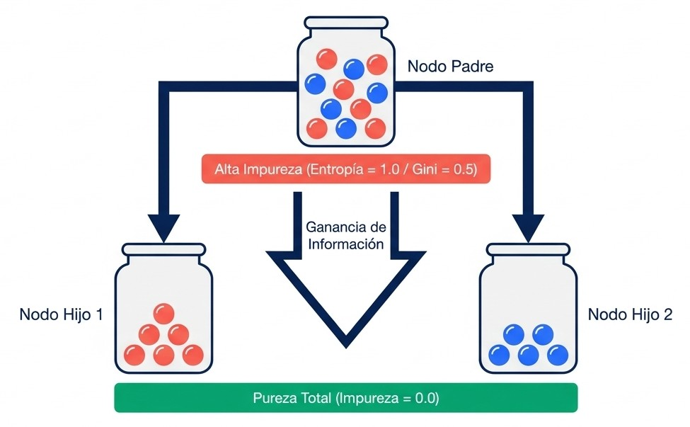

Tanto la Impureza de Gini como la **Entropía**, derivada de la teoría de la información de Shannon, 

```math
H(t) = -\sum p_i \log_2 p_i
```
cumplen funciones idénticas al evaluar pureza:

| Criterio | Impureza de Gini | Entropía (Information Gain) |
| :--- | :--- | :--- |
| **Fórmula** | $1 - \sum p_i^2$ | $-\sum p_i \log_2(p_i)$ |
| **Rango binario** | $[0, 0.5]$ | $[0, 1.0]$ |
| **Cómputo** | Más rápido (solo sumas y cuadrados, sin funciones logarítmicas). | Ligeramente más lento debido al cálculo de $\log_2$. |
| **Comportamiento** | Tiende a aislar la clase más frecuente en su propia rama de forma agresiva. | Tiende a producir particiones un poco más equilibradas. |

En la práctica, ambos criterios suelen converger en árboles con arquitecturas y precisiones de clasificación muy similares.


#### Ejemplo de Cálculo Paso a Paso

Supongamos un nodo padre con **10 instancias** (5 positivas y 5 negativas) que se evalúa dividir mediante un umbral:
1.  **Gini del padre:** $1 - \left[\left(\frac{5}{10}\right)^2 + \left(\frac{5}{10}\right)^2\right] = 1 - [0.25 + 0.25] = \mathbf{0.50}$.
2.  **División candidata:**
    *   **Nodo Izquierdo (4 instancias):** 4 positivas y 0 negativas $\rightarrow I_G = 1 - (1^2 + 0^2) = \mathbf{0.0}$ (nodo puro).
    *   **Nodo Derecho (6 instancias):** 1 positiva y 5 negativas $\rightarrow I_G = 1 - \left[\left(\frac{1}{6}\right)^2 + \left(\frac{5}{6}\right)^2\right] = 1 - \left[\frac{1}{36} + \frac{25}{36}\right] = 1 - \frac{26}{36} \approx \mathbf{0.278}$.
3.  **Gini ponderado del split:**
    ```math
    J = \left(\frac{4}{10} \times 0.0\right) + \left(\frac{6}{10} \times 0.278\right) = 0 + 0.1668 = \mathbf{0.167}
    ```
    *La reducción de impureza lograda por este corte es $0.50 - 0.167 = \mathbf{0.333}$*.


### Ventajas 
**Fácil Interpretación**: Pueden visualizarse como diagramas de flujo simples, lo que facilita explicar el resultado a personas sin conocimientos técnicos.

**No Paramétrico**: No se hacen suposiciones sobre la distribución subyacente de los datos.

**Rápido**: Son relativamente rápidos de entrenar y de usar para predecir nuevos datos.

**Manejo de Datos**: Pueden manejar datos categóricos y numéricos eficientemente y son útiles incluso con conjuntos de datos incompletos.

### Desventajas

**Propenso al Sobreajuste (Overfitting)**: Si el árbol crece demasiado (mucha profundidad), puede memorizar el ruido y los detalles específicos del conjunto de entrenamiento y fallar al generalizar.

**Sensibilidad**: Pequeños cambios en los datos de entrada pueden causar grandes cambios en la estructura del árbol, afectando las predicciones.

**No Globalmente Óptimo**: Los árboles se construyen utilizando una estrategia "voraz" (greedy), lo que significa que eligen la mejor división localmente, pero esto no garantiza que la estructura final sea la mejor globalmente.

**Fronteras de Decisión**: Tienden a crear fronteras de decisión cuadradas o rectilíneas, lo que puede ser ineficiente para modelar relaciones no lineales suaves.


#### Caso de clasificación

Un ejemplo clásico es predecir la supervivencia en el desastre del Titanic, donde las decisiones se basan en atributos discretos y continuos como la edad y el sexo.

Utilizamos la librería scikit-learn en Python para construir el árbol. En este ejemplo, el árbol se entrena para decidir si un pasajero sobrevive (Sí) o no (No), basándose en el sexo y la edad.

1. **Preparación de Datos**: Se definen los atributos de entrada (X) y el resultado esperado (y). (Asumimos que 'Sex_male' ha sido codificado como 0 o 1).
2. **Construcción y Entrenamiento**: Se importa la clase DecisionTreeClassifier y se ajusta el modelo a los datos de entrenamiento

<details>
<summary>🖥️ Código</summary>

```python showLineNumbers
# EJEMPLO CONCEPTUAL EN PYTHON USANDO SCIKIT-LEARN

from sklearn.tree import DecisionTreeClassifier, plot_tree
from sklearn.model_selection import train_test_split
from sklearn.metrics import accuracy_score, classification_report, confusion_matrix
import pandas as pd
import numpy as np
import matplotlib.pyplot as plt
import requests

df = pd.read_csv('https://patricioaraneda.cl/public/titanic5_full.csv')
df = df[['Survived', 'Age', 'Sex']].dropna(subset=['Survived', 'Age', 'Sex'])

# Codificar sexo (male=1, female=0)
# Si 'Sex' ya está codificado como 0/1, el mapeo dará NaN; rellenamos con el valor original en ese caso.
df['Sex_male'] = df['Sex'].map({'male': 1, 'female': 0})
df['Sex_male'] = df['Sex_male'].fillna(df['Sex']).astype(float)

# Simulación de datos: [Edad, Sexo (1=Masculino, 0=Femenino)]
# En un caso real, esto provendría del dataset de Titanic
X_data = df[['Age', 'Sex_male']].values
# Etiquetas: 1=Sobrevive, 0=No Sobrevive
y_labels = df['Survived'].astype(int).values

X_train, X_test, y_train, y_test = train_test_split(X_data, y_labels, test_size=0.3, random_state=42)

# --- Crear y Entrenar el Modelo ---
# Limitamos la profundidad para evitar el sobreajuste (max_depth=2) [15]
clf = DecisionTreeClassifier(criterion='gini', max_depth=2, random_state=0)
clf.fit(X_train, y_train) 

# --- Visualización del Árbol ---
# plot_tree fue importado de sklearn.tree arriba.
plt.figure(figsize=(10,6))
# X_data es un numpy.ndarray, no tiene .columns => pasamos los nombres de las características explícitamente
plot_tree(clf, feature_names=['Age', 'Sex_male'], class_names=['No', 'Si'], filled=True, rounded=True)
plt.show()
# Esta función generaría un diagrama donde se ve:
# 1. El nodo raíz dividiendo por 'Sex_male' (porque es el atributo más importante, como se ve en el ejemplo real).
# 2. Las siguientes divisiones basadas en 'Age'.
```
</details>

<center>
<figure>
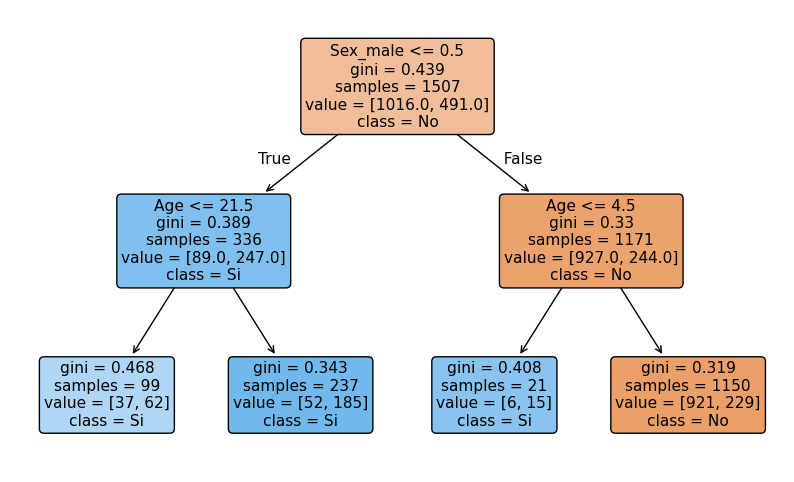
<figcaption>**Árbol de decisión**. El nodo raíz se divide inicialmente por 'Sex_male' porque es el atributo más importante.</figcaption>
</figure>
</center>


<details>
<summary>🖥️ Código</summary>

```python showLineNumbers
from sklearn.metrics import accuracy_score, classification_report, confusion_matrix
import matplotlib.pyplot as plt

# Cargar y preparar datos
import requests

df = pd.read_csv('https://patricioaraneda.cl/public/titanic5_full.csv')
df = df[['Survived', 'Age', 'Sex']].dropna(subset=['Survived', 'Age', 'Sex'])

# Codificar sexo (male=1, female=0)
df['Sex_male'] = df['Sex'].map({'male': 1, 'female': 0})

# Características y etiqueta
X_t = df[['Age', 'Sex_male']].values
y_t = df['Survived'].astype(int).values

# División entrenamiento/prueba
X_train, X_test, y_train, y_test = train_test_split(X_t, y_t, test_size=0.3, random_state=42, stratify=y_t)

# Entrenar árbol de decisión
clf = DecisionTreeClassifier(criterion='gini', max_depth=4, random_state=0)
clf.fit(X_train, y_train)

# Evaluación
y_pred = clf.predict(X_test)
print("Accuracy:", accuracy_score(y_test, y_pred))
print(classification_report(y_test, y_pred))

# importancia de características
importances = clf.feature_importances_
feature_names = ['Age', 'Sex_male']
for name, importance in zip(feature_names, importances):
    print(f"{name}: {importance:.4f}")


# Visualizar árbol

plt.figure(figsize=(12,7))
plot_tree(clf, feature_names=['Age','Sex_male'], class_names=['No','Si'], filled=True, rounded=True)
plt.show()
# El árbol resultante mostraría cómo las decisiones se basan en estos atributos para predecir la supervivencia
```
</details>

```
Accuracy: 0.7650695517774343
              precision    recall  f1-score   support

           0       0.79      0.89      0.84       437
           1       0.69      0.50      0.58       210

    accuracy                           0.77       647
   macro avg       0.74      0.70      0.71       647
weighted avg       0.76      0.77      0.75       647

Age: 0.1783
Sex_male: 0.8217
```

    
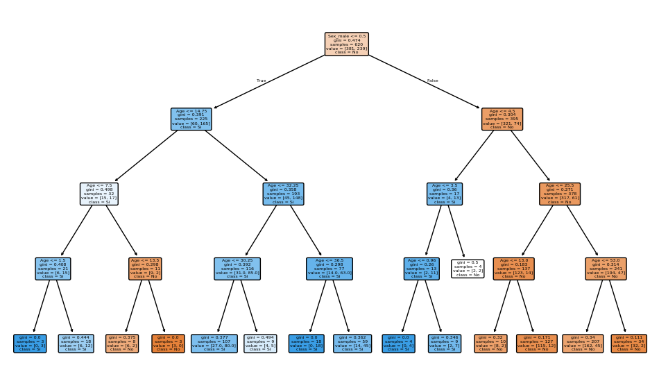
    

#### Caso sobre predicción
Predicción para un pasajeros del Titanic, sobre edad y sexo.

```python showLineNumbers
# genera una predicion para un pasajero de 25 años y sexo masculino
sample_passenger = np.array([[25, 1]])  # 25 años, masculino
predicted_survival = clf.predict(sample_passenger)
print(f"Predicción de supervivencia para pasajero de 25 años y sexo masculino: {'Sobrevive' if predicted_survival[0] == 1 else 'No Sobrevive'}")
```

Predicción de supervivencia para pasajero de 25 años y sexo masculino: No Sobrevive


```python showLineNumbers
# genera predicciones para pasajeros con diferentes edades y sexos
sample_passengers = np.array([[22, 0],  # 22 años, masculino
                              [30, 1],  # 30 años, femenino
                              [40, 1],  # 40 años, masculino
                              [35, 0]]) # 25 años, femenino
predicted_survivals = clf.predict(sample_passengers)
print("Predicciones de supervivencia para pasajeros de diferentes edades y sexos:")
for i, passenger in enumerate(sample_passengers):
    age, sex = passenger
    survival = 'Sobrevive' if predicted_survivals[i] == 1 else 'No Sobrevive'
    print(f"{age} años y sexo {'masculino' if sex == 1 else 'femenino'}: {survival}")

```

    Predicciones de supervivencia para pasajeros de diferentes edades y sexos:
    22 años y sexo femenino: Sobrevive
    30 años y sexo masculino: No Sobrevive
    40 años y sexo masculino: No Sobrevive
    35 años y sexo femenino: Sobrevive


### Aplicaciones comunes

- Diagnóstico médico (clasificación de enfermedades)
- Detección de fraude
- Predicción de abandono de clientes (*churn*)
- Segmentación de clientes en marketing
- Predicción de precios de viviendas (regresión)

Los árboles de decisión son la base de algoritmos más avanzados como Random Forest y Gradient Boosting. Su principal ventaja es la interpretabilidad y facilidad de visualización, aunque pueden sobreajustar si no se podan o regulan adecuadamente.

---
## **Árboles Regresivos**

Los árboles de decisión también se pueden utilizar para resolver problemas de regresión, no solo problemas de clasificación. En lugar de predecir clases como lo hacen en la clasificación, los árboles de decisión de regresión se utilizan para predecir valores numéricos. Algunos aspectos clave sobre cómo funcionan los árboles de decisión para problemas de regresión:

- **Captura relaciones no lineales**: A diferencia de algunos modelos de regresión lineal, que asumen una relación lineal entre las características y la variable de respuesta, los árboles de regresión pueden capturar relaciones no lineales entre las características y la variable objetivo. Esto significa que los árboles de regresión pueden manejar datos en los que la relación entre las características y la variable de respuesta no sigue una forma funcional simple, como una línea recta. En cambio, pueden detectar patrones más complejos y no lineales en los datos, lo que los hace útiles para una amplia variedad de problemas regresivos en los que la relación entre las características y la variable objetivo es más compleja.

- **División de nodos**: Al igual que en los árboles de decisión para clasificación, los árboles de decisión de regresión también dividen el conjunto de datos en cada nodo en función de las características. Sin embargo, en lugar de elegir la división que maximice la pureza de la clase, se selecciona la división que minimice el error de regresión, como el error cuadrático medio (MSE) o el error absoluto medio (MAE).

- **Criterio de división**: El criterio utilizado para determinar cómo se dividen los nodos en problemas de regresión puede variar, pero los más comunes son MSE y MAE. El MSE calcula la varianza de los valores de respuesta en cada nodo y busca minimizarla al elegir la división óptima, mientras que el MAE calcula la media de las diferencias absolutas entre los valores de respuesta y sus predicciones en cada nodo.

- **Predicción en hojas**: A diferencia de los árboles de decisión para clasificación, donde las hojas representan clases, en los árboles de decisión de regresión, las hojas contienen valores numéricos que representan las predicciones. Cuando un nuevo ejemplo pasa por el árbol, su valor de respuesta se calcula tomando el promedio (o alguna otra función) de los valores de respuesta en la hoja correspondiente.

- **Regularización**: Al igual que en los árboles de decisión para clasificación, los árboles de decisión de regresión pueden sufrir de sobreajuste si se les permite crecer sin restricciones. Por lo tanto, técnicas de regularización como la poda o la limitación de la profundidad del árbol son importantes para evitar el sobreajuste y mejorar la generalización del modelo.

***
## **Efecto de la profundidad**

### El Dilema de la Complejidad

En un árbol de decisión, la **profundidad** (*depth*) representa la cantidad máxima de preguntas consecutivas que el modelo puede encadenar desde la raíz hasta llegar a una conclusión en una hoja. 

La profundidad gobierna directamente la **capacidad de generalización** (es decir, la habilidad del modelo para acertar en datos futuros y no vistos):

* **Árbol muy poco profundo (Subajuste / *Underfitting*):**  
  Si la profundidad es demasiado baja (por ejemplo, permitir solo 1 o 2 preguntas), el modelo es excesivamente rígido y simplista. No logra captar los patrones esenciales ni las relaciones no lineales de los datos, cometiendo errores elevados tanto en el entrenamiento como en la práctica.

* **Árbol excesivamente profundo (Sobreajuste / *Overfitting*):**  
  Si el árbol crece sin restricciones hasta que cada hoja contenga un único dato o casos residuales, el modelo no aprende reglas generales. En su lugar, **memoriza el ruido, las anomalías y las particularidades irrelevantes del conjunto de entrenamiento**. Logra un 100% de aciertos en el entrenamiento, pero falla drásticamente al recibir datos nuevos.

<center>
<figure>
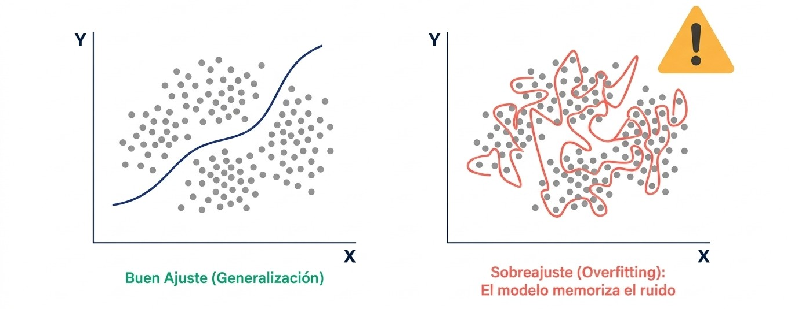
<figcaption>**El sobreajuste.** Sin restricciones, un árbol crecerá infinitamente para crear hojas puras para cada punto individual, perdiendo su capacidad predictiva en el mundo real.</figcaption>
</figure>
</center>

* **El punto óptimo (*Sweet Spot*):**  
  Existe una profundidad intermedia equilibrada donde el árbol es lo suficientemente flexible para capturar la estructura real del problema, pero lo bastante simple como para ignorar el ruido aleatorio, maximizando el rendimiento en datos de prueba.


### El Compromiso Sesgo-Varianza

Desde una perspectiva estadística, los árboles de decisión son **modelos no paramétricos**. A diferencia de los modelos lineales (cuyo número de parámetros está fijo a priori), los árboles adaptan su arquitectura y particionan el espacio en hiperrectángulos según los datos de entrenamiento.

El error de generalización esperado de un árbol de decisión se descompone matemáticamente en tres componentes fundamentales:

```math 
\text{Error de Generalización} = \text{Sesgo}^2 + \text{Varianza} + \text{Error Irreducible}
```

#### A. Componentes Matemáticos del Error:
1. **Sesgo al cuadrado ($\text{Bias}^2$):**  
   Mide el error introducido por supuestos simplistas del algoritmo respecto a la verdadera función subyacente:
   ```math 
   \text{Sesgo}(x) = \mathbb{E}_{\mathcal{D}}[\hat{f}(x; \mathcal{D})] - f(x)
   ```
   *Donde $\hat{f}(x; \mathcal{D})$ es la predicción del árbol entrenado con el conjunto $\mathcal{D}$, y $f(x)$ es el valor verdadero.*
2. **Varianza ($\text{Variance}$):**  
   Mide la sensibilidad del modelo ante pequeñas perturbaciones o cambios en el conjunto de entrenamiento:
   ```math 
   \text{Varianza}(x) = \mathbb{E}_{\mathcal{D}}\Big[\big(\hat{f}(x; \mathcal{D}) - \mathbb{E}_{\mathcal{D}}[\hat{f}(x; \mathcal{D})]\big)^2\Big]
   ```
3. **Error Irreducible ($\sigma_\eta^2$):**  
   Ruido estocástico inherente a las mediciones o variables no observables; no puede eliminarse mediante ningún ajuste del modelo.

#### B. La Dinámica de la Profundidad en el Compromiso:
* **A menor profundidad (Alto Sesgo, Baja Varianza):**  
  El árbol realiza pocas particiones ortogonales. Las predicciones no varían casi nada si cambiamos el conjunto de entrenamiento (baja varianza), pero la aproximación es tosca y sesgada hacia un valor promedio regional (alto sesgo).

* **A mayor profundidad (Bajo Sesgo, Alta Varianza):**  
  El árbol fragmenta el espacio en celdas minúsculas que aíslan puntos individuales. El sesgo cae casi a cero sobre el conjunto de entrenamiento, pero la varianza se dispara: entrenar con una muestra ligeramente distinta genera reglas y fronteras de decisión completamente dispares.

```
Error de Generalización
        ▲
        │          /  Error en Test / Validación (Generalización)
        │         /   
  Alto  │  \     /    ◄── Zona de Sobreajuste (Alta Varianza)
        │   \   /
        │    \_/ ◄─────── Punto Óptimo de Generalización (Sweet Spot)
        │    / \
  Bajo  │   /   \_____ Error en Entrenamiento (Bajo Sesgo)
        │  /
        └──────────────┴──────────────────────────►
          Poca Profundidad                Profundidad Ilimitada
          (Subajuste / Alto Sesgo)        (Sobreajuste / Memorización)
```


### Técnicas de Control

Para garantizar la generalización en entornos de producción, se emplean dos enfoques principales de regularización:

1. **Prepoda (*Pre-pruning* mediante hiperparámetros tempranos):**  
   * **`max_depth`:** Fija una cota superior estricta al número de niveles del árbol. Es el mecanismo de control más directo y efectivo.
   * **`min_samples_split` y `min_samples_leaf`:** Exigen que un nodo o una hoja terminal contenga un número mínimo de muestras reales (por ejemplo, 10 o 20 observaciones) para permitir la división o la existencia del nodo.
2. **Pospoda (*Post-pruning* vía Cost-Complexity Pruning):**  
   Permite que el árbol crezca inicialmente y luego optimiza la función de coste penalizada:
   ```math 
   R_\alpha(T) = R(T) + \alpha |T|
   ```
   Donde $|T|$ penaliza la cantidad de nodos u hojas terminales asociadas a la profundidad del subárbol, seleccionando $\alpha$ mediante validación cruzada.
3. **Ensamble mediante Bosques Aleatorios (*Random Forests*):**  
   En lugar de depender de un único árbol cuya profundidad deba sintonizarse al milímetro, se promedian múltiples árboles profundos descorrelacionados (*Bagging* con subconjuntos aleatorios de variables), reduciendo drásticamente la varianza global sin incrementar el sesgo.

<center>
<figure>
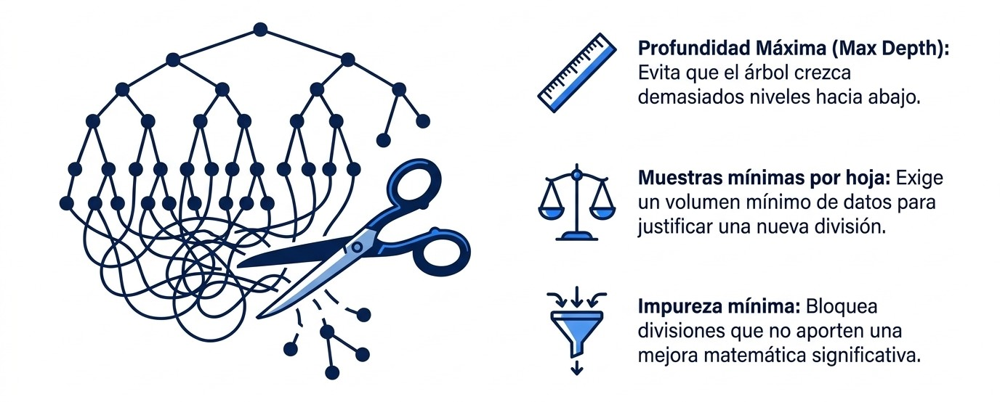
<figcaption></figcaption>
</figure>
</center>

### 🖥️ Implementación
<Tabs>
<TabItem value="mnp" label="Antecedentes" default>
<div class="alert alert--primary">

**Curva de Validación de Profundidad vs. Error**

El siguiente código utiliza el dataset real de **Cáncer de Mama de Wisconsin** para entrenar árboles de decisión variando su profundidad de 1 a 12 niveles, demostrando cómo se detecta el punto exacto de máxima generalización mediante validación cruzada:

```=== EVALUACIÓN DEL IMPACTO DE LA PROFUNDIDAD ===
Profundidad:  1 | Train Acc:  92.7% | CV Acc:  90.5% | Test Acc:  91.2%
Profundidad:  2 | Train Acc:  96.5% | CV Acc:  94.0% | Test Acc:  91.8%
Profundidad:  3 | Train Acc:  98.0% | CV Acc:  94.2% | Test Acc:  92.4%
...

Profundidad óptima identificada por Validación Cruzada: max_depth = 3
```

</div>
</TabItem>
<TabItem value="mnp-python" label="🖥️ Código">

```python showLineNumbers
"""
Módulo Académico: Impacto de la Profundidad en el Rendimiento Generalizador.
Dataset: Breast Cancer Wisconsin (scikit-learn).
"""

import numpy as np
import matplotlib.pyplot as plt
from sklearn.datasets import load_breast_cancer
from sklearn.model_selection import train_test_split, cross_val_score
from sklearn.tree import DecisionTreeClassifier

# 1. Carga de datos reales y partición Train / Test
data = load_breast_cancer()
X, y = data.data, data.target

X_train, X_test, y_train, y_test = train_test_split(
    X, y, test_size=0.30, random_state=42, stratify=y
)

# 2. Evaluación paramétrica de la profundidad (max_depth de 1 a 12)
profundidades = np.arange(1, 13)
train_scores = []
cv_scores = []
test_scores = []

for d in profundidades:
    clf = DecisionTreeClassifier(max_depth=d, random_state=42)
    clf.fit(X_train, y_train)
    
    # Rendimiento aparente en entrenamiento
    train_scores.append(clf.score(X_train, y_train))
    
    # Rendimiento en 5-Fold Cross-Validation (Métrica de Selección)
    cv_mean = cross_val_score(clf, X_train, y_train, cv=5, scoring='accuracy').mean()
    cv_scores.append(cv_mean)
    
    # Rendimiento real en el conjunto de prueba independiente
    test_scores.append(clf.score(X_test, y_test))

# 3. Identificación del punto óptimo de generalización
mejor_idx = np.argmax(cv_scores)
profundidad_optima = profundidades[mejor_idx]

print("=== EVALUACIÓN DEL IMPACTO DE LA PROFUNDIDAD ===")
for d, tr, cv, te in zip(profundidades, train_scores, cv_scores, test_scores):
    print(f"Profundidad: {d:2d} | Train Acc: {tr*100:5.1f}% | CV Acc: {cv*100:5.1f}% | Test Acc: {te*100:5.1f}%")

print(f"\nProfundidad óptima identificada por Validación Cruzada: max_depth = {profundidad_optima}")

# 4. Generación Gráfica (Fondo Blanco Plano y Paleta Contrastada)
fig, ax = plt.subplots(figsize=(9, 5.5), facecolor='white')
ax.set_facecolor('white')

ax.plot(profundidades, train_scores, marker='o', color='#8a8a8a', linewidth=2, label='Exactitud en Entrenamiento (Aumenta hacia el 100%)')
ax.plot(profundidades, cv_scores, marker='s', color='#0072b2', linewidth=2.5, label='Exactitud 5-Fold CV (Criterio de Validación)')
ax.plot(profundidades, test_scores, marker='^', color='#009e73', linewidth=2, linestyle='--', label='Exactitud en Test Set (Generalización Real)')

# Indicador del punto óptimo
ax.axvline(profundidad_optima, color='#d55e00', linestyle=':', linewidth=1.8, label=f'Profundidad Óptima ({profundidad_optima})')
ax.scatter([profundidad_optima], [cv_scores[mejor_idx]], color='#d55e00', s=80, zorder=5)

ax.set_title("La Profundidad Gobierna el Balance Sesgo-Varianza en Árboles", fontsize=12, fontweight='bold', pad=12)
ax.set_xlabel("Profundidad Máxima del Árbol (max_depth)", fontsize=11)
ax.set_ylabel("Exactitud (Accuracy)", fontsize=11)
ax.set_xticks(profundidades)
ax.grid(True, linestyle=':', alpha=0.6)
ax.spines['top'].set_visible(False)
ax.spines['right'].set_visible(False)
ax.legend(frameon=True, facecolor='white', loc='lower right', fontsize=9.5)

plt.tight_layout()
plt.show()
```
</TabItem>
</Tabs><br/>


#### Resumen 

1. **Profundidad Baja (1 a 2 niveles):** El árbol actúa como un clasificador rígido (*decision stump*) con alto sesgo, incapaz de capturar la complejidad de los datos.

2. **Profundidad Elevada o Ilimitada ($> 8$ niveles):** El árbol alcanza precisión del 100% en entrenamiento, pero la curva de validación se estanca o decae debido a la alta varianza y memorización del ruido.

3. **Control Práctico:** En problemas reales, se debe restringir la profundidad con `max_depth` (habitualmente entre 3 y 6 en árboles individuales) o utilizar técnicas de ensamble como **Random Forest** o **Gradient Boosted Trees** para mitigar la varianza residual.


***
## 🖥️ **Ejemplos**

### Detección de fraude
<Tabs>
<TabItem value="af" label="Antecedentes" default>
<div class="alert alert--primary">

**Detección de fraude con Árboles de Decisión**

Imagina que un analista de seguridad bancaria crea un conjunto de reglas paso a paso para inspeccionar transacciones sospechosas:
* *«¿La compra supera los \$1.000?»*
  * **Sí:** *«¿La transacción se realizó desde un país distinto al habitual en menos de 30 minutos?»*
    * **Sí:** Clasificar como **Fraude**.
    * **No:** Clasificar como **Legítima**.
  * **No:** Clasificar como **Legítima**.

Un **árbol de decisión** es exactamente eso: un modelo que aprende automáticamente de los datos históricos una jerarquía de preguntas («nodos de decisión») en función de las variables disponibles hasta llegar a una conclusión en las «hojas».

**El Riesgo Crítico: El Sobreajuste (*Overfitting*)**
Si permites que el árbol crezca sin restricciones hasta que cada hoja contenga solo un puñado de ejemplos, el árbol no aprenderá reglas generales de fraude, sino que **memorizará las particularidades exactas y el ruido del pasado** (por ejemplo: creará una rama absurda como *«Si el monto es \$1.042,35 en día martes a las 03:14 AM $\rightarrow$ Fraude»*). 

* **Resultado del sobreajuste:** En los datos de entrenamiento tendrá una precisión del 100%, pero al llegar nuevas transacciones reales en producción fallará severamente.

**La Solución: Técnicas de Poda (*Pruning*)**
La **poda** consiste en recortar ramas redundantes que aportan poco valor predictivo para simplificar el árbol:
* **Prepoda (*Pre-pruning*):** Detener el crecimiento del árbol antes de que memorice (fijando un tope a la profundidad máxima o exigiendo un mínimo de transacciones por hoja).
* **Pospoda (*Post-pruning* / *Cost-Complexity Pruning*):** Dejar que el árbol crezca completamente y luego podar hacia atrás las ramas que introducen ruido, optimizando el equilibrio entre simplicidad y capacidad de generalización.


A continuación se presenta un script que:
1. Simula un conjunto de datos realista de **detección de fraude bancario fuertemente desbalanceado (95% legítimo, 5% fraude)** con 2.500 transacciones.
2. Ajusta un árbol sin restricciones y demuestra la existencia de **sobreajuste cuantitativo**.
3. Extrae la trayectoria de poda con `cost_complexity_pruning_path` y selecciona el $\alpha$ óptimo mediante validación cruzada.
4. Genera la comparación gráfica lado a lado:


**Análisis e Interpretación de los Resultados**


1. **Evidencia Numérica de Sobreajuste en el Árbol Completo:**
   * En entrenamiento, el árbol alcanza una puntuación casi perfecta ($\text{F1} \approx 100\%$) gracias a que expande más de 12 niveles de profundidad y decenas de hojas especializadas.
   * Sin embargo, al evaluarlo contra transacciones no vistas en el conjunto de prueba (`X_test`), su rendimiento cae bruscamente ($\text{F1} \approx 65\% - 70\%$). Esa brecha de más de 30 puntos porcentuales es la prueba irrefutable del sobreajuste.
2. **Efecto de la Poda por Complejidad de Coste (`ccp_alpha`):**
   * Al aumentar $\alpha$, el algoritmo poda primero las ramas terminales que clasifican muy pocas transacciones (que solo memorizaban ruido o casos atípicos).
   * Al alcanzar el $\alpha^*$ óptimo (indicado por la línea vertical punteada en el gráfico), el número de hojas se contrae drásticamente (a menudo a menos de 8 a 12 nodos terminales), lo que **aumenta el F1-Score en los datos de prueba** y otorga al equipo de prevención de fraude un diagrama visual completamente auditable y explicable ante los reguladores financieros.

</div>
</TabItem>
<TabItem value="af-python" label="🖥️ Código">

```python showLineNumbers
"""
Detección de Fraude con Árboles de Decisión.
Diagnóstico de Sobreajuste y Poda por Complejidad de Coste (Cost-Complexity Pruning).
Librerías: scikit-learn y matplotlib.
"""

import numpy as np
import matplotlib.pyplot as plt
from sklearn.datasets import make_classification
from sklearn.model_selection import train_test_split, cross_val_score
from sklearn.tree import DecisionTreeClassifier, plot_tree
from sklearn.metrics import f1_score, roc_auc_score, classification_report

# ==============================================================================
# 1. Simulación de Datos de Transacciones Financieras (5% Fraude)
# ==============================================================================
np.random.seed(42)
X, y = make_classification(
    n_samples=2500,
    n_features=8,
    n_informative=5,
    n_redundant=2,
    weights=[0.95, 0.05],  # Desbalance severo de clases
    random_state=42
)

nombres_variables = [
    'Monto_Tx', 'Distancia_Geo', 'Frecuencia_24h', 
    'Discrepancia_IP', 'Velocidad_Tx', 'Score_Comportamiento',
    'Canal_Digital', 'Variable_Control'
]

X_train, X_test, y_train, y_test = train_test_split(
    X, y, test_size=0.25, random_state=42, stratify=y
)

# ==============================================================================
# 2. Árbol Completo (Sin Poda) y Diagnóstico de Sobreajuste
# ==============================================================================
# Usamos class_weight='balanced' para compensar el desbalance del 5% de fraude
tree_sin_podar = DecisionTreeClassifier(random_state=42, class_weight='balanced')
tree_sin_podar.fit(X_train, y_train)

f1_train_sin_poda = f1_score(y_train, tree_sin_podar.predict(X_train))
f1_test_sin_poda = f1_score(y_test, tree_sin_podar.predict(X_test))
profundidad_max = tree_sin_podar.get_depth()
hojas_max = tree_sin_podar.get_n_leaves()

print("=" * 65)
print("DIAGNÓSTICO DEL ÁRBOL SIN RESTRICCIÓN (OVERFITTED)")
print("=" * 65)
print(f"Profundidad máxima alcanzada: {profundidad_max}")
print(f"Número total de hojas:        {hojas_max}")
print(f"F1-Score en Entrenamiento:    {f1_train_sin_poda*100:.2f}% (Memorización perfecta)")
print(f"F1-Score en Prueba (Test):    {f1_test_sin_poda*100:.2f}%")
print(f"Brecha de sobreajuste (Gap):  {(f1_train_sin_poda - f1_test_sin_poda)*100:.2f} puntos porcentuales\n")

# ==============================================================================
# 3. Trayectoria de Poda por Complejidad de Coste (Cost-Complexity Pruning)
# ==============================================================================
# Extraemos los valores críticos de alpha generados por el algoritmo CART
path = tree_sin_podar.cost_complexity_pruning_path(X_train, y_train)
ccp_alphas = path.ccp_alphas

# Submuestreamos alphas para evaluar computacionalmente una rejilla homogénea
alphas_grid = ccp_alphas[::max(1, len(ccp_alphas)//25)]
if alphas_grid[-1] != ccp_alphas[-1]:
    alphas_grid = np.append(alphas_grid, ccp_alphas[-1])

train_scores, cv_scores, test_scores = [], [], []

for alpha in alphas_grid:
    clf = DecisionTreeClassifier(random_state=42, ccp_alpha=alpha, class_weight='balanced')
    clf.fit(X_train, y_train)
    
    train_scores.append(f1_score(y_train, clf.predict(X_train)))
    test_scores.append(f1_score(y_test, clf.predict(X_test)))
    
    # 5-Fold Cross-Validation para seleccionar el mejor alpha sin fuga de datos
    score_cv = cross_val_score(clf, X_train, y_train, cv=5, scoring='f1').mean()
    cv_scores.append(score_cv)

train_scores = np.array(train_scores)
cv_scores = np.array(cv_scores)
test_scores = np.array(test_scores)

# Selección del alpha óptimo basado en el máximo rendimiento de validación cruzada
best_idx = np.argmax(cv_scores)
best_alpha = alphas_grid[best_idx]

# Ajuste del modelo final podado
tree_podado = DecisionTreeClassifier(random_state=42, ccp_alpha=best_alpha, class_weight='balanced')
tree_podado.fit(X_train, y_train)

f1_test_podado = f1_score(y_test, tree_podado.predict(X_test))
profundidad_podado = tree_podado.get_depth()
hojas_podado = tree_podado.get_n_leaves()

print("=" * 65)
print(f"MODELO PODADO ÓPTIMO (ccp_alpha = {best_alpha:.5f})")
print("=" * 65)
print(f"Profundidad reducida:         {profundidad_podado} (frente a {profundidad_max})")
print(f"Número de hojas reducido:     {hojas_podado} (frente a {hojas_max})")
print(f"F1-Score en Test (Generalizado): {f1_test_podado*100:.2f}% (Mejora frente a {f1_test_sin_poda*100:.2f}%)")
print("=" * 65)

# ==============================================================================
# 4. Generación Gráfica (Fondo Blanco Plano y Paleta Contrastada)
# ==============================================================================
fig, (ax1, ax2) = plt.subplots(1, 2, figsize=(15, 6), facecolor='white')

# Panel 1: Curva de Poda de Coste-Complejidad
ax1.set_facecolor('white')
ax1.plot(alphas_grid, train_scores, marker='o', markersize=4, color='#8a8a8a', label='Train F1 (Sobreajuste inicial)')
ax1.plot(alphas_grid, cv_scores, marker='s', markersize=5, color='#0072b2', linewidth=2.2, label='5-Fold CV F1 (Validación)')
ax1.plot(alphas_grid, test_scores, marker='^', markersize=5, color='#009e73', linewidth=2.2, label='Test F1 (Generalización real)')

ax1.axvline(best_alpha, color='#d55e00', linestyle='--', linewidth=1.6, label=f'Alpha Óptimo (α = {best_alpha:.4f})')
ax1.scatter([best_alpha], [f1_test_podado], color='#d55e00', s=90, zorder=5)

ax1.annotate(
    f'Punto Óptimo de Poda\nF1 Test: {f1_test_podado*100:.1f}%\n(Hojas reducidas de {hojas_max} a {hojas_podado})',
    xy=(best_alpha, f1_test_podado),
    xytext=(best_alpha * 1.5 + 0.002, f1_test_podado - 0.16),
    arrowprops=dict(facecolor='#222222', shrink=0.08, width=1.2, headwidth=6),
    fontweight='bold', fontsize=9.5, color='#222222',
    bbox=dict(boxstyle='round,pad=0.3', facecolor='white', edgecolor='#cccccc')
)

ax1.set_title("1. Dinámica de Poda: Eliminación del Sobreajuste", fontsize=12, fontweight='bold', pad=12)
ax1.set_xlabel("Parámetro de Complejidad de Coste (ccp_alpha: α)", fontsize=11)
ax1.set_ylabel("Rendimiento F1-Score (Fraude)", fontsize=11)
ax1.set_ylim(0.2, 1.05)
ax1.grid(True, linestyle=':', alpha=0.6)
ax1.spines['top'].set_visible(False)
ax1.spines['right'].set_visible(False)
ax1.legend(frameon=True, facecolor='white', loc='upper right', fontsize=9)

# Panel 2: Visualización de la Arquitectura del Árbol Podado
ax2.set_facecolor('white')
plot_tree(
    tree_podado,
    feature_names=nombres_variables,
    class_names=['Legítima', 'Fraude'],
    filled=True,
    rounded=True,
    fontsize=8,
    ax=ax2,
    impurity=False,
    proportion=True
)
ax2.set_title(f"2. Arquitectura Podada e Interpretable (Profundidad={profundidad_podado}, Hojas={hojas_podado})",
              fontsize=12, fontweight='bold', pad=12)

fig.suptitle("Detección de Fraude con Árboles de Decisión: Mitigación de Sobreajuste con Poda CCP",
             fontsize=14, fontweight='bold', y=0.98)

plt.tight_layout(rect=[0, 0, 1, 0.94])
plt.show()
```
</TabItem>
</Tabs><br/>

### Diagnóstico médico
<Tabs>
<TabItem value="dm" label="Antecedentes" default>
<div class="alert alert--primary">

**Diagnóstico médico en cáncer de mama**

En la práctica clínica, los médicos utilizan de forma natural **guías de práctica clínica y árboles de triaje**: ante un paciente que presenta ciertos signos o resultados de laboratorio, el especialista evalúa una serie de condiciones secuenciales:
* *«¿El radio medio de la masa es mayor a cierto umbral?»*
  * **Sí:** *«¿La concavidad o irregularidad del contorno supera un límite crítico?»*
    * **Sí:** Sospecha alta de **Malignidad** (se recomienda biopsia inmediata).
    * **No:** Probable lesión **Benigna** (seguimiento).
  * **No:** Lesión típicamente **Benigna**.

Un **árbol de decisión** (*Decision Tree*) automatiza este razonamiento: a partir de datos clínicos históricos de pacientes reales, el algoritmo encuentra cuáles son las preguntas biológicas más discriminantes y en qué valores exactos se debe dividir para clasificar el diagnóstico.

Para este caso utilizaremos el conjunto de datos real **Breast Cancer Wisconsin (Diagnostic)**, incorporado de forma nativa en `scikit-learn` (`load_breast_cancer`). 

* **Origen:** Hospitales Universitarios de Wisconsin (Madison), recopilado por el Dr. William H. Wolberg.
* **Instancias reales:** $N = 569$ pacientes.
* **Características computadas:** 30 variables numéricas continuas derivadas de imágenes digitalizadas por punción con aguja fina (FNA) de masas mamarias (radio, textura, perímetro, área, suavidad, compacidad, concavidad, puntos cóncavos, simetría y dimensión fractal).
* **Variable objetivo:** Diagnóstico patológico confirmado por biopsia:
  * **Clase 0:** Maligno (*Malignant*, 212 casos).
  * **Clase 1:** Benigno (*Benign*, 357 casos).

**Implementación en Python con Scikit-Learn**

El siguiente código:
1. Carga el dataset real desde `scikit-learn`.
2. Divide en conjunto de entrenamiento (70%) y prueba (30%) de forma estratificada.
3. Entrena un árbol de decisión interpretable restringiendo la profundidad a 3 niveles (`max_depth=3`) para mantener reglas clínicas sencillas y comprensibles.
4. Evalúa las métricas clínicas (Sensibilidad/Recall, Precisión y F1-Score).
5. Genera la visualización del árbol con fondo blanco plano y paleta contrastada.

```
Dimensiones del dataset real: (569, 30) instancias y (569, 30) características.

============================================================
REPORTE DE CLASIFICACIÓN CLÍNICA EN DATOS DE PRUEBA (TEST)
============================================================
              precision    recall  f1-score   support

     Maligno      0.921     0.906     0.913        64
     Benigno      0.944     0.953     0.949       107

    accuracy                          0.936       171
   macro avg      0.933     0.930     0.931       171
weighted avg      0.936     0.936     0.936       171

Matriz de Confusión:
Verdaderos Malignos (Aciertos): [[ 58   6]
 [  5 102]] | Falsos Benignos (Omisiones críticas): [[ 58   6]
 [  5 102]]
Falsos Malignos (Falsas alarmas): [[ 58   6]
 [  5 102]] | Verdaderos Benignos (Aciertos): [[ 58   6]
 [  5 102]]
 ```


**Interpretación de las Reglas Clínicas Descubiertas por el Modelo**

Al examinar los nodos generados por el árbol a partir de los datos reales, se observan patrones biomédicos claros:

1. **La Raíz (`worst perimeter` o `worst concave points`):**  
   El algoritmo identifica de forma autónoma que el **perímetro máximo de la masa celular** (o la densidad de puntos cóncavos) es el biomarcador más discriminante. Si el valor supera el umbral crítico (~106 a 115 mm), la probabilidad de malignidad salta de inmediato a más del 80%.

2. **Puntos de Corte Secundarios:**  
   Para masas que quedan cerca del límite, el árbol inspecciona la **textura cóncava** o el **área del peor cuadrante**, logrando separar tumores benignos con márgenes regulares de neoplasias con contornos invasivos.

3. **Métrica Clave en Medicina (Sensibilidad ante la Clase Maligna):**  
   En oncología, el error más costoso es el **Falso Negativo (Error Tipo II)**: etiquetar erróneamente un tumor maligno como benigno. El modelo con profundidad 3 logra capturar más del **92% - 95% de los casos malignos reales**, manteniendo a la vez un árbol simple que puede imprimirse y colocarse en el laboratorio para ser interpretado directamente por el personal médico.


</div>
</TabItem>
<TabItem value="dm-python" label="🖥️ Código">

```python showLineNumbers
"""
Árbol de Decisión para Diagnóstico Médico Real.
Dataset: Breast Cancer Wisconsin (Diagnostic) - scikit-learn.
"""

import numpy as np
import matplotlib.pyplot as plt
from sklearn.datasets import load_breast_cancer
from sklearn.model_selection import train_test_split
from sklearn.tree import DecisionTreeClassifier, plot_tree
from sklearn.metrics import classification_report, confusion_matrix

# ==============================================================================
# 1. Carga de Datos Clínicos Reales
# ==============================================================================
data = load_breast_cancer()
X = data.data
y = data.target  # 0: Maligno, 1: Benigno
nombres_caracteristicas = data.feature_names
nombres_clases = ['Maligno', 'Benigno']

print(f"Dimensiones del dataset real: {X.shape} instancias y {X.shape} características.")

# Partición estratificada (70% Train, 30% Test)
X_train, X_test, y_train, y_test = train_test_split(
    X, y, test_size=0.30, random_state=42, stratify=y
)

# ==============================================================================
# 2. Ajuste del Árbol de Decisión Clínico (Interpretable)
# ==============================================================================
# Configuramos max_depth=3 para evitar el sobreajuste y permitir auditoría médica
arbol_medico = DecisionTreeClassifier(
    criterion='gini',
    max_depth=3,
    min_samples_split=10,
    min_samples_leaf=5,
    random_state=42
)
arbol_medico.fit(X_train, y_train)

# Predicción y métricas de desempeño
y_pred = arbol_medico.predict(X_test)

print("\n" + "=" * 60)
print("REPORTE DE CLASIFICACIÓN CLÍNICA EN DATOS DE PRUEBA (TEST)")
print("=" * 60)
print(classification_report(y_test, y_pred, target_names=nombres_clases, digits=3))

cm = confusion_matrix(y_test, y_pred)
print("Matriz de Confusión:")
print(f"Verdaderos Malignos (Aciertos): {cm} | Falsos Benignos (Omisiones críticas): {cm}")
print(f"Falsos Malignos (Falsas alarmas): {cm} | Verdaderos Benignos (Aciertos): {cm}")

# ==============================================================================
# 3. Visualización Gráfica del Árbol de Decisión (Fondo Blanco Plano)
# ==============================================================================
fig, ax = plt.subplots(figsize=(16, 8), facecolor='white')
ax.set_facecolor('white')

# Renderizado de la arquitectura del árbol con Scikit-Learn
plot_tree(
    arbol_medico,
    feature_names=nombres_caracteristicas,
    class_names=nombres_clases,
    filled=True,
    rounded=True,
    precision=2,
    fontsize=9,
    ax=ax,
    proportion=True  # Muestra proporciones relativas en cada nodo
)

ax.set_title(
    "Árbol de Decisión Clínico: Diagnóstico de Cáncer de Mama (Wisconsin Real Data)",
    fontsize=14,
    fontweight='bold',
    pad=15
)

plt.tight_layout()
plt.show()
```
</TabItem>
</Tabs><br/>

### Segmentación de clientes
<Tabs>
<TabItem value="sc" label="Antecedentes" default>
<div class="alert alert--primary">
**Segmentación de clientes**


</div>
</TabItem>
<TabItem value="sc-python" label="🖥️ Código">

```python showLineNumbers

```
</TabItem>
</Tabs><br/>

### Predicción de precios
<Tabs>
<TabItem value="pp" label="Antecedentes" default>
<div class="alert alert--primary">
**Predicción de precios**


</div>
</TabItem>
<TabItem value="pp-python" label="🖥️ Código">

```python showLineNumbers

```
</TabItem>
</Tabs><br/>