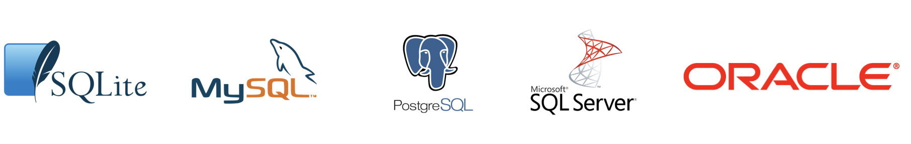
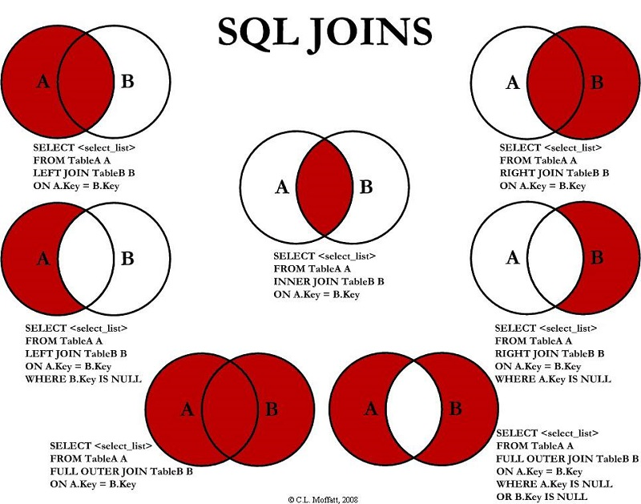

SQL es un lenguaje estructurado de consulta (Structured Query Language, en inglés). diseñado específicamente para administrar información en sistemas de gestión de bases de datos de tipo relacional.

Puede considerarse un lenguaje de programación como tal, ya que cuenta con uso de variables, tipos de datos, elementos condicionales y lógicos. Es el estandar de facto para la gestión de datos y permite:

-   Consultar, actualizar y reorganizar datos
-   Crear y modificar la estructura de datos
-   Controlar el acceso a los datos

El uso de este lenguaje es altamente imperativo para todo profesional que tenga por objetivo acceder a altos volumenes y/o datos complejos.

-   [SQL tutorial](https://www.w3schools.com/sql/)

La historia de SQL se origina en 1970 en un paper del Dr. E. F. Codd de los laboratorios de investigación de IBM, titulado "A Relational Model of Data for Large Shared Data Banks" donde propuso la representación de un modelo de datos como un conjunto de tablas. Y la vinculación entre ellas mediante relaciones, lo que se conoce actualmente como el modelo relacional.

Junto con lo anterior, también propuso un lenguaje llamado **DSL/Alpha** para manipular los datos en las tablas relacionadas. En los laboratorios de IBM crearon sobre este un lenguaje simplificado que denominaron SQUARE. Modificaciones posteriores derivaron en uno llamado **SEQUEL** cuyo nombre finalmente se acortó a **SQL**. Finalmente se transformó en un estándar de la industria en 1986 por la ANSI (American National Standards Institute), y ya lleva más de 40 años de uso con numerosas características añadidas desde entonces.

Las últimas actualizaciones en 2016 agregan nuevas características como la integración de tecnologías como XML y JSON, y la búsqueda de filas en base a un patrón definido por una expresión regular.

El núcleo central de SQL se utiliza en la gran mayoría de las bases de datos comerciales y de uso gratuito. Algunas compañías han realizado ajustes a SQL para adaptarlas de mejor manera a sus productos y originado por tanto versiones "mejoradas" de SQL, como ejemplo de ello PL/SQL de Oracle y Transact-SQL de Microsoft.

**SQL** no es un acrónimo de **S**tandard **Q**uery **L**anguage (en español "lenguaje estándar de consulta"), es mas bien un cortamiento de la palabra SEQUEL y es el lenguaje estandarizado para la realización de consultas, es decir la extracción de datos desde las bases de datos. Es estándar ya que se utiliza en la totalidad de las bases conocidas, ya sea en forma nativa o en alguna variante según el fabricante de la base de datos.

No es un lenguaje de programación propiamente tal, como lo son PHP, Python, Java o Javascript, por mencionar unos pocos. Esto debido a que presenta ciertas limitaciones. Este lenguaje define tanto los inputs com outputs que son ejecutadas por el motor de optimización de la base de datos.

Un ejemplo de SQL en el siguiente bloque de código:


```sql showLineNumbers
SELECT nombre, apellido, rut, edad, genero
FROM clientes
WHERE edad > 20 AND genero = 'M'
ORDER BY edad ASC
```
```

      Cell In[1], line 1
        SELECT nombre, apellido, rut, edad, genero
               ^
    SyntaxError: invalid syntax
```

Donde: **SELECT** permite elegir que campos (o columnas como nombre, apellido, rut, edad y genero) queremos mostrar, **FROM** nos indica desde que tabla (clientes) y donde están definidos los campos. **WHERE** permite especificar una condición (o filtro que queremos ejecutar sobre los datos resultantes) y **ORDER BY** nos permite obtener una lista ordenada por edad en forma ascendente.

Por tanto, el código anterior obtendrá una lista de los clientes mayores de 20 años de género masculino y entregará los resultados en forma ordenada de menor a mayor edad. La lista contendrá las variables de nombre, apellido, rut, edad y género en ese mismo orden.

SQL posee entornos específicos de uso. Posee funciones para la definición de las bases de datos (DDL), el control de acceso de usuarios (DCL), la gestión de las transacciones (TCL) y el más importante o más utilizados la manipulación de datos (DML) que posee las funciones para la obtención de los datos propiamente tal.


## Tipos de Datos


Los tipos de datos soportados lo son por la mayoría de los sistemas de bases de datos que soportan SQL, salvo algunas excepciones que son particulares a un sistema específico. Tomar en cuenta que PostgreSQL utiliza adicionalmente tipos geométricos y direcciones de redes.

Tipos de datos en PostgreSQL: [](https://www.postgresql.org/docs/13/datatype.html)

En general los tipos de datos manejados por SQL incluyen:

-   Numéricos
-   Moneda
-   Caracter
-   Binario
-   Fecha/hora
-   Lógicos (booleanos)
-   Enumerados
-   Geometricos
-   Redes
-   Bit String
-   Texto
-   UUID
-   XML
-   JSON
-   Arreglos
-   Compuestos (Composite)
-   Rangos
-   Identificadores de objetos


```sql showLineNumbers
SELECT CAST(123 AS DECIMAL(5,2)) --returns 123.00
SELECT CAST(12345.12 AS NUMERIC(10,5)) --returns 12345.12000
```


**Numéricos**

Los de tipo numéricos incluyen enteros y decimales con un almacenamiento desde -32768 a +32767 para "*smallint*", hasta +9223372036854775807 para un "*bigint*"

**Serial**

Los tipos serial (`serial, smallserial, bigserial` no son tipos efectivos sino una convención para anotar un identificador único auto incrementado). Se usa AUTO_INCREMENT en otras bases de datos.


```sql showLineNumbers
CREATE TABLE person (
    id SERIAL
)
```


***Char y varchar***


```sql showLineNumbers
CHARACTER VARYING(n), VARCHAR(n)
CHARACTER (n), CHAR(n)

SELECT CAST('ABC' AS CHAR(10)) 
-- 'ABC ' se completa con espacios a la izquierda
SELECT CAST('ABC' AS VARCHAR(10)) 
-- 'ABC' sin espacios
SELECT CAST('ABCDEFGHIJKLMNOPQRSTUVWXYZ' AS CHAR(10)) 
-- 'ABCDEFGHIJ' se trunca a 10 caracteres
```

***Arrays***


```sql showLineNumbers
-- declarando un arreglo
SELECT INTEGER[];
SELECT INTEGER[3]; 
SELECT INTEGER[][]; 
SELECT INTEGER[3][3]; 
SELECT INTEGER ARRAY; 
SELECT INTEGER ARRAY[3];

-- creando un arreglo

SELECT '{0,1,2}';
SELECT '{{0,1},{1,2}}';
SELECT ARRAY[0,1,2];
SELECT ARRAY[ARRAY[0,1],ARRAY[1,2]];
```

## Definición de Datos (DDL)

Este lenguaje esta orientado a la definición de las estructuras de datos dentro de la base de datos. Las estructuras son las tablas, índices, vistas, etc. Las funciones principales son CREATE, ALTER y DROP (crear, modificar y eliminar respectivamente).

#### CREATE

[Ver documentación oficial](https://www.postgresql.org/docs/current/sql-createtable.html)

Modo general de creación.


```sql showLineNumbers
CREATE [ [ GLOBAL | LOCAL ] { TEMPORARY | TEMP } | UNLOGGED ] 
TABLE [ IF NOT EXISTS ] table_name ( [
  { column_name data_type [ COMPRESSION compression_method ] 
  [ COLLATE collation ] [ column_constraint [ ... ] ]
    | table_constraint
    | LIKE source_table [ like_option ... ] }
    [, ... ]
] )
[ INHERITS ( parent_table [, ... ] ) ]
[ PARTITION BY { RANGE | LIST | HASH } ( { column_name | ( expression ) } 
[ COLLATE collation ] [ opclass ] [, ... ] ) ]
[ USING method ]
[ WITH ( storage_parameter [= value] [, ... ] ) | WITHOUT OIDS ]
[ ON COMMIT { PRESERVE ROWS | DELETE ROWS | DROP } ]
[ TABLESPACE tablespace_name ]
```

Crear una base de datos.


```sql showLineNumbers
CREATE DATABASE midb;
USE midb;
```

Crea las tablas de la base de datos "midb"


```sql showLineNumbers
CREATE TABLE mitabla ( id INT PRIMARY KEY, nombre VARCHAR(20) );
INSERT INTO mitabla VALUES ( 1, 'Sara' );
INSERT INTO mitabla VALUES ( 2, 'Sonia' );
INSERT INTO mitabla VALUES ( 3, 'Daniel' );
```


```sql showLineNumbers
-- Crea una tabla "persona"
CREATE TABLE person (
person_id BIGINT NOT NULL, 
last_name VARCHAR(255) NOT NULL, 
first_name VARCHAR(255),
age INT NOT NULL,
PRIMARY KEY (person_id)
);
```


```sql showLineNumbers
-- Alternativamente define la clave primaria en forma directa.
CREATE TABLE person (
person_id BIGINT NOT NULL PRIMARY KEY, 
last_name VARCHAR(255) NOT NULL, 
first_name VARCHAR(255),
address VARCHAR(255),
city VARCHAR(255)
);
```


-   `NOT NULL` - este parámetro asegurará que la columna no almacene un valor `NULL`

-   `UNIQUE` - este parámetro va a prevenir que la columna almacene el mismo valor más de una vez.

-   `UNIQUE KEY` - este parámetro designará la columna como un identificador único.

Crear una tabla a partir de otra existente. crea una nueva tabla a partir de los datos de "persona" con registros de personas que tengan sobre 30 años.


```sql showLineNumbers
CREATE TABLE people_over_30 AS SELECT * FROM persona WHERE edad > 30;
```

Crea un indice en la tbla films para el campo title


```sql showLineNumbers
CREATE UNIQUE INDEX title_idx ON films (title);
```

crea un indice basado en la expresion lower(title), lo que permite buscar en base a caracteres en minusculas -- aunque se hayan escrito en mayúsculas. Si se omitió el nombre del indice el sistema elegirá films_lower_idx.


```sql showLineNumbers
CREATE INDEX ON films ((lower(title)));
```


```sql showLineNumbers
--Crea un indice con una locacion determinada.
CREATE INDEX title_idx_spanish ON films (title COLLATE "es_ES");

-- Crea un indice con un ordenamiento determinado.
CREATE INDEX title_idx_nulls_low ON films (title NULLS FIRST);

-- crea un rol en la base de datos.
CREATE USER davide WITH PASSWORD 'jw8s0F4';

-- Crea un rol con una password valida hasta una fecha específica. Luego de esa fecha la password no tendrá validez.
CREATE ROLE miriam WITH LOGIN PASSWORD 'jw8s0F4' 
VALID UNTIL '2005-01-01';

-- Crea un rol que puede crear bases de datos y administrar roles.
CREATE ROLE admin WITH CREATEDB CREATEROLE;

-- Crear una vista nombrada "clientes_ventas".
CREATE VIEW clientes_ventas AS 
SELECT * FROM clientes
WHERE region = "RM";
```

#### ALTER

Modifica la estructura de una tabla sin suprimirla y volver a crearla, como añadir columnas, eliminar columnas o cambiar definiciones de columna (por ejemplo, longitud o los valores predeterminados).

[https://www.postgresql.org/docs/current/sql-altertable.html](https://www.postgresql.org/docs/current/sql-altertable.html)


```sql showLineNumbers

-- forma general
ALTER TABLE [ IF EXISTS ] [ ONLY ] name [ * ]
    action [, ... ]

ALTER TABLE [ IF EXISTS ] [ ONLY ] name [ * ]
    RENAME [ COLUMN ] column_name TO new_column_name

ALTER TABLE [ IF EXISTS ] [ ONLY ] name [ * ]
    RENAME CONSTRAINT constraint_name TO new_constraint_name

ALTER TABLE [ IF EXISTS ] name
    RENAME TO new_name

ALTER TABLE [ IF EXISTS ] name
    SET SCHEMA new_schema

ALTER TABLE ALL IN TABLESPACE name [ OWNED BY role_name [, ... ] ]
    SET TABLESPACE new_tablespace [ NOWAIT ]

ALTER TABLE [ IF EXISTS ] name
    ATTACH PARTITION partition_name { 
    FOR VALUES partition_bound_spec | DEFAULT }

ALTER TABLE [ IF EXISTS ] name
    DETACH PARTITION partition_name [ CONCURRENTLY | FINALIZE ]
```

Agrega una columna direccion a la tabla clientes, como resultado todos los registros tendran ese campo nulo.


```sql showLineNumbers
ALTER TABLE clientes ADD COLUMN direccion varchar(30);
```

Todos los registros existentes recibiran la fecha actual en el nuevo campo fecha los nuevos registros tendran la fecha en que se ingresen.


```sql showLineNumbers
ALTER TABLE clientes
ADD COLUMN fecha timestamp with time zone DEFAULT now();
```

Agregar una columa con un valor inicial que luego cambiará a otro valor para los nuevos registros. Los registros previamente existentes recibirán el valor 'old', en cambio los nuevos tendran el valor 'current'.


```sql showLineNumbers
ALTER TABLE ventas
ADD COLUMN status varchar(30) DEFAULT 'old',
ALTER COLUMN status SET default 'current';
```


```sql showLineNumbers
--Eliminar una columna de una tabla.
ALTER TABLE distributors DROP COLUMN address RESTRICT;

--Realizar cambio en dos columnas a la vez.
ALTER TABLE clientes
ALTER COLUMN direccion TYPE varchar(80),
ALTER COLUMN nombre TYPE varchar(100);

--Renombrar una columa o una tabla.
ALTER TABLE clientes RENAME COLUMN direccion TO ciudad;

ALTER TABLE clientes RENAME TO personas;

--Agregar una restriccion a una columna o remover una restricción.
ALTER TABLE clientes ALTER COLUMN calle SET NOT NULL;

ALTER TABLE clientes ALTER COLUMN calle DROP NOT NULL;

--Agregar una clave foránea a una tabla.
ALTER TABLE clientes ADD CONSTRAINT clidireccion 
FOREIGN KEY (direccion) REFERENCES direcciones (direccion);

--Agregar una clave primaria a un tabla.
ALTER TABLE clientes ADD PRIMARY KEY (cli_id);
```

#### DROP

Elimina objetos de la base de datos.


```sql showLineNumbers
-- elimina una tabla personas
DROP TABLE personas;

--Elimina la base de datos.
DROP DATABASE midb;

-- Elimina una vista llamada clientes_ventas.
DROP VIEW clientes_ventas;
```

#### TRUNCATE

Elimina los datos de una tabla sin alterar la estructura de la tabla.


```sql showLineNumbers
TRUNCATE TABLE clientes;
```

## Manipulación de Datos (DML)

Un lenguaje de manipulación de datos (Data Manipulation Language, o DML en inglés) es una parte del lenguaje SQL que incluido por el sistema de gestión de base de datos permite a los usuarios llevar a cabo las tareas de consulta o manipulación de los datos, organizados por el modelo de datos adecuado.

DML esta orientado por tanto a la interacción con los datos propiamente tales dentro de la base de datos. Esta interacción incluye la selección, inserción, actualización y eliminación de datos (registros dentro de una BD).

### SELECT

SELECT permite recuperar registros desde cero o más tablas. WHERE filtra los registros antes del agrupamiento y HAVING filtra los grupos creados por GROUP BY.

**SELECT en PostgreSQL**


```sql showLineNumbers
[ WITH [ RECURSIVE ] with_query [, ...] ] 
SELECT [ ALL | DISTINCT [ ON ( expression [, ...] ) ] ] * | 
expression [ [ AS ] output_name ] [, ...] 
[ FROM from_item [, ...] ] 
[ WHERE condition ] 
[ GROUP BY expression [, ...] ] 
[ HAVING condition [, ...] ] 
[ WINDOW window_name AS ( window_definition ) [, ...] ] 
[ { UNION | INTERSECT | EXCEPT } [ ALL ] select ] 
[ ORDER BY expression [ ASC | DESC | USING operator ] 
[ NULLS { FIRST | LAST } ] [, ...] ] [ LIMIT { count | ALL } ] 
[ OFFSET start [ ROW | ROWS ] ] [ FETCH { FIRST | NEXT } [ count ] 
{ ROW | ROWS } ONLY ] 
[ FOR { UPDATE | SHARE } [ OF table_name [, ...] ] 
[ NOWAIT ] [...] ]column2, ... 
FROM table_name;

SELECT f.title, f.did, d.name, f.date_prod, f.kind
    FROM distributors d, films f
    WHERE f.did = d.did

SELECT kind, sum(len) AS total
    FROM films
    GROUP BY kind
    HAVING sum(len) < interval '5 hours';

SELECT *  FROM T_CLIENTES;
SELECT *  FROM T_PEDIDOS;
SELECT *  FROM T_PRODUCTOS;
```

### INSERT

Realiza operaciones de ingreso de valores dentro de la tabla.


```sql showLineNumbers
INSERT INTO table_name VALUES (value1, value2, value3)

INSERT INTO table_name (column1, column2, column3,..) 
VALUES ( value1, value2, value3,..);

insert into UTILES  (codigo, descripcion, fecalta) 
values (1,'Lapiz',sysdate);
insert into UTILES  (codigo, descripcion, fecalta) 
values (2,'Goma',sysdate);
insert into UTILES  (codigo, descripcion, fecalta) 
values (3,'Sacapuntas',null);
insert into UTILES  values (4,'regla',sysdate);
insert into UTILES  values (5,'escuadra',null);
insert into UTILES  (codigo, descripcion)  
values (6,'transportador');
insert into UTILES  (descripcion, codigo)  
values ('compas',7);
insert into UTILES  (fecalta, codigo, descripcion ) 
values (sysdate, 8, 'estuche');
```

### BULK INSERT

Realiza operaciones de tipo INSERT desde archivos externos.

SQL Server 2016 en adelante


```sql showLineNumbers
BULK INSERT TableName FROM 'filePath’ 
WITH ( FORMAT = ‘CSV’, FIELDTERMINATOR = ‘,’, 
ROWTERMINATOR = '\n’, 
ROWS_PER_BATCH = 10000, FIRSTROW = 2, TABLOCK );
```

### UPDATE

La sentencia UPDATE es utilizada para actualizar los datos de una tabla existente dentro de la base de datos.

Se pueda actualizar desde una a varias columnas según se requiera. Si se omite la claúsula WHERE, el comando afecta a todos los registros de la tabla.


```sql showLineNumbers
UPDATE estudiantes SET NAME = 'PRATIK' WHERE id = 20;

UPDATE table_name SET column1 = value1, column2 = value2 
WHERE condition;
```

donde: + table_name: nombre de la tabla + columnN: nombre de la columna + valueN: nuevo valor de la columna + condition: condición requerida para seleccionar las filas que deben ser actualizadas.

UPDATE nombre_tabla 
SET nombre_columna = valor  
[ WHERE condición [ AND condición] ]  

UPDATE UTILES SET  descripcion =  ‘Regla 30 cm’ 
  WHERE  codigo= 4;
  
UPDATE UTILES SET  fecalta =  sysdate;

UPDATE utiles SET fecalta = sysdate, descripcion=‘regla 30 cm.’ 
  WHERE código = 4;

### DELETE

Realiza operaciones de eliminación de registros desde las tablas.


```sql showLineNumbers
DELETE FROM nombre_tabla 
WHERE nombre_columna = valor

DELETE FROM personas 
WHERE nombre = 'LUIS' AND apellido1 = 'LOPEZ' 
AND apellido2 = 'PEREZ'

DELETE nombre_tabla 
[ WHERE condición [ AND condición] ]

delete UTILES WHERE  codigo= 7;
delete UTILES;
```

### Ejemplos

En el primer ejemplo de código, se devuelven todas las filas (no se especifica la cláusula WHERE) y todas las columnas (con \*) de la tabla Product de la base de datos AdventureWorks2012.


```sql showLineNumbers
USE AdventureWorks2012;
GO
SELECT *
FROM Production.Product
ORDER BY Name ASC;

USE AdventureWorks2012;
GO
SELECT p.*
FROM Production.Product AS p
ORDER BY Name ASC;
GO


--Selecciona los primeros 5 registros de ordenes.
SELECT * FROM ordenes LIMIT 5;

--Cuenta de los distintos productos desde ventas.
SELECT count(distinct idproducto)
FROM ventas;

--Las ventas realizadas del producto id=89
SELECT idproducto, sum(cantidad) as total
FROM ventas
WHERE idproducto = 89;

--Seleccionar el titulo y el año de estreno de las películas emitidas en 
--1990 y 2000 y con una duración mayor a dos horas.
SELECT titulo, year
FROM peliculas
WHERE year IN (1990,2000)
AND duracion > 120

--Selección del titulo e idioma de las películas con idioma ingles, 
--español o francés.
SELECT titulo, idioma
FROM peliculas
WHERE idioma IN ('English', 'French', 'Spanish')

--todos los detalles de las películas en español estrenadas después del 2000, 
--pero antes del 2010
SELECT * FROM peliculas
WHERE idioma = 'Spanish'
AND year > 2000 
AND year < 2010

--Obtener el porcentaje de personas que ya no están vivas. Alias el resultado como porcentaje_muerto. ¡Recuerda usar 100.0 y no 100!.
SELECT (count(muerte)*100.0)/count(*) AS porcentaje_muerto
FROM persona

--Seleccionar el número de años entre la película mas vieja y la mas nueva. establezca el resultado como 'diferencia'.
SELECT max(year) - min(year) AS diferencia 
FROM peliculas

```

Todos los registros puede implicar además extraer toda la información de cada variable (columna) de una tabla determinada. El siguiente fragmento extrae toda la información de la tabla clientes, sin filtro de ningún tipo.


```sql showLineNumbers
SELECT * FROM clientes

--Los clientes de Concepción (condición simple).
SELECT * 
FROM clientes 
WHERE ciudad = 'Concepción'

--subconjunto de columnas (información parcial).
SELECT nombre, apellido, cargo, correo 
FROM clientes

--Condición múltiple.
SELECT * 
FROM clientes 
WHERE ciudad = 'Concepción' AND edad >= 45
AND fecha IS NOT NULL

--Condición múltiple con OR.
SELECT * 
FROM clientes 
WHERE (ciudad = 'Concepción' AND edad >= 45 OR estado = TRUE)
AND fecha IS NOT NULL
```

### Ejemplos de agregaciones


```sql showLineNumbers
--El total de productos vendidos.
SELECT sum(cantidad)
FROM ventas;

--La mayor cantidad de venta de un producto.
SELECT max(cantidad)
FROM ventas;

--Total de unidades vendidas por producto (los primeros 5 más vendidos).
SELECT idproducto, sum(cantidad) as total
FROM ventas
GROUP BY idproducto
HAVING cantidad > 0
ORDER BY total DESC
LIMIT 5;

--Cuantas consultas por usuario medico (simple).
SELECT count(idmedico), ex_idm as medicos 
FROM consultas c 
GROUP BY idmedico

--Lista de edades y cantidad de pacientes para cada edad.
SELECT DISTINCT count(*),pa_edad 
FROM bio_pacientes bp GROUP BY pa_edad
ORDER BY pa_edad

--Encontrar la mayor diferencia en el total de puntajes de todas las tareas. Mostrar la diferencia.
SELECT MAX(puntaje)-MIN(puntaje) AS diferencia 
FROM
  (SELECT student,
          SUM(tarea1 + tarea2 + tarea3) AS puntaje
   FROM clase_puntajes
   GROUP BY student) a;
```

El promedio de la compensación según el cargo y el género del empleado. La compensación se calcula agregando el salario y el bono de cada empleado. No todos los empleados reciben el bono. Un empleado puede recibir más de un bono.


```sql showLineNumbers
SELECT e.employee_title, e.sex,
AVG(e.salary + b.ttl_bonus) AS avg_compensation 
FROM sf_employee e
INNER JOIN
  (SELECT worker_ref_id,
          SUM(bonus) AS ttl_bonus
   FROM sf_bonus
   GROUP BY worker_ref_id) b ON e.id = b.worker_ref_id 
GROUP BY employee_title, sex;

--Número de tiendas abierta en domingo.
SELECT sunday, COUNT(*) AS total_business
FROM yelp_business_hours bh
LEFT JOIN yelp_business b ON bh.business_id = b.business_id
WHERE sunday IS NOT NULL
AND is_open = 1
GROUP BY sunday
ORDER BY total_business DESC;

--Total de ventas de Alicia y Renato.
SELECT SUM(ventas) AS total_ventas FROM ventas_general
WHERE vendedor = 'Alicia' OR vendedor = 'Renato'
```

#### Categorías on CASE

Define un serie de categorías en base al precio. Crea una nueva columna 'nivel' con la categoría evaluada.


```sql showLineNumbers
SELECT id, articulo, precio,
  CASE precio WHEN < 500  THEN 'BAJO'
             WHEN < 15000 THEN 'NORMAL'
             ELSE 'AlTO'
  END as nivel
FROM ventas


--Contabilizar cuantos productos estan en nivel ALTO.
SELECT
    COUNT(Id) AS itemes,
    SUM ( CASE
         WHEN nivel = 'ALTO' THEN 1
          ELSE 0 END
        ) AS itemes_altos
FROM ventas
```


### Registros duplicados

Uno de los problemas más acuciantes en el análisis de datos tiene que ver con este tema.


```sql showLineNumbers
SELECT max(pa_id), pa_apellido,pa_nombre, COUNT(pa_id) AS NumOccurrences
FROM bio_pacientes
GROUP BY pa_apellido, pa_nombre
HAVING ( COUNT(pa_id) > 1 )

--Alternativa.
SELECT nombre, rut, COUNT(*) AS registros
FROM clientes
GROUP BY nombre, rut
HAVING ( COUNT(*) > 1 ) 

--full detalle de cuales registros tienen duplicados
SELECT * FROM
    (
    SELECT column_a, column_b, column_c, count(*) as records 
    FROM tabla1
    GROUP BY 1,2,3
   ) a
WHERE records = 2

--listar los registros duplicados en base a una columna determinada (col_1).
SELECT id, col_1, col_2
FROM (  SELECT  *, 
                COUNT(*) OVER(PARTITION BY col_1) N
        FROM codigos) as A
WHERE N > 1


--Eliminar solo los duplicados.
DELETE FROM tabla1
WHERE NOT campo IN 
(select max(campo) 
FROM tabla1 GROUP BY campo)

-- alternativa
DELETE FROM tabla_1 a USING (
SELECT MIN(ctid) as ctid, key
    FROM tabla_1 
    GROUP BY key HAVING COUNT(*) > 1
    ) b
WHERE a.key = b.key 
AND a.ctid <> b.ctid


--En MySQL mediante una tabla temporal donde se registran los duplicados.
CREATE temporary TABLE temp_table (id int);
INSERT temporal_table
        (id)
SELECT id
FROM your_table t1
WHERE EXITS
        (
        SELECT *
        FROM your_table t2
        WHERE t2.col_1 = t1.col_1
            and t2.col_2 = t1.col_2
            and t2.col_3 = t1.col_3
            and t2.id > t1.id
        );

-- ahora se compara ambas tablas para eliminar los duplicados
DELETE
FROM your_table
WHERE id in (SELECT id FROM temporal_table);
```

### Operadores lógicos
Se basan en cumplir una condición que se evalua verdadero o falso.


```sql showLineNumbers
--Ambas condiciones deben cumplirse.
SELECT *
FROM clientes 
WHERE nacimiento > ‘1995-01-01’ AND puntos > 1000

--Al menos una condición debe cumplirse.
SELECT *
FROM clientes 
WHERE nacimiento > ‘1995-01-01’ OR puntos > 1000

--Negar cierta condición.
SELECT *
FROM clientes 
WHERE NOT (nacimiento > ‘1995-01-01’)

--Clientes de alguna de las categorías.
SELECT *
FROM clientes 
WHERE estado IN ('A', 'B', 'C', 'D')

--Entre un rango de fechas o números.
SELECT *
FROM clientes 
WHERE puntos BETWEEN 1000 AND 5000
```

### Subconsultas

Distribución de ordenes por cliente.


```sql showLineNumbers
SELECT orders, count(*) as num_customers 
FROM
(
   SELECT customer_id, count(order_id) as orders 
   FROM orders
   GROUP BY 1
) a
GROUP BY 1
```


```sql showLineNumbers
-- Conocer el producto mas caro.

SELECT nombre, codigo, precio
FROM productos
WHERE precio=(SELET max(precio) FROM productos)
```

Las subconsultas que retornan un solo valor escalar se utiliza con un operador de comparación o en lugar de una expresión


```sql showLineNumbers
SELECT CAMPOS
FROM TABLA
WHERE CAMPO OPERADOR (SUBCONSULTA)

SELECT CAMPO OPERADOR (SUBCONSULTA)
FROM TABLA
```


```sql showLineNumbers
-- Conocer el valor de un artículo determinado ('pesa') y la diferencia con el artículo mas costoso.

SELECT articulo, precio,
precio - (SELECT max(precio) FROM libros) as diferencia
FROM productos
WHERE articulo = 'pesa'

-- Actualizamos el precio del producto con el valor mayor:.

UPDATE productos SET precio=45
WHERE valor = (SELECT max(valor) FROM productos)
```


#### Pivot

Una tabla de pivoteo es una manera de resumir datos en forma de filas y columnas. Dado por los atributos de una columna donde la intersección de fila y columna se utiliza un valor de tipo estadístico como suma , cuenta o promedio. Cuadro resumen de las ventas de cada producto por fecha.


```sql showLineNumbers

SELECT fecha, 
sum(case WHEN product = 'polera' THEN monto ELSE 0 END) as poleras,
sum(case WHEN product = 'camisa' THEN monto ELSE 0 END) as camisas,
sum(case WHEN product = 'zapato' THEN monto ELSE 0 END) as zapatos
FROM ordenes
GROUP BY 1

--Promedio de valor de propiedades por comuna y numero de dormitorios.

SELECT comuna,
   avg(valor) FILTER (WHERE dormitorio = 1) AS "1",
   avg(valor) FILTER (WHERE dormitorio = 2) AS "2",
   avg(valor) FILTER (WHERE dormitorio = 3) AS "3",
   avg(valor) FILTER (WHERE dormitorio = 4) AS "4"
FROM propiedades
GROUP BY comuna;

SELECT * FROM   
(
    SELECT 
        category_name, 
        product_id
    FROM 
        production.products p
        INNER JOIN production.categories c 
            ON c.category_id = p.category_id
) t 
PIVOT(
    COUNT(product_id) 
    FOR category_name IN (
        [Children], 
        [Comfort], 
        [Cruisers], 
        [Cyclocross], 
        [Electric], 
        [Mountain], 
        [Road])
) AS pivot_table;


--Agregando el año del modelo.
SELECT * FROM   
(
    SELECT 
        category_name, 
        product_id,
        model_year
    FROM 
        production.products p
        INNER JOIN production.categories c 
            ON c.category_id = p.category_id
) t 
PIVOT(
    COUNT(product_id) 
    FOR category_name IN (
        [Children], 
        [Comfort], 
        [Cruisers], 
        [Cyclocross], 
        [Electric], 
        [Mountain], 
        [Road])
) AS pivot_table;


--En PostgreSQL se requiere habilitar la función tablefunc (`CREATE` `extension tablefunc;`) para utilizar crosstab.

--Seleccionar el puntaje obtenido de cada alumno en cada examen.

SELECT * 
FROM crosstab(
'SELECT nombre, examen, puntaje 
 FROM examenes ORDER BY 1,2')
AS notas (nombre varchar(15),examen1 int, examen2 int, 
examen3 int, examen4 int);
```


### Series de tiempo

Los análisis de series de tiempo es un tipo común de necesidad de análisis de datos, según necesitamos conocer el comportamiento de una característica en el tiempo, ya sean ventas de productos, ingresos, etc.

La característica principal es el tiempo el que debe ser en formato date o timestamp.

Las funciones generales para manejo de iempo son date_part o extract **date_part**('periodo', variable) **extract**('periodo' from variable) donde variable en nuestro columna en formato timestamp y periodo puede ser:

-   microsecond
-   millisecond
-   second
-   minute
-   hour
-   day
-   week
-   month
-   quarter
-   year
-   decade
-   century
-   millennium

Cuadro comparativo de ventas de cada articulo segun fecha de venta. Esto alimenta un gráfico de comparación de cada producto.


```sql showLineNumbers

SELECT date_part('year', fecha) as anual, productos, 
sum(venta) as total
FROM ventas
WHERE productos IN ('camisa','pantalon','zapato', 'juego')
GROUP BY 1,2

--Cálculo de la diferencia entre 2 áreas de ventas, secciones masculina y femenina.

SELECT date_part('year',sales_month) as ventas_year,
sum(CASE WHEN kind_of_business = 'Mujer' THEN ventas end) 
as venta_mujer,
sum(CASE WHEN kind_of_business = 'Hombre' THEN ventas end) 
as venta_hombre
FROM ventas
WHERE tipo_seccion IN ('Hombre', 'Mujer')
GROUP BY 1

--Cálculo de la diferencia entre 2 áreas de ventas, secciones masculina y femenina.

SELECT ventas_year, 
    venta_mujer - venta_hombre as womens_minus_mens,
    venta_hombre - venta_mujer as mens_minus_womens 
FROM (
    SELECT date_part('year',sales_month) as ventas_year,
    sum(CASE WHEN kind_of_business = 'Mujer' THEN ventas end) 
    as venta_mujer,
    sum(CASE WHEN kind_of_business = 'Hombre' THEN ventas end) 
    as venta_hombre
    FROM ventas
    WHERE tipo_seccion IN ('Hombre', 'Mujer')
    GROUP BY 1
) a
```

### Uniones (JOIN)



La herramienta más potente en el modelo relacional. Las sentencias JOIN permiten el uso de datos provenientes de dos o más tablas utilizando como conector entre ellas una columna cómun. Esta columna debe ser del mismo tipo de datos, y generalmente es la clave primaria de ellas (aunque no necesariamente).

#### LEFT JOIN

LEFT JOIN o LEFT OUTER JOIN obtiene todos lod datos de la primera tabla (o tablaba izquierda), y solamenta las filas que coinciden desde la segunda tabla (o tabla derecha). en caso de no haber coincidencias desde esta última tabla muestra solo valores nulos.

Recuperando filas desde una tabla que no poseen correspondencia de filas a otra tabla y mantiene solo las filas que no corresponden (anti-join).


```sql showLineNumbers
SELECT d.*
FROM departamentos d LEFT OUTER JOIN empleados e
ON (d.depto = e.depto)
WHERE e.deptno is null
```


Seleccionar registros de dos tablas y luego correlacionar con una tercera tabla. empleados y departamentos y bono entregado (no todos los empleados reciben bono).


```sql showLineNumbers
SELECT e.ename, d.loc, eb.bono
FROM empleados e 
JOIN departamentos d ON (e.deptno=d.deptno)
LEFT JOIN bonos eb ON (e.empno=eb.empno)
ORDER BY 2
```


Seleccionar registros de dos tablas y luego correlacionar con una tercera tabla. empleados y departamentos y bono entregado (no todos los empleados reciben bono)


```sql showLineNumbers
SELECT e.ename, d.loc,
    (SELECT eb.bono FROM bonos eb
         WHERE eb.empno=e.empno) as bono
FROM empleados e, departamentos d
WHERE e.deptno=d.deptno
```


```sql showLineNumbers
-- Clientes sin ordenes de compra.

SELECT distinct a.cliente_id
FROM transacciones a
LEFT JOIN clientes b ON a.cliente_id = b.cliente_id 
WHERE b.cliente_id IS NULL

--Cuantos pacientes hay de cada comuna.

SELECT count(*) cantidad, co_id codigo, co_comuna as comuna 
FROM pacientes p
LEFT JOIN comunas c on (p.pa_comuna = c.co_id)
WHERE pa_comuna !='00000'
GROUP BY co_id, pa_comuna
ORDER BY cantidad DESC;

--Cuantas consultas por usuario medico (completo).

SELECT count(ex_idm),md_nombre||' '||md_apellido , ex_idm as medicos 
FROM consultas c 
LEFT JOIN medicos ON (ex_idm=md_id)
GROUP BY ex_idm, md_nombre||' '||md_apellido
```

#### INNER JOIN

INNER JOIN o JOIN regresa solamente los registros coincidentes en ambas tablas.


```sql showLineNumbers
-- sentencia general

SELECT *
FROM table_1
INNER JOIN table_2
ON table_1.column_name = table_2.column_name

-- forma simplificada

SELECT * FROM table_1 JOIN table_2
ON table_1.column_name = table_2.column_name

-- Detalles de orden y producto.

SELECT a.*,b.* 
FROM ventas as a 
INNER JOIN 
productos as b 
ON a.idproducto = b.idproducto
```


Encontrar el total de camas (beds) por nacionalidad dentro de los registros de Airbnb, en las tablas airbnd_apartments con airbnd_hosts mediante la columna relacionada "host_id".


```sql showLineNumbers
SELECT nationality, SUM(n_beds) AS total_beds_available
FROM airbnb_hosts h
INNER JOIN airbnb_apartments a ON h.host_id = a.host_id 
GROUP BY nationality
ORDER BY total_beds_available DESC;
```

Esta consulta devolverá los datos de la tabla 1 cuyos campos coincidan con los de la tabla2 con una clave y los datos que no estén en la tabla 1 al compararlos con la tabla2 con una condición y una clave.


```sql showLineNumbers
select *
from Table1 t1
inner join Table2 t2 on t1.ID_Column = t2.ID_Column
left join Table3 t3 on t1.ID_Column = t3.ID_Column 
where t2.column_name = column_value
and t3.ID_Column is null order by t1.column_name;
```

#### OUTER JOIN

**LEFT OUTER JOIN**

Devuelve todas las filas de la tabla izquierda, emparejadas con las filas de la tabla derecha en las que se cumplen las condiciones de la cláusula ON. Las filas en las que no se cumple la cláusula ON tienen NULL en todas las columnas de la tabla derecha

```
SELECT * FROM table_1 AS t1
LEFT JOIN table_2 AS t2 ON t1.ID_Column = t2.ID_Column
```

**RIGHT OUTER JOIN**

Devuelve todas las filas de la tabla derecha, emparejadas con las filas de la tabla izquierda en las que se cumplen las condiciones de la cláusula ON. Las filas en las que no se cumple la cláusula ON tienen NULL en todas las columnas de la tabla izquierda.

```
SELECT * FROM table_1 AS t1
RIGHT JOIN table_2 AS t2 ON t1.ID_Column = t2.ID_Column
```

**FULL OUTER JOIN**

Se devuelven todas las filas de ambas tablas, independientemente de que se cumplan las condiciones de la cláusula ON. Las filas que no satisfacen la cláusula ON se devuelven con NULL en todas las columnas de la tabla opuesta (es decir, para una fila de la tabla izquierda, todas las columnas de la tabla derecha contendrán NULL, y viceversa).

```
SELECT * FROM table_1 AS t1
FULL JOIN table_2 AS t2 ON t1.ID_Column = t2.ID_Column
```

#### SELF JOIN

Una tabla puede unirse a sí misma en lo que se conoce como autounión, donde combina registros de la tabla con otros registros de la misma tabla. Estas autouniones suelen utilizarse en consultas en las que se define una jerarquía en las columnas de la tabla.


```sql showLineNumbers

--Lista de empleados con sus respectivos jefes desde la tabla de empleados.
SELECT empleados.Name, jefes.Name AS jefe
FROM empleados
INNER JOIN empleados AS jefes
ON empleados.Boss_ID = jefes.ID
```

#### UNION

Apilando registros de 2 o mas tablas. Deben tener las mismas cantidad de columnas y tipo de dato. Incluye los duplicados si existen.


```sql showLineNumbers
SELECT nombre, departamento
FROM empleados
WHERE deptno = 20
UNION ALL
    SELECT deptnombre, deptno
    FROM departamentos
    UNION ALL
        SELECT '++++', NULL
        FROM tabla1

--No se incluyen los duplicados.
SELECT nombre, departamento
FROM empleados
WHERE deptno = 20
UNION
    SELECT deptnombre, deptno
    FROM departamentos
    UNION
        SELECT '++++', '++++'
        FROM tabla1


--Seleccionar las filas de dos o más tablas combinando la información de varias columnas.
SELECT e.ename, d.loc,
FROM empleados e, departamentos d
WHERE e.deptno = d.deptno
AND deptno = 10

-- alternativa
SELECT e.ename, d.loc,
FROM empleados e INNER JOIN departamentos d
ON (e.deptno = d.deptno)
WHERE deptno = 10


--Encontrar filas iguales entre 2 tablas, esto es filas similares en valores.
SELECT col1,col2,col3,col4,col5
FROM tabla1
WHERE (col2,col3,col4) in (
    SELECT col2,col3,col4 FROM tabla1
    INTERSECT
    SELECT col2,col3,col4 FROM tabla2
)

-- version alternativa
SELECT e.empno,e.ename,e.job,e.sal,e.deptno
FROM tabla1 e JOIN tabla2
ON (e.ename = v.ename
and e.job = v.job
and e.sal = v.sal )

--Actualizar en base a un join.
UPDATE usuarios AS u 
SET rute = r.rut, id=r.idf,
passwd=md5(substring(r.rut from 1 for 4))
FROM ruts AS r
WHERE u.id = r.ido 
```

## Control de Datos (DCL)

Son una colección de comandos destinados al control del acceso a los objetos y estructuras de la base de datos. Los comandos utilizados son GRANT y REVOQUE (otorgar y denegar respectivamente).

**Grant** define los privilegios de acceso a los diversos objetos dentro de la base de datos. El estándar SQL no permite establecer los privilegios en más de un objeto por comando.

**Revoque** elimina los permisos otorgados previamente por GRANT.

Los privilegios son:

-   `SELECT`
-   `INSERT`
-   `UPDATE`
-   `DELETE`
-   `TRUNCATE`
-   `REFERENCES`
-   `TRIGGER`
-   `CREATE`
-   `CONNECT`
-   `TEMPORARY`
-   `EXECUTE`
-   `USAGE`

### Ejemplos


```sql showLineNumbers

-- forma general de GRANT
GRANT { { SELECT | INSERT | UPDATE | DELETE | TRUNCATE | 
    REFERENCES | TRIGGER }
    [, ...] | ALL [ PRIVILEGES ] }
    ON { [ TABLE ] table_name [, ...]
         | ALL TABLES IN SCHEMA schema_name [, ...] }
    TO role_specification [, ...] [ WITH GRANT OPTION ]
    [ GRANTED BY role_specification ]


--Otorga pivilegios de ingreso a todos los usuarios para la tabla films:
GRANT INSERT ON films TO PUBLIC;

--Otorga todos los privilegios al usuario manuel en la tabla clientes.
GRANT ALL PRIVILEGES ON clientes TO manuel;

--Permite la membresia en el grupo admins al usuario manuel
GRANT admins TO manuel;

--Forma general de REVOQUE.
REVOKE [ GRANT OPTION FOR ]
    { { SELECT | INSERT | UPDATE | DELETE | TRUNCATE | 
    REFERENCES | TRIGGER }
    [, ...] | ALL [ PRIVILEGES ] }
    ON { [ TABLE ] table_name [, ...]
         | ALL TABLES IN SCHEMA schema_name [, ...] }
    FROM role_specification [, ...]
    [ GRANTED BY role_specification ]
    [ CASCADE | RESTRICT ]


--Revoca el privilegio de insertar para el el usuario public en l atabla films
REVOKE INSERT ON films FROM PUBLIC; 

--Revoca todos los privilegios al usuario manuel para la tabla clientes.
REVOKE ALL PRIVILEGES ON clientes FROM manuel;

--Revoca la membresia del grupo admins al usuario manuel
REVOKE admins FROM manuel;
```

## Control de Transacciones (TCL)

Una transacción es una agrupación de acciones que se comportan como una unidad. Estas deben cumplir 4 propiedades fundamentales conocidas como ACID (atomicidad, coherencia, asilamiento y durabilidad).

-   **Atomicidad**: Una transacción es indivisible, o se ejecutan todas la sentencias o no se ejecuta ninguna.

-   **Consistencia**: Después de una transacción la base de datos estará en un estado válido y consistente.

-   **Aislamiento**: Cada transacción está aislada del resto de transacciones y que el acceso a los datos se hará de forma exclusiva. Si una transacción que quiere acceder de forma concurrente a los datos que están siendo utilizados por otra transacción, no podrá hacerlo hasta que la primera haya terminado.

-   **Durabilidad**: Los cambios que realiza una transacción sobre la base de datos son permanentes.

Una sentencia simple de SQL es una transacción autocompletada (autocommit)


```sql showLineNumbers
UPDATE Products SET UnitPrice=20 WHERE ProductName ='Chai'
```

Este tipo de sentencias se escriben en el fichero de transacciones de la base de datos y se realizan los cambios en la base de datos. En caso de problemas algunos motores de datos automaticamente retornan al estado anterior.

Cuando se deben generar varias sentencias como parte de un proceso es necesario ejercer control sobre estas acciones. Es decir debe cumplirse el todo o nada.

### Ejemplos


```sql showLineNumbers

-- mysql
START TRANSACTION;
UPDATE cuentas SET saldo = saldo - 100 WHERE id = 1;
UPDATE cuentas SET saldo = saldo + 100 WHERE id = 2;
COMMIT;

-- postgresql
BEGIN TRANSACTION;
UPDATE cuentas SET saldo = saldo - 100 WHERE id = 1;
UPDATE cuentas SET saldo = saldo + 100 WHERE id = 2;
COMMIT;

--Estableciendo un punto de retorno en my_savepoint en caso de error.
BEGIN;
UPDATE accounts SET balance = balance - 100.00
    WHERE name = 'Alice';
SAVEPOINT my_savepoint;
UPDATE accounts SET balance = balance + 100.00
    WHERE name = 'Bob';
-- oops ... forget that and use Wally's account
ROLLBACK TO my_savepoint;
UPDATE accounts SET balance = balance + 100.00
    WHERE name = 'Wally';
COMMIT;
```

## Procedimientos

Los procedimientos[^09-sql-2], más comunmente conocidos como procedimientos almacenados (Store Procedure) son un conjunto de instrucciones destinados a ejecutar un proceso específico. Estos pueden aceptar parámetros de entrada y salida, y pueden devolver ya sea un valor o un conjunto de registros. Los motores más utilizados de bases de datos como Oracle, MySQL, PostgreSQL y otros, permiten el uso de estos procedimientos.

[^09-sql-2]: Documentación completa en su sitio oficial [**ver enlace**](https://www.postgresql.org/docs/15/sql-createprocedure.html)

En cada petición SQL se establece una comunicación entre el cliente que genera el SQL y el servidor que traduce esta petición para generar los resultados esperados y los transmite por la red hacia el cliente, cada petición entonces generará más tráfico. Una forma de reducir este tráfico y que varias interacciones se generen dentro del servidor antes de entregar el resultado final al cliente es mediante el uso de procedimientos almacenados (PA).

Como el PA se ejecuta en el servidor de base de datos, todas las instrucciones se ejecutan directamente en el servidor y una vez obtenidos los resultados estos son enviados al cliente. Además, si se realiza un cambio al PA este se activará para todos los clientes que lo utilicen, centralizando la lógica empresarial de la base de datos.

Estos PA entonces tienen la función primordial de hacer más eficiente el uso de la base de datos, ya que podemos generar una serie de procesos encadenados que se activen dentro del servidor, en lugar de realizar estos procesos uno a uno, donde cada proceso además significa una interrelación cliente y servidor lo que conlleva a un mayor tráfico de datos y tiempo.

Los PA se pueden escribir en variadod lenguajes de programación, esto depende del motor utilizado, PostgreSQL admite: : PL/pgSQL, PL/Perl, PL/Tcl y PL/Python

El lenguaje disponible automáticamente en PostgreSQL es PL/pgSQL. Para utilizar PL/Perl, PL/Tcl o PL/Python tiene que ser configurado o compilado en PostgreSQL con estos parámetros `--with-perl` `--with-tcl` `--with-python`.

Tambien existen muchos otros lenguajes disponibles como módulos adicionales, como, PL/Java, PL/PHP, PL/R, PL/Ruby, PL/Sheme y PL/sh. Para su uso deben descargarse e instalarse en forma individual.

El lenguaje de procedimientos [^09-sql-3] es similar al PL/SQL de Oracle y esta disponible por defecto en cada instalación de PostgreSQL. Se utiliza para:

[^09-sql-3]: Para una referencia completa de este lenguaje [**ver este enlace**](https://www.postgresql.org/docs/current/plpgsql.html).

-   Creación de procedimientos, funciones y disparadores
-   Generar estructuras de control
-   Realización de operaciones y cálculos complejos

Este lenguaje es estructurado en forma de bloques.


```sql showLineNumbers
CREATE [ OR REPLACE ] FUNCTION 
nombre_funcion([  [ argnombre ] argtipo ]) 
RETURNS tipo AS $$

[ DECLARE ]
 [ declaraciones de variables ]

BEGIN
  codigo  
END;
$$ LANGUAGE plpgsql
   | IMMUTABLE | STABLE | VOLATILE
   | CALLED ON NULL INPUT | RETURNS NULL ON NULL INPUT | STRICT
   | [ EXTERNAL ] SECURITY INVOKER | [ EXTERNAL ] SECURITY DEFINER
   | COST execution_cost
   | ROWS result_rows
   | SET configuration_parameter { TO value | = value | FROM CURRENT }
;
```

**Nota**. Cuando se crea un PA para reemplazar uno existente, los permisos y autoría del PA no son alterados. Por tanto se debe tener permisos de propietario para reemplazarlo.

**Nota**. Al reemplazar un PA existente no pueden cambiarse los nombres de sus argumentos o sus tipos. De lo contrario se creará un nuevo PA. Por tanto, pueden existir PA con el mismo nombre pero que difieren en sus argumentos (en nombre y/o tipo).


```sql showLineNumbers
CREATE OR REPLACE FUNCTION ejemplo(integer) 
RETURNS integer AS $$
BEGIN
 RETURN $1;
END;
$$ LANGUAGE plpgsql;
```

#### Para qué procedimientos almacenados?

En primer lugar para mejorar el rendimiento de la aplicación. Cada ejecución se realiza en el servidor de la base de datos sin interacción con el cliente ni tener que procesar resultados intermedios.

Para simplificar la aplicación. Al delegar algunas funciones dentro de la base de datos y ahorrar por tanto complejidad en el desarrollo de la aplicación. Al tener la lógica de proceso dentro de la base de datos, esta se aplicará en forma independiente a la aplicación utilizada desde el lado del cliente. Por tanto nuestra capacidad de conocer a cabalidad nuestro motor de datos puede permitir alivianar muchas tareas complejas en la aplicación cliente.

**NOTA**: El lado negativo de esta propuesta reside en que al vincular ciertos procesos a la base de datos utilizada, condiciona que la aplicación cliente debe mantenerse vinculada a esta y no podrá fácilmente ser utilizada con otro motor de datos.

Cuando tenemos relaciones entre tablas con la condición ON CASCADE, en que si eliminamos un registro en una tabla, posiblemente podemos eliminar a su vez los registros asociados en otra tabla y así sucesivamente. Pero con PA podemos establecer nuevas rutinas de relaciones: podremos establecer que al actualizar un registro de una tabla se realicen operaciones aritméticas en otros registros asociados, eliminar algunos, actualizar otros, y así sucesivamente. El cielo es el límite o nuestra capacidad de manejar procesos complejos, lo que ocurra primero.

### Ejemplos


```sql showLineNumbers

-- el tipico Hola mundo SQL Server
CREATE PROCEDURE HolamundoProcedure
AS
PRINT 'Hola mundo'

-- ejecutarlo...
exec HolamundoProcedure

--Creación de un PA en SQL Server.
--PA que toma el nombre de un autor para retornar una frase del tipo:
-- "Baldomero Lillo es de Chile""

CREATE PROCEDURE GetNombre
(
  @input_id INT = NULL,     
  @name VARCHAR(128) = NULL 
AS 
BEGIN
  SELECT Name + ' es de ' + Country 
  FROM Autores
  WHERE Id = @input_id OR Name = @name
END 
GO

-- llamada al PA
EXECUTE GetName @id = 1
ó
EXEC Getname @name = 'Baldomero Lillo'

--Creación de un PA en PostgreSQL.
CREATE OR REPLACE PROCEDURE DeleteItem
(
  item INT
)
LANGUAGE plpgsql AS
$$
BEGIN
  DELETE FROM  table_itemes WHERE id_item = item;
END
$$

-- llamada al procedimiento
CALL DeleteItem(4)
```

## Funciones

A diferencia de los procedimientos almacenados, las funciones siempre deben devolver un valor, y tiene solo parámetros de entrada y una cláusula de retorno que debe estar declarado en el encabezado.

Las funciones son seguras al estar dentro de la base de datos, de manera que oculta detalles a la aplicación.

Formato de declaración de funcion. entre \[\] indica opcional.


```sql showLineNumbers
CREATE [OR REPLACE] 
FUNCTION nombre_de_funcion(argumento IN tipo_de_dato)
RETURN tipo_de_dato
AS
BEGIN
  codigo
END [nombre_de_funcion]
```

Nota
Un procedimiento almacenado (PA) puede llamar a funciones propias de SQL o de tipo UDF, pero una función no puede llamar a un PA.

### Ejemplos


```sql showLineNumbers
--Cálculo de área de un circulo dado el radio.
CREATE OR REPLACE FUNCTION area_circulo(radio IN NUMBER)
RETURN NUMBER
IS
    pi NUMBER := 3.14;
    area NUMBER;
BEGIN
   area := pi * POWER(radio, 2);
   RETURN area;
END area_circulo;

-- llamada
SELECT area_circulo(45)

--Regresa todas los artículos de la tabla itemes.
CREATE OR REPLACE FUNCTION GetAllItemes()
RETURNS itemes
LANGUAGE SQL
AS
$$
  SELECT * FROM itemes;
$$

-- llamada
SELECT GetAllItemes()

--El Hola mundo SQL server.
CREATE FUNCTION dbo.HolamundoFunction()
RETURNS varchar(20)
AS 
BEGIN
	 RETURN 'Hello world'
END

-- ejecutarlo
SELECT HolamundoFunction() as resultado
```

Toma como argumento una fecha en formato date y la convierte en texto con un formato especifico de 'DD-MM-YYYY' (ej: 25-12-2022). Para ello usa la funcion propia de PostgreSQL 'to_char' para la conversion en texto.

El formato de fecha en las bases de datos se almacenan por defecto en el formato 'YYYY-MM-DD' (ej: 2022-12-25)


```sql showLineNumbers
CREATE OR REPLACE FUNCTION date_format(fecha date)
RETURNS text
LANGUAGE sql
AS 
$function$
  SELECT to_char($1, 'DD-MM-YYYY')
$function$;

--Igual a la función anterior pero esta vez acepta un formato de fecha que incluye la hora.
CREATE OR REPLACE 
FUNCTION date_format(fecha timestamp without time zone, 
  formato character varying)
 RETURNS text
 LANGUAGE sql
AS 
$function$
SELECT to_char($1, 'DD-MM-YYYY')
$function$;

--Esta vez se incluye un argumento adicional a la fecha que fuerza el formato de fecha de salida.
CREATE OR REPLACE FUNCTION date_format(fecha date, 
  formato character varying)
 RETURNS text
 LANGUAGE sql
AS 
$function$
  SELECT to_char($1, 'DD-MM-YYYY')
$function$;

--Esta vez la función toma un texto con un formato de fecha y lo convierte en una fecha real. Utiliza la función --estandar 'to_date' para la conversion de formato.
CREATE OR REPLACE FUNCTION public.date_format2(text)
RETURNS date
LANGUAGE sql
AS 
$function$
SELECT to_date($1, 'DD-MM-YY')
$function$;

--Esta vez toma una fecha en modo de texto y la transforma en un formato de fecha propio de postgresql, 
--con formato largo.
CREATE OR REPLACE FUNCTION public.date_formatpg(text)
RETURNS date
LANGUAGE sql
AS 
$function$
SELECT to_date($1, 'YYYY-MM-DD')
$function$;

--Esta vez se controla si la fecha es nula, en cuyo caso devolverá ''.
CREATE OR REPLACE FUNCTION pgdate(text)
 RETURNS date
 LANGUAGE sql
AS 
$function$
SELECT to_date(NULLIF($1,''), 'DD-MM-YYYY')
$function$;


--Idem anterior pero recibiendo una fecha.

CREATE OR REPLACE FUNCTION pgdate(date)
 RETURNS date
 LANGUAGE sql
AS $function$
SELECT to_date(NULLIF(to_char($1,'YYYY-MM-DD'),''),'YYYY-MM-DD')
$function$;

```

Funciones algo más complejas.


```sql showLineNumbers
--Función con dos argumentos y definición de variables.

CREATE OR REPLACE FUNCTION sumacien(integer, integer) 
RETURNS integer AS $$
DECLARE
  numero1 ALIAS FOR $1;
  numero2 ALIAS FOR $2;

  constante CONSTANT integer := 100;
  resultado integer;

BEGIN
  resultado := (numero1 * numero2) + constante;
  RETURN resultado;
END;
$$ LANGUAGE plpgsql;

-- llamada de la función
SELECT sumacien(5, 20)


--Inclusion de IF...THEN, toma dos numeros y devuelve un string de la comparación entre los numeros ingresados
CREATE OR REPLACE FUNCTION ejemplo_txt(integer, integer) 
RETURNS text AS $$
DECLARE
  A ALIAS FOR $1;
  B ALIAS FOR $2;

  constante CONSTANT integer := 100;
  resultado INTEGER;

  resultado_txt TEXT DEFAULT 'El resultado final es NULO'; 

BEGIN
 resultado := (A * B) + constante;

  IF resultado <> 190 THEN
    resultado_txt :=  'El resultado es menor a 190';
  END IF;

  RETURN resultado_txt;
END;
$$ LANGUAGE plpgsql;

-- llamada a ejemplotxt
SELECT ejemplotxt(5,8)
```

## Procedimientos vs Funciones

-   Un procedimiento no puede devolver un valor, una función sí (aunque ambos puedan devolver datos en parámetros `OUT` e `IN OUT`, [ver ejemplos](http://www.postgresonline.com/journal/archives/129-Use-of-OUT-and-INOUT-Parameters.html) aunque sean para postgres).

-   De lo anterior podemos deducir que las funciones se usan como parte de una expresión (`campo1 * función(campo2)`), los procedimientos no.

-   La instrucción `return` devuelve el control al programa que la llama y entrega los resultados en ella, en el procedimiento devuelve el control al programa que la llamó pero no devuelve un valor.

-   Las funciones pueden ser llamadas desde instrucciones SQL (`SELECT`, `UPDATE`, `DELETE`, etc) y los procedimientos no (deben ser llamados de manera independiente mediante un CALL).

-   Procedimientos: Ejecutar una serie de consultas, modificaciones en diferentes tablas o cálculos entre ellas que serían complejas en una única instrucción SQL y no requiere de un valor de retorno.

-   Funciones: Cálculo de un valor que será usado en una consulta SQL (como campo de un resultado `SELECT`, asignación de valor en un `UPDATE` o como filtro en un `WHERE`) a partir de parámetros de entrada, ya sea accediendo a datos de diferentes tablas o bien a partir únicamente de los parámetros de entrada.

## Disparadores (Triggers)

Los disparadores se encargan de activar una determinada function cuando ocurre un cierto evento ya sea en una tabla, vista o una tabla foránea. Estos disparadores se activan cuando se modifica la data mediante cualquier evento de una sentencia DML (Data Manipulation Language), esto incluye por cierto INSERT, UPDATE, DELETE o TRUNCATE. Se utilizan para ejecutar reglas de negocio en los datos, auditar o validar datos.

Estructura de un trigger


```sql showLineNumbers
CREATE TRIGGER triggername}
{BEFORE | AFTER} {INSERT | UPDATE| DELETE }
ON tablename FOR EACH ROW
codigo;

CREATE [OR REPLACE] TRIGGER nombre_de_trigger
BEFORE -- contexto de tiempo
INSERT -- acción
ON nombre_de_tabla
FOR EACH ROW
BEGIN
  codigo
END;
```


El contexto de tiempo aplica a una de las siguientes situaciones:

**BEFORE**: Solo se aplica a tablas y antes de verificar las restricciones. Es útil para chequear las restricciones de datos en aquellas situaciones donde no se puede verificar la integridad de ellos mediante las referencias.

**AFTER**: Solo aplica en tablas y después de realizar las operaciones. Se emplea para ejercer cambios en otras tablas en cascada.

**INSTEAD OF**: Se aplica en vistas, para hacerlas actualizables.

Eventos de trigger para tablas.

| Evento     | SQL    | Nivel        |
|------------|--------|--------------|
| BEFORE     | DELETE | FOR EACH ROW |
| BEFORE     | DELETE |              |
| BEFORE     | INSERT | FOR EACH ROW |
| BEFORE     | INSERT |              |
| BEFORE     | UPDATE | FOR EACH ROW |
| BEFORE     | UPDATE |              |
| AFTER      | DELETE | FOR EACH ROW |
| AFTER      | DELETE |              |
| AFTER      | INSERT | FOR EACH ROW |
| AFTER      | INSERT |              |
| AFTER      | UPDATE | FOR EACH ROW |
| AFTER      | UPDATE |              |
| INSTEAD OF | DELETE | FOR EACH ROW |
| INSTEAD OF | DELETE |              |
| INSTEAD OF | INSERT | FOR EACH ROW |
| INSTEAD OF | INSERT |              |
| INSTEAD OF | UPDATE | FOR EACH ROW |
| INSTEAD OF | UPDATE |              |

### Ejemplos


## Referencias

-   [Historia y evolución](https://www.universidadviu.com/co/actualidad/nuestros-expertos/lenguaje-sql-historia-y-conceptos-basicos#:~:text=Historia%20del%20lenguaje%20SQL,se%20cre%C3%B3%20el%20lenguaje%20SQL.)
-   [SQL w3schools](https://www.w3schools.com/sql/default.asp)
-   https://www.postgresql.org/docs/13/index.html
-   https://www.w3schools.com/sql/sql_foreignkey.asp
-   https://docs.microsoft.com/en-us/sql/relational-databases/tables/create-foreign-key-relationships?view=sql-server-ver15
-   https://dev.mysql.com/doc/refman/8.0/en/create-table-foreign-keys.html
-   https://www.postgresqltutorial.com/psql-commands
