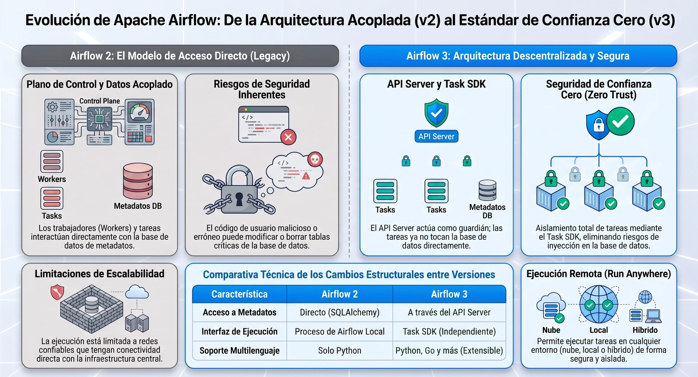

<center>
<figure>

<figcaption></figcaption>
</figure>
</center>

### La Revolución Arquitectónica
**Task SDK y Desacoplamiento de Base de Datos**


En versiones anteriores, como Airflow 2, todos los componentes de la infraestructura, incluyendo los trabajadores (*workers*) que ejecutan el código de usuario, tenían una conexión directa y privilegios amplios de lectura y escritura sobre la base de datos de metadatos (*metastore*). Esta topología clásica presentaba serios problemas de seguridad: un error lógico en un DAG o código de usuario malicioso en una tarea podía comprometer el histórico completo de ejecuciones, alterar variables globales o saturar el *pool* de conexiones de la base de datos de metadatos.

**Airflow 3 resuelve esta vulnerabilidad aislando por completo la ejecución de tareas de la base de datos**. La interacción directa ha sido reemplazada por un componente intermedio: el **API Server**. 

```
                                  [ PLANO DE CONTROL ]
                                 ┌────────────────────┐
                                 │  Metadata Database │
                                 └─────────┬──────────┘
                                           │
                                           ▼
                                 ┌────────────────────┐
                                 │     API Server     │
                                 └─────────▲──────────┘
                                           │  (Peticiones HTTP Seguras / gRPC)
                                           │  (Task SDK de Privilegio Mínimo)
                                  [ PLANO DE EJECUCIÓN ]
                                 ┌────────────────────┐
                                 │  Workers (Task)    │
                                 └────────────────────┘
```

Los trabajadores ahora ejecutan tareas comunicándose exclusivamente con el **API Server** mediante llamadas HTTP rápidas y seguras coordinadas por el nuevo **Task SDK** (el cual cuenta con implementaciones nativas en Python y de forma experimental en Golang). A través de esta interfaz de privilegios mínimos, las tareas solicitan parámetros de contexto o credenciales cifradas, y reportan estados (`success`, `failed`) o variables de comunicación cruzada (*XComs*) de vuelta al plano de control, eliminando la exposición de la base de datos relacional subyacente.

Esta separación física e incremental habilita la **Ejecución Remota (*Remote Execution*)**. Las tareas de procesamiento de datos sensibles pueden ejecutarse de forma segura en entornos *on-premises* aislados o nubes privadas mediante el **EdgeExecutor** o el **Remote Execution Agent**, limitándose a enviar telemetría de red trivial y metadatos del estado del DAG hacia el servidor central.

---

### Arquitectura de Seguridad
**Protección en Reposo, en Tránsito y Gobierno de Credenciales**

La postura de seguridad de un orquestador distribuido moderno se evalúa bajo un enfoque de **Confianza Cero (*Zero-Trust*)** y defensa en profundidad, estructurado en tres dimensiones físicas:

#### A. Cifrado de Datos en Reposo (Fernet Key)
La base de datos de metadatos almacena por definición las conexiones y configuraciones de red de todo tu ecosistema corporativo (claves de APIs, conexiones JDBC, credenciales en la nube). Para evitar que un atacante con acceso directo a las tablas relacionales pueda extraer estas credenciales en texto plano, Airflow exige la configuración de un sistema de **cifrado simétrico** mediante una **clave Fernet**. 

La clave Fernet (configurada mediante la directiva `AIRFLOW__CORE__FERNET_KEY` o cargada dinámicamente desde un comando seguro a través de `AIRFLOW__CORE__FERNET_KEY_CMD`) genera una cadena secreta e inmutable que cifra de manera automática todas las columnas marcadas como confidenciales en la base de datos relacional antes de su escritura física en el disco.

#### B. Cifrado de Datos en Tránsito (HTTPS/TLS)
Para contrarrestar ataques de tipo **Man-in-the-Middle (MITM)** en los que un actor intercepta los paquetes de red que viajan entre el navegador del usuario (o las llamadas de API de los trabajadores) y la interfaz de usuario, es obligatorio configurar conexiones cifradas bajo **HTTPS (TLS/SSL)**. 

Al aprovisionar las directivas en el archivo de configuración:
```ini
[api]
ssl_cert = /ruta/segura/certificado.pem
ssl_key = /ruta/segura/privatekey.pem
```
El **API Server** (que integra internamente un servidor web Gunicorn) cifra asimétricamente el flujo de datos usando una llave pública distribuida en un certificado X.509, mientras que los clientes autentican la identidad del plano de control mediante firmas de confianza digital.

#### C. Gobierno de Credenciales sin Código (Secrets Backends)
La inclusión de datos de autenticación o claves directamente dentro de los archivos lógicos de un DAG (*hardcoding*) es considerada una mala práctica de desarrollo. 

Airflow 3 soporta de manera nativa la integración de **Secrets Backends** (como HashiCorp Vault, AWS SSM, Google Secrets Manager y Azure Key Vault). Al mapear estas herramientas, cuando un operador requiere instanciar un gancho de conexión (*Hook*), el motor de ejecución intercepta la llamada y consulta jerárquicamente las credenciales en la bóveda externa usando tokens de vida corta (*downscoped tokens*), antes de buscar en las variables de entorno locales o en la base de datos de metadatos.

Adicionalmente, se debe evitar el uso de código de computación o llamadas de red en el **ámbito global o de nivel superior (*top-level code*)** del DAG. Dado que el procesador de DAGs analiza periódicamente los scripts para serializarlos, cualquier llamada HTTP o consulta SQL fuera de las funciones `@task` se ejecutará de forma redundante y costosa en cada ciclo del procesador, ralentizando el sistema y exponiendo tokens de red de forma innecesaria.

---

### Arquitectura de Observabilidad
**Métricas, Logs y Versionado de Pipelines**

La observabilidad en sistemas distribuidos se compone de tres pilares fundamentales que proporcionan una visión integral del rendimiento del clúster:

#### A. Métricas de Rendimiento (StatsD y OpenTelemetry)
Airflow 3 permite instrumentar la infraestructura para enviar telemetría en tiempo real utilizando el modelo de inserción (*push*) de **StatsD** o el estándar **OpenTelemetry** hacia colectores distribuidos. La arquitectura típica utiliza un exportador intermedio para convertir las métricas UDP y permitir que un servidor de **Prometheus** las consuma bajo el modelo de extracción (*pull*), para finalmente visualizarlas en un tablero interactivo de **Grafana**.

Siguiendo las mejores prácticas de observabilidad, el clúster debe monitorearse según los cuatro pilares de telemetría de sistemas:
*   **Latencia (*Latency*):** El tiempo necesario para encolar y procesar tareas. Por ejemplo, la latencia de planificación medida mediante `dagrun.[dag_id].first_task_scheduling_delay`.
*   **Carga (*Load*):** El volumen de transacciones solicitadas al orquestador, como las tareas concurrentes en ejecución (`executor.running_tasks`).
*   **Errores (*Errors*):** Anomalías detectadas en producción, medidas a través de contadores como `dag_processing.import_errors` (fallos de sintaxis en el procesamiento de DAGs) o `ti_failures` (instancias de tareas fallidas).
*   **Saturación (*Saturation*):** Qué tan cerca de su límite operativo se encuentra el sistema, monitorizando el consumo de CPU/RAM de las máquinas físicas y la disponibilidad de espacios libres en las colas (`executor.queued_tasks` o `executor.open_slots`).

#### B. Arquitectura de Logs Centralizada y Almacenamiento Remoto
Los logs se capturan en tres niveles físicos para evitar silos en contenedores efímeros:
1.  **Logs del API Server/Web:** Registran las interacciones del usuario y las llamadas de la API REST.
2.  **Logs del Scheduler y DAG Processor:** Diagnósticos de la orquestación lógica y el rendimiento del análisis de ficheros.
3.  **Logs de Tareas:** Salidas estándar de ejecución de los operadores individuales.

Para evitar la pérdida de trazabilidad ante la terminación o el escalado dinámico de nodos de computación, se configura el **almacenamiento de logs remoto** (`AIRFLOW__LOGGING__REMOTE_LOGGING=True`), despachando las trazas de forma asíncrona hacia buckets de almacenamiento como AWS S3, Azure Blob o Google Cloud Storage utilizando credenciales centralizadas.

#### C. Versionado de DAGs y Trazabilidad del Código
Para resolver el problema del desvanecimiento del histórico cuando se modifican flujos (por ejemplo, al eliminar o renombrar un nodo del grafo), Airflow 3 introduce el **versionado nativo de DAGs**. 

El **DAG Processor** detecta de forma automática los cambios en la estructura de los scripts y registra una nueva firma lógica en la base de datos de metadatos. De este modo, los analistas pueden auditar el código exacto y el linaje de las ejecuciones del pasado sin riesgo de colisiones de versión o inconsistencias durante la ejecución de DAG runs concurrentes.

```
┌────────────────────────────────────────────────────────────────────────┐
│                        AIRFLOW 3 METADATA DATABASE                     │
│                                                                        │
│  ┌───────────────────────┐             ┌────────────────────────────┐  │
│  │     DAG Version 1     │             │        DAG Version 2       │  │
│  │  (Código e Historial) │             │   (Estructura Actualizada) │  │
│  └───────────▲───────────┘             └─────────────▲──────────────┘  │
└──────────────┼───────────────────────────────────────┼─────────────────┘
               │                                       │
     (Reruns con Código Antiguo)              (Nuevas Ejecuciones)
```

---
<br />
### Implementación de Código
<Tabs>
<TabItem value="mnp" label="Antecedentes" default>
<div class="alert alert--primary">
**Un Pipeline de Producción Seguro y Observable**

El siguiente script en Python implementa las mejores prácticas analizadas: utiliza la **API TaskFlow** de Airflow 3, configura alertas automatizadas mediante callbacks de fallo, define reintentos con retraso exponencial ante fallos del sistema, y utiliza de manera segura un **Hook** para acceder a credenciales externas sin realizar computaciones globales.
</div>
</TabItem>
<TabItem value="mnp-python" label="💻 Código">

```python showLineNumbers
"""
Pipeline de Producción Seguro, Idempotente y Observable (Airflow 3 Standard)
Estilo: Académico, técnico y de alta legibilidad.
"""

import logging
import uuid
from pendulum import datetime, duration
from airflow.sdk import dag, task, Asset
from airflow.providers.openai.hooks.openai import OpenAIHook
from airflow.exceptions import AirflowException

# ==============================================================================
# 1. SISTEMA DE OBSERVABILIDAD: CALLBACK DE FALLO PARA ALERTA FINA
# ==============================================================================
def notificar_excepcion_produccion(context: dict):
    """
    Función de callback ejecutada de manera síncrona en el worker ante fallos.
    Permite auditar el diagnóstico exacto de la excepción sin conectarse
    directamente a la base de datos relacional del metastore.
    """
    ti = context.get("task_instance")
    dag_run = context.get("dag_run")
    exception = context.get("exception")
    logical_date = context.get("logical_date")  # run_after en Airflow 3

    # Extracción segura de metadatos de auditoría
    dag_id = ti.dag_id if ti else "DESCONOCIDO"
    task_id = ti.task_id if ti else "DESCONOCIDO"
    run_id = dag_run.run_id if dag_run else "DESCONOCIDO"
    try_number = ti.try_number if ti else 1

    log_diagnostico = (
        f"\n🚨 [OBSERVABILIDAD - EXCEPCIÓN DETECTADA EN PIPELINE]\n"
        f"• Identificador DAG : {dag_id}\n"
        f"• Nodo Afectado     : {task_id}\n"
        f"• Corrida Run ID    : {run_id}\n"
        f"• Intento de Tarea  : {try_number}\n"
        f"• Fecha Lógica (UTC): {logical_date}\n"
        f"• Excepción Tipo    : {type(exception).__name__ if exception else 'N/A'}\n"
        f"• Mensaje de Error  : {exception}\n"
    )
    
    # Registramos de forma nativa en el sistema de Logs de Airflow
    logging.error(log_diagnostico)


# ==============================================================================
# 2. DEFINICIÓN DEL ASSET DE ENTRADA (DATA-AWARE SCHEDULING)
# ==============================================================================
# Asset lógico que actúa como activador de la ingesta
asset_ingesta_tienda = Asset("s3://raw-data-tienda/ventas-diarias.csv")


# ==============================================================================
# 3. PIPELINE DE ANÁLISIS DE DATOS SEGURO (DAG)
# ==============================================================================
@dag(
    dag_id="pipeline_seguridad_observabilidad_airflow3",
    start_date=datetime(2026, 8, 1),
    # El DAG se ejecuta automáticamente al recibir una actualización del Asset
    schedule=[asset_ingesta_tienda],
    catchup=False,  # En Airflow 3 es False por defecto para evitar corridas masivas accidentales
    on_failure_callback=[notificar_excepcion_produccion],
    default_args={
        # Tolerancia a fallos transitorios: 2 intentos con retraso de 3 minutos
        "retries": 2,
        "retry_delay": duration(minutes=3),
        "on_failure_callback": [notificar_excepcion_produccion]
    }
)
def pipeline_ventas():

    # CAPA BRONZE: Extracción e Ingesta
    @task
    def extraer_transacciones_bronze() -> dict:
        """
        Simula la ingesta del lote de transacciones diario.
        Retorna datos ligeros serializables que viajarán de forma segura a través de XCom.
        """
        logging.info("Extrayendo archivo de transacciones desde almacenamiento seguro...")
        lote_id = str(uuid.uuid4())
        
        # Datos JSON a transferir
        datos_ventas = {
            "lote_id": lote_id,
            "transacciones": [
                {"item_id": 101, "monto_usd": 1500.00, "pais": "España"},
                {"item_id": 102, "monto_usd": 45.50, "pais": "Francia"},
                {"item_id": 103, "monto_usd": 0.00, "pais": "España"}  # Valor frontera (evaluación de riesgo)
            ]
        }
        return datos_ventas

    # CAPA SILVER: Procesamiento, Limpieza y Enriquecimiento mediante LLMs
    @task
    def enriquecer_analisis_silver(datos_bronze: dict) -> list:
        """
        Enriquece las transacciones procesando descripciones automáticas mediante OpenAI.
        Utiliza el Hook correspondiente de forma segura dentro del hilo del worker.
        """
        lote_id = datos_bronze["lote_id"]
        transacciones = datos_bronze["transacciones"]
        transacciones_enriquecidas = []

        logging.info(f"Iniciando enriquecimiento Silver para el lote: {lote_id}")

        # Uso correcto del Hook: Instanciación segura dentro de la tarea, evitando llamadas globales
        try:
            openai_hook = OpenAIHook(conn_id="my_openai_conn")
            client = openai_hook.get_conn()
        except Exception as e:
            raise AirflowException(f"Error crítico al conectar con el Secrets Backend de OpenAI: {e}")

        for tx in transacciones:
            monto = tx["monto_usd"]
            if monto <= 0.0:
                # Provocamos intencionalmente un fallo controlado para demostrar la alerta de observabilidad
                raise ValueError(f"Anomalía financiera: La transacción {tx['item_id']} presenta un monto no válido de 0.0.")
            
            # Formateamos descripción enriquecida simulada
            tx["descripcion_enriquecida"] = f"Transacción autorizada de {monto} USD en {tx['pais']}"
            transacciones_enriquecidas.append(tx)

        return transacciones_enriquecidas

    # CAPA GOLD: Almacenamiento final e Integración
    @task
    def cargar_datos_gold(datos_silver: list):
        """
        Consolida la información y persiste los registros limpios e indexados en el Data Lakehouse.
        """
        total_registros = len(datos_silver)
        logging.info(f"Cargando exitosamente {total_registros} registros enriquecidos en la capa Gold.")

    # 4. DECLARACIÓN DEL LINAJE LÓGICO Y DEPENDENCIAS
    # Airflow infiere de manera automática el Grafo (DAG) por el paso secuencial de argumentos
    datos_crudos = extraer_transacciones_bronze()
    datos_limpios = enriquecer_analisis_silver(datos_crudos)
    cargar_datos_gold(datos_limpios)


# Instanciación lógica para el registro en el API Server
pipeline_ventas()
```
</TabItem>
</Tabs><br />

***

🎨 ¿Te gustaría que prepare una infografía bento-grid en tu panel de **Studio** que represente visualmente la transición del plano de datos y control de Airflow 2 hacia el nuevo estándar del API Server y Task SDK de Airflow 3?