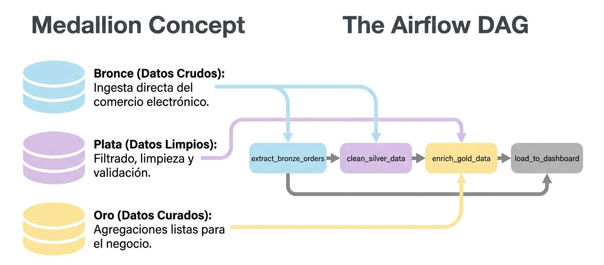

# Grafo Acíclico Dirigido (DAG)

DAG Directory
```text
airflow/
├── dags/                    # Directorio principal de DAGs
│   ├── etl_pipeline.py
│   ├── ml_pipeline.py
│   └── utils/
├── plugins/                 # Plugins personalizados
├── config/                  # Configuración
├── logs/                    # Logs de ejecución
└── data/                    # Datos temporales
```

Un **DAG** (por sus siglas en inglés, *Directed Acyclic Graph* o **Grafo Acíclico Dirigido**) representa un flujo de trabajo, canalización o *pipeline* de datos individual dentro del ecosistema de orquestación de **Apache Airflow**. 

Conceptualmente, un DAG es una estructura matemática que organiza diversas tareas y define de manera estricta las relaciones y dependencias de ejecución entre ellas. Para comprender su naturaleza a nivel universitario, es necesario descomponer sus tres propiedades fundamentales:

1.  **Directed (Dirigido):** Las conexiones (aristas o bordes) entre las tareas (nodos o vértices) tienen una dirección única y explícita, representada por flechas. Esto determina un flujo hacia adelante donde una tarea descendente (*downstream*) solo puede iniciar su ejecución una vez que sus tareas predecesoras (*upstream*) han concluido con éxito.

2.  **Acyclic (Acíclico):** El grafo no permite la existencia de bucles o ciclos de retroalimentación; es decir, es imposible que el camino de ejecución regrese a una tarea previamente completada. Esta característica evita callejones sin salida lógicos (*deadlocks*), donde dos tareas dependieran mutuamente entre sí para poder iniciar.

3.  **Graph (Grafo):** Es la representación visual y lógica de todo el flujo, mapeando las dependencias estructurales de las operaciones que se desean ejecutar.

---

### Arquitectura de Operación y Ciclo de Vida de un DAG

<center>
<figure>

<figcaption>El código Pyhton dicta la lógica de negocio, pero la estructura del DAG dict el flujo del tiempo y el estado.</figcaption>
</figure>
</center>

La ejecución y ciclo de vida de un DAG en un entorno de producción de Airflow se gestiona de forma descentralizada mediante componentes de sistema coordinados que interactúan a través de una base de datos centralizada de metadatos (el *metastore*) y un *API Server*:

```
[Código Python (DAG File)] 
       │
       ▼ (Lectura y parseo periódico)
[DAG Processor] ──(Serialización)──> [Metastore]
                                        ▲
                                        │ (Lectura y verificación de dependencias)
                                 [Scheduler] ──(Asignación de tareas)──> [Executor]
                                                                            │
                                                                            ▼
                                                                     [Workers (Cola)]
```

#### Definición como Código (*Configuration as Code*)
En Airflow, los DAGs se definen dinámicamente mediante archivos de script de **Python**. Esto ofrece la ventaja de aplicar buenas prácticas de ingeniería de software (como el control de versiones con Git o despliegues automatizados mediante CI/CD). 

Las dependencias se configuran de manera intuitiva utilizando el operador de desplazamiento de bits a la derecha o izquierda (`>>` o `<<`) o mediante la función `chain()`.

#### El Ciclo de Operación de los Componentes
Cuando un script de DAG se coloca en el directorio correspondiente (`dags_folder`), Airflow lo opera a través de las siguientes etapas secuenciales:

*   **Fase de Parseo (DAG Processor):** El procesador de DAGs lee e interpreta el código Python, valida que no existan ciclos infinitos y guarda una versión serializada (estructurada) en el *metastore*.
*   **Planificación (Scheduler):** El planificador monitorea continuamente los intervalos de ejecución (*schedule interval*) definidos para el DAG. Al cumplirse las condiciones temporales (o ante un evento de datos), crea una instancia de ejecución lógica conocida como **DAG Run**.
*   **Resolución de Dependencias:** El *Scheduler* revisa cada tarea individual dentro de la ejecución activa (*Task Instances*), evaluando si sus dependencias anteriores han concluido satisfactoriamente. Por defecto, se rige bajo la regla de disparo `all_success`. Una vez autorizada, la tarea pasa al estado `queued` (encolada).
*   **Ejecución Física (Executor y Workers):** El ejecutor (como *Celery* o *Kubernetes*) distribuye la instrucción de ejecución física hacia los *Workers* (trabajadores). El *Worker* procesa la lógica de la tarea de forma aislada y reporta el estado final (`success` o `failed`) al *metastore* a través de llamadas de red seguras al **API Server**.
*   **Optimización Asíncrona (Triggerer):** Si una tarea soporta ejecución diferida (*deferrable tasks*), el *Worker* puede suspenderla temporalmente para liberar memoria y recursos de hardware, delegando el monitoreo asíncrono al componente **Triggerer** hasta que el evento externo se complete.


### Conceptos Clave de Robustez
*   **Idempotencia:** Un principio fundamental para diseñar DAGs estables. Significa que, si un operador o tarea se vuelve a ejecutar múltiples veces con los mismos parámetros de entrada (por ejemplo, al limpiar una tarea fallida desde la interfaz), el resultado final en el almacenamiento analítico debe ser idéntico, evitando duplicaciones o inconsistencias de datos.

*   **Atomicidad:** Cada tarea en el DAG debe realizar exactamente una única operación lógica indivisible. Separar los procesos de extracción, transformación y carga en tareas independientes permite aislar errores, optimizar la computación distribuida y reanudar únicamente el paso exacto que falló, en lugar de reiniciar todo el flujo desde el principio.


### Análisis Técnico de las Buenas Prácticas Aplicadas

Para que un pipeline de datos sea estable y robusto en producción, este script implementa de forma nativa tres principios fundamentales de ingeniería de software:

#### 1. Idempotencia Estricta (*"Same In - Same Out"*)
Si un pipeline falla en el paso final de carga debido a un corte en la conexión con la base de datos, el orquestador reintentará la tarea. Al volver a ejecutar el pipeline para el mismo periodo de tiempo, **no deben generarse registros duplicados o inconsistencias**.
*   **A nivel de archivos:** En lugar de utilizar `datetime.now()`, el script utiliza el parámetro contextual de Airflow `data_interval_start`. Esto asegura que el archivo descargado y procesado pertenezca únicamente a la ventana lógica de tiempo correspondiente a la ejecución programada, incluso si se realiza un rellenado de datos históricos (*backfilling*) meses después.
*   **A nivel de base de datos:** La sentencia SQL generada en la capa Gold utiliza el patrón **UPSERT** (`INSERT ... ON CONFLICT (fecha, pais) DO UPDATE SET ...`). Si la tarea se ejecuta varias veces para la misma fecha y país, simplemente sobrescribe y actualiza los valores existentes en lugar de duplicarlos.

#### 2. Atomicidad del Flujo de Trabajo
Cada tarea del DAG tiene un único propósito delimitado y bien definido. Al separar la extracción (Bronze), la limpieza (Silver) y la agregación (Gold) en procesos aislados, logramos que, en caso de fallar la conexión al almacén de datos (Gold), **no tengamos que volver a realizar la llamada a la API externa de origen** (Bronze). Simplemente se limpia el estado de la tarea de carga en Airflow y se reinicia desde el paso fallido de forma localizada, ahorrando ancho de banda y costes de cómputo.

#### 3. Interoperabilidad de la API TaskFlow y Operadores Tradicionales
Airflow 3 permite la convivencia armoniosa del código moderno de Python (decorado con `@task`) con clases de operadores tradicionales e integrados de proveedores externos (como `SQLExecuteQueryOperator`). La API de TaskFlow expone el atributo de salida `.output` de los métodos decorados, el cual puede ser renderizado en las propiedades plantillables (*templated fields*) de los operadores tradicionales mediante sintaxis Jinja.


### Idempotencia

La **idempotencia** es una de las propiedades más críticas y un principio de diseño fundamental en la ingeniería de pipelines de datos, particularmente dentro de **Apache Airflow**.

Un DAG (o una tarea individual dentro de él) se considera **idempotente** si su ejecución repetida bajo las mismas condiciones y con los mismos parámetros de entrada produce exactamente el mismo resultado final, sin generar efectos secundarios adicionales o alteraciones no deseadas en el sistema de destino. En términos matemáticos y de computación:

```math
{Tarea}(x) = \text{Tarea}(\text{Tarea}(x))
```

Esto significa que si una tarea se ejecuta una, dos o cien veces con los mismos datos de entrada, el estado de los datos de salida en tu base de datos, data lake o almacenamiento de objetos debe ser idéntico al de la primera ejecución exitosa.


#### ¿Por qué es crucial la idempotencia en Airflow?

En un entorno de producción distribuido, las fallas son inevitables. Un pipeline puede interrumpirse a mitad de camino por problemas de red, desconexión de una base de datos externa, falta de memoria en un clúster de Spark o caídas del propio nodo trabajador (*worker*). Ante estos escenarios, Airflow y los ingenieros de datos dependen de dos acciones comunes:

1.  **Reintentos automáticos (*retries*):** Airflow volverá a intentar ejecutar una tarea fallida de manera automatizada si así se configura en sus parámetros.
2.  **Rellenado histórico (*backfilling*) o reejecución manual:** Los desarrolladores limpian el estado de una tarea anterior (*clear state*) en la interfaz gráfica para volver a procesar datos históricos tras haber corregido un error en el código.

Si tus tareas **no son idempotentes**, cada reejecución o reintento duplicará los registros o corromperá el conjunto de datos de destino, sesgando los análisis analíticos posteriores.

#### Ejemplo de una Tarea No Idempotente
Considera una tarea que extrae las transacciones del día y las escribe al final de un único archivo acumulativo llamado `/data/ventas.json` usando un método de anexión (*append*). Si la tarea falla al final y Airflow la reintenta, los registros de ese día se escribirán dos veces en el archivo central. **Este diseño no es de ninguna manera idempotente**.

---

#### Estrategias de Implementación de Tareas Idempotentes

Para asegurar que un flujo de datos sea reproducible y seguro, los ingenieros de datos emplean tres metodologías fundamentales:

**1. Particionamiento Temporal y Sobrescritura Directa**

En lugar de manipular archivos compartidos globales, el flujo de datos debe segmentarse en particiones discretas de tiempo (por ejemplo, por año, mes y día). Al ejecutar la tarea, el sistema debe configurarse para **sobrescribir explícitamente** la partición correspondiente al intervalo de ejecución de Airflow. Si la tarea se ejecuta nuevamente, simplemente reemplazará la partición existente con los nuevos datos limpios, garantizando un resultado consistente.

**2. Operaciones de tipo Upsert (*ON CONFLICT*) en Bases de Datos**

Al interactuar con bases de datos relacionales o almacenes de datos (*Data Warehouses*), las operaciones de inserción directa (`INSERT`) deben ser reemplazadas por operaciones **Upsert** (unificación de `UPDATE` e `INSERT`). Al definir una clave primaria única (como la combinación de la fecha y el identificador de transacción), se puede instruir a la base de datos para que actualice el registro existente o ignore la inserción si el dato ya fue procesado.

**3. Determinismo a través del Contexto de Airflow**

Para que una tarea sea idempotente, también debe ser **determinista** (retornar siempre la misma salida para un mismo input). Es un error severo utilizar funciones dinámicas no deterministas del sistema operativo dentro del código, como `datetime.now()`, para definir rutas de archivos o filtrar bases de datos. 

Si ejecutas hoy un *backfill* de hace tres meses, `datetime.now()` filtrará con la fecha de hoy, rompiendo la coherencia histórica. En su lugar, se deben inyectar las **variables de contexto nativas de Airflow**, tales como `logical_date` o `data_interval_start`, las cuales garantizan que la tarea se acote estrictamente a la ventana de tiempo exacta que está procesando.


<Tabs>
<TabItem value="mnp" label="Demo" default>
<div class="alert alert--primary">
**Demostración Práctica en Python (TaskFlow API)**

El siguiente script de Python ejemplifica la construcción de un DAG de Airflow con tareas estrictamente idempotentes. El primer operador implementa la sobrescritura de archivos particionados por fecha, y el segundo simula una inserción en base de datos protegida contra duplicados mediante una cláusula SQL de tipo Upsert:
</div>
</TabItem>
<TabItem value="mnp-python" label="💻 Código">

```python showLineNumbers
# Implementación en Python
from pendulum import datetime
from airflow.sdk import dag, task
from airflow.providers.common.sql.operators.sql import SQLExecuteQueryOperator
import json
import os

@dag(
    dag_id="pipeline_idempotente_ventas",
    start_date=datetime(2026, 8, 1),
    schedule="@daily",  # Ejecución diaria programada de forma consistente
    catchup=False
)
def pipeline_ventas():

    # 1. TAREA BRONZE (Extracción con sobrescritura determinista)
    # Hacemos uso de 'logical_date' del contexto de Airflow para forzar el determinismo
    @task
    def extraer_datos_api(logical_date=None) -> str:
        """
        Extrae datos y los almacena en una partición física temporal.
        Garantiza la idempotencia sobrescribiendo el archivo en cada reintento.
        """
        # Formateamos la fecha lógica para aislar la partición física
        fecha_particion = logical_date.strftime("%Y-%m-%d")
        ruta_salida = f"/tmp/ventas_bronze_{fecha_particion}.json"
        
        # Datos simulados de la API de origen
        datos_api = [
            {"id_venta": 101, "monto": 1500.0, "fecha": fecha_particion},
            {"id_venta": 102, "monto": 450.0, "fecha": fecha_particion}
        ]
        
        # Sobrescribimos el archivo (mode="w") para evitar la duplicación de registros
        # si esta tarea se ejecuta múltiples veces debido a fallas
        with open(ruta_salida, "w") as f:
            json.dump(datos_api, f)
            
        print(f"Partición guardada de forma idempotente en: {ruta_salida}")
        return ruta_salida

    # 2. TAREA SILVER / GOLD (Generación de comandos SQL deterministas)
    @task
    def generar_upsert_sql(ruta_archivo: str, logical_date=None) -> str:
        """
        Genera sentencias SQL con soporte para UPSERT (ON CONFLICT).
        """
        fecha_particion = logical_date.strftime("%Y-%m-%d")
        ruta_sql = f"/tmp/carga_ventas_{fecha_particion}.sql"
        
        with open(ruta_archivo, "r") as f:
            ventas = json.load(f)
            
        with open(ruta_sql, "w") as f:
            for v in ventas:
                # El uso de 'ON CONFLICT (id_venta) DO UPDATE...' garantiza que
                # si el registro ya existe en el Data Warehouse por una corrida fallida previa,
                # se actualice de forma segura sin generar duplicidad de tuplas.
                query = (
                    f"INSERT INTO warehouse.ventas_diarias (id_venta, monto, fecha) "
                    f"VALUES ({v['id_venta']}, {v['monto']}, '{v['fecha']}') "
                    f"ON CONFLICT (id_venta) DO UPDATE SET "
                    f"monto = EXCLUDED.monto, fecha = EXCLUDED.fecha;\n"
                )
                f.write(query)
                
        return ruta_sql

    # 3. TAREA DE CARGA (Operador Tradicional del Ecosistema de SQL)
    # SQLExecuteQueryOperator ejecuta de manera transaccional el script generado
    ejecutar_carga_db = SQLExecuteQueryOperator(
        task_id="ejecutar_carga_db",
        conn_id="postgres_data_warehouse",
        # Hacemos referencia al script SQL generado dinámicamente
        sql="carga_ventas_{{ logical_date | ds }}.sql",
        autocommit=True
    )

    # Definición de dependencias lógicas y linaje de datos
    ruta_datos = extraer_datos_api()
    ruta_script_sql = generar_upsert_sql(ruta_datos)
    
    # Vinculamos la carga del SQL final
    ruta_script_sql >> ejecutar_carga_db

# Instanciamos el pipeline
pipeline_ventas()
```
</TabItem>
</Tabs>
<br/>


### Ejemplos


La forma recomendada y moderna de escribir DAGs en Airflow es a través de la **API TaskFlow**, la cual utiliza decoradores de Python para simplificar la declaración de tareas, reduciendo el código repetitivo (*boilerplate*) y gestionando de forma automática el paso de datos mediante XCom (comunicación cruzada).

#### Ejemplo 1
<Tabs>
<TabItem value="mnp" label="Antecedentes" default>
<div class="alert alert--primary">

**Implementación de un DAG de ETL**

A continuación se muestra un script técnico completo de un pipeline de ETL simulado:
</div>
</TabItem>
<TabItem value="mnp-python" label="💻 Código" default>

```python showLineNumbers
import uuid
from pendulum import datetime
from airflow.sdk import dag, task

# 1. DEFINICIÓN DEL CONTEXTO DEL DAG MEDIANTE EL DECORADOR @dag
@dag(
    dag_id="pipeline_etl_academico",
    start_date=datetime(2026, 8, 1),
    schedule="@daily",          # Frecuencia de ejecución diaria gestionada por el Scheduler
    catchup=False,              # Evita la ejecución retrospectiva automática de ejecuciones pasadas
    default_args={
        "retries": 2,           # Número de reintentos automatizados ante fallos temporales
        "retry_delay": 120      # Tiempo de espera en segundos entre reintentos
    }
)
def pipeline_etl():

    # 2. DECLARACIÓN DE TAREAS OPERATIVAS CON EL DECORADOR @task
    # Cada función Python se convierte automáticamente en un nodo del DAG
    @task
    def extraer_datos_api() -> dict:
        """
        Simula la ingesta de datos crudos (Capa Bronze).
        """
        payload_crudo = {
            "batch_id": str(uuid.uuid4()),
            "metricas": [120.50, 450.20, 99.90, None]
        }
        print(f"Extracción completada. ID del lote: {payload_crudo['batch_id']}")
        return payload_crudo

    @task
    def transformar_datos(data: dict) -> dict:
        """
        Filtra inconsistencias y limpia nulos (Capa Silver).
        """
        metricas_sucias = data["metricas"]
        # Filtrado de valores None (Calidad del dato)
        metricas_limpias = [float(val) for val in metricas_sucias if val is not None]
        
        data_procesada = {
            "batch_id": data["batch_id"],
            "metricas_limpias": metricas_limpias,
            "registros_procesados": len(metricas_limpias)
        }
        print(f"Transformación finalizada para el lote {data['batch_id']}.")
        return data_procesada

    @task
    def cargar_datos_lakehouse(data_limpia: dict):
        """
        Persiste los datos refinados para consumo analítico (Capa Gold).
        """
        # Aquí se ejecutaría la persistencia en Delta Lake u otros motores
        total_registros = data_limpia["registros_procesados"]
        print(f"Carga exitosa. Se insertaron {total_registros} registros limpios en producción.")

    # 3. DECLARACIÓN DE DEPENDENCIAS Y FLUJO DE DATOS
    # Al pasar la salida de una función decorada como entrada de otra, 
    # Airflow infiere de manera automática las dependencias en el grafo lógico
    datos_crudos = extraer_datos_api()
    datos_limpios = transformar_datos(datos_crudos)
    cargar_datos_lakehouse(datos_limpios)

# 4. INSTANCIACIÓN FINAL DEL FLUJO DE TRABAJO
pipeline_etl()
```
</TabItem>
</Tabs>


#### Ejemplo 2

<Tabs>
<TabItem value="mnp" label="Antecedentes" default>
<div class="alert alert--primary">
**Ingesta y Procesamiento Diario de Ventas (*E-commerce*)**

En entornos corporativos reales, los sistemas transaccionales (OLTP) generan constantemente registros de ventas que se almacenan temporalmente o se exponen mediante APIs. El departamento de Business Intelligence (BI) y el equipo de Data Science requieren que estos datos se integren de forma limpia, consistente e incremental dentro de un repositorio analítico central (un *Data Lakehouse* o *Data Warehouse*) sin sobrecargar los sistemas de origen.

Para resolver esto, diseñaremos un pipeline que se ejecuta de forma diaria y automatizada. Sus etapas son:
1.  **Capa Bronze (Extracción):** Descarga el archivo de transacciones crudas del día desde el servidor de origen y lo almacena de manera inmutable en el lago de datos.
2.  **Capa Silver (Transformación y Calidad):** Limpia el dataset, remueve registros corruptos (valores nulos en campos clave), castea los tipos de datos al formato correcto y calcula métricas derivadas como el subtotal por transacción.
3.  **Capa Gold (Agregación de Negocio):** Agrupa y resume los ingresos totales por país del día correspondiente, exportando estas métricas estructuradas en archivos de consulta SQL listos para su carga.
4.  **Carga (Load):** Ejecuta de forma transaccional el lote de inserciones en la base de datos analítica centralizada (Data Warehouse).
</div>
</TabItem>
<TabItem value="mnp-python" label="💻 Código" default>

```python showLineNumbers title="Código Completo del DAG en Python"
import os
import json
import pendulum
from airflow.sdk import dag, task, chain
from airflow.providers.common.sql.operators.sql import SQLExecuteQueryOperator

# ==============================================================================
# DEFINICIÓN DEL DAG (ORQUESTADOR PRINCIPAL)
# ==============================================================================
@dag(
    dag_id="pipeline_etl_ecommerce_medallon",
    start_date=pendulum.datetime(2026, 8, 1, tz="UTC"),
    schedule="0 2 * * *",  # Se ejecuta diariamente a las 02:00 UTC (al terminar el día de negocio)
    catchup=False,
    template_searchpath="/tmp",  # Permite buscar scripts SQL dinámicos en este directorio
    default_args={
        "retries": 3,                      # Tolerancia a fallos: reintenta hasta 3 veces
        "retry_delay": pendulum.duration(minutes=5),  # Espera 5 minutos entre intentos
    }
)
def etl_ecommerce():

    # 1. CAPA BRONZE (Extracción Inmutable)
    @task
    def extraer_datos_bronze(data_interval_start=None) -> str:
        """
        Descarga el lote de transacciones del día desde el origen.
        Utiliza 'data_interval_start' para asegurar la idempotencia del archivo físico.
        """
        fecha_particion = data_interval_start.strftime("%Y-%m-%d")
        ruta_destino = f"/tmp/bronze_sales_{fecha_particion}.json"

        os.makedirs("/tmp", exist_ok=True)
        
        # Simulación de la lectura física desde la API transaccional externa
        datos_simulados = [
            {"invoice_no": "540468", "stock_code": "20717", "quantity": 10, "price": 2.50, "country": "Spain"},
            {"invoice_no": "540469", "stock_code": "20699", "quantity": 5, "price": 12.00, "country": "France"},
            {"invoice_no": "540470", "stock_code": "20717", "quantity": None, "price": 3.00, "country": "Germany"},  # Registro corrupto
            {"invoice_no": "540471", "stock_code": "10002", "quantity": 1, "price": 45.00, "country": "Spain"}
        ]

        with open(ruta_destino, "w") as f:
            json.dump(datos_simulados, f)

        print(f"Bronze: Datos crudos del {fecha_particion} guardados en {ruta_destino}")
        return ruta_destino

    # 2. CAPA SILVER (Limpieza, Validación y Tipado)
    @task
    def limpiar_datos_silver(ruta_bronze: str, data_interval_start=None) -> str:
        """
        Lee los datos crudos de la capa Bronze, remueve nulos y calcula subtotales.
        """
        fecha_particion = data_interval_start.strftime("%Y-%m-%d")
        ruta_silver = f"/tmp/silver_sales_{fecha_particion}.json"

        with open(ruta_bronze, "r") as f:
            transacciones = json.load(f)

        # Validación del esquema en escritura y limpieza de registros inválidos
        registros_limpios = []
        for t in transacciones:
            # Calidad de datos: descartamos registros sin cantidad o precio
            if t["quantity"] is not None and t["price"] is not None:
                t["quantity"] = int(t["quantity"])
                t["price"] = float(t["price"])
                t["subtotal"] = t["quantity"] * t["price"]  # Característica calculada (enriquecimiento)
                registros_limpios.append(t)

        with open(ruta_silver, "w") as f:
            json.dump(registros_limpios, f)

        print(f"Silver: Datos depurados guardados en {ruta_silver}")
        return ruta_silver

    # 3. CAPA GOLD (Agregación e Idempotencia Lógica)
    @task
    def agregar_datos_gold(ruta_silver: str, data_interval_start=None) -> str:
        """
        Resume las transacciones y genera un archivo SQL dinámico para la carga idempotente (Upsert).
        """
        fecha_particion = data_interval_start.strftime("%Y-%m-%d")
        ruta_queries_sql = f"/tmp/gold_queries_{fecha_particion}.sql"

        with open(ruta_silver, "r") as f:
            datos = json.load(f)

        # Agrupación grupal: calculamos ingresos totales por país
        ventas_por_pais = {}
        for reg in datos:
            pais = reg["country"]
            subtotal = reg["subtotal"]
            ventas_por_pais[pais] = ventas_por_pais.get(pais, 0.0) + subtotal

        # Escritura de sentencias de Upsert SQL para el almacén analítico
        with open(ruta_queries_sql, "w") as f:
            for pais, total in ventas_por_pais.items():
                # El uso de 'ON CONFLICT' garantiza la idempotencia si el pipeline se vuelve a ejecutar
                query = (
                    f"INSERT INTO reporte_ventas_diarias (fecha, pais, total_ventas) "
                    f"VALUES ('{fecha_particion}', '{pais}', {total}) "
                    f"ON CONFLICT (fecha, pais) DO UPDATE SET total_ventas = EXCLUDED.total_ventas;\n"
                )
                f.write(query)

        print(f"Gold: Archivo de carga SQL estructurado en {ruta_queries_sql}")
        return ruta_queries_sql

    # 4. CAPA DE CARGA (Operador Tradicional del Ecosistema de SQL)
    # Se declara utilizando la sintaxis de operador clásica para interactuar con Postgres.
    # Se pasa la plantilla del archivo con el formato Jinja {{ data_interval_start | ds }}
    cargar_a_base_datos_gold = SQLExecuteQueryOperator(
        task_id="cargar_a_base_datos_gold",
        conn_id="postgres_data_warehouse",
        sql="gold_queries_{{ data_interval_start | ds }}.sql",  # Jinja renderizará la ruta final
        autocommit=True
    )

    # ==============================================================================
    # DECLARACIÓN DE DEPENDENCIAS (FLUJO DE DATOS Y EJECUCIÓN)
    # ==============================================================================
    # La API TaskFlow infiere implícitamente las dependencias de los pasos 1, 2 y 3
    # debido a que la salida de un método decorado sirve como entrada del siguiente.
    archivo_bronze = extraer_datos_bronze()
    archivo_silver = limpiar_datos_silver(archivo_bronze)
    archivo_sql_gold = agregar_datos_gold(archivo_silver)

    # Encadenamos la tarea final del operador tradicional usando el operador de bit-shift (>>)
    # Esto asegura que la base de datos se actualice solo tras generarse el archivo SQL de Gold.
    archivo_sql_gold >> cargar_a_base_datos_gold


# Instanciación lógica del pipeline para el motor de Airflow
etl_ecommerce()
```
</TabItem>
</Tabs>


<br/>
<Tabs>
<TabItem value="mnp" label="Antecedentes" default>
<div class="alert alert--primary">
**Gestor de Alertas Automatizado en Airflow 3**

Este script de Python implementa un **Gestor de Alertas** centralizado de nivel de producción. El código utiliza la API moderna de **TaskFlow** de Airflow 3.

**Análisis Técnico del Script**

1. **Contexto de Ejecución de Tareas (`TaskInstance`):** El callback de fallo tiene acceso al diccionario `context`, el cual provee el estado actual del ejecutor en el momento del colapso. Campos como `context['task_instance']` y `context['exception']` permiten realizar un análisis forense preciso de la traza de ejecución directamente desde la memoria RAM del *worker*, antes de que el estado sea serializado.

2. **Propagación Jerárquica de Callbacks:** Al colocar `on_failure_callback` dentro del diccionario `default_args`, Airflow aplica de forma hereditaria el gestor de alertas a todas las tareas hijas del DAG. Esto asegura que no sea necesario codificar la lógica de alerta tarea por tarea, reduciendo la redundancia de código (*boilerplate*).

3. **Idempotencia en Notificaciones:** El script está diseñado para no generar escrituras colaterales. El uso de variables relativas al tiempo de ejecución (como `logical_date` de Airflow 3) garantiza que las alertas generadas por reintentos o ejecuciones históricas (*backfilling*) mantengan consistencia cronológica con la ventana de datos afectada, facilitando la auditoría de los datos históricos.
</div>
</TabItem>
<TabItem value="mnp-python" label="💻 Código" default>

```python showLineNumbers title="Gestor de alertas automatizado"
# Implementación en Python

"""
DAG de Producción con Sistema de Alertas Automatizado (Airflow 3)
Este script implementa un gestor de excepciones en tiempo real utilizando
la directiva on_failure_callback para capturar diagnósticos detallados.
"""

import logging
import os
from pendulum import datetime, duration
from airflow.sdk import dag, task, Asset
from airflow.exceptions import AirflowSkipException

# ==============================================================================
# 1. DEFINICIÓN DEL GESTOR DE ALERTAS (CALLBACK)
# ==============================================================================
def gestor_alertas_produccion(context: dict):
    """
    Función de callback ejecutada de forma síncrona en el worker en el 
    instante exacto en que ocurre una excepción no controlada.
    
    Extrae metadatos críticos del contexto de ejecución de Airflow de forma segura.
    """
    # Extraer objetos del entorno de ejecución desde el contexto
    ti = context.get("task_instance")  # Representa la instancia de la tarea fallida
    dag_run = context.get("dag_run")   # Representa la corrida del DAG correspondiente
    exception = context.get("exception")  # Captura el objeto de excepción/traza de error
    logical_date = context.get("logical_date")  # Marca de tiempo run_after (Airflow 3)

    # Extraer metadatos de diagnóstico con salvaguardas (fallbacks)
    dag_id = ti.dag_id if ti else "Desconocido"
    task_id = ti.task_id if ti else "Desconocido"
    run_id = dag_run.run_id if dag_run else "Desconocido"
    try_number = ti.try_number if ti else 1
    
    # Formatear el diagnóstico técnico para el volcado de logs y alertas
    mensaje_diagnostico = (
        f"\n"
        f"======================================================================\n"
        f"🚨 [ALERTA DE PRODUCCIÓN] - EXCEPCIÓN DETECTADA EN PIPELINE\n"
        f"======================================================================\n"
        f"• DAG Asociado      : {dag_id}\n"
        f"• Tarea Afectada    : {task_id}\n"
        f"• ID de Ejecución   : {run_id}\n"
        f"• Intento Actual    : {try_number}\n"
        f"• Fecha Lógica (UTC): {logical_date}\n"
        f"• Tipo de Excepción : {type(exception).__name__ if exception else 'N/A'}\n"
        f"• Mensaje de Error  : {exception}\n"
        f"======================================================================\n"
    )

    # 1. Registrar diagnóstico detallado en el sistema de logs nativo de Airflow
    logging.error(mensaje_diagnostico)

    # 2. Integración Conceptual para Canales de Notificación Externos (Webhooks)
    # En producción, aquí se despacha la carga útil (payload) a Slack, Teams o PagerDuty
    # Ejemplo:
    # import requests
    # url_webhook = os.getenv("SLACK_WEBHOOK_URL")
    # if url_webhook:
    #     requests.post(url_webhook, json={"text": mensaje_diagnostico})


# ==============================================================================
# 2. CONFIGURACIÓN DEL DAG Y FLUJO DE TRABAJO (TASKFLOW API)
# ==============================================================================
@dag(
    dag_id="pipeline_ventas_produccion",
    start_date=datetime(2026, 8, 1),
    schedule=None,              # Trigger manual o externo para este caso de estudio
    catchup=False,              # Airflow 3 desactiva catchup por defecto a nivel global
    # Callback de nivel de DAG (se ejecuta si el flujo general falla o expira)
    on_failure_callback=[gestor_alertas_produccion],
    # Propagación de parámetros por defecto a todas las tareas hijas
    default_args={
        "retries": 1,                               # Número de reintentos automáticos
        "retry_delay": duration(minutes=3),         # Intervalo entre reintentos
        "on_failure_callback": [gestor_alertas_produccion] # Alerta a nivel de tarea individual
    }
)
def pipeline_ventas_produccion_dag():

    @task
    def extraer_datos_tienda():
        """Simula una extracción exitosa de transacciones."""
        logging.info("Extrayendo transacciones de la base de datos relacional...")
        return [100.50, 250.00, 15.75, 0.0]

    @task
    def calcular_impuestos_criticos(valores: list):
        """
        Simula una transformación crítica propensa a fallas matemáticas
        para demostrar el comportamiento del disparador de alertas.
        """
        logging.info("Iniciando procesamiento de impuestos por transacción...")
        
        factor_calculo = 5.0
        impuestos_calculados = []
        
        for valor in valores:
            if valor == 0.0:
                # Provocamos de forma intencional una división por cero
                logging.warning("Valor nulo detectado. Ejecutando operación de riesgo...")
                resultado = factor_calculo / valor  # Lanzará ZeroDivisionError
            else:
                resultado = valor * 0.15
            impuestos_calculados.append(resultado)
            
        return impuestos_calculados

    # Definición del linaje lógico y dependencias implícitas mediante TaskFlow
    datos = extraer_datos_tienda()
    calcular_impuestos_criticos(datos)

# Instanciación del flujo para registro en el plano de control
pipeline_ventas_produccion_dag()
```
</TabItem>
</Tabs>
<br/>


