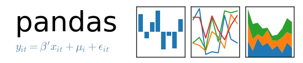

# Pandas

:::info[Codigo:]
[](https://colab.research.google.com/drive/1ZTL7UKsr7hzdVyqjgRQqiYWqeWjm5J4Z)


Atajos:
- https://www.dataquest.io/cheat-sheet/pandas-cheat-sheet/
:::

:::info[Descarga fichas de atajos]
 - [Resumen Pandas](/files/pandas_es.pdf)
 - [Data Wrangling](/files/pandas_datawrangling.pdf)
:::

Pandas es una biblioteca de Python diseñada para análisis y manipulación de datos. Proporciona estructuras de datos eficientes y herramientas para trabajar con datos tabulares y series temporales.

## Características principales

- **DataFrames**: Estructuras bidimensionales similares a tablas SQL o hojas de cálculo
- **Series**: Arreglos unidimensionales etiquetados
- **Manipulación de datos**: Filtrado, transformación, agregación y limpieza
- **Lectura/Escritura**: Soporte para múltiples formatos (CSV, Excel, JSON, SQL, etc.)
- **Análisis estadístico**: Cálculos rápidos y resúmenes de datos
- **Manejo de valores faltantes**: Herramientas para detectar y tratar datos ausentes

## Instalación

```bash
pip install pandas
ó
uv add pandas
```

## Uso básico

```python
import pandas as pd

# Crear un DataFrame
df = pd.DataFrame({'columna1': [1, 2, 3], 'columna2': ['a', 'b', 'c']})

# Ver primeras filas
df.head()
```

Pandas es esencial para ciencia de datos, análisis exploratorio y preparación de datos en Python.

Las principales diferencias entre las estructuras de datos de **pandas** (`Series` y `DataFrame`) y las de **NumPy** (`ndarray`) radican en su propósito, la flexibilidad de los tipos de datos que manejan y el uso de etiquetas o índices para organizar la información.

A continuación se detallan las diferencias clave:

### 1. Homogeneidad vs. Heterogeneidad de los datos
*   **NumPy (`ndarray`):** Es un contenedor diseñado para datos **homogéneos**, lo que significa que todos los elementos dentro de un array deben ser del mismo tipo (por ejemplo, todos flotantes o todos enteros) para garantizar la eficiencia matemática.

*   **Pandas (`DataFrame`):** Está diseñado para trabajar con datos **heterogéneos** o tabulares. En un `DataFrame`, cada columna puede tener un tipo de dato distinto (números, cadenas de texto, booleanos, etc.), similar a una tabla de base de datos o una hoja de cálculo.

*   **Pandas (`Series`):** Aunque una `Series` suele contener valores del mismo tipo, es más flexible que un array de NumPy al estar integrada con un índice de etiquetas.

### 2. El Índice y el etiquetado
*   **NumPy:** Los arrays utilizan una **indexación basada exclusivamente en enteros** para acceder a los elementos por su posición (0, 1, 2...).

*   **Pandas:** Sus estructuras se centran en el concepto de **ejes etiquetados**.
    *   Una `Series` asocia un array de etiquetas (índice) a sus valores.
    *   Un `DataFrame` tiene tanto un **índice de filas como de columnas**, lo que permite acceder a los datos mediante nombres o etiquetas descriptivas (como "Fecha", "Precio", "Estado").
    *   Soporta además la **indexación jerárquica** (`MultiIndex`), que permite trabajar con datos de más de dos dimensiones en una forma tabular.

### 3. Alineación automática de datos
*   **Pandas:** Una característica fundamental es la **alineación automática por etiquetas**. En operaciones aritméticas entre dos objetos (como sumar dos `Series`), pandas alinea los datos según sus índices; si las etiquetas no coinciden en ambos objetos, introduce valores nulos (`NaN`) en lugar de dar un error.

*   **NumPy:** Las operaciones suelen requerir que los arrays tengan la misma forma o que cumplan reglas estrictas de "transmisión" (*broadcasting*) para operar elemento a elemento sin considerar etiquetas.

### 4. Manejo de datos faltantes
*   **Pandas:** Está optimizado para la limpieza de datos y ofrece un manejo muy flexible de los **datos ausentes** (representados como `NaN` o `<NA>`). La mayoría de sus métodos estadísticos excluyen automáticamente los valores nulos.

*   **NumPy:** Aunque admite `NaN` en arrays de punto flotante, carece de la misma integración profunda para manejar valores nulos en todos sus tipos de datos y operaciones.

### 5. Dimensionalidad
*   **NumPy:** Puede manejar arrays de **n-dimensiones** (desde vectores 1D y matrices 2D hasta tensores de muchas dimensiones).

*   **Pandas:** Se especializa en estructuras de **una dimensión** (`Series`) y **dos dimensiones** (`DataFrame`). Para dimensiones superiores, utiliza la indexación jerárquica dentro de estas mismas estructuras.

En resumen, mientras que **NumPy** es la piedra angular para la computación numérica y el procesamiento de bloques de datos homogéneos a bajo nivel, **pandas** fusiona esas ideas con capacidades de manipulación de datos de hojas de cálculo y bases de datos relacionales, facilitando la limpieza, unión y análisis de datos del mundo real.

¿En qué casos es mejor usar NumPy en lugar de pandas?

Aunque **pandas** es una herramienta poderosa para el análisis de datos tabulares, existen situaciones específicas en las que es preferible utilizar **NumPy**, principalmente debido a su eficiencia computacional y su especialización en el manejo de datos numéricos puros. Los casos principales incluyen:

*   **Procesamiento de datos homogéneos:** NumPy es la opción ideal cuando se trabaja con grandes conjuntos de datos donde **todos los elementos son del mismo tipo** (generalmente enteros, reales o complejos). Al ser estructuras homogéneas, permiten un almacenamiento mucho más compacto y cálculos matemáticos más rápidos que las listas de Python o las estructuras heterogéneas de pandas.

*   **Cálculos de N-dimensiones:** Mientras que pandas se especializa en datos de una dimensión (`Series`) y dos dimensiones (`DataFrame`), **NumPy está diseñado para manejar arrays multidimensionales** de cualquier rango de forma nativa y eficiente.

*   **Computación científica y matemática intensiva:** NumPy es la piedra angular para tareas de **álgebra lineal, transformadas de Fourier y generación de números aleatorios**. Para aplicaciones en la industria y la ciencia donde los programas pueden ejecutarse durante días o semanas, el uso de arrays de NumPy es fundamental para reducir el tiempo de ejecución mediante la **vectorización**, que elimina la necesidad de bucles lentos en Python.

*   **Eficiencia de memoria y velocidad punta:** En situaciones donde el rendimiento es crítico y no se requiere la funcionalidad de etiquetas o índices de pandas, NumPy consume **menos memoria** y ofrece una velocidad de procesamiento superior en operaciones aritméticas directas sobre grandes bloques de números. Operar directamente con NumPy evita la sobrecarga (overhead) que pandas introduce para gestionar metadatos y alineación de datos.

*   **Interoperabilidad con lenguajes de bajo nivel:** Gracias a su API de C, NumPy permite que librerías escritas en **C, C++ o FORTRAN** trabajen directamente con los datos almacenados en memoria sin necesidad de copiarlos, lo que lo convierte en el "pegamento" esencial para integrar software científico heredado con Python.

*   **Operaciones de bajo nivel en memoria:** NumPy permite un control más fino sobre cómo se organizan los datos en la RAM (como el orden de C o FORTRAN), lo que puede afectar significativamente la velocidad de los cálculos debido a la jerarquía de caché de la CPU.

En resumen, mientras que **pandas** es excelente para limpiar, unir y analizar datos del mundo real (especialmente si son heterogéneos), **NumPy** es superior para la **computación numérica pura y el manejo de matrices multidimensionales de gran tamaño**.