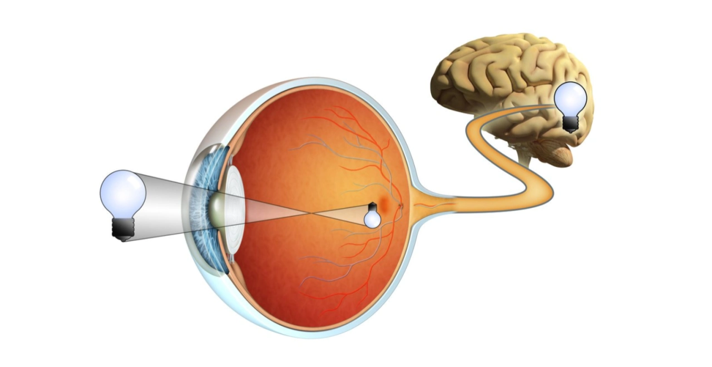
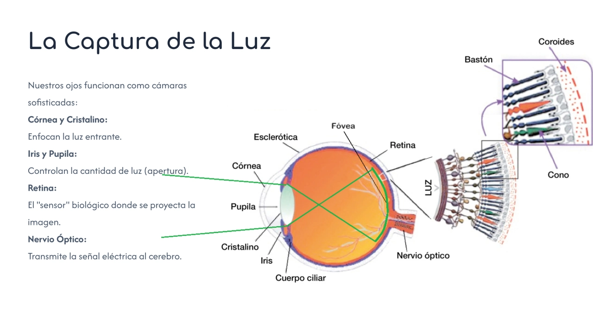
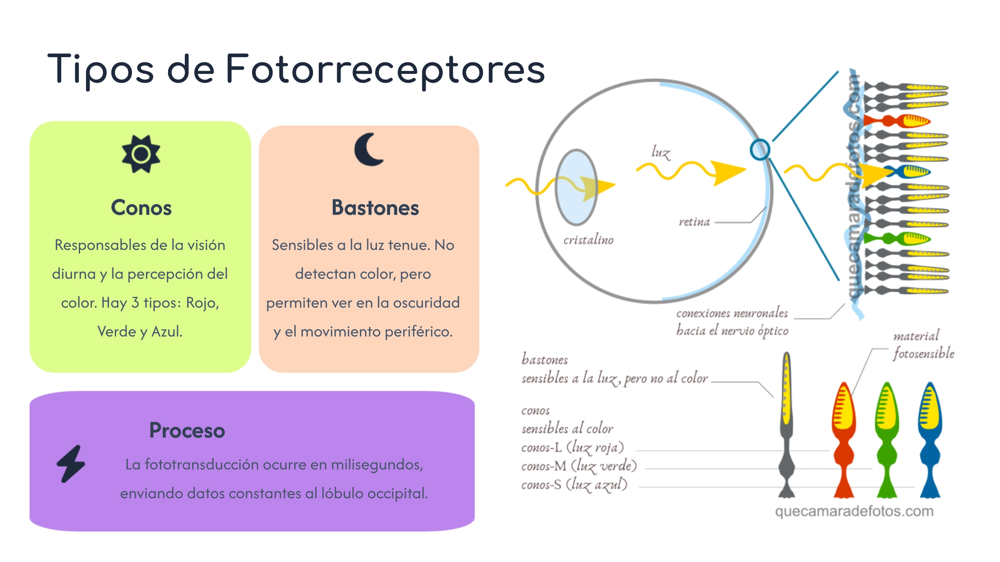
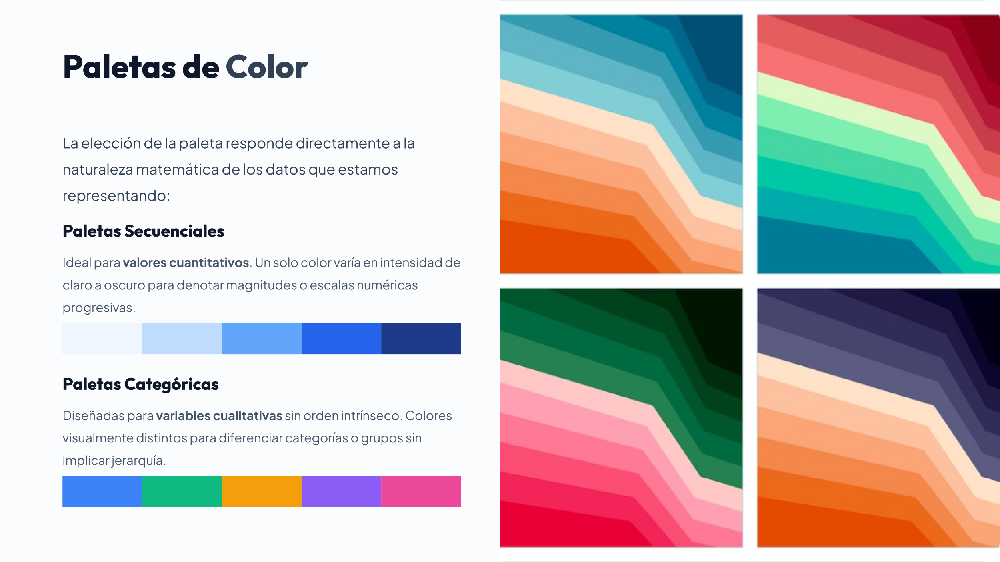
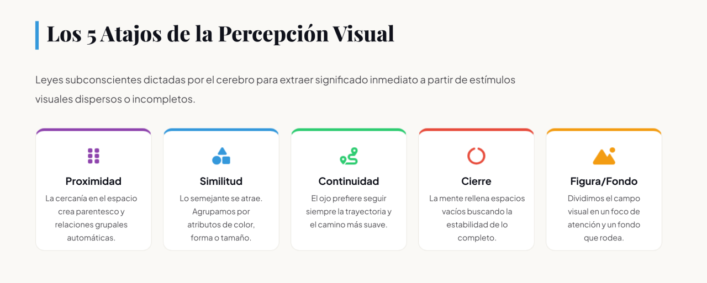
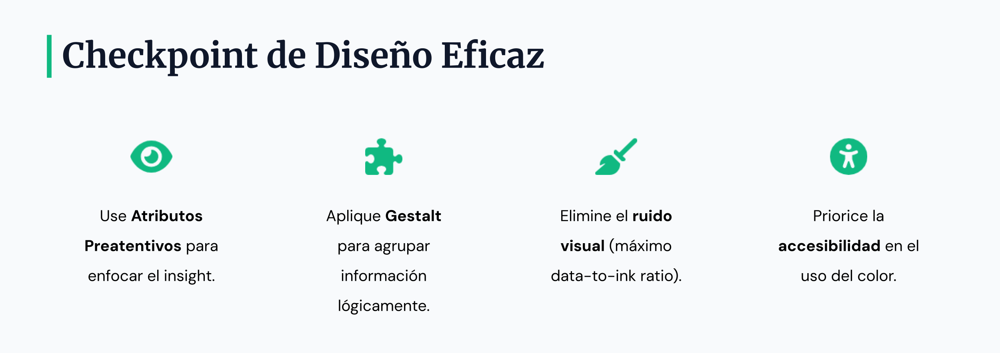

Los **principios de percepción humana** son fundamentales para la visualización de datos, ya que aprovechan la forma en que nuestro cerebro procesa la información visual de manera automática y eficiente.

## El Sistema Visual

El proceso de visión no ocurre únicamente en los ojos, sino principalmente en el **cerebro**. Mientras que la retina actúa como una membrana sensorial que convierte la luz en señales nerviosas, el cerebro es el encargado de identificar objetos y patrones basándose en experiencias pasadas.
*   **Capacidad de procesamiento:** Aproximadamente una **cuarta parte del cerebro humano** está involucrada en el procesamiento visual, lo que supera a cualquier otro sentido.

*   **Jerarquía cognitiva:** La percepción ocurre de forma jerárquica; primero se identifican elementos simples como bordes y esquinas, luego formas genéricas y, finalmente, la semántica del objeto (por ejemplo, reconocer que es un rostro).

*   **Efecto de superioridad de la imagen:** Los seres humanos retienen mucho mejor la información presentada en imágenes (65%) que la presentada solo en texto o audio (10%) después de tres días.

### Biología de la precepción

### La Atención y los Atributos Preatentivos
Nuestra atención se dirige mediante mecanismos que ocurren antes de que seamos conscientes de ellos.
*   **Memoria Icónica:** Es una memoria de cortísima duración que se sintoniza con los **atributos preatentivos**, permitiéndonos detectar diferencias en el entorno casi instantáneamente (en menos de **250 milisegundos**).

*   **Búsqueda Preatentiva ("Pop-out"):** Ciertos objetos "saltan" a la vista si difieren significativamente de su entorno en una sola propiedad visual, como el color o la forma.

*   **Limitaciones:** La memoria a corto plazo solo puede manejar unos **cuatro fragmentos de información** visual a la vez, por lo que saturar una gráfica con demasiados colores o formas sobrecarga la capacidad cognitiva del espectador.

### El Color
El color es la herramienta más poderosa pero también la más mal utilizada en la comunicación visual.
*   **Componentes:** Se define por su **tono** (*hue* o el nombre del color), **saturación** (*chroma* o intensidad) y **luminancia** (*brightness*).
*   **Uso Estratégico:** Debe usarse de forma **parca y consistente** para resaltar un solo punto de dato o serie, evitando "el arcoíris" que impide que algo destaque realmente.
*   **Paletas:** Se recomiendan paletas **secuenciales** (un solo color que varía en intensidad) para valores cuantitativos, y paletas **categóricas** (colores distintos) para variables cualitativas sin orden intrínseco.
*   **Accesibilidad (Daltonismo):** Cerca del 8% de los hombres sufren deficiencia de visión cromática, especialmente entre el **rojo y el verde**. Se recomienda usar paletas de **azul y naranja** para garantizar que todos puedan distinguir los datos.

### La Forma
La forma permite codificar información a través de diversos atributos que el sistema visual reconoce rápidamente:
*   **Atributos de forma:** Incluyen la **orientación, el tamaño, la longitud de línea, el ancho de línea y la curvatura**.
*   **Percepción de cantidad:** El cerebro asocia naturalmente la longitud de una línea o el tamaño de una burbuja con valores cuantitativos; por ejemplo, una línea más larga representa un valor mayor.
*   **Precisión:** Los humanos somos mucho más precisos juzgando la **longitud** (como en gráficos de barras) que juzgando **áreas** (como en gráficos de burbujas o sectores), donde solemos subestimar o sobreestimar las diferencias.

### La Posición
La ubicación espacial es el atributo preatentivo más efectivo para representar datos ordenados o continuos.
*   **Patrón de lectura en "Z":** Sin otros estímulos, la audiencia procesa la información empezando por la esquina superior izquierda y moviéndose en zigzag hacia la derecha y hacia abajo. Por ello, lo más importante debe colocarse en la parte superior izquierda.
*   **Alineación:** Crear líneas verticales y horizontales limpias mediante la alineación de títulos y ejes genera una sensación de unidad y reduce el desorden visual.
*   **Línea base común:** Los gráficos de barras deben tener siempre una **línea base en cero**, ya que el cerebro compara los puntos finales de las barras respecto a ese origen para evaluar magnitudes.

### Agrupamiento (Principios de la Gestalt)

Los psicólogos de la Gestalt identificaron cómo el cerebro organiza piezas individuales en un "todo organizado".
*   **Proximidad:** Los objetos físicamente cercanos se perciben como parte de un mismo grupo.
*   **Similitud:** Objetos con color, forma o tamaño parecido se asocian entre sí.
*   **Encierro:** El uso de sombreado o bordes para rodear elementos indica que pertenecen a una categoría distinta (ej. separar datos reales de pronósticos).
*   **Cierre:** El cerebro tiende a percibir formas completas incluso si falta una parte del borde; esto permite eliminar bordes de gráficos sin perder la estructura.
*   **Continuidad:** Los ojos siguen el camino más suave; por ejemplo, percibimos que las barras están alineadas aunque no haya una línea de eje explícita.
*   **Conexión:** Los objetos unidos físicamente por una línea se perciben como un grupo con una relación más fuerte que la simple similitud (ej. líneas que conectan puntos en un gráfico de series temporales).

## Gestalt

La **Teoría Gestalt**, desarrollada por psicólogos en Alemania durante la década de 1920, se basa en el concepto de que el cerebro humano percibe las cosas como un **"todo organizado"**. En el contexto de la visualización de datos, estos principios son herramientas esenciales para ayudar a la audiencia a distinguir rápidamente entre la **señal** (la información importante) y el **ruido** (elementos innecesarios o distractores).

A continuación, se detallan los principios fundamentales aplicados a la comunicación visual:

### Proximidad (Proximity)
Este principio establece que los objetos que están **espacialmente cerca** unos de otros tienden a percibirse como parte de un mismo grupo.
*   **Aplicación en visualización:** En el diseño de tablas, simplemente ajustando el espaciado entre puntos o números, se puede dirigir la mirada del lector para que lea a través de las filas o hacia abajo en las columnas sin necesidad de líneas divisorias. En los gráficos, colocar las etiquetas de datos directamente junto a los puntos de datos (en lugar de una leyenda separada) utiliza la proximidad para eliminar el esfuerzo mental de "buscar y comparar".

### Similitud (Similarity)
Los objetos que comparten **atributos visuales similares**, como color, forma, tamaño u orientación, se perciben como relacionados o pertenecientes a un grupo común.
*   **Aplicación en visualización:** El color es la herramienta de similitud más potente. Se puede utilizar el mismo color en un título o una anotación de texto y en la serie de datos correspondiente dentro del gráfico para indicar visualmente que ambos elementos están vinculados. Esto permite que la audiencia asocie la información sin necesidad de explicaciones adicionales.

### Continuidad (Continuity)
Nuestros ojos buscan el **camino más suave** y tienden a crear continuidad en lo que vemos, incluso si hay interrupciones explícitas. Percibimos los objetos parcialmente ocultos como formas familiares completas.
*   **Aplicación en visualización:** En un gráfico de barras, no es necesario dibujar una línea de eje vertical (eje Y); la alineación de las barras crea un camino visual que permite al cerebro "ver" la base común. Las líneas de puntos para proyecciones o pronósticos también aprovechan este principio: el cerebro sigue la trayectoria de la línea aunque esté fragmentada.

### Cierre (Closure)
Este principio indica que las personas tienden a percibir conjuntos de elementos individuales como una **forma única y reconocible** cuando es posible; si faltan partes de un borde, nuestros ojos llenan el vacío.
*   **Aplicación en visualización:** La mayoría de las aplicaciones de gráficos incluyen por defecto bordes y sombreados de fondo. El principio de cierre demuestra que estos son innecesarios; un gráfico sigue pareciendo una entidad cohesiva sin bordes externos, lo que libera "tinta" y permite que los datos destaquen más.

### Figura-Fondo (Figure-Ground)
Este concepto se refiere a nuestra tendencia a organizar los elementos visuales separándolos en aquellos que están en el **primer plano** (la figura o el foco) y los que están en el **fondo**.
*   **Aplicación en visualización:** Es vital para crear una **jerarquía visual**. El analista debe decidir qué datos deben "saltar" a la vista (usando colores intensos o tamaños mayores) y cuáles deben empujarse al fondo (usando tonos grises o líneas más finas) para que sirvan solo como contexto sin competir por la atención. El uso estratégico del gris es fundamental para mantener elementos necesarios (como ejes o cuadrículas) sin que distraigan del mensaje principal.

## Busqueda preatentiva

La **búsqueda preatentiva** (o procesamiento preatentivo) es un proceso del sistema visual humano que permite detectar de forma casi instantánea y subconsciente ciertos atributos en una imagen, sin necesidad de un esfuerzo mental consciente o un escaneo secuencial.

A continuación se detallan los componentes clave de este concepto:

### Mecanismo y Velocidad
Este fenómeno ocurre en la **memoria icónica**, que es una memoria sensorial de cortísima duración sintonizada con atributos visuales específicos. Se considera que una tarea es preatentiva si se completa en menos de **200 a 250 milisegundos**, lo cual sucede antes de que el cerebro procese la información de manera consciente.

### El efecto "Pop-out" (Salto Visual)
Ciertos objetos en nuestro campo visual "saltan" a la vista (perceptual pop-out) cuando difieren significativamente de lo que los rodea en una sola propiedad visual. Por ejemplo:
*   Es mucho más rápido encontrar un círculo azul en un mar de círculos amarillos (canal de **color**) que encontrar un círculo entre una multitud de triángulos (canal de **forma**).
*   El canal de color suele ser más fuerte y efectivo para generar este efecto que el canal de forma.

### Atributos Preatentivos Principales
Los diseñadores de visualizaciones aprovechan una serie de atributos físicos que el cerebro identifica de manera automática:
*   **Color:** Tono (hue) e intensidad (saturación). El uso de un color contrastante es la herramienta más poderosa para dirigir la atención.

*   **Forma:** Orientación, tamaño, longitud de línea, ancho de línea, curvatura y marcas añadidas.

*   **Posición Espacial:** Ubicación en 2D, que permite ver grupos (clusters) o valores atípicos (outliers) instantáneamente.

*   **Movimiento:** Animación o parpadeo (aunque este último se recomienda usar con cautela por ser potencialmente molesto).

### Importancia en la Visualización de Datos
El objetivo de utilizar la búsqueda preatentiva es **reducir el tiempo de obtención de información** (*time to insight*). Al emplear estos atributos estratégicamente, el analista puede:
*   **Señalar qué es lo importante:** El espectador ve lo que el diseñador quiere antes de saber que lo está viendo.

*   **Crear una jerarquía visual:** Permite guiar a la audiencia a través del gráfico en el orden deseado, empujando los elementos secundarios al fondo (usualmente mediante tonos grises) y resaltando el mensaje principal.

*   **Diferenciar señal de ruido:** Ayuda a que los datos críticos no se pierdan en el desorden visual.

**Nota sobre su uso:** Para que estos atributos funcionen, deben usarse de forma **simple y consistente**. Si se resaltan demasiados elementos a la vez, pierden su valor preatentivo y el visual se convierte de nuevo en una tarea de búsqueda lenta y consciente.

### Resumen
Dominar los principios de la Gestalt permite al diseñador de información **eliminar el desorden visual** y reducir la carga cognitiva de la audiencia. Al aplicar estas reglas, se crean visualizaciones que se sienten "correctas" y organizadas, facilitando que el cerebro procese la información de manera automática y eficiente.