:::info
[](https://colab.research.google.com/drive/1ryr52KS0XYHr-Ws6J9tSOFnrpPb3ZVfW)

Información adicional:
- [Guía de usuario](https://matplotlib.org/stable/users/index.html#)
- [Cheatsheet](https://matplotlib.org/cheatsheets/)
:::

**Matplotlib** es la biblioteca de Python más conocida y utilizada para la creación de gráficos y visualizaciones de datos bidimensionales de alta calidad. Fue diseñada originalmente por John Hunter para ofrecer una interfaz de trazado similar a MATLAB dentro de Python, y permite generar figuras aptas para su publicación en una amplia variedad de formatos (PDF, PNG, SVG, etc.).

Es una herramienta fundamental en el ecosistema científico, ya que sirve de base para otras bibliotecas como **Seaborn** y tiene una integración nativa muy fuerte con **Pandas**.

**Matplotlib** utiliza un concepto de "figura" para el despliegue de un gráfico, esta contiene ejes (Axes)donde se agrupan todos los elementos del gráfico que incluyen: titulos, leyendas e incluso otras figuras.

Se espera el uso de arrays de numpy para plotear, y por ende es recomendable para obtener los mejores resultados usar una conversion como numpy.matrix.

Existen dos formas de generar gráficos en Matplotlib:
1. **Explicita**: Crear Figuras y Axes y usando métodos OOP (orientado a objetos)
1. **Implicita**: Utiliza Pyplot para generar Figuras y Axes, mediante las funciones propias de pyplot

**Instalación:**
```python
# pip
pip install matplotlib
# conda
conda install -c conda-forge matplotlib
# uv
uv add matplotlib
```
```python
# Para uso en jupyter
%matplotlib inline
```

## Uso básicos

Para utilizarla, habitualmente se importa el módulo `pyplot` con el alias `plt`:
```python showLineNumbers
import matplotlib.pyplot as plt
import numpy as np
```
#### Anatomía de un gráfico

La gran mayoría de gráficos comparten los mismos elementos:
- Un área de gráficos
- Ejes, que contienen los valores, categorías y marcas, mayores y menores
- Valores, contenidos en líneas o barras u otros

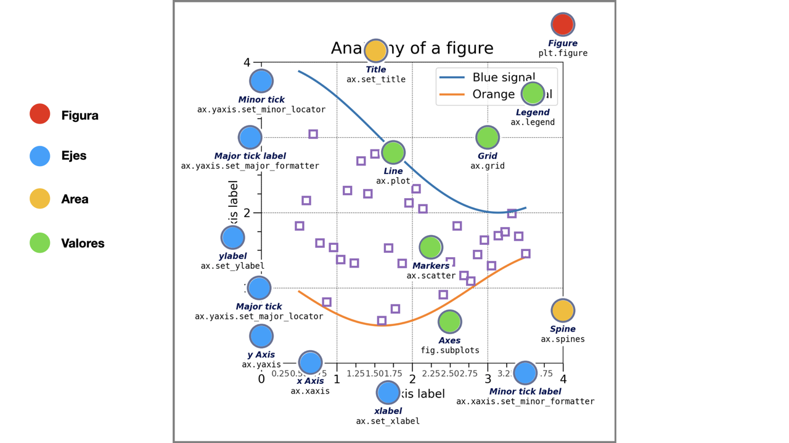

Por lo que el aprendizaje en uno de ellos facilita aprender otro nuevo.

#### Principios de Visualización y Estética de Datos con Matplotlib

La librería Matplotlib es el vehículo para transformar conjuntos de números en visiones comprensibles. Un gráfico efectivo requiere componentes que guíen la percepción:
- **Identificación**: El uso de títulos y etiquetas de ejes (xlabel / ylabel) es obligatorio para que el analista comprenda las variables en juego.

- **Contexto**: Las leyendas (legend) son esenciales para diferenciar múltiples series de datos y evitar la confusión visual.

- **Enfoque**: La técnica de "explode" en gráficos de pastel permite resaltar información específica (como destacar el tiempo de "comida" frente al resto del día) separando físicamente una porción del resto.

#### Estética, Teoría del Color y Estilo
La configuración estética no es solo decorativa; facilita que el cerebro identifique rangos de probabilidad:
- **Códigos de Color**: Se emplean abreviaturas como m (magenta), c (cian), r (rojo) y k (negro).

- **Estilos Visuales**: Plantillas como ggplot o fivethirtyeight estandarizan la legibilidad.

- **Sombreado (alpha)**: Este parámetro de transparencia es crítico. En el proyecto de los paquetes de papas fritas, el uso de alpha permite visualizar el área Amarilla (datos dentro de la tolerancia de peso) versus el área Roja (fuera de rango), definiendo visualmente las zonas de probabilidad en la curva de distribución.

Esta estructura estética permite que el cerebro identifique tendencias y anomalías de forma casi instantánea, antes incluso de procesar el dato numérico.

## Tipos de Gráficos y su función perceptiva

Cada elección gráfica debe responder a la pregunta: ¿Para qué sirve esto al analista?
- **Gráfico de Barras**: Ideal para la comparación visual directa entre categorías discretas. Permite juzgar magnitudes relativas de un vistazo.

- **Histograma**: A diferencia de las barras, se usa para ver la distribución de una muestra en rangos (bins). Es la herramienta para entender, por ejemplo, cómo se reparte una población en grupos de edad.

- **Gráfico de Dispersión (Scatter Plot)**: Perfecto para revelar la relación entre dos variables y, vitalmente, para cazar valores atípicos (outliers).

- **Stack Plot**: Diseñado para mostrar la contribución de varios activos a un total. Su valor real es identificar desequilibrios en la asignación de recursos, como notar que el tiempo de "Chill" consume excesivamente las horas de un domingo en comparación con el tiempo de "Work".

### Gráfico de líneas
Es el tipo de gráfico por defecto. Puedes pasarle una lista de números y Matplotlib se encarga de generar los ejes y trazar la línea.
- **Concepto**: Mostrar la tendencia de una variable continua a lo largo del tiempo. Simula los datos de pasajeros de una aerolínea.
```python showLineNumbers
import matplotlib.pyplot as plt
import numpy as np

# 1. Crear datos que simulan el crecimiento mensual de pasajeros de una aerolínea
meses = np.arange(1, 13)
pasajeros = [112, 118, 132, 129, 121, 135, 148, 148, 136, 119, 104, 118]

# 2. Inicializar la figura y graficar
plt.figure(figsize=(8, 4))
plt.plot(meses, pasajeros, marker='o', color='b', linestyle='-', linewidth=2)

# 3. Añadir etiquetas básicas indispensables
plt.title('Evolución Mensual de Pasajeros (Año Simulado)')
plt.xlabel('Meses del Año')
plt.ylabel('Cantidad de Pasajeros (en miles)')
plt.xticks(meses) # Asegura que se muestren todos los números del 1 al 12

# 4. Mostrar gráfico
plt.grid(True, linestyle=':', alpha=0.6)
plt.show()
```
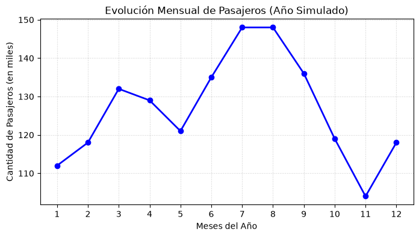


### Gráfico de dispersión
Útil para visualizar puntos individuales y encontrar relaciones entre variables.
- **Set de datos**: Diabetes Dataset (Estandarizado en scikit-learn).
- **Concepto**: Evaluar si existe correlación visual entre dos variables continuas (Edad e Índice de Masa Corporal).
```python showLineNumbers
import matplotlib.pyplot as plt
from sklearn.datasets import load_diabetes

# 1. Cargar el dataset real de pacientes con diabetes
diabetes = load_diabetes(as_frame=True)
df = diabetes.frame

# 2. Graficar la relación entre la edad y el índice de masa corporal (BMI)
plt.figure(figsize=(8, 5))
plt.scatter(df['age'], df['bmi'], alpha=0.6, color='coral', edgecolors='darkred')

# 3. Personalización del gráfico
plt.title('Análisis de Dispersión: Edad vs. IMC en Pacientes')
plt.xlabel('Edad (Estandarizada)')
plt.ylabel('Índice de Masa Corporal (Estandarizado)')
plt.grid(True, linestyle='--', alpha=0.5)

plt.show()
```
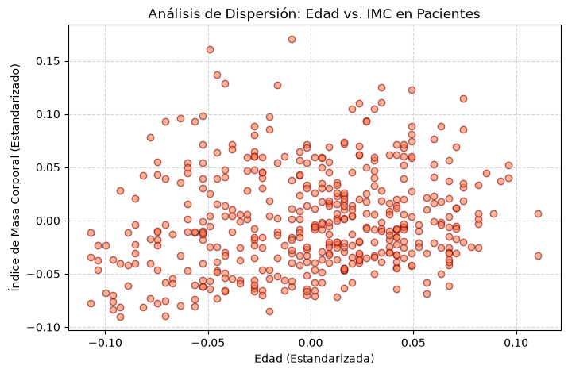

### Barras
- **Concepto**: Comparar cantidades discretas entre diferentes grupos. Usaremos datos simulados de ventas por categorías de productos.

```python showLineNumbers
import matplotlib.pyplot as plt

# 1. Definir categorías y valores reales de rendimiento comercial
categorias = ['Electrónica', 'Ropa', 'Hogar', 'Libros', 'Juguetes']
ventas = [45000, 32000, 28000, 15000, 22000]

# 2. Configurar la figura
plt.figure(figsize=(8, 5))
plt.bar(categorias, ventas, color='teal', edgecolor='black', alpha=0.8)

# 3. Personalizar detalles estéticos básicos
plt.title('Ventas Totales por Categoría de Producto', fontsize=14, fontweight='bold')
plt.xlabel('Categorías')
plt.ylabel('Ingresos ($)')
plt.grid(axis='y', linestyle='--', alpha=0.7) # Solo rejilla horizontal

# 4. Mostrar resultado
plt.show()
```
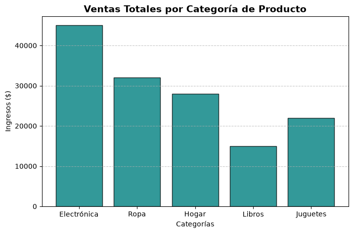


### Barras apiladas
En este tipo de gráfico se define una variable "bottom" para establecer la apilación y orden de las series.
- Cuándo usar
    - Para mostrar la composición de un total por categoría (qué parte aporta cada subserie al total).
    - Cuando el interés principal es el total y la proporción relativa de las partes (p. ej. participación de mercado, desglose presupuestario).
    - Cuando hay pocas subseries por barra (recomendable ≤ 4–5) y las diferencias son claras.

- Cuándo no usar
    - Si necesitas comparar valores absolutos de una misma subserie entre categorías (las subseries apiladas son difíciles de comparar salvo la base).
    - Cuando hay muchas subseries o muchas barras: el gráfico se vuelve confuso.
    - Si existen valores negativos que complican la apilación.
    - Para comparaciones precisas entre pequeñas porciones — en ese caso, mejor barras agrupadas o small multiples.

- Buenas prácticas
    - Limitar el número de subseries; agrupar las muy pequeñas en “Otros”.
    - Ordenar las subseries de forma consistente (p. ej. del mismo criterio en todas las barras) o por importancia para facilitar la lectura.
    - Mostrar totales encima de cada barra si el total es relevante.
    - Ofrecer una versión normalizada (100%) si interesa comparar proporciones en lugar de valores absolutos.
    - Usar paletas de colores contrastantes y accesibles (color‑blind friendly) y evitar efectos 3D.
    - Añadir etiquetas/porcentajes visibles (autopct) y una leyenda clara; considerar anotaciones directas sobre las porciones más importantes.
    - Usar barras horizontales si las categorías tienen etiquetas largas.
    - Considerar alternativas cuando se necesite comparar subseries entre categorías: barras agrupadas, small multiples, o líneas.
    - Mantener el orden y la paleta consistentes entre múltiples gráficos para facilitar comparaciones.

```python showLineNumbers
plt.bar(years, nivel1, label='Nivel 1', color='blue')
plt.bar(years, nivel2, label='Nivel 2', color='orange', bottom=nivel1)
plt.bar(years, nivel3, label='Nivel 3', color='green', bottom=nivel1+nivel2)
plt.bar(years, nivel4, label='Nivel 4', color='red', bottom=nivel1+nivel2+nivel3)
plt.bar(years, nivel5, label='Nivel 5', color='purple', bottom=nivel1+nivel2+nivel3+nivel4)

# añadir etiquetas y título

plt.xlabel('Años de examen')
plt.ylabel('Puntajes')
plt.title('Puntajes a lo largo de los años', fontsize=18)
plt.xlabel('Años de examen', fontsize=14)
plt.ylabel('Puntajes', fontsize=14)

plt.xticks(fontsize=10)
plt.yticks(fontsize=10)
plt.legend(loc='upper center', ncol=5)
plt.gcf().set_size_inches(12, 8)

plt.show()

```
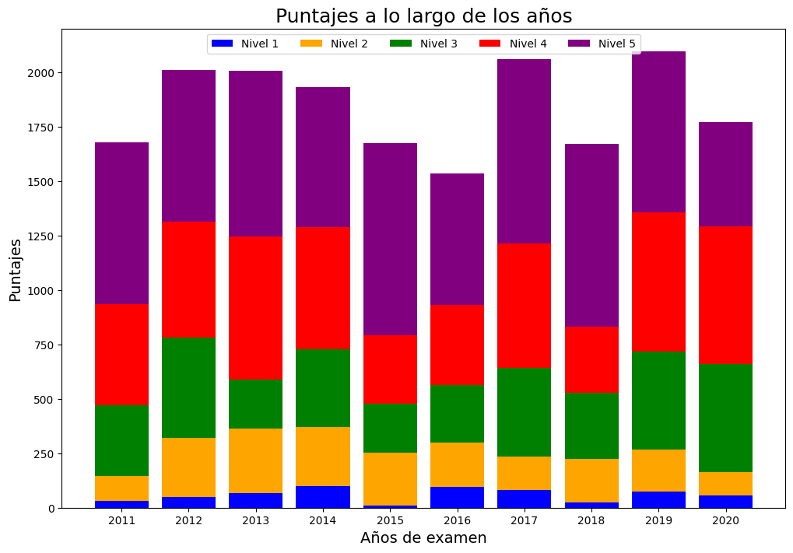

**Cambio de color**
```python showLineNumbers
import matplotlib.pyplot as plt
# establece paleta de colores Pastel1 para las barras
plt.rcParams['axes.prop_cycle'] = plt.cycler(color=plt.cm.Pastel1.colors)

plt.bar(years, nivel1, label='Nivel 1')
plt.bar(years, nivel2, label='Nivel 2', bottom=nivel1)
plt.bar(years, nivel3, label='Nivel 3', bottom=nivel1+nivel2)
plt.bar(years, nivel4, label='Nivel 4', bottom=nivel1+nivel2+nivel3)
plt.bar(years, nivel5, label='Nivel 5', bottom=nivel1+nivel2+nivel3+nivel4)

# añadir etiquetas y título

plt.xlabel('Años de examen')
plt.ylabel('Puntajes')
plt.title('Puntajes a lo largo de los años', fontsize=18)
plt.xlabel('Años de examen', fontsize=14)
plt.ylabel('Puntajes', fontsize=14)

plt.xticks(fontsize=10)
plt.yticks(fontsize=10)
plt.legend(loc='upper center', ncol=5)
plt.gcf().set_size_inches(12, 8)

plt.show()
```
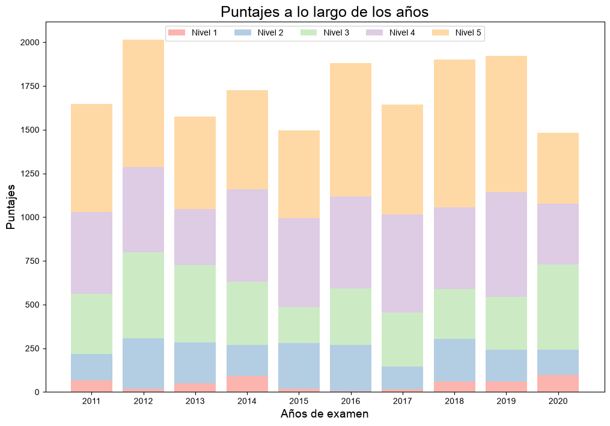

### Histograma
Ideal para explorar la distribución de un conjunto de datos.
- **Set de datos**: Iris Dataset (Atributos morfológicos de flores).
- **Concepto**: Visualizar la forma en la que se distribuye una sola variable para entender su asimetría o concentraciones.
```python showLineNumbers
import matplotlib.pyplot as plt
from sklearn.datasets import load_iris

# 1. Cargar el dataset real Iris
iris = load_iris()
# Seleccionamos la primera columna: "Sepal Length" (Largo del sépalo)
largo_sepalo = iris.data[:, 0] 

# 2. Crear el histograma especificando el número de contenedores (bins)
plt.figure(figsize=(8, 5))
plt.hist(largo_sepalo, bins=12, color='skyblue', edgecolor='navy', alpha=0.7)

# 3. Añadir líneas estadísticas básicas de referencia (Opcional pero recomendado)
media = largo_sepalo.mean()
plt.axvline(media, color='red', linestyle='dashed', linewidth=2, label=f'Media: {media:.2f} cm')

# 4. Configurar etiquetas
plt.title('Distribución del Largo del Sépalo (Dataset Iris)')
plt.xlabel('Medida del Sépalo (cm)')
plt.ylabel('Frecuencia (Número de Flores)')
plt.legend()
plt.grid(True, alpha=0.3)

plt.show()
```
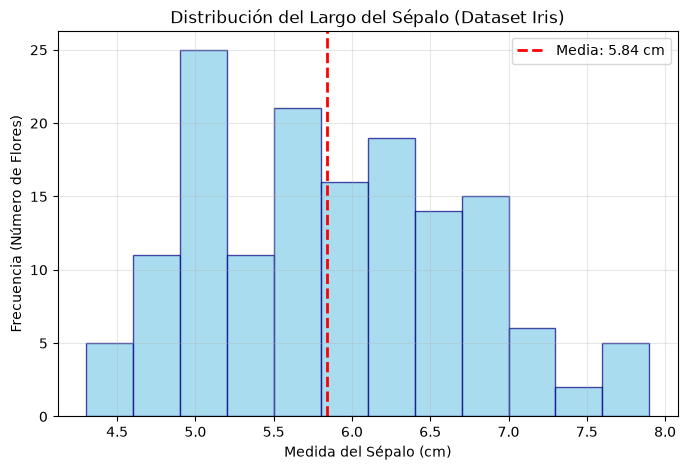

### Torta o Pie

Los gráficos de torta (pie charts) muestran cómo se reparte un todo en partes; cada porción representa la proporción de una categoría respecto al total.

- Usos adecuados
    - Visualizar la composición relativa (porcentajes) de un conjunto con pocas categorías.
    - Mostrar participación de cada categoría cuando el interés es la proporción del total (share).
    - Paneles y resúmenes donde una vista rápida de “qué parte ocupa cada cosa” es suficiente.

- Cuándo conviene usarlos
    - Cuando hay pocas categorías (recomendable ≤ 5).
    - Cuando las diferencias entre partes son grandes y fáciles de distinguir.
    - Cuando el objetivo es comunicar proporciones, no comparar valores exactos entre categorías.

- Cuándo evitarlos
    - Muchas categorías o muchas porciones pequeñas (mejor usar barras).
    - Valores muy similares que requieren comparación precisa (usar gráfico de barras).
    - Series temporales o datos con valores negativos.

- Buenas prácticas
    - Mostrar porcentajes y/o valores absolutos (autopct, etiquetas claras).
    - Ordenar las porciones (p. ej. descendente) y agrupar los muy pequeños en “Otros”.
    - Evitar efectos 3D y exageraciones visuales; preferir paletas de colores legibles.
    - Considerar un donut (anillo) si se quiere colocar una etiqueta central o enfatizar menos el volumen.
    - Si la audiencia necesita comparar categorías, usar un gráfico de barras en su lugar.


```python showLineNumbers
plt.pie(nivel1, labels=years, autopct='%1.1f%%', startangle=140)
plt.title('Distribución del Nivel 1 a lo largo de los años', fontsize=16)
plt.gcf().set_size_inches(6,6)
plt.show()
```
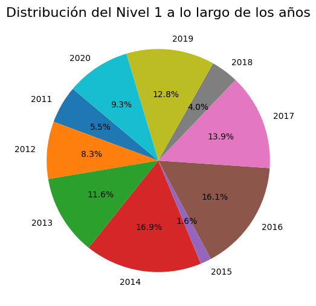


**cambio de color**
```python showLineNumbers
# color pastel para el gráfico de pastel
plt.rcParams['axes.prop_cycle'] = plt.cycler(color=plt.cm.Pastel1.colors)

plt.pie(nivel1, labels=years, autopct='%1.1f%%', startangle=140)
plt.title('Distribución del Nivel 1 a lo largo de los años', fontsize=16)
plt.gcf().set_size_inches(6,6)
plt.show()
```
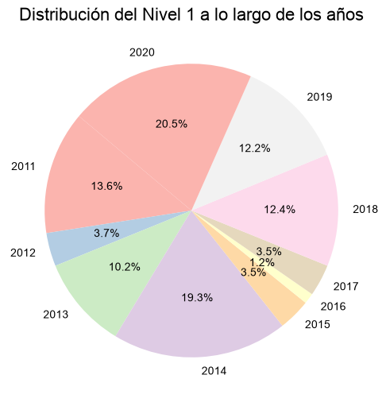

Crear un gráfico que reune todos los niveles de puntaje en 2 columnas.

```python showLineNumbers
fig, axs = plt.subplots(3, 2, figsize=(12, 18))
niveles = [nivel1, nivel2, nivel3, nivel4, nivel5]
titulos = ['Nivel 1', 'Nivel 2', 'Nivel 3', 'Nivel 4', 'Nivel 5']

for i, (nivel, titulo) in enumerate(zip(niveles, titulos)):
    row, col = divmod(i, 2)
    axs[row, col].pie(nivel, labels=years, autopct='%1.1f%%', startangle=140)
    axs[row, col].set_title(f'Distribución del {titulo}', fontsize=16)
    axs[row, col].figure.set_size_inches(12, 12)

# Eliminar el subplot vacío (última celda)
axs[2, 1].axis('off')

plt.tight_layout()
plt.show()
```
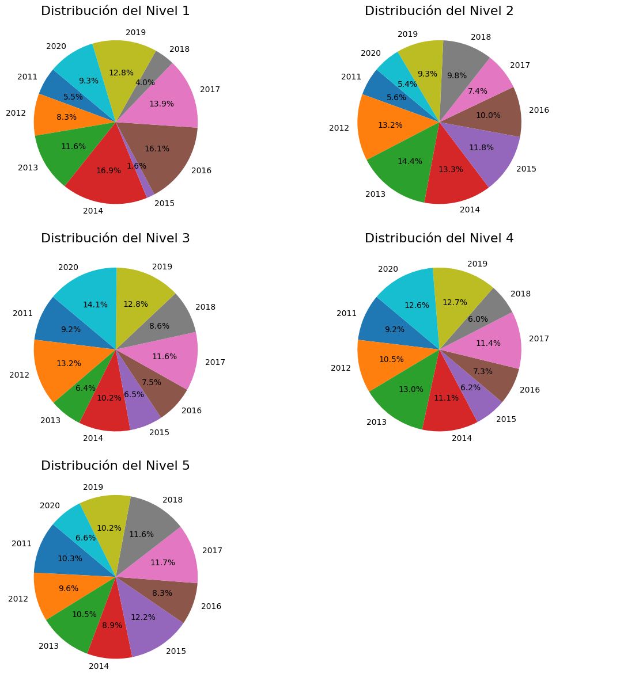

## Color

https://matplotlib.org/stable/gallery/color/index.html

<details>
<summary>Colores en Matplotlib ...</summary>
```python showLineNumbers
import matplotlib.pyplot as plt
import numpy as np

cmaps = [('Perceptually Uniform Sequential', [
            'viridis', 'plasma', 'inferno', 'magma', 'cividis']),
         ('Sequential', [
            'Greys', 'Purples', 'Blues', 'Greens', 'Oranges', 'Reds',
            'YlOrBr', 'YlOrRd', 'OrRd', 'PuRd', 'RdPu', 'BuPu',
            'GnBu', 'PuBu', 'YlGnBu', 'PuBuGn', 'BuGn', 'YlGn']),
         ('Sequential (2)', [
            'gray', 'bone', 'pink', 'spring', 'summer', 'autumn', 'winter',
            'cool', 'Wistia', 'hot', 'afmhot', 'gist_heat', 'copper']),
         ('Diverging', [
            'PiYG', 'PRGn', 'BrBG', 'PuOr', 'RdGy', 'RdBu',
            'RdYlBu', 'RdYlGn', 'Spectral', 'coolwarm', 'bwr', 'seismic',
            'berlin', 'managua', 'vanimo']),
         ('Cyclic', ['twilight', 'twilight_shifted', 'hsv']),
         ('Qualitative', [
            'Pastel1', 'Pastel2', 'Paired', 'Accent',
            'Dark2', 'Set1', 'Set2', 'Set3',
            'tab10', 'tab20', 'tab20b', 'tab20c']),
         ('Miscellaneous', [
            'flag', 'prism', 'ocean', 'gist_earth', 'terrain', 'gist_stern',
            'gnuplot', 'gnuplot2', 'CMRmap', 'cubehelix', 'brg',
            'gist_rainbow', 'rainbow', 'jet', 'turbo', 'nipy_spectral',
            'gist_ncar'])]

gradient = np.linspace(0, 1, 256)
gradient = np.vstack((gradient, gradient))


def plot_color_gradients(cmap_category, cmap_list):
    # Create figure and adjust figure height to number of colormaps
    nrows = len(cmap_list)
    figh = 0.35 + 0.15 + (nrows + (nrows-1)*0.1)*0.22
    fig, axs = plt.subplots(nrows=nrows, figsize=(6.4, figh))
    fig.subplots_adjust(top=1-.35/figh, bottom=.15/figh, left=0.2, right=0.99)

    axs[0].set_title(f"{cmap_category} colormaps", fontsize=14)

    for ax, cmap_name in zip(axs, cmap_list):
        ax.imshow(gradient, aspect='auto', cmap=cmap_name)
        ax.text(-.01, .5, cmap_name, va='center', ha='right', fontsize=10,
                transform=ax.transAxes)

    # Turn off *all* ticks & spines, not just the ones with colormaps.
    for ax in axs:
        ax.set_axis_off()


for cmap_category, cmap_list in cmaps:
    plot_color_gradients(cmap_category, cmap_list)
```
</details>

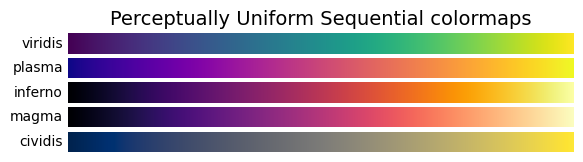

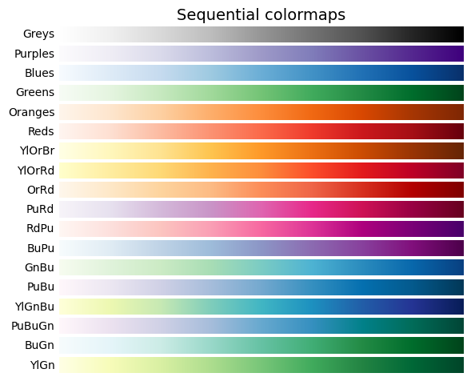

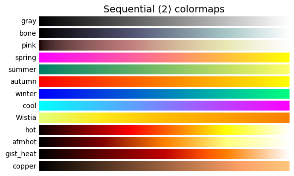

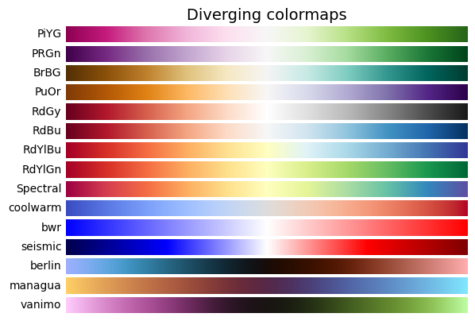


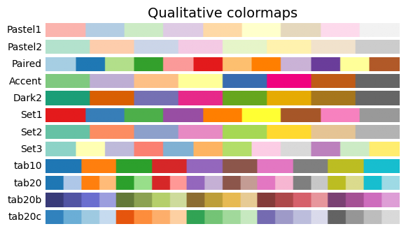

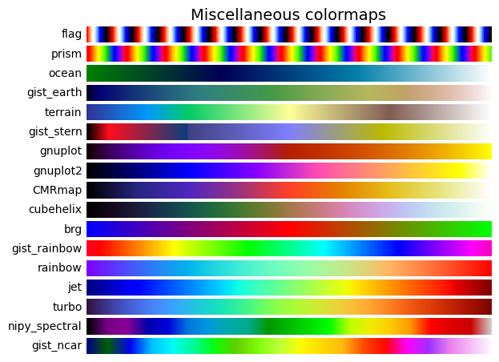

## Subplots

### Figuras

Matplotlib ofrece amplia flexbilidad para la distribución de subplots en la forma de figuras.

:::info[Referencia]
https://matplotlib.org/stable/users/explain/figure/figure_intro.html#viewing-figures
:::

```python showLineNumbers
# establecer tamaño de figura del grafico y diseño ajustado
fig, axs = plt.subplots(2, 2, figsize=(10, 6), layout='constrained')
```
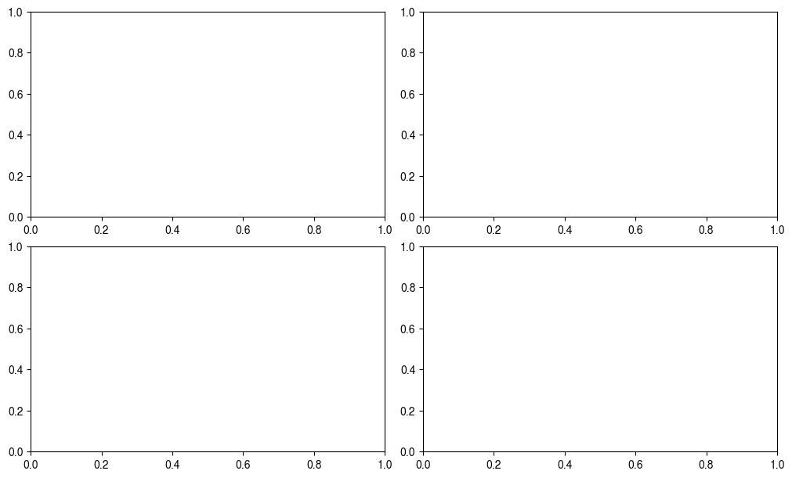

```python showLineNumbers
fig, axs = plt.subplot_mosaic([['A', 'right'], ['B', 'right']],
                            figsize=(8, 6), layout='constrained')
for ax_name, ax in axs.items():
    ax.text(0.5, 0.5, ax_name, ha='center', va='center')
```
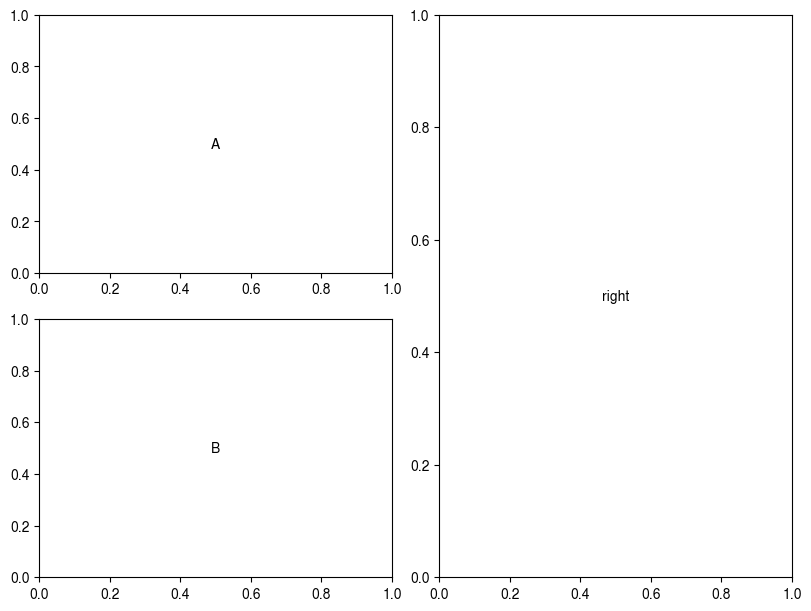

#### Subplots Múltiples Básicos

- **Set de datos**: Iris Dataset (Comparación de múltiples variables).
- **Concepto**: Organizar más de una gráfica en una sola ventana utilizando plt.subplots para comparar diferentes perspectivas de los datos.
```python showLineNumbers
import matplotlib.pyplot as plt
from sklearn.datasets import load_iris

# 1. Preparar datos
iris = load_iris()
X = iris.data
nombres_caracteristicas = iris.feature_names

# 2. Crear una matriz de subgráficos de 1 fila y 2 columnas
fig, (ax1, ax2) = plt.subplots(nrows=1, ncols=2, figsize=(14, 5))

# 3. Primer Subgráfico (Izquierda): Largo vs Ancho del Sépalo
ax1.scatter(X[:, 0], X[:, 1], color='purple', alpha=0.7)
ax1.set_title('Sépalo: Largo vs Ancho')
ax1.set_xlabel(nombres_caracteristicas[0])
ax1.set_ylabel(nombres_caracteristicas[1])
ax1.grid(True, linestyle=':')

# 4. Segundo Subgráfico (Derecha): Largo vs Ancho del Pétalo
ax2.scatter(X[:, 2], X[:, 3], color='green', alpha=0.7)
ax2.set_title('Pétalo: Largo vs Ancho')
ax2.set_xlabel(nombres_caracteristicas[2])
ax2.set_ylabel(nombres_caracteristicas[3])
ax2.grid(True, linestyle=':')

# 5. Ajustes globales de la cuadrícula
fig.suptitle('Análisis Comparativo de Dimensiones (Dataset Iris)', fontsize=14, fontweight='bold')
plt.tight_layout() # Evita el solapamiento de textos entre gráficas

plt.show()
```
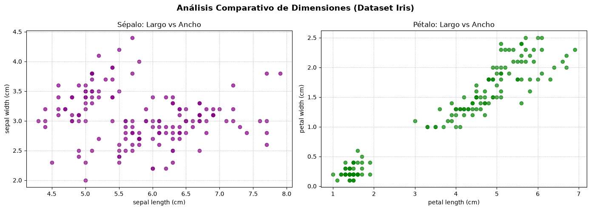

## Personalización de gráficos

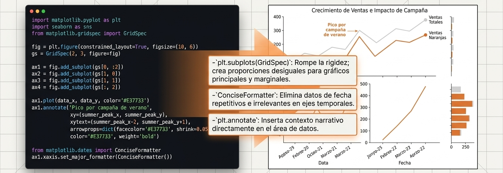

Matplotlib permite ajustar casi cualquier elemento de la visualización para mejorar su legibilidad:

*   **Títulos y etiquetas:** Se usan métodos como `set_title()`, `set_xlabel()` y `set_ylabel()`.
*   **Leyendas:** Identifican las diferentes series de datos en un mismo gráfico mediante el argumento `label` y la función `plt.legend()`.
*   **Estilos de línea:** Puedes cambiar el color, el grosor (`linewidth`) o el tipo de trazo (discontinuo, puntos, etc.).

**Ejemplo de gráfico personalizado:**
```python showLineNumbers
fig, ax = plt.subplots()
ax.plot(,, linewidth=3, label="Cuadrados")
ax.set_title("Números al cuadrado", fontsize=24)
ax.set_xlabel("Valor", fontsize=14)
ax.set_ylabel("Resultado", fontsize=14)
ax.legend()
plt.show()
```

#### Gráfico simple con personalización
Se presentan una serie de personalizaciones respecto de los aspectos generales de un gráfico.
```python showLineNumbers
import matplotlib.pyplot as plt
import numpy as np

# crear una serie de datos ficticios
# una lista de años desde 2011 a 2020
years = ["2011", "2012", "2013", "2014", "2015", "2016", "2017", "2018", "2019", "2020"]

nivel1 = np.random.rand(10) * 100
nivel2 = np.random.rand(10) * 200 +100
nivel3 = np.random.rand(10) * 300 +200
nivel4 = np.random.rand(10) * 400 +300
nivel5 = np.random.rand(10) * 500 +400

plt.rcParams['font.family'] = 'arial'

# crear un gráfico de líneas en modo explícito

fig, ax = plt.subplots(figsize=(8, 4))
ax.plot(years, nivel1, label='Nivel 1')  # Plot some data on the Axes.
ax.plot(years, nivel2, label='Nivel 2')  # Plot more data on the Axes...
ax.plot(years, nivel3, label='Nivel 3')  # ... and some more.
ax.set_xlabel('Años de examen')  # Add an x-label to the Axes.
ax.set_ylabel('Puntajes')  # Add a y-label to the Axes.
ax.set_title("Puntajes a lo largo de los años")  # Add a title to the Axes.
ax.legend()  # Add a legend.
```


```python showLineNumbers
# crear un gráfico de líneas en modo implícito
plt.figure(figsize=(8, 4))
plt.plot(years, nivel1, label='Nivel 1')
plt.plot(years, nivel2, label='Nivel 2')
plt.plot(years, nivel3, label='Nivel 3')
plt.xlabel('Años de examen')
plt.ylabel('Puntajes')
plt.title("Puntajes a lo largo de los años")
plt.legend()
plt.show()
```
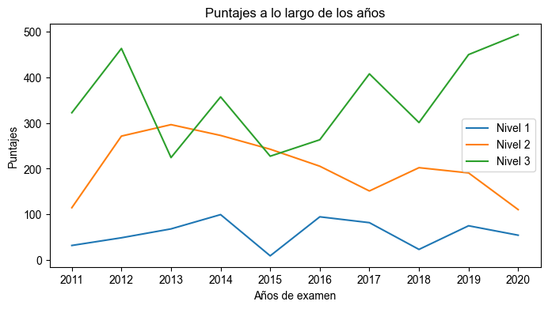

```python showLineNumbers
# creación de un gráfico con matplotlib
# crear una figura y un eje
plt.plot(years, nivel1, label='Nivel 1')
plt.plot(years, nivel2, label='Nivel 2')
plt.plot(years, nivel3, label='Nivel 3')
plt.plot(years, nivel4, label='Nivel 4')
plt.plot(years, nivel5, label='Nivel 5')

# añadir una leyenda
plt.legend()

# establecer el tipo de letra para todo el grafico
plt.rcParams['font.family'] = 'Nimbus Sans'

# añadir etiquetas y título
plt.xlabel('Años de examen')
plt.ylabel('Puntajes')
plt.title('Puntajes a lo largo de los años', fontsize=16)

# personalizar eje y respecto de los puntajes de 0 a 500 en incrementos de 50
plt.yticks(np.arange(0, 901, 50))

# activar cuadricula
plt.grid()

# activar marcas menores solo en el eje y
plt.minorticks_on()
plt.grid(which='minor', axis='y', linestyle=':', linewidth=0.5)

#establecer un tamaño de figura en pulgadas
plt.gcf().set_size_inches(12, 7)

# no mostrar ticks menores, solo mayores en el eje x en los años
plt.tick_params(axis='x', which='minor', bottom=False, top=False)

# mostrar el gráfico
plt.show()
```
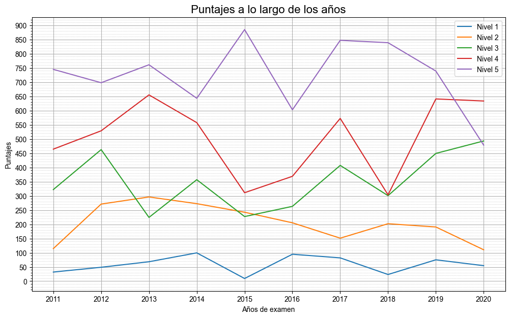

### Marcadores
El uso de marcadores permite diferenciar mayormente entre las series de un gráfico.
[Guía de marcas](https://matplotlib.org/stable/api/markers_api.html#module-matplotlib.markers)

```python showLineNumbers
# establecer colores y marcas para cada línea, esto sobreescribe los colores por defecto.
plt.plot(years, nivel1, label='Nivel 1', color='blue', marker='o')
plt.plot(years, nivel2, label='Nivel 2', color='orange', marker='s')
plt.plot(years, nivel3, label='Nivel 3', color='green', marker='^')
plt.plot(years, nivel4, label='Nivel 4', color='red', marker='+')
plt.plot(years, nivel5, label='Nivel 5', color='purple', marker='x')

# añadir una leyenda
plt.legend()

# añadir etiquetas y título
plt.xlabel('Años de examen')
plt.ylabel('Puntajes')
plt.title('Puntajes a lo largo de los años')

# personalizar eje de puntaje de 0 a 500 en incrementos de 50
plt.yticks(np.arange(0, 901, 50))

# activar cuadricula
plt.grid()

# activar marcas menores solo en el eje y
plt.minorticks_on()
plt.grid(which='minor', axis='y', linestyle=':', linewidth=0.5)

# establecer un tamaño de figura en pulgadas
plt.gcf().set_size_inches(12, 7)

# no mostrar ticks menores, solo mayores en el eje x en los años
plt.tick_params(axis='x', which='minor', bottom=False, top=False)

# mostrar el gráfico
plt.show()

```
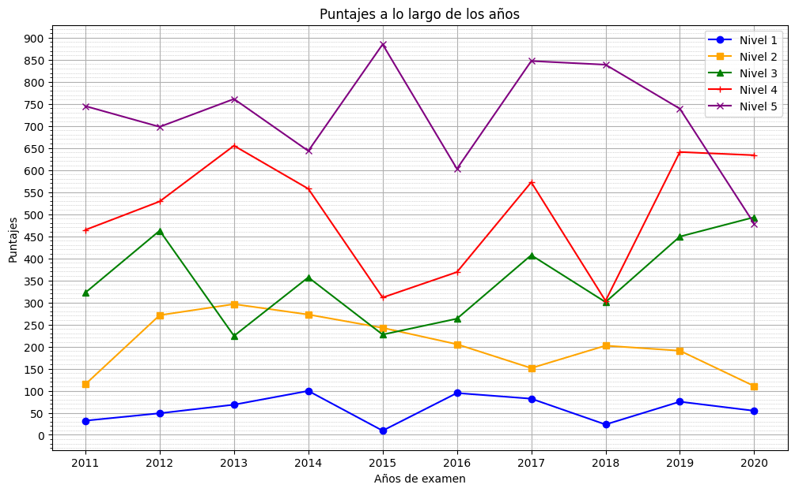

```python showLineNumbers
# definir estilo de linea para cada serie de datos
plt.figure(figsize=(12, 6))
plt.plot(years, nivel1, label='Nivel 1', color='blue', marker='o', linestyle='-')
plt.plot(years, nivel2, label='Nivel 2', color='orange', marker='s', linestyle='--')
plt.plot(years, nivel3, label='Nivel 3', color='green', marker='^', linestyle='-.')
plt.plot(years, nivel4, label='Nivel 4', color='red', marker='+', linestyle=':')
plt.plot(years, nivel5, label='Nivel 5', color='purple', marker='x', linestyle='-')

# añadir una leyenda   
plt.legend()

# establecer un tamaño de figura en pulgadas
#plt.gcf().set_size_inches(12, 7)


# mostrar el gráfico
plt.show()
```
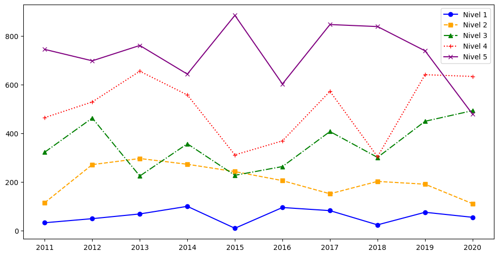

## Integración con Pandas
Una de las mayores ventajas es que puedes generar gráficos directamente desde objetos de Pandas (Series o DataFrames) con una sintaxis muy simplificada.
```python showLineNumbers
import pandas as pd
df = pd.DataFrame(np.random.randn(10, 4).cumsum(0), columns=['A', 'B', 'C', 'D'])
df.plot() # Crea un gráfico de líneas con leyenda para las 4 columnas
plt.show()
```
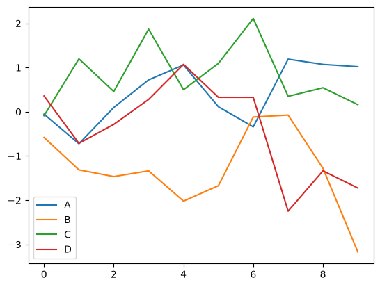

### Visualizaciones avanzadas
Matplotlib puede utilizarse para:
*   **Anotaciones:** Añadir texto y flechas en puntos específicos de interés.
*   **Subgráficos:** Crear cuadrículas con múltiples gráficos en una sola figura usando `plt.subplots()`.
*   **Mapas de calor:** Visualizar matrices de datos bidimensionales mediante funciones como `imshow()`.
*   **Animaciones:** Generar secuencias de gráficos para crear archivos de video o GIFs.

### plt.plot vs ax.plot

La diferencia principal entre usar **`plt.plot`** y **`ax.plot`** radica en el nivel de control y la estructura del código dentro de la librería Matplotlib. Mientras que el primero es una función de conveniencia de alto nivel, el segundo es un método de un objeto específico que ofrece mayor flexibilidad para visualizaciones complejas.

#### Enfoque basado en estados

Este método  (`plt.plot`) es el más sencillo y similar a la interfaz de MATLAB. Se utiliza el módulo `pyplot` (alias `plt`) para realizar trazados rápidos de forma implícita sobre la "figura actual" y el "eje actual".

**Ejemplo de uso:**
```python showLineNumbers title="plt.plot"
import matplotlib.pyplot as plt
import numpy as np

# Datos de ejemplo
x = np.linspace(0, 10, 100)
y = np.sin(x)

# Se traza directamente sobre el estado global
plt.plot(x, y, label='Seno')
plt.title('Estilo Pyplot (plt.plot)') # Afecta al gráfico activo
plt.xlabel('x')
plt.ylabel('y')
plt.legend()
plt.show()
```
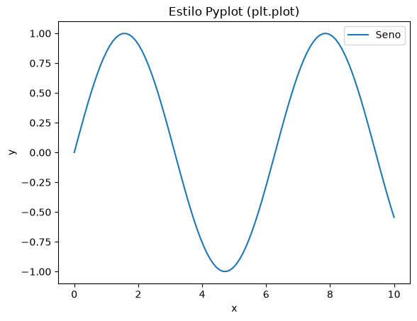

#### Enfoque orientado a objetos 
Este es el enfoque (`ax.plot`) **preferido para personalizaciones complejas**. Aquí se crean explícitamente objetos de tipo `Figure` (la ventana completa) y `Axes` (un trazado individual). Esto permite manipular cada gráfico de forma independiente y precisa.

**Ejemplo de uso:**
```python showLineNumbers title="ax.plot"
import matplotlib.pyplot as plt
import numpy as np

x = np.linspace(0, 10, 100)
y = np.cos(x)

# Se crean explícitamente los objetos Figure y Axes
fig, ax = plt.subplots() 

# Se usa el método del objeto Axes
ax.plot(x, y, color='red', label='Coseno')
ax.set_title('Estilo Orientado a Objetos (ax.plot)') # Métodos del objeto ax
ax.set_xlabel('x')
ax.set_ylabel('y')
ax.legend()
plt.show()
```

#### Diferencia clave en subgráficos (Múltiples ejes)
La mayor ventaja de `ax.plot` se hace evidente al trabajar con varias gráficas en una misma figura. Mientras que con `plt` tendrías que estar cambiando de subgráfico activo constantemente, con el enfoque orientado a objetos tienes un objeto `ax` para cada espacio.

**Ejemplo con múltiples subgráficos:**
```python showLineNumbers title="ax.plot con subgraficos"
import matplotlib.pyplot as plt
import numpy as np

x = np.linspace(0, 10, 100)

# Se crea una cuadrícula de 1 fila y 2 columnas
# subplots() devuelve un array de objetos Axes en la variable axes
fig, axes = plt.subplots(1, 2, figsize=(10, 4)) 

# Acceso directo al primer objeto Axes
axes.plot(x, np.sin(x), color='blue')
axes.set_title('Seno')

# Acceso directo al segundo objeto Axes
axes.plot(x, np.cos(x), color='green')
axes.set_title('Coseno')

plt.tight_layout() # Ajusta el espacio entre subgráficos
plt.show()
```

A continuación se detallan las disparidades clave:

#### 1. Nivel de la API y Control
*   **`plt.plot`**: Es una función del módulo **`pyplot`** (importado habitualmente como `plt`). Se considera una función de **máximo nivel** que actúa sobre el subgráfico que esté activo en ese momento. Es ideal para trazados rápidos y sencillos donde solo hay un gráfico en la figura.
*   **`ax.plot`**: Es un **método de instancia** de un objeto de tipo **`Axes`** o `AxesSubplot`. Es **preferible utilizar métodos de eje** en lugar de funciones de nivel máximo como `plt.plot`, ya que permite personalizar y definir subgráficos de manera directa e independiente dentro de una misma figura.

#### 2. Uso en subgráficos (Subplots)
La diferencia se vuelve evidente cuando se trabaja con múltiples gráficos a la vez:
*   Al utilizar la función **`plt.subplots()`**, se obtienen dos variables: **`fig`** (que representa toda la colección de trazados) y **`ax`** (que representa un solo trazado específico). 
*   En este esquema, se usa **`ax.plot()`** para dibujar datos en ese eje concreto, lo que permite un manejo más preciso si la figura tiene, por ejemplo, una cuadrícula de $2\times2$.

#### 3. Filosofía de programación
*   **Enfoque de estado (Pyplot):** `plt.plot` sigue un estilo similar a MATLAB, donde el sistema mantiene un seguimiento del "gráfico actual" de forma implícita.
*   **Enfoque orientado a objetos:** `ax.plot` es más "pythónico" y estructurado. Al trabajar con objetos `Axes`, puedes acceder a métodos específicos como `set_title` o `set_xlabel` directamente sobre ese objeto, evitando ambigüedades sobre a qué gráfico te refieres en figuras complejas.

#### Resumen comparativo

| Característica | `plt.plot` | `ax.plot` |
| :--- | :--- | :--- |
| **Origen** | Módulo `matplotlib.pyplot` | Clase `Axes` / `AxesSubplot` |
| **Contexto** | Global (actúa sobre el eje activo) | Local (específico de ese objeto `ax`) |
| **Recomendación** | Para gráficos rápidos y únicos | **Preferido** para figuras con múltiples subgráficos |
| **Sintaxis común** | `plt.plot(datos)` | `fig, ax = plt.subplots(); ax.plot(datos)` |

Para mostrar la diferencia entre el enfoque basado en estados (`plt.plot`) y el enfoque orientado a objetos (`ax.plot`), se presentan ejemplos que ilustran cómo se estructuran y cuándo es preferible cada uno.


*   **`plt.plot`**: Es una función de **nivel alto** que actúa sobre el subgráfico que esté activo en ese momento de forma global. Es ideal para scripts rápidos o exploraciones breves.
*   **`ax.plot`**: Es un **método de instancia** de la clase `Axes`. Permite una arquitectura de código más limpia y organizada, facilitando la creación de flujos de trabajo donde se definen y personalizan múltiples trazados de manera independiente dentro de una misma figura.

## Anotaciones

Las anotaciones en Matplotlib se utilizan para resaltar puntos de interés, añadir etiquetas explicativas o dibujar formas que mejoren la interpretación de un gráfico. Existen dos métodos principales para añadir información textual y visual: **`text`** y **`annotate`**.

#### 1. El método `text`
Se utiliza para colocar una cadena de texto en coordenadas específicas $(x, y)$ del subgráfico. 
*   **Sintaxis básica:** `ax.text(x, y, "Mensaje", family="monospace", fontsize=10)`.
*   Permite personalizar el estilo de la fuente, el tamaño y otros atributos visuales.

#### 2. El método `annotate`
Es una herramienta más avanzada que permite dibujar tanto el **texto** como una **flecha** que apunte a un punto determinado. Es especialmente útil en análisis de series temporales para marcar hitos o eventos específicos.

Los parámetros clave mencionados en los ejemplos son:
*   **`xy`**: Las coordenadas del punto que se desea señalar (por ejemplo, una fecha y un valor de precio).
*   **`xytext`**: Las coordenadas donde se ubicará el texto de la etiqueta.
*   **`arrowprops`**: Un diccionario que define las propiedades de la flecha, como el color (`facecolor`), el ancho (`width`) y las dimensiones de la punta (`headwidth`, `headlength`).
*   **Alineación**: Se pueden usar `horizontalalignment` y `verticalalignment` para ajustar la posición del texto respecto a su coordenada.

#### Dibujo de formas (Patches)
A menudo, las anotaciones se complementan con figuras geométricas para encerrar o destacar áreas. Matplotlib ofrece objetos llamados "figuras geométricas" (*patches*) en el módulo `matplotlib.patches`:
*   **Formas comunes:** `Rectangle` (rectángulo), `Circle` (círculo) y `Polygon` (polígono).
*   **Uso:** Se crea el objeto de la forma y luego se añade al subgráfico mediante el método **`ax.add_patch(forma)`**.

#### Ejemplo lógico de anotación
En un gráfico de precios financieros, se podría iterar sobre una lista de fechas importantes para añadir anotaciones automáticas:
```python showLineNumbers
# Basado en el ejemplo de la crisis financiera 2008-2009
for fecha, etiqueta in datos_crisis:
    ax.annotate(etiqueta, 
                xy=(fecha, valor_en_fecha + 75), # Punto a señalar
                xytext=(fecha, valor_en_fecha + 225), # Posición del texto
                arrowprops=dict(facecolor="black", headwidth=4, width=2),
                horizontalalignment="left", verticalalignment="top")
```

**Nota sobre otras herramientas:** Si se utiliza la interfaz **Easyviz** (de la biblioteca SciTools), la función `text(x, y, 'texto')` también está disponible, aunque el soporte para flechas en posiciones arbitrarias puede depender del motor de trazado (*backend*) utilizado, como Gnuplot.


## Ejemplos

#### Visualización Multidimensional (GridSpec)... (ver código)

**Visualización Multidimensional con subplots personalizados (GridSpec)**

Set de datos: California Housing (Precios de viviendas en California basado en geografía, ingresos, etc.)

Este ejemplo avanzado combina un mapa geográfico disperso utilizando la latitud y longitud, codificando el precio de la vivienda mediante colores y la población mediante el tamaño de los puntos. Al lado y abajo, se añaden histogramas marginales para analizar la distribución de las variables clave utilizando `GridSpec` para controlar la proporción de cada panel.

```python showLineNumbers
import matplotlib.pyplot as plt
import matplotlib.gridspec as gridspec
from sklearn.datasets import fetch_california_housing
import pandas as pd

# 1. Cargar el dataset real
california = fetch_california_housing(as_frame=True)
df = california.frame

# Limitar a una muestra representativa para mejorar la velocidad del gráfico
df_sample = df.sample(n=3000, random_state=42)

# 2. Configurar GridSpec para el diseño avanzado (Layout de Paneles)
fig = plt.figure(figsize=(14, 10))
gs = gridspec.GridSpec(2, 2, width_ratios=[3, 1], height_ratios=[3, 1],
                       wspace=0.15, hspace=0.15)

# Definir los ejes basándonos en la rejilla
ax_main = fig.add_subplot(gs[0, 0])
ax_hist_y = fig.add_subplot(gs[0, 1], sharey=ax_main)
ax_hist_x = fig.add_subplot(gs[1, 0], sharex=ax_main)

# 3. Gráfico Principal: Mapa de dispersión avanzado
scatter = ax_main.scatter(
    df_sample['Longitude'], df_sample['Latitude'],
    s=df_sample['Population'] / 100,  # El tamaño representa la población
    c=df_sample['MedHouseVal'],       # El color representa el valor medio de la vivienda
    cmap='coolwarm', alpha=0.6, edgecolors='none'
)
ax_main.set_title('Visualización Geográfica de Viviendas en California', fontsize=14, pad=15)
ax_main.set_ylabel('Latitud')
ax_main.grid(True, linestyle='--', alpha=0.5)

# Añadir barra de colores personalizada en un eje específico para no desordenar el layout
cbar = fig.colorbar(scatter, ax=ax_hist_y, orientation='horizontal', pad=0.15)
cbar.set_label('Valor Medio de la Vivienda ($100k)')

# 4. Gráfico Marginal Derecho: Histograma de Latitud
ax_hist_y.hist(df_sample['Latitude'], bins=40, orientation='horizontal', color='steelblue', alpha=0.7)
ax_hist_y.set_xlabel('Frecuencia')
ax_hist_y.grid(True, linestyle='--', alpha=0.5)
plt.setp(ax_hist_y.get_yticklabels(), visible=False)  # Ocultar etiquetas compartidas

# 5. Gráfico Marginal Inferior: Histograma de Longitud
ax_hist_x.hist(df_sample['Longitude'], bins=40, color='steelblue', alpha=0.7)
ax_hist_x.set_ylabel('Frecuencia')
ax_hist_x.set_xlabel('Longitud')
ax_hist_x.grid(True, linestyle='--', alpha=0.5)
plt.setp(ax_hist_x.get_xticklabels(), visible=False)  # Ocultar etiquetas compartidas

# Ajustar y mostrar el resultado
plt.show()
```
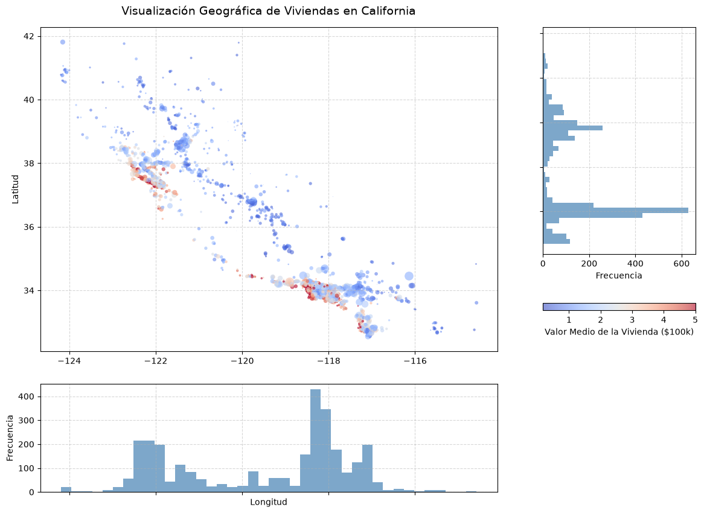

#### Anotaciones avanzadas... (ver código)

**Análisis de Componentes Principales (PCA) con anotaciones avanzadas**

Set de datos: Iris Dataset (Medidas de flores)

En el uso avanzado de Matplotlib, a menudo necesitamos realizar transformaciones de datos sobre la marcha y resaltar regiones o elementos específicos (anotaciones con flechas y cajas de texto elegantes). Este ejemplo reduce las dimensiones de las características de las flores a 2 componentes principales y destaca los "centroides" o puntos medios de cada especie usando parches y flechas indicativas.

```python showLineNumbers
import numpy as np
import matplotlib.pyplot as plt
from sklearn.datasets import load_iris
from sklearn.decomposition import PCA

# 1. Cargar datos de Iris y aplicar PCA
iris = load_iris()
X = iris.data
y = iris.target
target_names = iris.target_names

pca = PCA(n_components=2)
X_r = pca.fit_transform(X)

# 2. Configurar la figura con un estilo estilizado
plt.figure(figsize=(10, 7))
colors = ['darkorange', 'cyan', 'fuchsia']
lw = 2

# Dibujar los puntos correspondientes a cada clase
for color, i, target_name in zip(colors, [0, 1, 2], target_names):
    points = X_r[y == i]
    plt.scatter(points[:, 0], points[:, 1], color=color, alpha=.8, lw=lw,
                label=target_name, edgecolors='black', s=60)
    
    # Calcular el centroide de la clase para la anotación avanzada
    centroid = np.mean(points, axis=0)
    
    # 3. Añadir anotaciones avanzadas (Bocadillos y flechas personalizadas)
    plt.annotate(
        f'Centroide\n{target_name.upper()}',
        xy=(centroid[0], centroid[1]), 
        xytext=(centroid[0] + 0.8, centroid[1] + 0.8),
        textcoords='data',
        arrowprops=dict(arrowstyle="->", connectionstyle="arc3,rad=0.2", color='black', lw=1.5),
        bbox=dict(boxstyle="round,pad=0.3", fc="yellow", alpha=0.3, ec="black")
    )

# 4. Personalización del fondo y ejes
plt.title('Análisis de Componentes Principales (PCA) del Dataset Iris', fontsize=14, fontweight='bold', pad=15)
plt.xlabel(f'Componente Principal 1 ({pca.explained_variance_ratio_[0]*100:.2f}%)', fontsize=11)
plt.ylabel(f'Componente Principal 2 ({pca.explained_variance_ratio_[1]*100:.2f}%)', fontsize=11)

# Posicionar la leyenda de forma externa y elegante
plt.legend(loc='upper right', shadow=True, scatterpoints=1, fontsize=11)
plt.grid(True, linestyle=':', alpha=0.6)

# Ajustar límites para dar espacio a las anotaciones
plt.xlim(X_r[:,0].min() - 1, X_r[:,0].max() + 2)
plt.ylim(X_r[:,1].min() - 1, X_r[:,1].max() + 2)

plt.show()
```

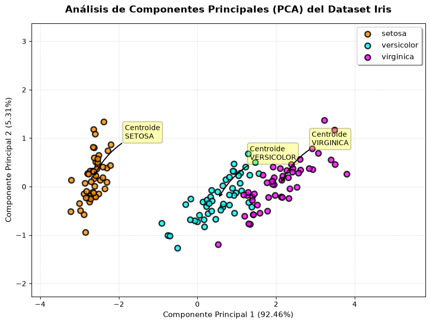

#### Matriz de Subgráficos Estructurada... (ver código)

Este ejemplo crea una cuadrícula de $2 \times 2$ subgráficos para mapear los histogramas y densidades estimadas por kernel (KDE approximation) de cada característica física del dataset.

```python showLineNumbers
import matplotlib.pyplot as plt
import numpy as np
from sklearn.datasets import load_iris

# 1. Cargar el dataset real
iris = load_iris()
X = iris.data
feature_names = iris.feature_names
target = iris.target
target_names = iris.target_names

# 2. Crear una figura compartiendo una estructura regular de subgráficos (2 filas, 2 columnas)
fig, axs = plt.subplots(nrows=2, ncols=2, figsize=(12, 9), sharey=True)

# Lista de colores por cada clase de flor
colors = ['#FF5733', '#33FF57', '#3357FF']

# 3. Iterar dinámicamente sobre la matriz plana de subgráficos
for i, ax in enumerate(axs.flat):
    # Separar los datos de la característica actual por cada clase
    for class_idx, class_name in enumerate(target_names):
        subset = X[target == class_idx, i]
        
        # Dibujar el histograma en el subgráfico correspondiente
        ax.hist(subset, bins=15, alpha=0.5, label=class_name, color=colors[class_idx], edgecolor='black')
    
    # Personalización avanzada por cada subgráfico individual
    ax.set_title(feature_names[i].capitalize(), fontsize=12, fontweight='bold')
    ax.set_xlabel('Medida (cm)', fontsize=10)
    ax.grid(True, linestyle=':', alpha=0.6)
    
    # Poner las etiquetas del eje Y solo en la primera columna para evitar redundancias
    if i % 2 == 0:
        ax.set_ylabel('Frecuencia de muestras', fontsize=10)

# 4. Ajustes globales de la figura
fig.suptitle('Distribución de Características del Dataset Iris por Especie', fontsize=16, fontweight='bold', y=0.98)

# Colocar una leyenda única global en lugar de repetirla en cada subgráfico
handles, labels = axs[0, 0].get_legend_handles_labels()
fig.legend(handles, labels, loc='upper right', bbox_to_anchor=(0.98, 0.95), shadow=True, ncol=3)

plt.tight_layout(rect=[0, 0, 1, 0.93]) # Ajustar márgenes para que no se superpongan los textos
plt.show()
```

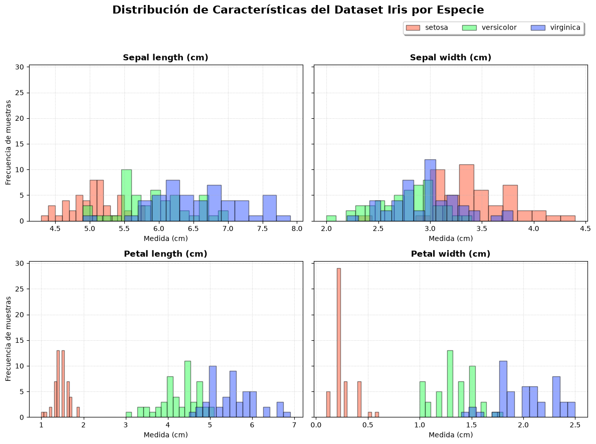

#### Subgráficos Asimétricos y Dinámicos (ver código)
Set de datos: Diabetes Dataset (Evolución de la enfermedad frente a factores como IMC, presión sanguínea, etc.)

Este ejemplo utiliza una estructura no uniforme. El subgráfico de la izquierda abarca toda la altura de la cuadrícula y muestra una regresión lineal con intervalos simulados de confianza, mientras que la parte derecha se divide en dos subgráficos independientes para evaluar las variables asociadas a nivel estadístico (diagramas de caja y dispersión residual).

```python showLineNumbers
import matplotlib.pyplot as plt
import matplotlib.gridspec as gridspec
import numpy as np
import pandas as pd
from sklearn.datasets import load_diabetes
from sklearn.linear_model import LinearRegression

# 1. Cargar y preparar datos
diabetes = load_diabetes(as_frame=True)
df = diabetes.frame

# Tomamos dos variables principales: BMI (Índice de Masa Corporal) y la progresión de la enfermedad (target)
X_bmi = df[['bmi']].values
y = df['target'].values

# Entrenar un regresor rápido para la visualización del modelo
model = LinearRegression().fit(X_bmi, y)
X_seq = np.linspace(X_bmi.min(), X_bmi.max(), 100).reshape(-1, 1)
y_pred = model.predict(X_seq)

# 2. Definir una estructura avanzada asimétrica usando GridSpec
fig = plt.figure(figsize=(15, 8))
gs = gridspec.GridSpec(nrows=2, ncols=2, width_ratios=[1.2, 1], hspace=0.3, wspace=0.2)

# Asignar posiciones
ax_main = fig.add_subplot(gs[:, 0])      # Columna 0 completa (Filas 0 y 1)
ax_top_right = fig.add_subplot(gs[0, 1]) # Fila 0, Columna 1
ax_bot_right = fig.add_subplot(gs[1, 1]) # Fila 1, Columna 1

# 3. Subgráfico Izquierdo (Principal): Ajuste de Regresión
ax_main.scatter(df['bmi'], df['target'], alpha=0.5, color='teal', edgecolors='w', label='Pacientes')
ax_main.plot(X_seq, y_pred, color='crimson', linewidth=3, label='Tendencia Lineal')
ax_main.set_title('Impacto del IMC (BMI) en la Progresión de la Diabetes', fontsize=13, fontweight='bold')
ax_main.set_xlabel('Índice de Masa Corporal (Estandarizado)')
ax_main.set_ylabel('Progresión de la Enfermedad (Unidades)')
ax_main.legend()
ax_main.grid(True, linestyle='--')

# 4. Subgráfico Superior Derecho: Diagrama de Caja Condicional (Categorización interna)
# Dividimos artificialmente a los pacientes en presión arterial (bp) alta y baja para el análisis visual
bp_median = df['bp'].median()
df['bp_group'] = np.where(df['bp'] >= bp_median, 'Presión Alta', 'Presión Baja')

box_data = [df[df['bp_group'] == 'Presión Baja']['target'], df[df['bp_group'] == 'Presión Alta']['target']]
ax_top_right.boxplot(box_data, patch_artist=True, label=['Presión Baja', 'Presión Alta'],
                     boxprops=dict(facecolor='lightblue', color='navy'),
                     medianprops=dict(color='darkred', linewidth=2))
ax_top_right.set_title('Distribución de Progresión según Presión Arterial', fontsize=11, fontweight='bold')
ax_top_right.set_ylabel('Progresión')
ax_top_right.grid(True, axis='y', linestyle=':')

# 5. Subgráfico Inferior Derecho: Gráfico de Dispersión Secundario (Edad vs Progresión)
ax_bot_right.scatter(df['age'], df['target'], alpha=0.6, color='goldenrod', edgecolors='k', s=25)
ax_bot_right.set_title('Relación Secundaria: Edad vs Progresión', fontsize=11, fontweight='bold')
ax_bot_right.set_xlabel('Edad (Estandarizada)')
ax_bot_right.set_ylabel('Progresión')
ax_bot_right.grid(True, linestyle=':')

# Título General Informativo
fig.suptitle('Cuadro de Mando Exploratorio: Análisis del Dataset de Diabetes', fontsize=16, fontweight='bold')

plt.show()
```
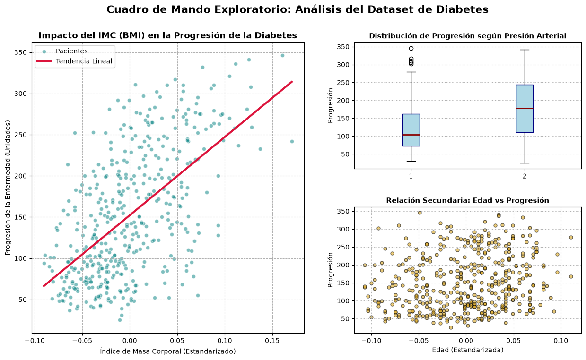


---

## Series

Definiremos datos aleatorios de temperatura a lo largo de un año. Estarán con una distribución normal con una media de 25 grados.

```python showLineNumbers
import numpy as np
import matplotlib.pyplot as plt
# color para el gráfico
plt.rcParams['axes.prop_cycle'] = plt.cycler(color=plt.cm.magma.colors)


np.random.seed(120)  # Para reproducibilidad    
temperatura = np.random.normal(20, 5, 365)  
dias = np.arange(1, 366)
plt.figure(figsize=(12, 6))
plt.plot(dias, temperatura, linestyle='-', marker='o', markersize=3)
plt.title('Temperatura Diaria a lo Largo de un Año', fontsize=16)
plt.xlabel('Día del Año', fontsize=14)
plt.ylabel('Temperatura (°C)', fontsize=14)
plt.xticks(np.arange(0, 366, 30), fontsize=10)
plt.yticks(np.arange(0, 41, 5), fontsize=10)
plt.grid()
plt.show()

```
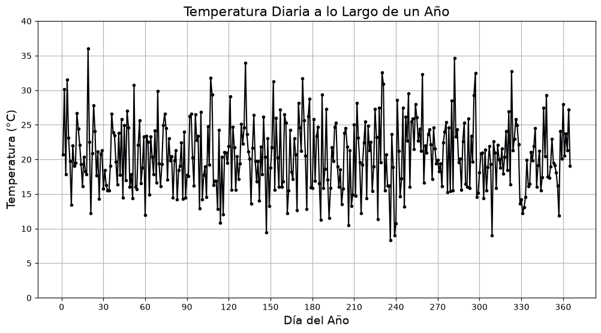

- grafica con temperatura diaria
- distribucion de temperaturas


```python showLineNumbers
import matplotlib.pyplot as plt
# set default color
plt.rcParams['axes.prop_cycle'] = plt.cycler(color=[plt.cm.Blues(0.55), plt.cm.Blues(0.75)])

fig, ax = plt.subplots(1, 2, figsize=(12, 4))

ax[0].plot(temperatura, label="Temperatura diaria")
ax[0].set_xlabel("Día")
ax[0].set_ylabel("Temperatura (°C)")
ax[0].set_title("Temperatura diaria")
ax[0].legend()

ax[1].hist(temperatura, bins=10, edgecolor="black")
ax[1].set_xlabel("Temperatura (°C)")
ax[1].set_ylabel("Frecuencia")
ax[1].set_title("Distribución")

#plt.tight_layout()
#plt.gcf().set_size_inches(12, 6)
plt.show()
```
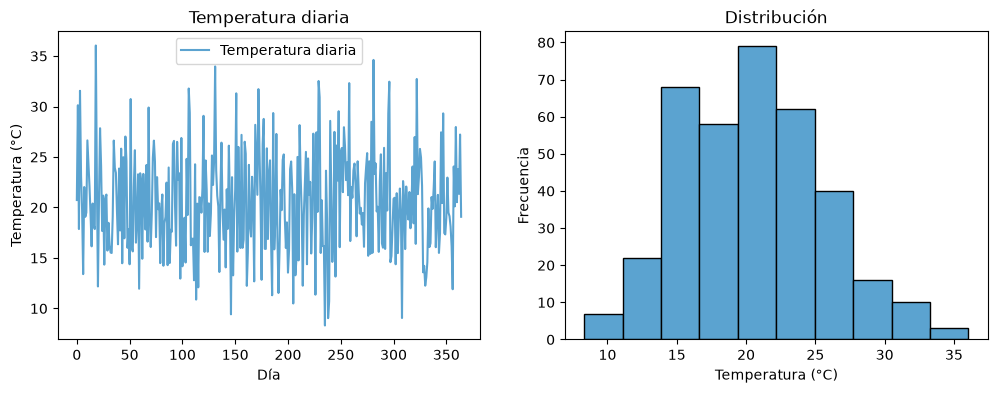

### Serie de temperatura
Análisis de las temperaturas máximas y mínimas en Chiloé, chile, en estación Mocopulli.

- Latitud: -42.34667	
- Longitud: -73.71500
- Altitud: 174

#### Obtención de datos desde web (ver código)
- https://climatologia.meteochile.gob.cl/application/informacion/buscadorEstaciones/RE2007

Los datos de temperaturas máximas y mínimas están en una dirección web.

```python showLineNumbers
import numpy as np
import pandas as pd
import matplotlib.pyplot as plt

import requests # para acceder a datos en la web

url = "http://patricioaraneda.cl/public"

# grafico de temperaturas maximas y minimas
maximas = pd.read_csv(f'{url}/maximas.csv', parse_dates=['Fecha'], dayfirst=True)
minimas = pd.read_csv(f'{url}/minimas.csv', parse_dates=['Fecha'], dayfirst=True)

plt.figure(figsize=(12, 6))
plt.plot(maximas['Fecha'], maximas['Temperatura'], label='Temperaturas Máximas', color='red')
plt.plot(minimas['Fecha'], minimas['Temperatura'], label='Temperaturas Mínimas', color='blue')
plt.xlabel('Fecha', fontsize=14)
plt.ylabel('Temperatura (°C)', fontsize=14)
plt.title('Temperaturas Máximas y Mínimas Diarias en 2024', fontsize=16)
plt.xticks(rotation=90, fontsize=10)

# personalizar eje de puntaje de -5 a 30 en incrementos de 5 grados
plt.yticks(np.arange(-5, 31, 5), fontsize=10)

plt.xticks(maximas['Fecha'][::31], rotation=90, fontsize=9)

# activar cuadricula
plt.grid()
# activar marcas menores solo en el eje y
plt.minorticks_on()
plt.grid(which='minor', axis='y', linestyle=':', linewidth=0.5)

plt.legend()
plt.grid()
plt.show()
```


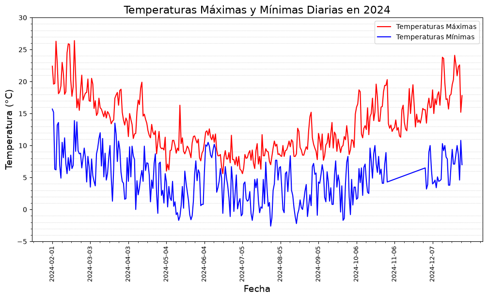


### Serie COVID-19

#### Evolución de casos de Covid-19 (ver código)
```python showLineNumbers
import matplotlib.pyplot as plt
import numpy as np
import matplotlib.font_manager as fm
import requests

# origen de los datos
url = "https://patricioaraneda.cl/public"

# Cargar datos y graficar evolución acumulada hasta septiembre de 2025
dfv = pd.read_csv(f'{url}/covid-19cases.csv')

# detectar columna de fecha
date_candidates = [c for c in dfv.columns if any(k in c.lower() for k in ('date', 'fecha', 'day'))]
if not date_candidates:
    raise ValueError("No se encontró columna de fecha (buscando 'date', 'fecha' o 'day').")
date_col = date_candidates[0]
dfv[date_col] = pd.to_datetime(dfv[date_col], dayfirst=True, errors='coerce')

# detectar columna de país/ubicación
country_candidates = [c for c in dfv.columns if any(k in c.lower() for k in ('country', 'pais', 'location', 'region'))]
if not country_candidates:
    raise ValueError("No se encontró columna de país (buscando 'country', 'pais', 'location' o 'region').")
country_col = country_candidates[0]

# detectar columna de casos (preferir contadores acumulados)
cases_candidates = [c for c in dfv.columns if any(k in c.lower() for k in ('cum', 'confirmed', 'total', 'cumulative'))]
if not cases_candidates:
    # fallback a columnas de casos diarios
    cases_candidates = [c for c in dfv.columns if any(k in c.lower() for k in ('cases', 'new', 'count'))]
if not cases_candidates:
    raise ValueError("No se encontró columna de casos (buscar 'confirmed','total','cases','new', etc.).")
cases_col = cases_candidates[0]

# Filtrar hasta 30-sep-2025
cutoff = pd.to_datetime('2025-09-30')
dfv = dfv[dfv[date_col].notna()].copy()
dfv = dfv[dfv[date_col] <= cutoff]

# Normalizar nombres de columnas usados
dfv = dfv.rename(columns={date_col: 'date', country_col: 'country', cases_col: 'cases_raw'})

# Determinar si 'cases_raw' es acumulado o diario: si para un país la serie no es creciente asumimos diario
def is_cumulative(group):
    s = group.sort_values('date')['cases_raw']
    return s.is_monotonic_increasing

sample = dfv.groupby('country').apply(lambda g: is_cumulative(g) if len(g) > 1 else True)
use_as_cumulative = sample.mean() >= 0.5  # si mayoría parecen acumuladas

if use_as_cumulative:
    # usar cases_raw como acumulado (por seguridad tomar max por fecha)
    dfv = dfv.sort_values(['country','date']).groupby(['country','date'], as_index=False).agg({'cases_raw':'max'})
    dfv['cum_cases'] = dfv.groupby('country')['cases_raw'].cummax()
else:
    # interpretar como casos diarios -> calcular acumulado por país
    dfv = dfv.sort_values(['country','date']).groupby(['country','date'], as_index=False).agg({'cases_raw':'sum'})
    dfv['cum_cases'] = dfv.groupby('country')['cases_raw'].cumsum()

# seleccionar los 10 países con más casos acumulados al corte
latest = dfv.sort_values('date').groupby('country').tail(1)
top10 = latest.sort_values('cum_cases', ascending=False).head(10)['country'].tolist()

# preparar datos para graficar
plot_df = dfv[dfv['country'].isin(top10)].copy()
pivot = plot_df.pivot_table(index='date', columns='country', values='cum_cases', aggfunc='max').fillna(method='ffill').fillna(0)

# graficar
plt.figure(figsize=(14,7))
for c in pivot.columns:
    plt.plot(pivot.index, pivot[c], label=c, linewidth=2)
plt.xlabel('Fecha')
plt.ylabel('Casos acumulados')
plt.title('Evolución de casos acumulados (hasta 2025-09-30)\nTop 10 países por casos acumulados')
plt.xlim(left=pivot.index.min(), right=cutoff)
plt.legend(loc='upper left', bbox_to_anchor=(1.02, 1))
plt.grid(alpha=0.3)
plt.tight_layout()
plt.show()

```


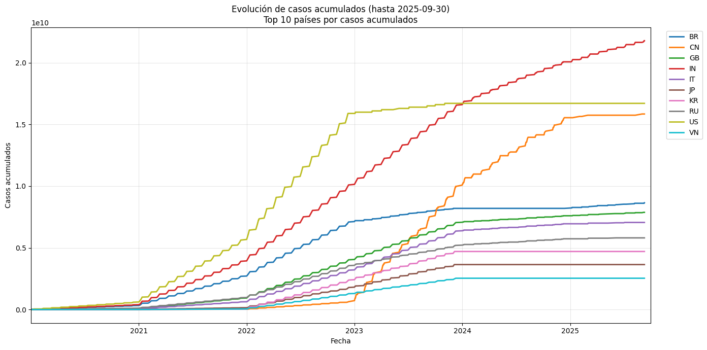

#### Grilla de casos acumulados (ver código)

```python showLineNumbers
import matplotlib.pyplot as plt
import numpy as np
import matplotlib.font_manager as fm
import requests

# origen de los datos
url = "https://patricioaraneda.cl/public"

# Grafica una grilla de series de casos acumulados por WHO_region (un subplot por región)

# Leer y normalizar la columna de fecha
dfv = pd.read_csv('../data/covid-19cases.csv', parse_dates=['Date_reported'], dayfirst=True)
df_plot = dfv.copy()

# Asegurar que exista una columna llamada 'date' con tipo datetime
if 'Date_reported' in df_plot.columns:
    df_plot = df_plot.rename(columns={'Date_reported': 'date'})
    df_plot['date'] = pd.to_datetime(df_plot['date'], dayfirst=True, errors='coerce')
elif 'date' in df_plot.columns:
    df_plot['date'] = pd.to_datetime(df_plot['date'], dayfirst=True, errors='coerce')
else:
    # intentar detectar una columna de fecha alternativa
    date_candidates = [c for c in df_plot.columns if any(k in c.lower() for k in ('date', 'fecha', 'day'))]
    if date_candidates:
        df_plot[date_candidates[0]] = pd.to_datetime(df_plot[date_candidates[0]], dayfirst=True, errors='coerce')
        df_plot = df_plot.rename(columns={date_candidates[0]: 'date'})
    else:
        raise ValueError("No se encontró columna de fecha (buscando 'Date_reported', 'date', 'fecha', etc.).")

# Construir series por región: preferir 'Cumulative_cases' si existe; si no, sumar 'New_cases' y calcular acumulado
if 'Cumulative_cases' in df_plot.columns:
    region_ts = df_plot.groupby(['WHO_region', 'date'], as_index=False).agg({'Cumulative_cases': 'sum'}).rename(columns={'Cumulative_cases': 'cum_cases'})
else:
    # sumar nuevos casos por región y calcular acumulado regional
    tmp = df_plot.groupby(['WHO_region', 'date'], as_index=False).agg({'New_cases': 'sum'}).sort_values(['WHO_region', 'date'])
    tmp['cum_cases'] = tmp.groupby('WHO_region')['New_cases'].cumsum()
    region_ts = tmp[['WHO_region', 'date', 'cum_cases']]

regions = sorted(region_ts['WHO_region'].unique())
n_regions = len(regions)
if n_regions == 0:
    raise ValueError("No se detectaron regiones para graficar.")

# Configurar la grilla de subplots
ncols = 3
nrows = int(np.ceil(n_regions / ncols))
fig, axes = plt.subplots(nrows, ncols, figsize=(5*ncols, 3.5*nrows), squeeze=False)
fig.suptitle("Casos acumulados por WHO_region", fontsize=16)

# Graficar cada región en su subplot (usando la serie acumulada)
for idx, region in enumerate(regions):
    r = idx // ncols
    c = idx % ncols
    axr = axes[r][c]
    s = region_ts[region_ts['WHO_region'] == region].sort_values('date')
    if s.empty:
        axr.text(0.5, 0.5, 'Sin datos', ha='center', va='center')
        axr.set_title(region)
        continue
    axr.plot(s['date'], s['cum_cases'], lw=1.8)
    axr.set_title(region)
    axr.set_xlabel('Fecha')
    axr.set_ylabel('Casos acumulados')
    axr.grid(alpha=0.25)
    # Anotar último valor
    last_date = s['date'].max()
    last_val = s.loc[s['date'] == last_date, 'cum_cases'].iloc[0]
    axr.annotate(f"{int(last_val):,}", xy=(last_date, last_val),
                 xytext=(-5, 5), textcoords='offset points', ha='right', va='bottom', fontsize=9)

# Apagar ejes vacíos si los hay
total_plots = nrows * ncols
for empty_idx in range(n_regions, total_plots):
    r = empty_idx // ncols
    c = empty_idx % ncols
    axes[r][c].axis('off')

plt.tight_layout(rect=[0, 0, 1, 0.96])
plt.show()
```


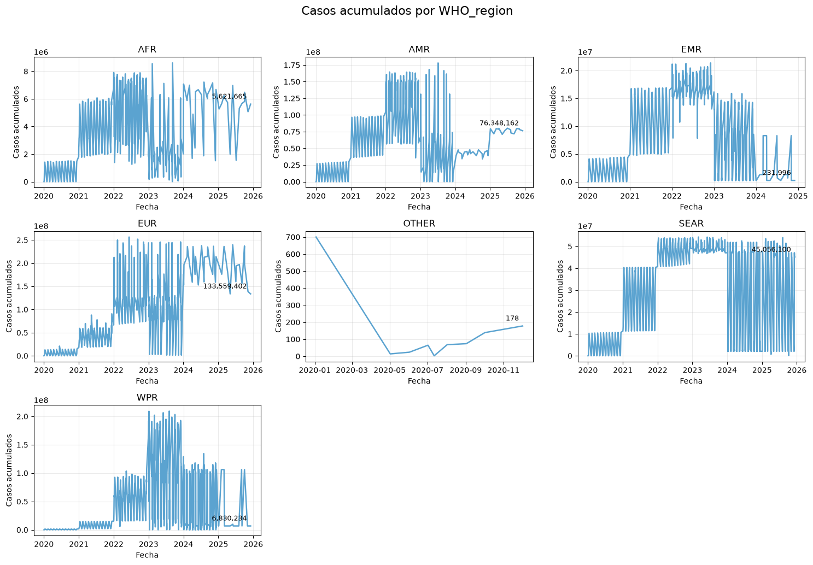


## Manejo Avanzado de Fechas

Cuando graficamos series temporales, las etiquetas por defecto pueden superponerse o ser difíciles de leer. Veremos cómo solucionar esto comparando tres métodos: el formateador automático por defecto, el moderno y limpio ConciseFormatter, y la personalización total mediante DateFormatter.

#### Manejo de fechas (ver código)
```python showLineNumbers
import numpy as np
import pandas as pd
import matplotlib.pyplot as plt
import matplotlib.dates as mdates

# Configurar una semilla para reproducibilidad
np.random.seed(42)

# Generar un rango de fechas (12 meses de datos diarios)
fechas = pd.date_range(start="2026-01-01", end="2026-12-30", freq="D")

# Simular una variación de precios usando un camino aleatorio (Random Walk)
precios_iniciales = 150.0
cambios = np.random.normal(loc=0.1, scale=2.0, size=len(fechas))
precios = precios_iniciales + np.cumsum(cambios)

# Creamos una única figura con 3 subplots distribuidos verticalmente (3 filas x 1 columna) para observar con precisión cómo cambia la visualización del eje X en cada caso.

# Crear la figura y los 3 subplots compartiendo el espacio
fig, axs = plt.subplots(3, 1, figsize=(11, 14), sharex=False)
fig.suptitle(
    "Comparativa de Formateadores de Fechas en Matplotlib",
    fontsize=16,
    fontweight="bold",
    y=0.95,
)

# Colores elegantes para cada gráfico
colores = ["#1f77b4", "#2ca02c", "#d62728"]

# =========================================================================
# GRÁFICO 1: Formateador por Defecto (AutoDateFormatter / Default)
# =========================================================================
axs[0].plot(fechas, precios, color=colores[0], linewidth=2)
axs[0].set_title("1. Usando el Formateador por Defecto (Default)", fontsize=12, pad=10)
axs[0].set_ylabel("Precio ($)")
axs[0].grid(True, linestyle="--", alpha=0.5)

# Matplotlib aplica automáticamente 'AutoDateFormatter'
# Normalmente añade el año abajo y las fechas con formatos estándar


# =========================================================================
# GRÁFICO 2: ConciseFormatter
# =========================================================================
# El ConciseFormatter reduce significativamente el texto repetitivo en el eje.
# Solo muestra la información que cambia (ej. el día), y el año/mes se delega a las esquinas.
axs[1].plot(fechas, precios, color=colores[1], linewidth=2)
axs[1].set_title(
    "2. Usando ConciseFormatter (Formato Compacto y Moderno)",
    fontsize=12,
    pad=10,
)
axs[1].set_ylabel("Precio ($)")
axs[1].grid(True, linestyle="--", alpha=0.5)

# Localizador automático para decidir dónde van los "ticks"
locator = mdates.AutoDateLocator()
axs[1].xaxis.set_major_locator(locator)

# Asignar el formateador conciso
axs[1].xaxis.set_major_formatter(mdates.ConciseDateFormatter(locator))


# =========================================================================
# GRÁFICO 3: Manual DateFormatter
# =========================================================================
# Nos permite controlar exactamente qué cadenas de caracteres se imprimen usando directivas strftime
axs[2].plot(fechas, precios, color=colores[2], linewidth=2)
axs[2].set_title(
    "3. Usando Manual DateFormatter (Personalizado: %b - %Y)",
    fontsize=12,
    pad=10,
)
axs[2].set_ylabel("Precio ($)")
axs[2].set_xlabel("Línea Temporal")
axs[2].grid(True, linestyle="--", alpha=0.5)

# Forzamos a que ponga un indicador principal cada mes
axs[2].xaxis.set_major_locator(mdates.MonthLocator(interval=1))

# Aplicamos un formato manual: Ej. "Ene - 2026", "Feb - 2026"
# %b = Nombre abreviado del mes, %Y = Año con 4 dígitos
axs[2].xaxis.set_major_formatter(mdates.DateFormatter("%Y-%b"))

# Al usar formatos manuales largos, rotar las etiquetas evita que se encimen
plt.setp(axs[2].get_xticklabels(), rotation=30, ha="right")


# Ajustar márgenes para evitar solapamientos
plt.tight_layout(rect=[0, 0, 1, 0.93])
plt.show()
```
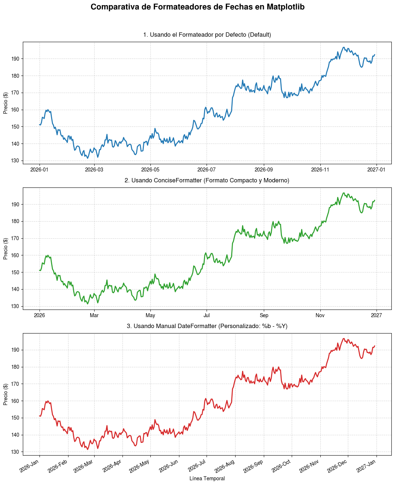

- **DefaultFormatter**: Cumple su función básica, pero suele generar etiquetas redundantes que repiten constantemente el año o el mes completo, ocupando demasiado espacio horizontal.

- **ConciseFormatter**: Introducido en versiones modernas de Matplotlib, remueve de forma inteligente los datos repetitivos. Si todas las fechas ocurren en el 2026, pondrá el año discretamente a un lado del eje y usará etiquetas muy cortas como "Feb", "Mar", facilitando la lectura fluida.

- **Manual DateFormatter**: Es la herramienta definitiva si el cliente o negocio te exige un formato regional específico (como el formato latino dd/mm/aaaa o en este caso %b - %Y). Requiere que configures manualmente un Locator asociado para que no se amontone la información.