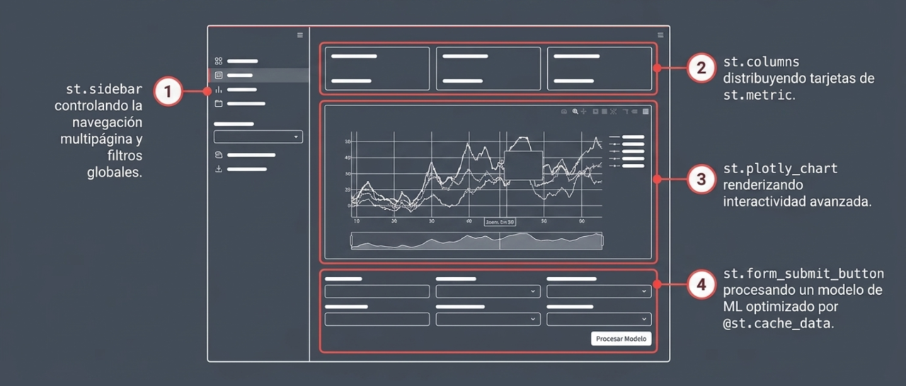

Las aplicaciones creadas con Streamlit no son muy  flexibles, como otras, sin embargo, tienen la virtud de ser muy fáciles de construir en comparación, justamente por esa estructura predefinida.
<center>
<figure> 

<figcaption>Anatomia de una interface de aplicación Streamlit.</figcaption>
</figure>
</center>

## Creación de una aplicación

Para crear una aplicación de Streamlit que cargue archivos, muestre indicadores clave de rendimiento (KPIs) y genere gráficos interactivos con **Altair**, puedes seguir este tutorial paso a paso basado en las mejores prácticas de desarrollo y organización de archivos.

#### Paso 1: Preparación e Importación de Librerías
Lo primero es crear un archivo Python (por ejemplo, `dashboard.py`) e importar los módulos necesarios: **Streamlit** para la interfaz, **Pandas** para el manejo de datos y **Altair** para las visualizaciones estadísticas.

```python showLineNumbers
import streamlit as st
import pandas as pd
import altair as alt
```

#### Paso 2: Configuración de la Página y Título
Configura el diseño de la aplicación para que utilice todo el ancho de la pantalla, lo cual es ideal para tableros con múltiples gráficos. Luego, añade un título descriptivo.

```python showLineNumbers
st.set_page_config(layout="wide")
st.title("📊 Tablero de Análisis Simple")
```

#### Paso 3: Carga de Archivos
Utiliza el comando **`st.file_uploader`** para permitir que el usuario suba su propio dataset en formato CSV. Es fundamental envolver el resto del código en una condición `if` para asegurar que la aplicación solo intente procesar los datos una vez que el archivo ha sido cargado.

```python showLineNumbers
uploaded_file = st.file_uploader("Sube tu archivo CSV", type=["csv"])

if uploaded_file is not None:
    df = pd.read_csv(uploaded_file)
    st.success("¡Archivo cargado con éxito!")
```

#### Paso 4: Visualización de KPIs (Card Metrics)
Para mostrar totales generales de forma atractiva, utiliza **`st.columns`** para organizar los widgets horizontalmente y **`st.metric`** para las tarjetas de datos. Las métricas son ideales para resaltar números importantes como ventas totales o conteos de registros.

```python showLineNumbers
# Ejemplo calculando métricas basadas en el DataFrame
total_registros = len(df)
valor_promedio = df.iloc[:, 1].mean() # Supone que la segunda columna es numérica

col1, col2 = st.columns(2)
col1.metric("Total de Registros", total_registros)
col2.metric("Valor Promedio", f"{valor_promedio:.2f}")
```

#### Paso 5: Creación de 3 Gráficos con Altair
Altair utiliza un enfoque **declarativo** donde defines las relaciones entre las columnas de tus datos. Para mostrarlos en Streamlit, usa el comando **`st.altair_chart`** con el parámetro `use_container_width=True` para que se ajusten al diseño.

1.  **Gráfico de Barras:** Útil para comparar categorías usando `mark_bar()`.
2.  **Gráfico de Líneas:** Ideal para ver tendencias temporales con `mark_line()` o `mark_point()`.
3.  **Gráfico de Áreas o Dispersión:** Puedes usar `mark_area()` para totales acumulados o `mark_circle()` para correlaciones.

```python showLineNumbers
st.subheader("Visualizaciones Estadísticas")

# Gráfico 1: Barras
chart1 = alt.Chart(df).mark_bar().encode(
    x=df.columns, y=df.columns, color=df.columns
).interactive()
st.altair_chart(chart1, use_container_width=True)

# Gráfico 2: Líneas
chart2 = alt.Chart(df).mark_line().encode(
    x=df.columns, y=df.columns
).interactive()
st.altair_chart(chart2, use_container_width=True)

# Gráfico 3: Dispersión
chart3 = alt.Chart(df).mark_circle().encode(
    x=df.columns, y=df.columns, size=df.columns, tooltip=list(df.columns)
).interactive()
st.altair_chart(chart3, use_container_width=True)
```

#### Paso 6: Ejecución de la Aplicación
Finalmente, guarda el archivo y ejecútalo desde tu terminal usando el comando **`streamlit run dashboard.py`**. Esto abrirá automáticamente una pestaña en tu navegador local donde podrás interactuar con tu nueva aplicación.

## Añadir filtros interactivos

Para añadir **filtros interactivos** a tus gráficos en Streamlit, debes combinar el uso de **widgets de entrada** con la manipulación de datos (normalmente a través de la librería Pandas) antes de renderizar la visualización.

A continuación, se detalla el proceso para lograr esta interactividad:

#### 1. Seleccionar el Widget de Filtrado
Dependiendo de qué tipo de datos quieras filtrar, puedes elegir entre varios widgets nativos de Streamlit:
*   **`st.selectbox()`**: Ideal para que el usuario elija una sola opción de una lista.
*   **`st.multiselect()`**: Permite seleccionar múltiples valores para una misma categoría.
*   **`st.slider()`** o **`st.select_slider()`**: Útiles para filtrar rangos numéricos o niveles ordenados (como la granularidad temporal).
*   **`st.radio()`**: Para elegir una opción entre un grupo pequeño y visible.

#### 2. Capturar la Selección y Filtrar el DataFrame
Streamlit sigue un modelo de ejecución en el que el script se vuelve a ejecutar de arriba abajo cada vez que un usuario interactúa con un widget. El valor seleccionado por el usuario se guarda en una variable que luego utilizas para filtrar tus datos con Pandas.

**Ejemplo lógico:**
1.  **Widget:** `especie_seleccionada = st.selectbox("Elige especie", ["Adelie", "Gentoo"])`.
2.  **Filtro:** `df_filtrado = df[df["especie"] == especie_seleccionada]`.
3.  **Gráfico:** `st.altair_chart(alt.Chart(df_filtrado)...)`.

#### 3. Organización en la Barra Lateral (`st.sidebar`)
Para mantener el área principal despejada, es una práctica recomendada colocar los filtros en la barra lateral. Puedes hacerlo simplemente anteponiendo `.sidebar` al comando del widget:
```python showLineNumbers
# Ejemplo de filtro en la barra lateral
seleccion = st.sidebar.multiselect("Filtrar por categoría", df['categoria'].unique())
if seleccion:
    df = df[df['categoria'].isin(seleccion)]
```

#### 4. Interactividad Nativa de las Librerías
Además de los filtros manuales que tú crees, recuerda que ciertas librerías ya ofrecen interactividad incorporada:
*   **Plotly:** Permite hacer zoom, desplazar el gráfico y ver información al pasar el cursor de forma automática.
*   **Altair:** Puedes añadir interactividad (como zoom y desplazamiento) simplemente agregando el método `.interactive()` al final de tu objeto de gráfico.
*   **Drill-down:** Existen componentes de la comunidad como `streamlit-plotly-events` que permiten capturar clics directamente en los elementos del gráfico para filtrar otros datos.

#### 5. Caching para Optimizar
Si el filtrado requiere procesar datasets muy grandes, usa el decorador **`@st.cache_data`** para cargar los datos originales. Esto asegura que la aplicación solo filtre el dataframe en memoria en lugar de volver a leer el archivo completo del disco en cada cambio de filtro, mejorando drásticamente el rendimiento.

## Añadir varios filtros

Para combinar varios filtros en una misma vista de Streamlit, el enfoque principal consiste en capturar los valores de múltiples **widgets de entrada** y aplicarlos secuencialmente para manipular un DataFrame de Pandas antes de renderizar los gráficos.

A continuación, se detallan las estrategias recomendadas según las fuentes:

#### 1. Organización en la Interfaz
Para no saturar el área principal de visualización, los filtros suelen organizarse de dos maneras:
*   **Barra lateral (`st.sidebar`):** Permite colocar todos los controles a la izquierda, dejando el espacio central para las métricas y gráficos.

*   **Columnas (`st.columns`):** Útil para colocar varios selectores de forma horizontal en la parte superior del dashboard, lo que ahorra espacio vertical.

#### 2. Filtros Interdependientes (Filtros Inteligentes)
Si deseas que la selección en un filtro (por ejemplo, "Categoría") limite automáticamente las opciones disponibles en otro (por ejemplo, "Producto"), debes seguir un proceso de **filtrado secuencial**. En lugar de obtener todos los valores únicos del dataset original, cada widget posterior debe extraer sus opciones de un DataFrame que ya ha sido filtrado por los widgets anteriores.

#### 3. Aplicación Lógica con Pandas
Una vez capturados los valores de los widgets (almacenados normalmente en variables o un diccionario), se utiliza la **indexación booleana** de Pandas para obtener la porción de datos deseada. Por ejemplo, puedes iterar sobre un diccionario de filtros y aplicar la función `.isin()` para incluir solo las filas que coincidan con las selecciones del usuario.

#### 4. Optimización con Formularios y Caching
*   **Uso de `st.form`:** Cuando se tienen muchos filtros, cada interacción del usuario provocaría un reinicio completo del script. Al envolver los filtros en un formulario, el usuario puede ajustar todas sus opciones y aplicarlas de una sola vez al hacer clic en el botón de envío (`st.form_submit_button`), lo que mejora la experiencia de uso.

*   **Caching:** Es esencial proteger la carga de los datos pesados con el decorador **`@st.cache_data`**. Esto garantiza que el filtrado múltiple se realice sobre el objeto en memoria y no requiera leer el archivo original desde el disco en cada cambio.

#### Ejemplo de flujo lógico:
1.  Se cargan los datos y se guardan en el **estado de sesión** o caché.
2.  El usuario selecciona opciones en un `st.multiselect` y define un rango en un `st.date_input`.
3.  El script calcula un nuevo DataFrame (`main_df`) aplicando todas las condiciones booleanas simultáneamente.
4.  Los widgets de salida, como **`st.metric`** y **`st.plotly_chart`**, se actualizan automáticamente para mostrar los resultados del nuevo DataFrame filtrado.

## st.form

El comando **`st.form`** en Streamlit es una herramienta fundamental para agrupar múltiples widgets de entrada y controlar el flujo de ejecución de la aplicación, permitiendo que los datos se envíen en un solo bloque en lugar de procesar cada cambio individualmente.

A continuación, se detalla su uso, cuándo emplearlo y un ejemplo práctico basado en las fuentes:

### ¿Cuándo debe usarse `st.form`?
Por defecto, Streamlit vuelve a ejecutar todo el script de Python cada vez que un usuario interactúa con cualquier widget (como mover un deslizador o escribir en un cuadro de texto). Debes usar un formulario en las siguientes situaciones:

*   **Formularios complejos:** Cuando tu aplicación requiere que el usuario complete muchos campos (nombre, fecha, valor numérico, etc.) antes de procesar la información.
*   **Evitar reruns innecesarios:** Si tienes procesos o cálculos costosos que no quieres que se disparen con cada pequeña interacción del usuario.
*   **Mejorar la experiencia del usuario (UX):** Permite al usuario revisar todas sus entradas y confirmarlas mediante un único botón de envío, en lugar de ver cómo la página se refresca con cada cambio.

### Componentes clave
Para implementar un formulario se requieren dos elementos obligatorios:
1.  **`st.form(key)`:** Crea el contenedor del formulario. El parámetro `key` es un identificador único obligatorio para el formulario.
2.  **`st.form_submit_button`:** Es el único botón capaz de enviar los datos del formulario y activar el relanzamiento del script. Sin este botón, Streamlit arrojará un error.

### Ejemplo de uso
El siguiente ejemplo muestra cómo estructurar un formulario de retroalimentación utilizando la sintaxis de administrador de contexto (`with`):

```python showLineNumbers
import streamlit as st

# Crear el formulario usando un identificador único
with st.form(key='mi_formulario_comentarios'):
    st.header('Formulario de Comentarios')
    
    # Organizar widgets en columnas dentro del formulario
    col1, col2 = st.columns(2)
    
    with col1:
        nombre = st.text_input('Nombre completo')
        calificacion = st.slider('Califica la app', 0, 10, 5)
        
    with col2:
        fecha = st.date_input('Fecha de visita')
        recomienda = st.radio('¿Nos recomendarías?', ('Sí', 'No'))
    
    # Botón obligatorio para procesar el formulario
    submit_button = st.form_submit_button(label='Enviar')

# Acción después de hacer clic en el botón de envío
if submit_button:
    st.success(f"Gracias {nombre}, hemos recibido tu calificación de {calificacion}.")
    # Aquí es donde los datos se procesan o guardan
```

### Notas importantes y limitaciones
*   **Envío por lotes:** Al presionar el botón de envío, el estado de todos los widgets dentro del formulario se envía en conjunto.
*   **Restricción de Callbacks:** Dentro de un formulario, solo el botón de envío (`st.form_submit_button`) puede tener una función de *callback*. Otros widgets internos no admiten esta funcionalidad mientras estén dentro del formulario.
*   **Diferencia con `st.button`:** Un botón normal dentro de un formulario no funcionará para enviar los datos; debe usarse específicamente el comando de envío de formulario.
*   **Limpieza al enviar:** Puedes usar el parámetro `clear_on_submit=True` en `st.form` para que todos los campos vuelvan a sus valores por defecto automáticamente después de presionar el botón de envío.

## st.dataframe

La diferencia fundamental entre **`st.dataframe`** y **`st.data_editor`** radica en la capacidad del usuario para interactuar con los datos: mientras que el primero es para visualización interactiva pero de solo lectura, el segundo permite la edición directa de los valores dentro de la aplicación.

A continuación se detallan las diferencias principales:

#### Interactividad y Edición
*   **`st.dataframe`**: Muestra un DataFrame como una **tabla interactiva** de solo lectura. El usuario puede desplazarse (scroll), ordenar las columnas haciendo clic en ellas y cambiar el tamaño de la tabla, pero **no puede modificar los datos** mostrados.
*   **`st.data_editor`**: Ofrece una interfaz similar a una hoja de cálculo que permite a los usuarios **editar los valores de las celdas** directamente desde la aplicación.

#### Retorno de Datos
*   **`st.dataframe`**: Su valor de retorno es `None` (o simplemente se usa para mostrar el objeto), por lo que no devuelve información de vuelta al script de Python más allá de la visualización.
*   **`st.data_editor`**: Es un widget bidireccional que **devuelve el DataFrame editado** como un nuevo objeto. Esto permite capturar los cambios del usuario y utilizarlos para otros procesos, como actualizar gráficos o guardar los datos en un archivo o base de datos.

#### Funcionalidades de Fila y Columna
*   **`st.data_editor`** permite configuraciones avanzadas que no están presentes o no son relevantes en `st.dataframe`:
    *   **Filas dinámicas**: Se puede configurar para permitir al usuario añadir o eliminar filas (por ejemplo, con el parámetro `num_rows="dynamic"`).
    *   **Configuración de columnas**: Ambos admiten `st.column_config`, pero en el editor esto permite definir tipos de entrada específicos para cada columna, como casillas de verificación (checkboxes), menús desplegables (selectboxes), selectores de fecha o URLs clicables.

#### Casos de Uso Ideales
| Función | Uso principal |
| :--- | :--- |
| **`st.dataframe`** | Exploración y análisis de datos donde solo se necesita visualizar grandes conjuntos de datos de forma interactiva (zoom, ordenamiento). |
| **`st.data_editor`** | Herramientas de control de calidad de datos, edición de parámetros de configuración, análisis de escenarios "what-if" o cualquier situación donde el usuario deba corregir o ingresar información. |

En resumen, si solo necesitas que tu audiencia **explore y vea** los resultados, usa `st.dataframe`; si necesitas que **interactúen y cambien** los datos, usa `st.data_editor`.

## Guardar cambios en st.data_editor

Para guardar los cambios realizados en el widget **`st.data_editor`**, debes aprovechar su naturaleza bidireccional, ya que esta función devuelve un nuevo objeto (un DataFrame, lista o diccionario) que contiene todas las ediciones hechas por el usuario.

A continuación, se detalla el proceso lógico y un ejemplo práctico para persistir estos cambios:

### Pasos para guardar los cambios
1.  **Capturar el valor de retorno:** Asigna el resultado de la función `st.data_editor()` a una variable. Esta variable contendrá el estado actual de los datos modificados.
2.  **Actualizar la fuente original:** Si estás trabajando con un DataFrame filtrado, puedes usar los índices para actualizar los registros en tu DataFrame original.
3.  **Persistencia física:** Utiliza métodos de **Pandas** (como `.to_csv()`) o conectores de bases de datos para escribir el contenido de esa variable en tu almacenamiento permanente.
4.  **Confirmación del usuario:** Es una buena práctica envolver la acción de guardado en un botón (**`st.button`**) para evitar que el archivo o la base de datos se sobrescriban automáticamente con cada interacción menor del usuario.

### Ejemplo de código
Siguiendo las fuentes, un patrón común para guardar cambios en un archivo CSV sería el siguiente:

```python showLineNumbers
import streamlit as st
import pandas as pd

# 1. Cargar los datos iniciales
df = pd.read_csv("datos.csv")

# 2. Mostrar el editor y capturar los cambios en 'df_editado'
df_editado = st.data_editor(df)

# 3. Botón para confirmar y persistir los cambios
if st.button("Guardar cambios y sobrescribir archivo"):
    df_editado.to_csv("datos.csv", index=False)
    st.success("¡Datos guardados exitosamente!")
```

### Consideraciones adicionales
*   **Gestión de duplicados:** Puedes añadir lógica adicional para verificar y eliminar filas duplicadas antes de guardar utilizando `df_editado.drop_duplicates()`.
*   **Estructura dinámica:** Si permites que el usuario añada o elimine filas (usando el parámetro `num_rows="dynamic"` en el editor), el DataFrame retornado reflejará automáticamente estos cambios estructurales.
*   **Versión de Streamlit:** El widget `st.data_editor` fue introducido de forma oficial en la versión 1.19 (anteriormente era una función experimental); asegúrate de tener una versión actualizada para acceder a todas sus funcionalidades de configuración de columnas.

## Barras de progreso

Para integrar indicadores de avance en procesos largos dentro de Streamlit, dispones de tres herramientas principales: **`st.progress()`**, **`st.spinner()`** y **`st.status()`**. Estos widgets permiten que el usuario sepa que la aplicación está trabajando y cuánto falta para terminar.

#### Barra de progreso (`st.progress`)
Se utiliza cuando puedes cuantificar el avance del proceso (por ejemplo, en un bucle que procesa filas de datos).

*   **Funcionamiento:** Recibe un valor entre 0 y 100 (entero) o entre 0.0 y 1.0 (flotante).
*   **Ejemplo de integración:**
    ```python showLineNumbers
    import streamlit as st
    import time

    bar = st.progress(0)
    for i in range(100):
        time.sleep(0.1)  # Simulación de proceso largo
        bar.progress(i + 1)
    st.write("¡Proceso completado!")
    ```.

#### Indicador de carga (`st.spinner`)
Se usa cuando no conoces el tiempo exacto que tomará la tarea, pero quieres mostrar un mensaje temporal mientras el bloque de código se ejecuta.

*   **Uso con `with`:** Se implementa como un administrador de contexto que desaparece automáticamente al finalizar la tarea.
*   **Ejemplo:**
    ```python showLineNumbers
    with st.spinner('Cargando datos...'):
        time.sleep(5)  # Operación costosa
    st.success('Datos listos.')
    ```.

#### Estado de la operación (`st.status`)
Este widget es útil para mostrar el estado de operaciones en curso, permitiendo incluir notificaciones o alertas sobre si la tarea está progresando, se completó o encontró errores.

#### Buenas prácticas para procesos largos
*   **Uso en la barra lateral:** Puedes colocar estos indicadores en la barra lateral (`st.sidebar.progress()`) para mantener el área principal de la aplicación despejada mientras se procesa la información.
*   **Optimización con Caching:** Para evitar que un proceso largo se ejecute cada vez que el usuario interactúa con un widget, utiliza **`@st.cache_data`**. Esto guarda el resultado en memoria y, en la siguiente ejecución, devuelve el dato instantáneamente sin repetir la espera.
*   **Elementos de celebración:** Al finalizar un proceso muy largo o importante, puedes usar `st.balloons()` o `st.snow()` para añadir un toque visual que indique el éxito de la tarea.

## Widgets

### Metricas

Para integrar el widget de métricas en un dashboard de Streamlit, se utiliza la función **`st.metric()`**, la cual está diseñada específicamente para resaltar indicadores clave de rendimiento (KPIs) de una manera visualmente atractiva y fácil de leer.

A continuación se detalla cómo funciona y cómo organizarlo dentro de una interfaz:

#### 1. Parámetros principales de `st.metric`
La sintaxis básica es `st.metric(label, value, delta=None, delta_color="normal")`:
*   **`label`**: Es el nombre o título de la métrica (por ejemplo, "Ventas Totales").
*   **`value`**: El valor numérico o texto principal que se desea mostrar.
*   **`delta`**: Un indicador opcional que muestra el cambio (aumento o disminución) respecto a un periodo anterior, generalmente acompañado de una flecha.
*   **`delta_color`**: Controla el color del delta. El modo **"normal"** muestra los aumentos en verde y las disminuciones en rojo; **"inverse"** invierte estos colores (útil para métricas donde menos es mejor, como los costos); y **"off"** muestra el delta en gris.

#### 2. Organización en el Dashboard mediante Columnas
En un dashboard profesional, es común mostrar varias métricas una al lado de la otra en la parte superior. Para lograr esto, se debe combinar `st.metric` con **`st.columns()`**:

```python showLineNumbers
import streamlit as st

# Crear tres columnas para las métricas principales
col1, col2, col3 = st.columns(3)

with col1:
    st.metric(label="Ingresos", value="$5,000", delta="10%")
with col2:
    st.metric(label="Gastos", value="$2,000", delta="-5%", delta_color="inverse")
with col3:
    st.metric(label="Usuarios Activos", value="1,200", delta="150")
```

#### 3. Técnicas avanzadas de diseño
*   **Uso de Contenedores:** Puedes envolver las métricas en un contenedor con borde (`st.container(border=True)`) para agruparlas visualmente y separarlas de los gráficos o tablas.
*   **Truco de Centrado:** Dado que Streamlit no ofrece una forma nativa de centrar el contenido dentro de una columna, una técnica común es subdividir una columna en tres partes (por ejemplo, con proporciones ``) y colocar la métrica en la columna del medio para que aparezca centrada en su sección.
*   **Integración Dinámica:** Las métricas son ideales para mostrar resultados de cálculos realizados con **Pandas**. Por ejemplo, en un dashboard de ventas, puedes calcular la suma de una columna de un DataFrame y pasar ese resultado directamente al parámetro `value` del widget.

Este widget es fundamental en aplicaciones de ciencia de datos porque permite a los tomadores de decisiones identificar rápidamente si los números están cumpliendo con las expectativas o si hay anomalías que requieran atención inmediata.