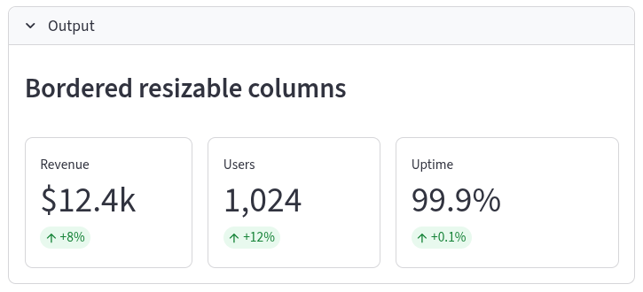
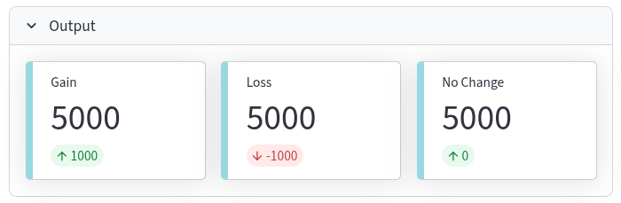

## Widgets

En el ecosistema de Streamlit, los **widgets** son los componentes fundamentales que permiten la interacción entre el usuario y la aplicación. Se pueden definir como las "palancas, botones y diales" que transforman un script estático de Python en una experiencia web bidireccional y dinámica.

A continuación se detallan sus características principales y categorías según las fuentes:

#### Función Principal
Los widgets actúan como el medio de comunicación donde el usuario proporciona datos o instrucciones y la aplicación responde en tiempo real. Sin ellos, una aplicación sería simplemente una visualización estática de información.

#### Categorías de Widgets
Las fuentes clasifican los widgets en varios grupos según su utilidad:

*   **Widgets de Entrada de Texto:** Permiten capturar cadenas de caracteres. Incluyen `st.text_input` (para líneas simples) y `st.text_area` (para bloques de texto más extensos).

*   **Widgets Numéricos y de Selección:**
    *   **`st.number_input`**: Para ingresar valores numéricos con validación automática.
    *   **`st.slider` y `st.select_slider`**: Para elegir valores o rangos deslizando un control.

*   **Widgets de Opción (Elección):**
    *   **`st.selectbox` y `st.multiselect`**: Menús desplegables para elegir una o varias opciones.
    *   **`st.radio`**: Botones de opción para seleccionar un único ítem de una lista visible.
    *   **`st.checkbox`**: Casillas de verificación para valores booleanos (verdadero/falso).

*   **Botones:** El widget más simple (`st.button`) se utiliza para activar acciones específicas, como ejecutar un cálculo o procesar datos.

*   **Widgets de Datos:** Permiten visualizar y, en algunos casos, editar tablas de datos, como `st.dataframe` y `st.data_editor`.

*   **Selectores de Tiempo y Color:** Incluyen calendarios (`st.date_input`), selectores de hora (`st.time_input`) y paletas de colores (`st.color_picker`).

*   **Carga de Medios:** Como `st.file_uploader` para subir archivos (hasta 200MB por defecto) y `st.camera_input` para capturar imágenes desde la webcam.

#### Comportamiento y Flujo de Ejecución
Una característica distintiva de los widgets en Streamlit es que **cada vez que un usuario interactúa con uno, el script de Python se vuelve a ejecutar de arriba abajo**. Esto permite que la aplicación refleje inmediatamente los cambios (por ejemplo, filtrar un gráfico al seleccionar una opción en un menú).

#### Identificadores Únicos (Keys)
Para que Streamlit pueda distinguir entre múltiples widgets del mismo tipo, utiliza un sistema de **identificadores o "keys"**. Aunque Streamlit suele generar estas claves internamente basándose en el contenido del widget, el desarrollador puede asignar una `key` manual para asegurar la unicidad y para acceder a su valor a través del estado de la sesión (`st.session_state`).

#### Estética y Diseño
Los widgets están pre-diseñados para ser visualmente atractivos por defecto, lo que permite al desarrollador centrarse en la lógica de la aplicación en lugar de en los detalles minuciosos del diseño de la interfaz de usuario. Se pueden organizar en la interfaz utilizando elementos de diseño como la barra lateral (`st.sidebar`), columnas (`st.columns`) o pestañas (`st.tabs`).


### Métricas

Para integrar el widget de métricas en un dashboard de Streamlit, se utiliza la función **`st.metric()`**, la cual está diseñada específicamente para resaltar indicadores clave de rendimiento (KPIs) de una manera visualmente atractiva y fácil de leer.

A continuación se detalla cómo funciona y cómo organizarlo dentro de una interfaz:

#### 1. Parámetros principales de `st.metric`
La sintaxis básica es `st.metric(label, value, delta=None, delta_color="normal")`:
*   **`label`**: Es el nombre o título de la métrica (por ejemplo, "Ventas Totales").
*   **`value`**: El valor numérico o texto principal que se desea mostrar.
*   **`delta`**: Un indicador opcional que muestra el cambio (aumento o disminución) respecto a un periodo anterior, generalmente acompañado de una flecha.
*   **`delta_color`**: Controla el color del delta. El modo **"normal"** muestra los aumentos en verde y las disminuciones en rojo; **"inverse"** invierte estos colores (útil para métricas donde menos es mejor, como los costos); y **"off"** muestra el delta en gris.

#### 2. Organización en el Dashboard mediante Columnas
En un dashboard profesional, es común mostrar varias métricas una al lado de la otra en la parte superior. Para lograr esto, se debe combinar `st.metric` con **`st.columns()`**:

```python showLineNumbers
import streamlit as st

# Crear tres columnas para las métricas principales
col1, col2, col3 = st.columns(3)

with col1:
    st.metric(label="Ingresos", value="$5,000", delta="10%")
with col2:
    st.metric(label="Gastos", value="$2,000", delta="-5%", delta_color="inverse")
with col3:
    st.metric(label="Usuarios Activos", value="1,200", delta="150")
```

#### 3. Técnicas avanzadas de diseño
*   **Uso de Contenedores:** Puedes envolver las métricas en un contenedor con borde (`st.container(border=True)`) para agruparlas visualmente y separarlas de los gráficos o tablas.
*   **Truco de Centrado:** Dado que Streamlit no ofrece una forma nativa de centrar el contenido dentro de una columna, una técnica común es subdividir una columna en tres partes (por ejemplo, con proporciones ``) y colocar la métrica en la columna del medio para que aparezca centrada en su sección.
*   **Integración Dinámica:** Las métricas son ideales para mostrar resultados de cálculos realizados con **Pandas**. Por ejemplo, en un dashboard de ventas, puedes calcular la suma de una columna de un DataFrame y pasar ese resultado directamente al parámetro `value` del widget.

Este widget es fundamental en aplicaciones de ciencia de datos porque permite a los tomadores de decisiones identificar rápidamente si los números están cumpliendo con las expectativas o si hay anomalías que requieran atención inmediata.

### st.dataframe

La diferencia fundamental entre **`st.dataframe`** y **`st.data_editor`** radica en la capacidad del usuario para interactuar con los datos: mientras que el primero es para visualización interactiva pero de solo lectura, el segundo permite la edición directa de los valores dentro de la aplicación.

A continuación se detallan las diferencias principales:

#### Interactividad y Edición
*   **`st.dataframe`**: Muestra un DataFrame como una **tabla interactiva** de solo lectura. El usuario puede desplazarse (scroll), ordenar las columnas haciendo clic en ellas y cambiar el tamaño de la tabla, pero **no puede modificar los datos** mostrados.
*   **`st.data_editor`**: Ofrece una interfaz similar a una hoja de cálculo que permite a los usuarios **editar los valores de las celdas** directamente desde la aplicación.

#### Retorno de Datos
*   **`st.dataframe`**: Su valor de retorno es `None` (o simplemente se usa para mostrar el objeto), por lo que no devuelve información de vuelta al script de Python más allá de la visualización.
*   **`st.data_editor`**: Es un widget bidireccional que **devuelve el DataFrame editado** como un nuevo objeto. Esto permite capturar los cambios del usuario y utilizarlos para otros procesos, como actualizar gráficos o guardar los datos en un archivo o base de datos.

#### Funcionalidades de Fila y Columna
*   **`st.data_editor`** permite configuraciones avanzadas que no están presentes o no son relevantes en `st.dataframe`:
    *   **Filas dinámicas**: Se puede configurar para permitir al usuario añadir o eliminar filas (por ejemplo, con el parámetro `num_rows="dynamic"`).
    *   **Configuración de columnas**: Ambos admiten `st.column_config`, pero en el editor esto permite definir tipos de entrada específicos para cada columna, como casillas de verificación (checkboxes), menús desplegables (selectboxes), selectores de fecha o URLs clicables.

#### Casos de Uso Ideales
| Función | Uso principal |
| :--- | :--- |
| **`st.dataframe`** | Exploración y análisis de datos donde solo se necesita visualizar grandes conjuntos de datos de forma interactiva (zoom, ordenamiento). |
| **`st.data_editor`** | Herramientas de control de calidad de datos, edición de parámetros de configuración, análisis de escenarios "what-if" o cualquier situación donde el usuario deba corregir o ingresar información. |

En resumen, si solo necesitas que tu audiencia **explore y vea** los resultados, usa `st.dataframe`; si necesitas que **interactúen y cambien** los datos, usa `st.data_editor`.

### Guardar cambios en st.data_editor

Para guardar los cambios realizados en el widget **`st.data_editor`**, debes aprovechar su naturaleza bidireccional, ya que esta función devuelve un nuevo objeto (un DataFrame, lista o diccionario) que contiene todas las ediciones hechas por el usuario.

A continuación, se detalla el proceso lógico y un ejemplo práctico para persistir estos cambios:

#### Pasos para guardar los cambios
1.  **Capturar el valor de retorno:** Asigna el resultado de la función `st.data_editor()` a una variable. Esta variable contendrá el estado actual de los datos modificados.
2.  **Actualizar la fuente original:** Si estás trabajando con un DataFrame filtrado, puedes usar los índices para actualizar los registros en tu DataFrame original.
3.  **Persistencia física:** Utiliza métodos de **Pandas** (como `.to_csv()`) o conectores de bases de datos para escribir el contenido de esa variable en tu almacenamiento permanente.
4.  **Confirmación del usuario:** Es una buena práctica envolver la acción de guardado en un botón (**`st.button`**) para evitar que el archivo o la base de datos se sobrescriban automáticamente con cada interacción menor del usuario.

#### Ejemplo de código
Siguiendo las fuentes, un patrón común para guardar cambios en un archivo CSV sería el siguiente:

```python showLineNumbers
import streamlit as st
import pandas as pd

# 1. Cargar los datos iniciales
df = pd.read_csv("datos.csv")

# 2. Mostrar el editor y capturar los cambios en 'df_editado'
df_editado = st.data_editor(df)

# 3. Botón para confirmar y persistir los cambios
if st.button("Guardar cambios y sobrescribir archivo"):
    df_editado.to_csv("datos.csv", index=False)
    st.success("¡Datos guardados exitosamente!")
```

#### Consideraciones adicionales
*   **Gestión de duplicados:** Puedes añadir lógica adicional para verificar y eliminar filas duplicadas antes de guardar utilizando `df_editado.drop_duplicates()`.
*   **Estructura dinámica:** Si permites que el usuario añada o elimine filas (usando el parámetro `num_rows="dynamic"` en el editor), el DataFrame retornado reflejará automáticamente estos cambios estructurales.
*   **Versión de Streamlit:** El widget `st.data_editor` fue introducido de forma oficial en la versión 1.19 (anteriormente era una función experimental); asegúrate de tener una versión actualizada para acceder a todas sus funcionalidades de configuración de columnas.

### st.columns


#### columnas ajustables

```python showLineNumbers
from streamlit_extras.resizable_columns import *

"""Resizable columns with borders."""
st.write("### Bordered resizable columns")
cols = resizable_columns(3, border=True, key="border_demo")
with cols[0]:
    st.metric("Revenue", "$12.4k", "+8%")
with cols[1]:
    st.metric("Users", "1,024", "+12%")
with cols[2]:
    st.metric("Uptime", "99.9%", "+0.1%")
```
<center>
<figure>

<figcaption>Las columnas son modificables arrastarndo el espacio entre ellas.</figcaption>
</figure>
</center>

### Barras de progreso

Para integrar indicadores de avance en procesos largos dentro de Streamlit, dispones de tres herramientas principales: **`st.progress()`**, **`st.spinner()`** y **`st.status()`**. Estos widgets permiten que el usuario sepa que la aplicación está trabajando y cuánto falta para terminar.

#### Barra de progreso (`st.progress`)
Se utiliza cuando puedes cuantificar el avance del proceso (por ejemplo, en un bucle que procesa filas de datos).

*   **Funcionamiento:** Recibe un valor entre 0 y 100 (entero) o entre 0.0 y 1.0 (flotante).
*   **Ejemplo de integración:**
    ```python showLineNumbers
    import streamlit as st
    import time

    bar = st.progress(0)
    for i in range(100):
        time.sleep(0.1)  # Simulación de proceso largo
        bar.progress(i + 1)
    st.write("¡Proceso completado!")
    ```.

#### Indicador de carga (`st.spinner`)
Se usa cuando no conoces el tiempo exacto que tomará la tarea, pero quieres mostrar un mensaje temporal mientras el bloque de código se ejecuta.

*   **Uso con `with`:** Se implementa como un administrador de contexto que desaparece automáticamente al finalizar la tarea.
*   **Ejemplo:**
    ```python showLineNumbers
    with st.spinner('Cargando datos...'):
        time.sleep(5)  # Operación costosa
    st.success('Datos listos.')
    ```.

#### Estado de la operación (`st.status`)
Este widget es útil para mostrar el estado de operaciones en curso, permitiendo incluir notificaciones o alertas sobre si la tarea está progresando, se completó o encontró errores.

#### Buenas prácticas para procesos largos
*   **Uso en la barra lateral:** Puedes colocar estos indicadores en la barra lateral (`st.sidebar.progress()`) para mantener el área principal de la aplicación despejada mientras se procesa la información.
*   **Optimización con Caching:** Para evitar que un proceso largo se ejecute cada vez que el usuario interactúa con un widget, utiliza **`@st.cache_data`**. Esto guarda el resultado en memoria y, en la siguiente ejecución, devuelve el dato instantáneamente sin repetir la espera.
*   **Elementos de celebración:** Al finalizar un proceso muy largo o importante, puedes usar `st.balloons()` o `st.snow()` para añadir un toque visual que indique el éxito de la tarea.

#### En un bucle

Para integrar la barra de progreso en un bucle de Streamlit, con la función **`st.progress()`**, la que está diseñada para visualizar el avance de operaciones de larga duración.

A continuación se detallan los pasos y reglas para su implementación:

#### Inicialización y Valores
La barra de progreso debe inicializarse antes de comenzar el bucle, normalmente con un valor de 0. Este widget acepta valores numéricos en dos formatos:
*   **Enteros:** En un rango de **0 a 100**.
*   **Punto flotante:** En un rango de **0.0 a 1.0**.

#### Actualización dentro del Bucle
Dentro del bucle, debes llamar al método **`.progress()`** sobre el objeto que creaste inicialmente para actualizar su estado visual en cada iteración.

**Ejemplo de código:**
```python showLineNumbers
import streamlit as st
import time

st.title('Ejemplo de Barra de Progreso')

# 1. Crear el objeto de la barra inicializado en 0
barra_de_progreso = st.progress(0)

# 2. Ejecutar el bucle
for i in range(100):
    time.sleep(0.1)  # Simulación de un proceso lento
    
    # 3. Actualizar la barra con el nuevo porcentaje
    barra_de_progreso.progress(i + 1)

st.write("¡Proceso completado!")
```

#### Opciones de Ubicación
*   **Contenido principal:** Al usar `st.progress()`, la barra aparecerá en el área central de la aplicación en el orden en que fue llamada.
*   **Barra lateral:** Si deseas mantener el área principal despejada, puedes integrar la barra en el panel izquierdo utilizando **`st.sidebar.progress(0)`**.
*   **Limpieza:** Una vez terminado el proceso, puedes usar el comando `.empty()` sobre el objeto de la barra de progreso si deseas que desaparezca de la interfaz.

Si el proceso es de duración incierta y no puedes calcular un porcentaje, las fuentes recomiendan usar **`st.spinner()`** en su lugar para mostrar un indicador de carga temporal.

### Metric cards

```python showLineNumbers
from streamlit_extras.metric_cards import *

col1, col2, col3 = st.columns(3)

col1.metric(label="Gain", value=5000, delta=1000)
col2.metric(label="Loss", value=5000, delta=-1000)
col3.metric(label="No Change", value=5000, delta=0)

style_metric_cards()
```
<center>
<figure>

<figcaption>Las tarjetas (cards) son esenciales para mostrar los KPIs dentro de un Panel.</figcaption>
</figure>
</center>


### Widgets para filtrar

Además de los widgets que ya hemos discutido (`st.selectbox`, `st.multiselect`, `st.slider` y `st.date_input`), Streamlit ofrece otras opciones potentes para capturar la interacción del usuario y aplicarla como filtros en tus datos:

#### 1. Widgets de Selección y Opción
*   **`st.checkbox`**: Este widget devuelve un valor booleano (`True` o `False`). Es ideal para filtros binarios, como permitir que el usuario decida si desea ver solo los registros que cumplen una condición específica (por ejemplo, "Solo mostrar productos en oferta").

*   **`st.radio`**: Permite seleccionar una única opción de una lista corta que permanece siempre visible. Es muy útil cuando tienes pocas categorías y quieres que el usuario vea todas las opciones disponibles de un vistazo sin tener que abrir un menú desplegable.

*   **`st.toggle`**: Funciona de manera similar al checkbox pero con una estética de interruptor. Se utiliza comúnmente para activar o desactivar capas de datos o filtros globales en la aplicación.

#### 2. Deslizadores Especializados
*   **`st.select_slider`**: Es un widget híbrido que combina la funcionalidad de una lista con la interfaz de un deslizador. Se usa para seleccionar valores de una lista ordenada de etiquetas de texto (como "Pequeño", "Mediano", "Grande") o para definir un rango entre opciones no numéricas.

#### 3. Entradas de Valor Específico
*   **`st.number_input`**: Permite al usuario ingresar o ajustar valores numéricos mediante botones de "+" y "-". Es excelente para filtrar por umbrales exactos, como "mostrar registros con una calificación mínima de X".

*   **`st.text_input`**: Actúa como una barra de búsqueda. Puedes usar el texto ingresado por el usuario para filtrar un DataFrame utilizando comparaciones de cadenas (como buscar nombres de clientes o productos específicos).

#### 4. Filtros de Tiempo y Color
*   **`st.time_input`**: Útil para dashboards que requieren análisis temporal detallado, permitiendo filtrar datos por horas o minutos específicos del día.

*   **`st.color_picker`**: Aunque su uso principal es estético, puede servir como filtro si tus datos contienen atributos cromáticos (por ejemplo, filtrar un inventario de ropa por el color seleccionado en la paleta).

Para optimizar el espacio, puedes colocar estos widgets en la barra lateral utilizando **`st.sidebar`** o agruparlos en columnas con **`st.columns`** para que el usuario pueda ajustar varios parámetros de filtrado simultáneamente sin recargar la página innecesariamente.

### st.form

El comando **`st.form`** en Streamlit es una herramienta fundamental para agrupar múltiples widgets de entrada y controlar el flujo de ejecución de la aplicación, permitiendo que los datos se envíen en un solo bloque en lugar de procesar cada cambio individualmente.

A continuación, se detalla su uso, cuándo emplearlo y un ejemplo práctico basado en las fuentes:

#### ¿Cuándo debe usarse `st.form`?
Por defecto, Streamlit vuelve a ejecutar todo el script de Python cada vez que un usuario interactúa con cualquier widget (como mover un deslizador o escribir en un cuadro de texto). Debes usar un formulario en las siguientes situaciones:

*   **Formularios complejos:** Cuando tu aplicación requiere que el usuario complete muchos campos (nombre, fecha, valor numérico, etc.) antes de procesar la información.
*   **Evitar reruns innecesarios:** Si tienes procesos o cálculos costosos que no quieres que se disparen con cada pequeña interacción del usuario.
*   **Mejorar la experiencia del usuario (UX):** Permite al usuario revisar todas sus entradas y confirmarlas mediante un único botón de envío, en lugar de ver cómo la página se refresca con cada cambio.

#### Componentes clave
Para implementar un formulario se requieren dos elementos obligatorios:
1.  **`st.form(key)`:** Crea el contenedor del formulario. El parámetro `key` es un identificador único obligatorio para el formulario.
2.  **`st.form_submit_button`:** Es el único botón capaz de enviar los datos del formulario y activar el relanzamiento del script. Sin este botón, Streamlit arrojará un error.

#### Ejemplo de uso
El siguiente ejemplo muestra cómo estructurar un formulario de retroalimentación utilizando la sintaxis de administrador de contexto (`with`):

```python showLineNumbers
import streamlit as st

# Crear el formulario usando un identificador único
with st.form(key='mi_formulario_comentarios'):
    st.header('Formulario de Comentarios')
    
    # Organizar widgets en columnas dentro del formulario
    col1, col2 = st.columns(2)
    
    with col1:
        nombre = st.text_input('Nombre completo')
        calificacion = st.slider('Califica la app', 0, 10, 5)
        
    with col2:
        fecha = st.date_input('Fecha de visita')
        recomienda = st.radio('¿Nos recomendarías?', ('Sí', 'No'))
    
    # Botón obligatorio para procesar el formulario
    submit_button = st.form_submit_button(label='Enviar')

# Acción después de hacer clic en el botón de envío
if submit_button:
    st.success(f"Gracias {nombre}, hemos recibido tu calificación de {calificacion}.")
    # Aquí es donde los datos se procesan o guardan
```

#### Notas importantes y limitaciones
*   **Envío por lotes:** Al presionar el botón de envío, el estado de todos los widgets dentro del formulario se envía en conjunto.
*   **Restricción de Callbacks:** Dentro de un formulario, solo el botón de envío (`st.form_submit_button`) puede tener una función de *callback*. Otros widgets internos no admiten esta funcionalidad mientras estén dentro del formulario.
*   **Diferencia con `st.button`:** Un botón normal dentro de un formulario no funcionará para enviar los datos; debe usarse específicamente el comando de envío de formulario.
*   **Limpieza al enviar:** Puedes usar el parámetro `clear_on_submit=True` en `st.form` para que todos los campos vuelvan a sus valores por defecto automáticamente después de presionar el botón de envío.

