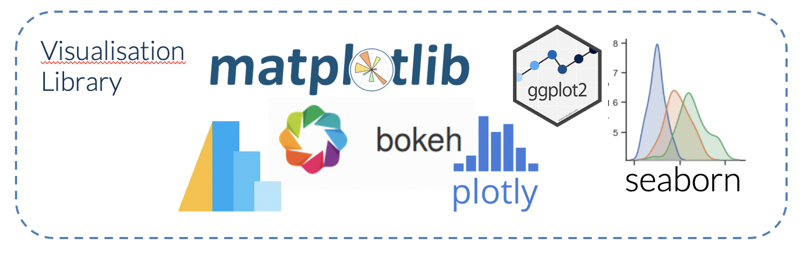
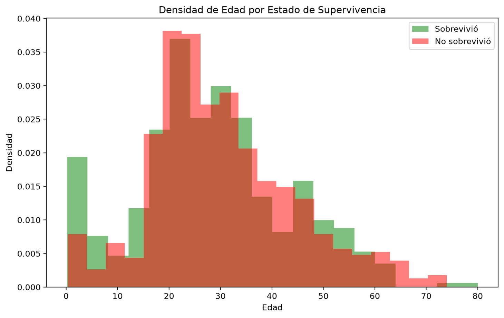
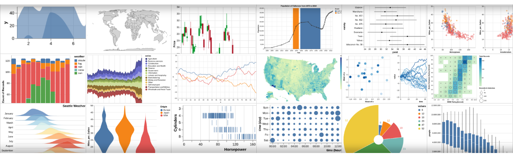
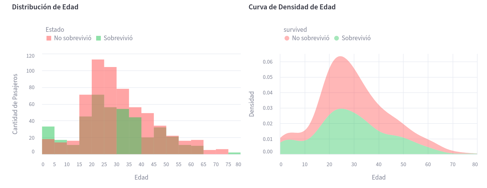
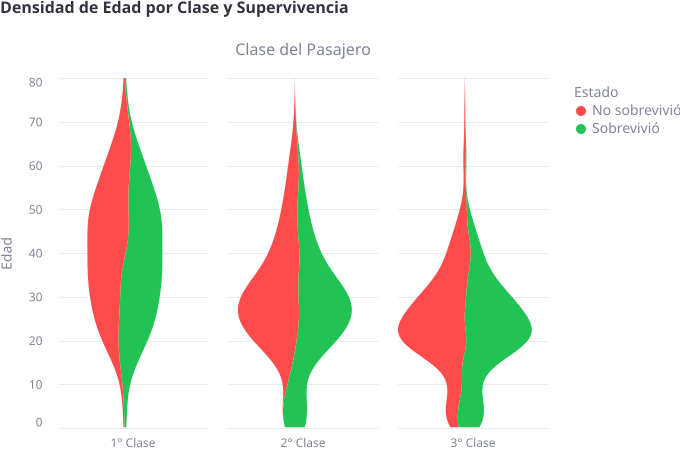
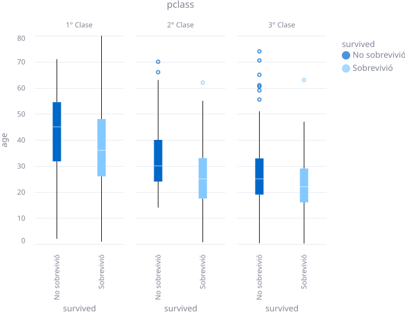
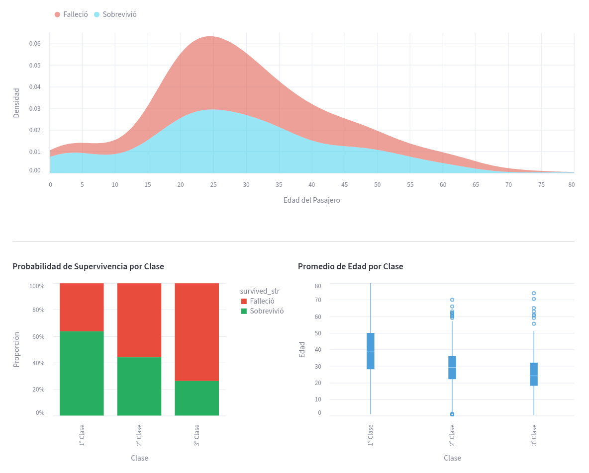

<center>

</center>

:::info[datasets]
- https://patricioaraneda.cl/public/titanic3.csv
- https://patricioaraneda.cl/public/penguins.csv
- https://patricioaraneda.cl/public/worldbank_population.csv
:::

## Integración de gráficos

Integrar gráficos de **Matplotlib** y **Plotly** en Streamlit es un proceso sencillo gracias a comandos nativos diseñados específicamente para estas bibliotecas. A continuación, se detalla cómo hacerlo para cada una:

### Matplotlib

<center>
<figure>

<figcaption></figcaption>
</figure>
</center>

Para crear un gráfico de barras utilizando la librería **Matplotlib** en una aplicación de Streamlit, se debe utilizar la función **`st.pyplot()`**. Esta función es la encargada de renderizar figuras de Matplotlib directamente en la interfaz web.

A continuación, se presenta un ejemplo completo de uso:

<details>
<summary>💻 Código</summary>

```python
import streamlit as st
import pandas as pd
import matplotlib.pyplot as plt

# 1. Título de la aplicación
st.title("Gráfico de Barras con Matplotlib")

# 2. Preparación de los datos (usando Pandas)
data = {
    'Nombre': ['Jessica', 'John', 'Alex'],
    'Puntaje':
}
df = pd.DataFrame(data)

# 3. Creación del gráfico con Matplotlib
# Se recomienda crear explícitamente la figura (fig) y los ejes (ax) 
# para tener mayor control y evitar errores en aplicaciones con múltiples gráficos.
fig, ax = plt.subplots()

# Dibujar las barras
ax.bar(df['Nombre'], df['Puntaje'], color='skyblue')

# Personalización de etiquetas y título
ax.set_xlabel('Nombres')
ax.set_ylabel('Puntaje')
ax.set_title('Puntajes por Persona')

# 4. Mostrar el gráfico en Streamlit
st.pyplot(fig)
```
</details>

<center>
<figure>

<figcaption>Uso de Matplotlib dentro de Streamlit.</figcaption>
</figure>
</center>

#### Detalles clave para su implementación:

*   **Uso de `plt.subplots()`:** Las fuentes recomiendan este enfoque (definir explícitamente `fig` y `ax`) en lugar de llamar a `plt.hist()` o `plt.bar()` de forma global. Esto asegura que los gráficos se mantengan separados y no se encimen datos de visualizaciones anteriores en la misma sesión.

*   **Integración con Pandas:** Es común definir los datos en un **DataFrame** de Pandas y luego pasar las columnas deseadas a los ejes de Matplotlib.

*   **Limpieza de la figura:** Por defecto, `st.pyplot()` limpia la figura después de renderizarla para optimizar el uso de memoria en la aplicación.

*   **Interactividad:** A diferencia de librerías como Plotly o Altair, los gráficos de Matplotlib en Streamlit se renderizan como imágenes estáticas. Si necesitas zoom o herramientas de filtrado integradas en el gráfico, se sugiere explorar `st.plotly_chart` o `st.altair_chart`.


*   **Nota importante:** Se recomienda encarecidamente definir y pasar el objeto `fig` explícitamente. Si se llama a `st.pyplot()` sin argumentos, Streamlit intentará usar la figura global actual, lo que puede causar resultados inesperados o errores de advertencia (`PyplotGlobalUseWarning`).


### Plotly

<center>
<figure>

<figcaption></figcaption>
</figure>
</center>

Para gráficos interactivos de Plotly, Streamlit ofrece el comando **`st.plotly_chart()`**.

*   **Interactividad:** Una gran ventaja es que toda la interactividad nativa de Plotly (zoom, herramientas de información al pasar el mouse, descarga como imagen) funciona automáticamente dentro de la aplicación.
*   **Uso con Plotly Express u Objects:** Puedes crear la figura usando `plotly.express` (para gráficos rápidos) o `plotly.graph_objects` (para mayor personalización) y luego mostrarla.
*   **Ajuste de ancho:** Es común usar el parámetro `use_container_width=True` para que el gráfico se expanda automáticamente al ancho de la columna o página.
*   **Ejemplo de código:**
    ```python
    import plotly.express as px
    import streamlit as st
    import pandas as pd

    df = pd.DataFrame({"x":, "y":})
    fig = px.line(df, x="x", y="y", title="Gráfico de Plotly")

    # Mostrar con ancho ajustado al contenedor
    st.plotly_chart(fig, use_container_width=True)
    ```

#### Comparación rápida entre ambos
| Característica | Matplotlib | Plotly |
| :--- | :--- | :--- |
| **Comando** | `st.pyplot(fig)` | `st.plotly_chart(fig)` |
| **Naturaleza** | Estática (imagen) | Interactiva (web) |
| **Uso ideal** | Visualizaciones estadísticas clásicas | Paneles interactivos y dashboards |

Ambas bibliotecas son compatibles con las funciones de **caching** de Streamlit (`@st.cache_data` o `@st.cache_resource`), lo que permite cargar los datos o generar los objetos de los gráficos de manera eficiente sin repetir cálculos costosos en cada recarga de la página.

### Personalizar gráficos

Para personalizar los colores de un gráfico en Streamlit, puedes utilizar métodos específicos de las bibliotecas de visualización (como Plotly, Matplotlib o Altair) o permitir que el usuario elija los colores mediante widgets interactivos.

A continuación, se detallan las formas principales de lograrlo:

#### Uso del widget `st.color_picker`
Streamlit ofrece el comando **`st.color_picker()`**, que permite al usuario seleccionar un color de forma interactiva. Este widget devuelve el color seleccionado como una cadena de texto en formato hexadecimal (por ejemplo, `"#D6266A"`), que luego puedes pasar a tus funciones de graficado.

*   **Con Seaborn/Matplotlib:** Puedes pasar el valor obtenido del selector de color al argumento `color` de la función de gráfico.
    ```python
    graph_color = st.sidebar.color_picker('Elige un color para el gráfico')
    sns.histplot(df['columna'], color=graph_color)
    ```
*   **Con Plotly:** Puedes usar el parámetro `color_discrete_sequence` para aplicar el color seleccionado a las series del gráfico.
    ```python
    fig = px.histogram(df, x="variable", color_discrete_sequence=[graph_color])
    ```

#### Personalización según la biblioteca de gráficos
Cada biblioteca integrada con Streamlit tiene sus propios parámetros para gestionar colores:

*   **Plotly:** Puedes asignar colores basados en variables específicas del dataset usando el argumento `color` (por ejemplo, `color="especie"`). También puedes definir escalas de colores continuas como "Viridis" en gráficos de dispersión.
*   **Altair:** La personalización se realiza dentro del método `.encode()`, utilizando el parámetro `color` para vincular una columna de datos a una escala cromática.
*   **Mapas (PyDeck):** En gráficos geoespaciales, puedes definir el color de las capas (como `ScatterplotLayer` o `HexagonLayer`) basándote en la densidad de los puntos o en valores específicos.

#### Temas globales de la aplicación
Puedes cambiar el esquema de colores de toda la interfaz, lo que afecta indirectamente a cómo se ven los widgets y algunos elementos gráficos, modificando el archivo **`config.toml`** en la carpeta `.streamlit`. Los parámetros clave son:

*   **`primaryColor`**: Cambia el color de acento de los elementos interactivos como botones y deslizadores.
*   **`backgroundColor`**: Define el color del área principal de contenido.
*   **`secondaryBackgroundColor`**: Ajusta el color de la barra lateral y de los fondos de ciertos widgets.
*   **`textColor`**: Cambia el color de la fuente en toda la aplicación.

Estas configuraciones de tema también se pueden previsualizar y ajustar gráficamente desde el menú de **Settings** en la esquina superior derecha de la aplicación Streamlit.

### Otras librerias compatibles

Además de **Matplotlib** y **Plotly**, Streamlit es compatible con una amplia variedad de librerías de visualización de Python, lo que permite desde gráficos estadísticos clásicos hasta mapas interactivos complejos.

Se detallan las librerías principales:

### Librerías de Visualización Estadística e Interactivas
*   **Altair:** Es una librería de visualización estadística declarativa basada en Vega. Streamlit tiene un comando nativo, `st.altair_chart()`, para integrarla de forma fluida. Es ideal para prototipado rápido y visualizaciones web responsivas.

*   **Seaborn:** Basada en Matplotlib, se utiliza para crear gráficos estadísticos más atractivos y con estilos predefinidos. Se despliega en Streamlit usando el comando `st.pyplot()`, al igual que Matplotlib.

*   **Bokeh:** Una librería enfocada en la interactividad dentro de navegadores web. Se integra mediante `st.bokeh_chart()`.

*   **Vega-Lite:** Utiliza una sintaxis JSON compacta para crear gráficos interactivos. Se puede renderizar con `st.vega_lite_chart()`.

#### Visualización Geoespacial y de Mapas
*   **PyDeck:** Especializada en visualizaciones de datos espaciales a gran escala y en 3D, construida sobre deck.gl. Se integra con `st.pydeck_chart()`.

*   **Folium:** Permite crear mapas interactivos utilizando la librería Leaflet.js de JavaScript. Existe un componente de la comunidad llamado `st-folium` que permite incluso capturar eventos de clic en el mapa de vuelta hacia Streamlit.

#### Visualizaciones Especializadas
*   **Graphviz:** Se utiliza para crear diagramas de red, flujogramas y estructuras de grafos utilizando el lenguaje DOT. Streamlit ofrece el comando `st.graphviz_chart()` para este propósito.

*   **Dagre-D3:** Otra opción para visualizaciones de grafos y redes disponible a través de integraciones.

#### Herramientas de Análisis Automático
*   **Pandas-Profiling:** Aunque es más una herramienta de análisis exploratorio de datos (EDA), existe un componente (`streamlit-pandas-profiling`) que genera reportes interactivos completos directamente dentro de una aplicación Streamlit.

**Nota sobre la compatibilidad:** Streamlit permite extender su funcionalidad mediante **componentes personalizados** de terceros, lo que significa que casi cualquier librería de visualización de JavaScript puede ser adaptada para funcionar dentro del entorno de Streamlit si existe el envoltorio (*wrapper*) adecuado.

## Altair

<center>
<figure>

<figcaption></figcaption>
</figure>
</center>

**https://altair-viz.github.io/**

Altair es la librería por defecto que utiliza Streamlit.

Para usar **Altair** en tus aplicaciones de Streamlit, debes seguir un enfoque **declarativo**, donde defines las relaciones entre las columnas de tus datos en lugar de especificar cada detalle del gráfico manualmente.


A continuación, se detallan los pasos y comandos principales:

#### 1. Preparación e Instalación
Primero, asegúrate de tener instalada la librería en tu entorno:
```bash
pip install altair
```
Luego, impórtala en tu script junto con Streamlit y Pandas.

<details>
<summary>💻 Código</summary>

```python showLineNumbers
import streamlit as st
import pandas as pd
import altair as alt

# 1. Carga y limpieza de datos
@st.cache_data
def load_data():
    df = pd.read_csv('https://patricioaraneda.cl/public/titanic3.csv')
    # Limpiamos nulos en 'age' y aseguramos que 'survived' sea tratada como categoría (nominal)
    df = df.dropna(subset=['age'])
    df['survived'] = df['survived'].map({1: 'Sobrevivió', 0: 'No sobrevivió'})
    return df

df = load_data()

# 2. Creación del Histograma con Altair
# Usamos mark_bar() y definimos el agrupamiento (bin) para la edad
histograma = alt.Chart(df).mark_bar(opacity=0.5, binSpacing=0).encode(
    alt.X('age:Q', bin=alt.Bin(maxbins=30), title='Edad'),
    alt.Y('count():Q', stack=None, title='Cantidad de Pasajeros'),
    alt.Color('survived:N', title='Estado', scale=alt.Scale(range=['red', 'green']),
              legend=alt.Legend(
                                orient='top',          # Posiciona la leyenda arriba
                                direction='horizontal', # Dispone los elementos de lado a lado
                            ))
).properties(
    title='Distribución de Edad',
    height=400
).interactive() # Permite zoom y desplazamiento [3, 4]

# 3. Creación de Gráfico de Densidad (Área)
# Nota: Altair permite transformar los datos para calcular la densidad
densidad = alt.Chart(df).transform_density(
    'age',
    as_=['age', 'density'],
    groupby=['survived']
).mark_area(opacity=0.4).encode(
    alt.X('age:Q', title='Edad'),
    alt.Y('density:Q', title='Densidad'),
    alt.Color('survived:N', scale=alt.Scale(range=['red', 'green']),
              legend=alt.Legend(
                                orient='top',          # Posiciona la leyenda arriba
                                direction='horizontal', # Dispone los elementos de lado a lado
                            ))
).properties(
    title='Curva de Densidad de Edad',
    height=400
).interactive()

# 4. Mostrar los gráficos en Streamlit
# Usamos columnas para ponerlos lado a lado [5, 6]
col1, col2 = st.columns(2)

with col1:
    st.altair_chart(histograma, use_container_width=True)

with col2:
    st.altair_chart(densidad, use_container_width=True)

```
</details>

<center>
<figure>

<figcaption>Uso de Altair, este permite utilizar dendisdad a diferencia de Matplotlib.</figcaption>
</figure>
</center>

**Detalles clave de la implementación con Altair:**

**Interactividad Nativa:** Al añadir .interactive(), el usuario puede hacer zoom y mover los gráficos sin necesidad de código adicional, algo que en Matplotlib sería estático.

**Mapeo de Colores:** La función encode(color='survived:N') agrupa automáticamente los datos y asigna colores distintos según la categoría, facilitando la comparación visual entre supervivientes y no supervivientes.

**Transformaciones en el Gráfico:** Altair permite realizar el cálculo de la densidad directamente dentro del objeto del gráfico con .transform_density(), evitando tener que procesar manualmente las curvas de distribución en Pandas.

**Ajuste al Contenedor:** Se utiliza el parámetro use_container_width=True en st.altair_chart() para asegurar que los gráficos aprovechen todo el ancho de las columnas de la interfaz.

**Tipos de Datos:** Es importante especificar :Q para datos cuantitativos (como la edad) y :N para datos nominales o categóricos (como el estado de supervivencia) para que Altair aplique las escalas correctas.

#### Comando Principal: `st.altair_chart()`
Para mostrar un gráfico de Altair, se utiliza la función **`st.altair_chart()`**. Un parámetro común es `use_container_width=True`, que ajusta automáticamente el ancho del gráfico al contenedor de la aplicación.

#### Flujo de Trabajo para Crear Gráficos
El proceso estándar consiste en definir un objeto de gráfico y luego pasarlo a Streamlit:

1.  **Definir el gráfico:** Usa `alt.Chart(df)` pasando tu DataFrame.

2.  **Elegir la marca (`mark`):** Define el tipo de visualización (barras, líneas, puntos, etc.).

3.  **Codificar canales (`encode`):** Mapea las columnas del DataFrame a los ejes X, Y, colores o tooltips.

4.  **Añadir interactividad:** Usa el método `.interactive()` para permitir que el usuario haga zoom o desplace el gráfico.

#### Ejemplos de Gráficos Comunes
*   **Gráfico de Barras:** Se usa `mark_bar()`. Altair puede resumir datos directamente, por ejemplo, usando `y='count(*):Q'` para contar registros.
*   **Gráfico de Áreas:** Utiliza `mark_area()`, ideal para representar datos cuantitativos basados en series temporales.
*   **Gráfico de Dispersión (Scatter):** Emplea `mark_circle()` o `mark_point()`. Es muy útil para ver correlaciones entre variables.
*   **Gráfico de Cajas (Boxplot):** Usa `mark_boxplot()` para representar cuartiles, promedios y valores atípicos.
*   **Mapa de Calor (Heatmap):** Se utiliza `mark_rect()` para representar la intensidad de valores en dos dimensiones.

Aunque las fuentes detallan específicamente el uso de la librería Seaborn para la creación de gráficos de violín (sns.violinplot), la librería Altair permite realizar un análisis estadístico similar mediante el uso de transformaciones de densidad o diagramas de caja (boxplots).

Se presenta un ejemplo de código que utiliza Altair en Streamlit para generar una visualización de densidad vertical (similar a un violín) para comparar la edad de los pasajeros según su clase y estado de supervivencia:

<details>
<summary>💻 Código</summary>

Para evaluar la relación entre la clase del pasajero (pclass) y su supervivencia (survived) en el dataset titanic3.csv utilizando un enfoque de distribución, se recomienda incluir una variable numérica continua como la edad para que el gráfico de violín sea representativo de una densidad real.

```python showLineNumbers
import streamlit as st
import pandas as pd
import altair as alt

# 1. Configuración y carga de datos [7, 8]

@st.cache_data
def load_titanic():
    # Carga el archivo titanic3.csv mencionado en las fuentes [7]
    df = pd.read_csv('titanic3.csv')
    # Limpieza de datos: eliminar nulos en 'age' para la distribución [7]
    df = df.dropna(subset=['age', 'pclass', 'survived'])
    # Convertir a tipos categóricos para mejorar la visualización
    df['survived'] = df['survived'].map({1: 'Sobrevivió', 0: 'No sobrevivió'})
    df['pclass'] = df['pclass'].astype(str) + "° Clase"
    return df

df = load_titanic()

# 2. Creación del gráfico con Altair [3, 5]
# Nota: Altair utiliza transformaciones para representar densidades [Turn 23]
violin_like_chart = alt.Chart(df).transform_density(
    'age',
    as_=['age', 'density'],
    groupby=['pclass', 'survived']
).mark_area(orient='horizontal').encode(
    alt.X('density:Q', stack='center', impute=None, title=None, axis=alt.Axis(labels=False, grid=False)),
    alt.Y('age:Q', title='Edad'),
    alt.Color('survived:N', title='Estado', scale=alt.Scale(range=['red', 'green'])),
    alt.Column('pclass:N', title='Clase del Pasajero', header=alt.Header(labelOrient='bottom'))
).properties(
    width=150,
    title='Densidad de Edad por Clase y Supervivencia'
).configure_view(
    stroke=None
)

# 3. Mostrar el gráfico en Streamlit [6, 9]
st.altair_chart(violin_like_chart, use_container_width=True)

# Alternativa rápida: Boxplot (Soportado nativamente por Altair en las fuentes [5])
st.subheader("Alternativa: Gráfico de Caja (Boxplot)")
boxplot = alt.Chart(df).mark_boxplot().encode(
    x='survived:N',
    y='age:Q',
    color='survived:N',
    column='pclass:N'
).properties(width=150)

st.altair_chart(boxplot)
```
</details>

<center>
<figure>

<figcaption>Gráfico tipo Violin en Altair.</figcaption>
</figure>
</center>

<center>
<figure>

<figcaption>Gráfico alternativo Boxplot en Altair.</figcaption>
</figure>
</center>

#### Datos de Interés
*   **Interacción fluida:** Al ser basado en Vega, los gráficos son web-friendly y responden bien en el navegador.

*   **Uso interno:** Las funciones nativas de Streamlit como `st.line_chart()` y `st.bar_chart()` son, en realidad, llamadas simplificadas a la librería Altair.

*   **Visualización de modelos:** Puedes usar `st.write(chart)` (la "navaja suiza" de Streamlit) para renderizar objetos de Altair directamente si no necesitas configuraciones adicionales.

### Ventajas de Altair

La elección entre **Altair**, **Matplotlib** y **Plotly** depende de las necesidades de interactividad y personalización del proyecto. **Altair** presenta ventajas significativas, especialmente en su integración con Streamlit:

#### 1. Enfoque Declarativo vs. Imperativo
*   **Altair:** Es una librería **declarativa**. Esto significa que el desarrollador define las **relaciones entre las columnas** de los datos (qué va en el eje X, qué en el Y, qué determina el color) y Altair se encarga del resto del diseño.

*   **Matplotlib:** Es más **verbosa** y requiere un control detallado de cada elemento del gráfico (enfoque imperativo), lo que puede complicar la creación de visualizaciones complejas.

*   **Plotly:** Aunque potente, puede tener una curva de aprendizaje más pronunciada para funciones avanzadas en comparación con la simplicidad de Altair.

#### 2. Interactividad Nativa y Rendimiento
*   **Altair:** Los gráficos son **interactivos por defecto** (zoom, desplazamiento, herramientas de información al pasar el ratón) y están diseñados para ser amigables con la web y responsivos.

*   **Matplotlib:** Los gráficos son **estáticos por defecto**. No ofrecen interactividad nativa dentro del navegador y, en aplicaciones muy grandes, pueden **ralentizar la ejecución** ya que se renderizan como imágenes estáticas en lugar de componentes web vivos.

*   **Plotly:** Es altamente interactivo y dinámico, pero esto puede hacerlo más **intensivo en recursos** de computación en comparación con la ligereza de Altair.

#### 3. Integración con Streamlit
*   **Altair:** Es la librería que Streamlit utiliza internamente para sus comandos de visualización nativos, como `st.line_chart()`, `st.bar_chart()` y `st.area_chart()`. Se considera la "capa visual" estándar sobre Python para este framework.

*   **Matplotlib:** Requiere definir explícitamente objetos de figura (`plt.subplots()`) y pasarlos al comando `st.pyplot()`, lo que puede generar advertencias globales si no se gestiona correctamente.

#### 4. Estética y Diseño
*   **Altair:** Es una opción que genera gráficos **"generalmente bonitos"** con poco esfuerzo, siguiendo principios modernos de visualización estadística.

*   **Matplotlib:** Es ampliamente adoptado pero se considera **"no particularmente atractivo"** estéticamente sin una configuración manual extensa.

### Resumen Comparativo

| Característica | Altair | Matplotlib | Plotly |
| :--- | :--- | :--- | :--- |
| **Naturaleza** | Declarativa (fácil de programar) | Imperativa (más código) | Interactiva (compleja) |
| **Interactividad** | Alta e integrada | Nula (estática) | Muy alta (dinámica) |
| **Uso en Streamlit** | Motor interno nativo | Renderizado como imagen | Integración bidireccional |
| **Estética** | Moderna y limpia | Clásica y básica | Moderna y profesional |

En conclusión, **Altair ofrece la mejor combinación de simplicidad de código, interactividad web y rendimiento** para la mayoría de los casos de uso en Streamlit, mientras que Matplotlib se reserva para visualizaciones científicas muy específicas y Plotly para dashboards donde se requiera una interactividad bidireccional extremadamente compleja.

### Personalizar

Para personalizar el diseño de tus gráficos de **Altair** en Streamlit, puedes utilizar diversos métodos y parámetros integrados en la librería que permiten controlar desde los colores hasta la interactividad.

A continuación, se detallan las formas principales de personalización según las fuentes:

#### Uso de Métodos de Marca (`mark_*`)
El método de marca define el tipo de gráfico y permite ajustes estéticos globales:
*   **Color Fijo:** Puedes definir un color estático para todos los elementos, por ejemplo: `alt.Chart(df).mark_area(color="orange")`.
*   **Opacidad:** Es útil para gráficos con datos superpuestos, usando parámetros como `opacity=0.4` dentro del método de marca [Turn 21].
*   **Grosor de línea:** En gráficos de línea, se puede ajustar con `strokeWidth`.

#### Personalización mediante `encode()`
El método `.encode()` vincula los datos con canales visuales y permite un control granular:
*   **Mapeo de Colores Dinámico:** Puedes asignar colores basados en una columna específica y definir escalas personalizadas: `alt.Color('columna:N', scale=alt.Scale(range=['red', 'green']))` [Turn 21].
*   **Ejes y Títulos:** Utiliza `alt.X()` o `alt.Y()` para renombrar ejes o configurar escalas cuantitativas (`:Q`) o nominales (`:N`): `alt.X('edad:Q', title='Edad del Pasajero')` [Turn 21].
*   **Tamaño:** En gráficos de dispersión, puedes variar el tamaño de los puntos según una variable: `encode(size='Col3')`.

#### Configuración de Leyendas y Tooltips
*   **Posicionamiento de Leyendas:** Puedes mover la leyenda a diferentes partes del gráfico (arriba, abajo, izquierda, derecha) usando `alt.Legend(orient='top')` dentro del canal de color [Turn 22].
*   **Tooltips Interactivos:** Para mostrar información al pasar el cursor, añade el parámetro `tooltip` en el método `encode()` pasando una lista de las columnas que deseas visualizar.

#### Interactividad y Dimensiones
*   **Zoom y Desplazamiento:** Simplemente añadiendo `.interactive()` al final de la definición de tu gráfico, permites que el usuario haga zoom y mueva la visualización [83, Turn 21].
*   **Ajuste al Contenedor:** Para que el gráfico ocupe todo el ancho disponible en la interfaz de Streamlit (especialmente útil si usas columnas), utiliza el parámetro `use_container_width=True` en la función de renderizado: `st.altair_chart(chart, use_container_width=True)` [900, Turn 21].

#### Títulos del Gráfico
Puedes añadir un título principal directamente al inicializar el objeto del gráfico: `alt.Chart(df, title="Mi Gráfico Personalizado")`.

Como recordatorio, Altair es una librería **declarativa**, lo que significa que en lugar de escribir cada detalle visual manualmente, defines las relaciones entre las columnas de tus datos y Altair se encarga de aplicar el diseño de forma inteligente.


### Personalizar tema de color

Establecer un tema de color para gráficos de **Altair** en Streamlit se puede lograr de dos maneras principales: a través de la configuración global del **tema de la aplicación** (que Altair respeta automáticamente) o definiendo **escalas de colores personalizadas** dentro del código del gráfico.

A continuación, se detallan los métodos indicados:

#### Configuración Global del Tema en Streamlit
Streamlit permite definir un esquema de colores para toda la aplicación que afecta a los componentes interactivos y visualizaciones. Esto se configura en el archivo de configuración de la aplicación.

*   **Gráficamente:** Puedes probar colores en tiempo real haciendo clic en el menú de hamburguesa (esquina superior derecha), seleccionando **Settings** y luego **Edit active theme**. Aquí puedes ajustar el `Primary color` (usado para elementos interactivos), `Background color`, `Text color` y `Secondary background color`.

*   **En el archivo de configuración:** Una vez elegidos los colores, debes guardarlos en el archivo `.streamlit/config.toml` en la sección `[theme]`:
    ```toml
    [theme]
    primaryColor = "#de8ba1"
    backgroundColor = "#f4f1ea"
    secondaryBackgroundColor = "#9fe4cc"
    textColor = "#262730"
    ```
    Los componentes (incluyendo Altair) están diseñados para adaptarse a estos ajustes de forma predeterminada para que la interfaz sea coherente.

#### Definición de Colores en el Gráfico de Altair
Si necesitas que un gráfico específico de Altair tenga un esquema de colores distinto o vinculado a los datos, se utiliza el parámetro **`scale`** dentro del método `encode()`.

*   **Mapeo de colores dinámico:** Puedes asignar un rango de colores específico para las categorías de tus datos:
    ```python
    alt.Color('columna_categoria:N', 
              scale=alt.Scale(range=['#e74c3c', '#27ae60'])) # Rojo y verde personalizados
    ```
*   **Uso de esquemas predefinidos:** Aunque las fuentes se centran en rangos manuales, mencionan que el método `mark_*` permite definir colores estáticos (ej. `mark_area(color="orange")`).

#### Personalización Dinámica con `st.color_picker`
Puedes permitir que el usuario elija el tema de color del gráfico interactivamente usando el widget **`st.color_picker()`**.
1.  Captura el color seleccionado por el usuario en una variable (ej. `color_usuario = st.color_picker(...)`).
2.  Pasa esa variable al parámetro de color de Altair para que el gráfico se actualice inmediatamente con la preferencia del usuario.

En resumen, mientras que el diseño visual general se gestiona en **`config.toml`**, el control granular de los colores dentro de Altair se realiza mediante el objeto **`alt.Scale`** en la codificación del color del gráfico.


### Ejemplo: Titanic

Para crear una visualización personalizada en Streamlit utilizando Altair y el dataset del Titanic, integraremos elementos de interactividad, personalización de colores y ajustes de diseño (leyendas superiores y tooltips).

A continuación, se presenta un ejemplo completo que analiza la relación entre la edad, la clase y la supervivencia:

<details>
<summary>💻 Código</summary>

```python showLineNumbers
import streamlit as st
import pandas as pd
import altair as alt

# 1. Configuración y Carga de Datos
st.set_page_config(layout="wide")
st.title("Análisis Personalizado del Titanic con Altair")

@st.cache_data
def load_titanic():
    # El archivo titanic3.csv contiene columnas como pclass, survived y age [1]
    df = pd.read_csv('titanic3.csv')
    # Limpieza: eliminar nulos en edad para los gráficos de distribución [1]
    df = df.dropna(subset=['age', 'pclass', 'survived'])
    # Mapeo para mejorar la legibilidad de las leyendas [1]
    df['survived_str'] = df['survived'].map({1: 'Sobrevivió', 0: 'Falleció'})
    df['pclass_str'] = df['pclass'].astype(str) + "° Clase"
    return df

df = load_titanic()

# 2. Personalización en el Sidebar
st.sidebar.header("Opciones de Personalización")
# Permitir al usuario elegir un color corporativo mediante el color_picker

color_base = st.sidebar.color_picker("Elige color para la clase", "#4b9ed9")

# 3. Visualización 1: Densidad de Edad y Supervivencia
st.subheader("Distribución de Edad por Supervivencia")

# Aplicamos leyenda superior y orientación horizontal [Turn 22]
chart_age = alt.Chart(df).transform_density(
    'age',
    as_=['age', 'density'],
    groupby=['survived_str']
).mark_area(opacity=0.6).encode(
    alt.X('age:Q', title='Edad del Pasajero'),
    alt.Y('density:Q', title='Densidad'),
    alt.Color('survived_str:N', 
              title=None,
              scale=alt.Scale(range=["#e7b51f", "#0d9ab6"]), # Rojo para fallecidos, verde para sobrevivientes
              legend=alt.Legend(orient='top', direction='horizontal')),
    tooltip=[
        alt.Tooltip('survived_str:N', title='Estado'),
        alt.Tooltip('age:Q', title='Edad'),
        alt.Tooltip('density:Q', title='Densidad')
    ] # Tooltips interactivos [4]
).properties(
    height=400
).interactive() # Zoom y desplazamiento habilitados [5, 6]

st.altair_chart(chart_age, use_container_width=True)

# 4. Visualización 2: Relación entre Clase (Pclass) y Supervivencia
st.divider()
col1, col2 = st.columns(2)

with col1:
    st.write("**Probabilidad de Supervivencia por Clase**")
    # Gráfico de barras apiladas al 100% para ver proporciones
    chart_pclass = alt.Chart(df).mark_bar().encode(
        alt.X('pclass_str:N', title='Clase'),
        alt.Y('count():Q', stack="normalize", title='Proporción'),
        alt.Color('survived_str:N', scale=alt.Scale(range=['#e74c3c', '#27ae60'])),
        tooltip=['pclass_str', 'survived_str', 'count()']
    ).properties(height=350)
    st.altair_chart(chart_pclass, use_container_width=True)

with col2:
    st.write("**Promedio de Edad por Clase**")
    # Uso del color personalizado del sidebar [2]
    chart_box = alt.Chart(df).mark_boxplot(color=color_base).encode(
        alt.X('pclass_str:N', title='Clase'),
        alt.Y('age:Q', title='Edad')
    ).properties(height=350)
    st.altair_chart(chart_box, use_container_width=True)

```
</details>

<center>
<figure>

<figcaption></figcaption>
</figure>
</center>

**Características de este ejemplo:**

**Gestión de Datos:** Utiliza @st.cache_data para optimizar el rendimiento al cargar el archivo titanic3.csv.

**Leyendas Superiores:** El gráfico de densidad implementa alt.Legend(orient='top') para posicionar la clave de supervivencia entre el título y el gráfico, facilitando la comparación inmediata.

**Interactividad:** Se incluye .interactive() para permitir que el usuario explore regiones específicas del gráfico de edad mediante zoom y paneo.

**Personalización Dinámica:** Integra un st.color_picker para modificar el color del gráfico de caja (boxplot) en tiempo real, demostrando flexibilidad en el diseño visual.

**Tipos de Marcas:** Se emplean mark_area() para la densidad, mark_bar() para la supervivencia por clase y mark_boxplot() para la distribución de promedios de edad.