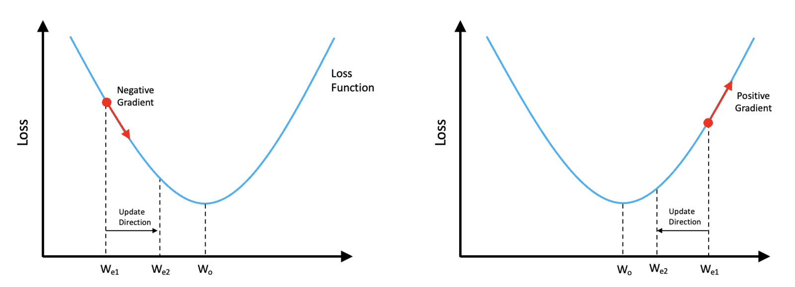
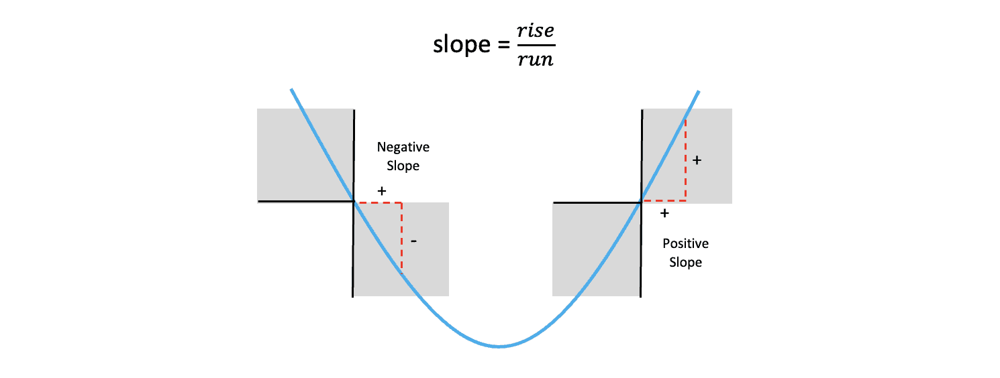
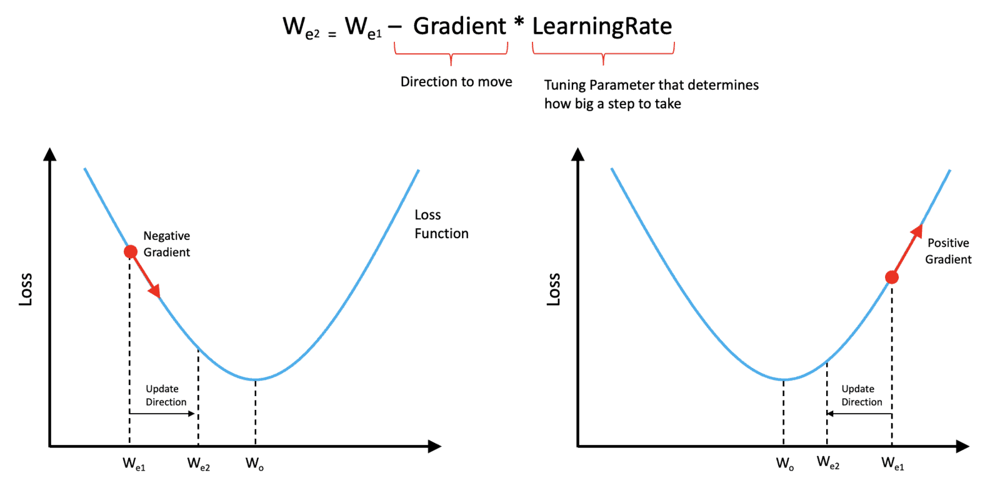

# Fundamentos del entrenamiento de una red neuronal


En esta unidad, cubriremos los elementos esenciales para entrenar redes neuronales en un problema de clasificación de imágenes. Seguiremos considerando la arquitectura interna de la red como una caja negra para poder centrarnos en otros componentes y conceptos fundamentales necesarios para entrenar redes neuronales.

Tabla de contenido
1 Introducción
2 Datos de entrenamiento etiquetados y codificación One-Hot
3 La función de pérdida
4 Descenso de gradiente (Optimización) )
5 Cálculo de muestra de actualización de peso
6 El circuito de entrenamiento completo
7 Parcelas de Entrenamiento
8. Realizar inferencias utilizando un modelo entrenado
9 Conclusión

# 1 Introducción
En la unidad anterior, abordamos una visión general de las redes neuronales, centrada principalmente en las entradas y salidas, y en cómo se interpretan los resultados en un problema de clasificación de imágenes. También aprendimos que las redes neuronales contienen pesos que deben ajustarse adecuadamente mediante un proceso de entrenamiento. En esta publicación, profundizaremos en cómo se entrenan las redes neuronales sin entrar en los detalles de una arquitectura de red específica. Esto nos permitirá analizar el proceso de entrenamiento a nivel conceptual, abarcando los siguientes temas.

Cómo se modelan los datos de entrenamiento etiquetados.
Cómo se utiliza una función de pérdida para cuantificar el error entre la entrada y la salida prevista.
Cómo se utiliza el descenso de gradiente para actualizar los pesos en la red.
2 Datos de entrenamiento etiquetados y codificación One-Hot
Analicemos con más detalle cómo se representan los datos de entrenamiento etiquetados para una tarea de clasificación de imágenes. Los datos de entrenamiento etiquetados consisten en imágenes y sus correspondientes etiquetas categóricas. Si una red está diseñada para clasificar objetos de tres clases (p. ej., Gatos, Perros, Otros), necesitaremos muestras de entrenamiento de las tres clases. Normalmente, se requieren miles de muestras de cada clase.

Los conjuntos de datos que contienen etiquetas categóricas pueden representarlas internamente como cadenas ("Gato", "Perro", "Otro") o como números enteros (0, 1, 2). Sin embargo, antes de procesar el conjunto de datos mediante una red neuronal, las etiquetas deben tener una representación numérica. Cuando el conjunto de datos contiene etiquetas enteras (p. ej., 0, 1, 2) para representar las clases, se proporciona un archivo de etiquetas de clase que define la asignación de los nombres de clase a sus representaciones enteras en el conjunto de datos. Esto permite asignar los números enteros a los nombres de clase cuando sea necesario. Como ejemplo concreto, considere la asignación de clases que se muestra a continuación.
```raw
Descripción de la etiqueta
  0 Gato
  1 perro
  2 Otros
```
Este tipo de codificación de etiquetas se denomina codificación de enteros porque se utilizan enteros únicos para codificar las etiquetas de clase. Sin embargo, cuando las etiquetas de clase no guardan relación entre sí, se recomienda utilizar la codificación one-hot . Esta técnica representa las etiquetas categóricas como vectores binarios (que contienen solo ceros y unos). En este ejemplo, tenemos tres clases diferentes (Gato, Perro y Otros), por lo que podemos representar numéricamente cada una de ellas con un vector de longitud tres, donde una de las entradas es un uno y las demás son todos ceros.
```raw
| Gato | Perro |Otro |
|---|---|---|
| 1 |0 |0 |
| 0 |1 |0 |
| 0 |  0 |1 |
| | | |
```
El orden particular es arbitrario, pero debe ser coherente en todo el conjunto de datos.

Consideremos primero una sola muestra de entrenamiento, como se muestra en la figura a continuación, que consta de la imagen de entrada y su etiqueta de clase. Para cada muestra de entrenamiento de entrada, la red generará una predicción compuesta por tres números que representan la probabilidad de que la imagen de entrada corresponda a una clase dada. La salida con la mayor probabilidad determina la etiqueta predicha. En este caso, la red predice (erróneamente) que la imagen de entrada es un "Perro" porque la segunda salida de la red tiene la mayor probabilidad. Observe que la entrada de la red es solo la imagen. Las etiquetas de clase de cada imagen de entrada se utilizan para calcular una pérdida, como se explica en la siguiente sección.


## 3 La función de pérdida
Todas las redes neuronales utilizan una función de pérdida que cuantifica el error entre el resultado predicho y la realidad fundamental para una muestra de entrenamiento dada. Como veremos en la siguiente sección, la función de pérdida puede utilizarse para guiar el proceso de aprendizaje (es decir, actualizar los pesos de la red para mejorar la precisión de las predicciones futuras).

Una forma de cuantificar el error entre la salida de la red y el resultado esperado es calcular la suma de errores al cuadrado (SSE), como se muestra a continuación. Esto también se conoce como pérdida. En el ejemplo siguiente, calculamos el error para una sola muestra de entrenamiento calculando la diferencia entre los elementos del vector de verdad fundamental y los elementos correspondientes de la salida prevista. Cada término se eleva al cuadrado, y la suma total de los tres representa el error total, que en este caso es 0.6638.

$$
SSE=
(1−0,37)^2+(0−0,50)^2+(0−0,13)^2=0.6638
$$

Al entrenar redes neuronales en la práctica, se utilizan muchas imágenes para calcular una pérdida antes de actualizar los pesos de la red. Por lo tanto, la siguiente ecuación se suele utilizar para calcular el Error Cuadrático Medio (EMM) de varias imágenes de entrenamiento. El ECM es simplemente la media del EMS de todas las imágenes utilizadas. El número de imágenes utilizadas para actualizar los pesos se denomina tamaño del lote (un tamaño de lote de 32 suele ser un buen valor predeterminado). El procesamiento de un lote de imágenes se denomina "iteración".

$$
MSE=
\sum_{i=1}^{n}(y_i - y_i)^2=media(SSE)
$$

## 4 Descenso de gradiente (Optimización)
Ahora que conocemos el concepto de función de pérdida, estamos listos para presentar el proceso de optimización utilizado para actualizar los pesos en una red neuronal. Afortunadamente, existe una forma sencilla de ajustar los pesos de una red neuronal llamada descenso de gradiente. Para simplificar, ilustraremos el concepto con un único parámetro ajustable llamado $O$, y vamos a suponer que la función de pérdida es convexa y, por lo tanto, tiene forma de cuenco, como se muestra en la figura.


*Fuente: [opencv.org](https://courses.opencv.org/courses/course-v1:Tensorflow+Bootcamp+TFKS/courseware/f7a0faad74eb496aa3795bb77144a236/fdeb573c42c246a7b2da7d6ff08ef0dc/?child=first)*

El valor de la función de pérdida se muestra en el eje vertical, y el valor de nuestro peso único entrenable se muestra en el eje horizontal. Supongamos que la estimación actual del peso es $W_{mi1}$.

Refiriéndonos al gráfico de la izquierda, si calculamos la pendiente de la función de pérdida en el punto correspondiente a la estimación del peso actual,
$W_{mi1}$. 
Podemos ver que la pendiente (gradiente) es negativa. En esta situación, necesitaríamos aumentar el peso para acercarnos al valor óptimo indicado por $W_o$. Por lo tanto, tendríamos que movernos en una dirección opuesta al signo del gradiente.

Por otra parte, si nuestra estimación de peso actual,
$W_{mi1} > W_o$ (como se muestra en el gráfico de la derecha), el gradiente sería positivo y necesitaríamos reducir el valor del peso actual para acercarnos al valor óptimo de $W_o$. Nótese que en ambos casos, todavía necesitamos movernos en una dirección opuesta al signo del gradiente.

Antes de continuar, aclaremos un punto por si se lo preguntan. Observen que, en ambas figuras, la flecha que dibujamos para representar la pendiente apunta hacia la derecha. En un caso, la flecha apunta hacia abajo y hacia la derecha, y en el otro, hacia arriba y hacia la derecha. Pero no se confundan por el hecho de que ambas flechas apuntan hacia la derecha; lo importante es el signo de la pendiente.

![]img/keras-loss-function-slope-sign.png)
*Fuente: [opencv.org](https://courses.opencv.org/courses/course-v1:Tensorflow+Bootcamp+TFKS/courseware/f7a0faad74eb496aa3795bb77144a236/fdeb573c42c246a7b2da7d6ff08ef0dc/?child=first)*

Recuerde que la pendiente de una línea se define como la elevación sobre la pendiente y que, cuando el peso está a la izquierda del valor óptimo, la pendiente de la función es negativa, y cuando está a la derecha del valor óptimo, la pendiente de la función es positiva. Por lo tanto, lo importante es el signo de la pendiente.


*Fuente: [opencv.org](https://courses.opencv.org/courses/course-v1:Tensorflow+Bootcamp+TFKS/courseware/f7a0faad74eb496aa3795bb77144a236/fdeb573c42c246a7b2da7d6ff08ef0dc/?child=first)*

En ambos casos descritos, necesitamos ajustar el peso en la dirección opuesta al signo del gradiente. Con estos conceptos en mente, podemos demostrar que la siguiente ecuación permite actualizar el peso en la dirección correcta, independientemente de su valor actual en relación con el valor óptimo.


*Fuente:[opencv.org](https://courses.opencv.org/courses/course-v1:Tensorflow+Bootcamp+TFKS/courseware/f7a0faad74eb496aa3795bb77144a236/fdeb573c42c246a7b2da7d6ff08ef0dc/?child=first)*

La mejor manera de entender esto es que el signo del gradiente determina la dirección en la que debemos movernos. Sin embargo, esta distancia debe ajustarse con un parámetro llamado tasa de aprendizaje ($\alpha$) , que suele ser un número pequeño, mucho menor que 1. La tasa de aprendizaje es algo que debemos especificar antes del entrenamiento y no algo que la red aprende. Parámetros como este suelen denominarse **hiperparámetros** para distinguirlos de los parámetros entrenables (como los pesos de la red).

En la práctica, la función de pérdida tiene múltiples dimensiones y no suele ser convexa, sino que presenta numerosos picos y valles. En general, la pendiente de la función de pérdida se denomina gradiente y es una función de todos los pesos de la red. Sin embargo, el enfoque utilizado para actualizar los pesos es conceptualmente el mismo que el descrito aquí.

## 5. Cálculo de muestra de actualización de peso
Para que esto sea un poco más concreto, hagamos un cálculo de ejemplo para actualizar el peso. Supongamos que el peso actual es $W_{mi1}$, que tiene un valor de $0.38$. También asumiremos que tenemos una tasa de aprendizaje de $.01$ y que la pendiente de la función de pérdida en el punto $W_{mi1}$ es igual a $-.55$. Usando la ecuación de actualización anterior, podemos calcular fácilmente una nueva estimación del peso, a la que nos referiremos como $W_{mi2}$. Este cálculo se simplificó porque estamos trabajando en una sola dimensión, que se puede extender fácilmente a múltiples dimensiones.


Un aspecto que aún no hemos abordado es cómo se calcula el gradiente de la función de pérdida con respecto a los pesos de la red. Afortunadamente, esto se gestiona mediante un algoritmo llamado retropropagación, integrado en frameworks de aprendizaje profundo como **TensorFlow**, **Keras** y **PyTorch**, por lo que no es necesario implementarlo.

## 6. El circuito de entrenamiento completo
Ahora que hemos cubierto todos los elementos esenciales asociados con el entrenamiento de una red neuronal, podemos resumir el proceso en el siguiente diagrama.

Aquí, tenemos una imagen de entrada a la izquierda y la salida de la red a la derecha, a la que nos referimos como $y'$
Usamos la etiqueta de verdad fundamental, $y$, junto con la salida prevista de la red para calcular una pérdida. Tenga en cuenta que no mostramos específicamente múltiples salidas de la red, pero debe entenderse que ambas $y'$ y $y$ son vectores cuya longitud es igual al número de clases para las que se está entrenando la red.

Tras calcular la pérdida, podemos calcular su gradiente con respecto a los pesos, lo que permite actualizarlos en la red. Este diagrama es importante y resume a grandes rasgos el proceso de entrenamiento de una red neuronal.

## 7. Entrenamiento
Ahora que tenemos una idea de cómo podemos actualizar los pesos en una red, vale la pena enfatizar que entrenar una red neuronal es un proceso iterativo que generalmente requiere pasar todo el conjunto de entrenamiento a través de la red varias veces.

Cada vez que el conjunto completo de datos de entrenamiento pasa por la red, lo denominamos época de entrenamiento (**training epoch**). El entrenamiento de redes neuronales suele requerir varias épocas de entrenamiento hasta que la pérdida deja de disminuir con el entrenamiento adicional. Como se puede observar en el primer gráfico a continuación, la velocidad a la que disminuye la pérdida disminuye gradualmente a medida que avanza el entrenamiento, lo que indica que el modelo se está acercando a su capacidad de aprendizaje.

También es muy común graficar la precisión del entrenamiento y, como es de esperar, a medida que la pérdida disminuye, la precisión tiende a aumentar, como se muestra en el segundo gráfico.

Hay muchos detalles importantes asociados con el entrenamiento de redes neuronales que no hemos cubierto en esta publicación inicial, pero a medida que avancemos en esta serie, continuaremos presentando conceptos más avanzados sobre este tema.

Nota: Un tema importante que aún no hemos abordado es la división de datos. Esto implica el concepto de un conjunto de datos de validación utilizado para evaluar la calidad del modelo entrenado durante el proceso de entrenamiento. Este es un tema importante y fundamental que se abordará en una próxima publicación.

## 8. Realizar inferencias utilizando un modelo entrenado
Ahora que hemos cubierto el proceso de entrenamiento de una red neuronal, vale la pena explicar brevemente qué haremos con ella. Una vez entrenada, podemos proporcionarle imágenes de contenido desconocido y usar la red para predecir la clase a la que pertenece la imagen. Esto se refleja en el diagrama a continuación. Observe que, en este punto, no necesitamos datos etiquetados. Solo necesitamos imágenes de contenido desconocido que deseamos clasificar. Realizar predicciones sobre datos desconocidos se conoce a menudo como usar la red para realizar inferencias.

## 9. Conclusión
Resumamos los puntos clave asociados al entrenamiento de redes neuronales.

Se requieren datos de entrenamiento etiquetados para entrenar una red neuronal para tareas de aprendizaje supervisado, como la clasificación de imágenes.
En la mayoría de los casos, se recomienda la codificación de etiquetas One-Hot para datos categóricos.
El entrenamiento de una red neuronal requiere una función de pérdida que se utiliza para cuantificar el error entre la salida de la red y la salida esperada.
El gradiente de la función de pérdida se calcula utilizando un algoritmo llamado retropropagación que está integrado en marcos de aprendizaje profundo como TensorFlow y PyTorch.
El descenso de gradiente se utiliza de manera iterativa para actualizar los pesos de la red neuronal.
Se utiliza un subconjunto de las imágenes de entrenamiento (tamaño del lote) para actualizar el peso. Esto se denomina iteración dentro de una época de entrenamiento.
Una época de entrenamiento consiste en procesar todo el conjunto de datos de entrenamiento a través de la red. Por lo tanto, el número de iteraciones en una época de entrenamiento es igual al número de imágenes de entrenamiento dividido entre el tamaño del lote.
Cada época de entrenamiento representa un paso completo del progreso del entrenamiento hasta que la función de pérdida se estabiliza. Precaución: En la práctica, no nos basamos únicamente en la pérdida de entrenamiento para evaluar la calidad del modelo entrenado. También se requiere la pérdida de validación, que abordaremos en una publicación posterior.

## Backpropagation

