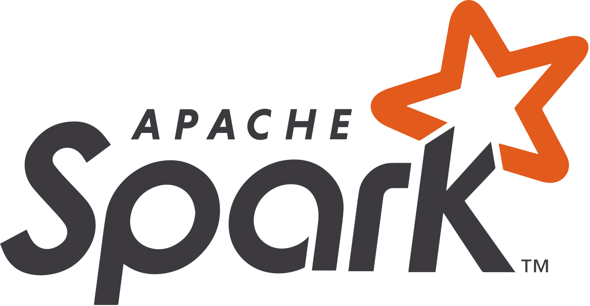

# Apache Spark
https://spark.apache.org/docs/latest/index.html

**Apache Spark** es un **motor de análisis unificado** diseñado para el procesamiento de datos a gran escala que permite coordinar la ejecución de tareas sobre datos distribuidos en un clúster de computadoras. Se define como una solución de computación en memoria que ofrece velocidades de procesamiento significativamente superiores a los modelos tradicionales basados en disco.

### Antecedentes y Origen
*   **Creación:** El proyecto nació en **2009** en el laboratorio AMP de la Universidad de California, Berkeley, iniciado por **Matei Zaharia** como parte del proyecto de investigación Mesos.

*   **Propósito inicial:** Surgió para abordar las limitaciones del framework **Hadoop MapReduce**, el cual era ineficiente para consultas interactivas o algoritmos iterativos debido a que escribía datos intermedios en el disco de forma persistente entre las fases de procesamiento.

*   **Evolución:** En 2013, el proyecto fue donado a la **Apache Software Foundation**, convirtiéndose rápidamente en uno de los proyectos de código abierto más activos de la fundación.

### Arquitectura Fundamental
Spark utiliza una arquitectura de tipo **maestro-esclavo** compuesta por los siguientes elementos clave:
*   **Driver Program (Programa conductor):** Es el corazón de la aplicación; ejecuta la función principal (`main()`), mantiene información sobre el estado de la aplicación, y es responsable de analizar, distribuir y programar el trabajo a través de los ejecutores.

*   **Cluster Manager (Administrador de clúster):** Controla las máquinas físicas y asigna recursos a las aplicaciones; Spark soporta administradores como **YARN**, **Mesos**, **Kubernetes** y su propio administrador **Standalone**.

*   **Executors (Ejecutores):** Procesos que corren en los nodos trabajadores (worker nodes) que ejecutan las tareas asignadas por el driver y almacenan los datos en memoria o disco.

### Detalles y Capacidades Clave
*   **Velocidad extrema:** Debido a sus capacidades de **computación en memoria**, Spark puede ser hasta 100 veces más rápido que Hadoop MapReduce para procesamiento en RAM y 10 veces más rápido en disco.

*   **Evaluación perezosa (Lazy Evaluation):** Spark no ejecuta las transformaciones de inmediato, sino que construye un plan de operaciones (un grafo acíclico dirigido o **DAG**) y solo realiza el cómputo cuando se invoca una **acción** (como contar o guardar datos), lo que permite optimizar el flujo de trabajo completo.

*   **Ecosistema Unificado:** Spark no solo procesa datos por lotes, sino que incluye bibliotecas integradas para diversas tareas:
    *   **Spark SQL:** Para procesamiento de datos estructurados mediante consultas tipo SQL.
    *   **Spark Streaming / Structured Streaming:** Para el procesamiento de flujos de datos en tiempo real.
    *   **MLlib:** Una biblioteca completa para tareas de aprendizaje automático escalable.
    *   **GraphX:** Para el procesamiento y análisis de grafos y redes.

*   **Abstracciones de Datos:** Inicialmente se basó en los **RDD** (Resilient Distributed Datasets), que son colecciones distribuidas de objetos tolerantes a fallos; posteriormente evolucionó hacia APIs estructuradas más eficientes como **DataFrames** y **Datasets**.

Spark es actualmente considerado el "sistema operativo" para Big Data, integrándose de forma nativa en plataformas modernas como **Azure Synapse Analytics**, **Databricks** y **AWS EMR**.

## Interacción entre Spark y Hadoop en el ecosistema Big Data
Spark y Hadoop interactúan de manera complementaria en el ecosistema Big Data, donde Spark suele actuar como el motor de procesamiento de alto rendimiento mientras aprovecha la infraestructura de almacenamiento y gestión de recursos de Hadoop.

A continuación se detallan las principales formas en que estas tecnologías colaboran:

### 1. Gestión de Recursos (YARN)
Spark puede ejecutarse sobre **YARN** (*Yet Another Resource Negotiator*), que es el sistema de gestión de recursos de Hadoop. 
*   **Convivencia:** YARN permite que aplicaciones de Spark y de Hadoop MapReduce se ejecuten **simultáneamente** en los mismos nodos de un clúster.
*   **Orquestación:** En este modelo, YARN se encarga de asignar "contenedores" (unidades de CPU y memoria) para que Spark ejecute sus tareas.

### 2. Almacenamiento de Datos (HDFS)
Aunque Spark no tiene un sistema de almacenamiento propio, está diseñado para trabajar estrechamente con **HDFS** (*Hadoop Distributed File System*).
*   **Acceso Nativo:** Spark puede leer y escribir datos directamente en HDFS en diversos formatos como texto, SequenceFiles, Parquet y Avro.
*   **Localidad de Datos:** Al trabajar con HDFS, Spark intenta programar las tareas en los nodos donde los datos residen físicamente, minimizando el tráfico de red y mejorando el rendimiento.

### 3. Reemplazo de MapReduce
Spark es considerado el **sucesor de Hadoop MapReduce**.
*   **Velocidad:** Spark es significativamente más rápido (hasta 100 veces más en memoria y 10 veces en disco) porque reduce las operaciones de lectura/escritura en disco que MapReduce realiza entre cada etapa de procesamiento.
*   **Simplicidad:** Mientras que MapReduce obliga a dividir cualquier problema en solo dos etapas (*Map* y *Reduce*) Spark permite flujos de trabajo más complejos y expresivos mediante un Grafo Acíclico Dirigido (DAG).

## Evaluación perezosa y optimización de consultas en Spark
La **evaluación perezosa** (*lazy evaluation*) es una de las características más críticas de Apache Spark para lograr su alta velocidad de procesamiento, ya que permite que el motor **retrase la ejecución de las transformaciones** hasta que sea estrictamente necesario devolver un resultado mediante una acción.

Esta estrategia ayuda a optimizar las consultas de las siguientes maneras:

*   **Optimización del plan de ejecución:** Al no ejecutar las instrucciones una por una, Spark puede construir un **grafo acíclico dirigido (DAG)** que representa todo el flujo de trabajo. Esto permite al optimizador (como Catalyst) **ver el conjunto completo de tareas** y reorganizarlas, eliminar pasos innecesarios o combinar operaciones múltiples en un solo paso físico (técnica llamada *pipelining*).

*   **Reducción del uso de memoria y almacenamiento:** Almacenar la lista de instrucciones consume mucho menos espacio que materializar y guardar **resultados de datos intermedios**. Spark solo procesa los datos necesarios para satisfacer la acción final, evitando "explotar" el almacenamiento con marcos de datos que no se volverán a utilizar.

*   **Filtrado inteligente (*Predicate Pushdown*):** Spark puede optimizar el flujo de datos empujando los filtros (operaciones `where`) directamente hacia la fuente de datos. Por ejemplo, si se define un filtro al final de una serie de transformaciones, Spark es lo suficientemente inteligente como para **aplicar ese filtro al leer los archivos originales**, evitando la carga innecesaria de millones de registros que luego serían descartados.

*   **Eficiencia en el tráfico de red:** La evaluación perezosa permite a Spark planificar las tareas de modo que se **minimice el intercambio de datos entre nodos** (*shuffling*), el cual es uno de los procesos más costosos en computación distribuida.

*   **Tolerancia a fallos mediante el linaje:** Spark mantiene la información de **linaje de cada RDD**, que es esencialmente la receta de cómo se creó. Gracias a que las transformaciones son perezosas y están almacenadas, si un nodo del clúster falla, Spark puede **reconstruir automáticamente solo las particiones de datos perdidas** siguiendo las instrucciones de su linaje desde la raíz.

En resumen, la evaluación perezosa permite que Spark pase de ser un ejecutor ciego de comandos a un **optimizador inteligente** que busca la ruta más eficiente para procesar grandes volúmenes de datos antes de mover un solo byte.

### 4. Interoperabilidad con el Ecosistema
Spark se integra con otras herramientas nacidas en Hadoop:
*   **Hive:** Spark SQL es compatible con Apache Hive, permitiendo a los usuarios ejecutar consultas SQL sobre tablas de Hive y acceder a su "metastore" sin necesidad de migrar los datos.

*   **HBase:** Spark puede utilizar bases de datos NoSQL de Hadoop como HBase para realizar análisis a gran escala.

En conclusión, la interacción entre ambos permite que las organizaciones utilicen la **estabilidad y escalabilidad de almacenamiento de Hadoop** junto con la **velocidad y versatilidad de procesamiento de Spark**.

## RDD
Los **RDD (Resilient Distributed Datasets)** son la abstracción de datos fundamental y primaria de Apache Spark. Conceptualmente, se definen como una **colección in-memory de objetos** distribuidos a través de los nodos de un clúster que pueden ser operados en paralelo.

A continuación, se detallan sus conceptos y características fundamentales:

### 1. Significado de sus siglas
El nombre describe con precisión sus propiedades principales:
*   **Resilient (Resiliente):** Son tolerantes a fallos; si un nodo falla, el dataset puede reconstruirse automáticamente utilizando la información de su "linaje" (la secuencia de pasos para crearlo).
*   **Distributed (Distribuido):** Los datos se dividen en una o más **particiones** distribuidas en la memoria de los nodos trabajadores (*Workers*) del clúster.
*   **Dataset (Conjunto de datos):** Consiste en registros identificables, que pueden ser líneas de texto, objetos de Python o registros de bases de datos.

### 2. Características clave
*   **Inmutabilidad:** Una vez creado, un RDD no se puede modificar en su lugar. Cualquier operación que parezca modificarlo (como un filtro) en realidad devuelve un RDD completamente nuevo.

*   **Evaluación perezosa (*Lazy Evaluation*):** Spark no ejecuta inmediatamente las transformaciones solicitadas. En su lugar, registra la operación en un grafo acíclico dirigido (DAG) y solo realiza el cómputo cuando se invoca una **acción** que requiere devolver un resultado. Esto permite a Spark optimizar todo el plan de ejecución antes de procesar los datos.

*   **Tipado fuerte:** El RDD puede representar diversos tipos de datos (Integer, String, o tipos personalizados definidos por el desarrollador).

*   **En memoria:** Están diseñados para almacenarse predominantemente en la memoria RAM, lo que los hace ideales para algoritmos iterativos y análisis interactivos, superando la velocidad de modelos como Hadoop MapReduce que guardan datos intermedios en disco.

### 3. Creación de un RDD
Existen tres formas principales de inicializar un RDD:
*   **Carga de datos externos:** Desde sistemas de archivos como HDFS, S3 o archivos locales, y fuentes como bases de datos SQL (vía JDBC) o JSON.

*   **Paralelización:** Tomando una colección existente en el programa (como una lista o un array) y distribuyéndola en el clúster.

*   **Transformación:** A partir de un RDD ya existente.

### 4. Operaciones con RDDs
Las operaciones se dividen estrictamente en dos categorías:
*   **Transformaciones:** Crean un nuevo RDD a partir de uno existente. Ejemplos comunes incluyen `map` (aplica una función a cada elemento), `filter` (selecciona elementos basados en una condición), `flatMap` y `distinct`.

*   **Acciones:** Son las que disparan el cómputo real y devuelven un valor al programa conductor (*Driver*) o guardan los datos en el almacenamiento. Ejemplos incluyen `collect` (trae todos los datos al driver), `count` (cuenta los registros), `reduce`, `first` y `saveAsTextFile`.

### 5. Persistencia y Caché
Por defecto, los RDD se recomputan cada vez que se llama a una acción sobre ellos. Para optimizar el rendimiento cuando un RDD se usará múltiples veces, Spark permite usar los métodos **`cache()`** o **`persist()`**. Esto guarda las particiones computadas en la memoria (o disco, según el nivel configurado) de los ejecutores para un acceso rápido posterior.

## Trabsformaciones comunes en RDD
Las transformaciones en Spark son operaciones que crean un nuevo RDD a partir de uno existente y se caracterizan por su **evaluación perezosa** (*lazy evaluation*), lo que significa que no se ejecutan hasta que una acción lo solicita.

A continuación, se detallan las transformaciones más comunes clasificadas por su propósito:

### 1. Transformaciones Básicas (Elemento a Elemento)
Estas se aplican a cualquier tipo de RDD:
*   **`map(func)`**: Pasa cada elemento del RDD a través de una función y devuelve un nuevo RDD con los resultados. Es una operación uno a uno.

*   **`filter(func)`**: Evalúa una expresión booleana para cada elemento y solo mantiene aquellos que devuelven `true`.

*   **`flatMap(func)`**: Similar a `map`, pero cada elemento de entrada puede mapearse a cero o más elementos de salida, "aplanando" el resultado final (útil para dividir frases en palabras).

*   **`distinct()`**: Elimina los elementos duplicados del RDD para devolver un conjunto de elementos únicos.

### 2. Transformaciones de Conjuntos y Estructura
Permiten combinar RDDs o cambiar su organización física:
*   **`union(otherRDD)`**: Devuelve un nuevo RDD que contiene la unión de los elementos del RDD original y el proporcionado como argumento.

*   **`intersection(otherRDD)`**: Devuelve solo los elementos que están presentes en ambos RDDs.

*   **`subtract(otherRDD)`**: Elimina del RDD original los elementos que también aparecen en el RDD de entrada.

*   **`sortBy(func, ascending)`**: Devuelve un RDD con los elementos ordenados según el criterio especificado.

*   **`repartition(num)` y `coalesce(num)`**: Se utilizan para cambiar el número de particiones. `repartition` puede aumentar o disminuir el número y causa un *shuffle* total, mientras que `coalesce` solo disminuye particiones y es más eficiente al evitar el movimiento masivo de datos si es posible.

### 3. Transformaciones para RDDs de Clave-Valor (*PairRDDs*)
Estas operaciones son fundamentales para el análisis de datos estructurados:
*   **`reduceByKey(func)`**: Agrupa los valores para cada clave y los combina usando una función asociativa y conmutativa. Es muy eficiente porque realiza una reducción local antes del intercambio de datos (*shuffle*).
*   **`groupByKey()`**: Agrupa todos los valores de una misma clave en una sola secuencia. Se recomienda usar `reduceByKey` en su lugar si el objetivo es agregar datos, debido al alto coste de red que genera.
*   **`mapValues(func)`**: Aplica una función solo a los valores de los pares clave-valor, manteniendo las claves originales intactas.
*   **`join(otherRDD)`**: Realiza un *inner join* basado en las claves de dos RDDs, devolviendo pares de la forma `(clave, (valor1, valor2))`.
*   **`leftOuterJoin` / `rightOuterJoin` / `fullOuterJoin`**: Versiones del *join* que permiten mantener registros de uno o ambos lados aunque no haya coincidencia de clave.
*   **`keys()` y `values()`**: Devuelven un nuevo RDD compuesto únicamente por las claves o por los valores del RDD original, respectivamente.

## Tipos de archivos soporta Spark para cargar RDDs
Apache Spark ofrece una amplia variedad de opciones para cargar datos en **RDD (Resilient Distributed Datasets)**, soportando tanto formatos de texto plano como formatos binarios y serializados.

Los tipos de archivos soportados se dividen principalmente en las siguientes categorías:

### 1. Archivos de Texto
*   **Texto plano:** El método `sc.textFile()` permite leer archivos de texto donde cada línea se convierte en un registro del RDD.
*   **Directorios de texto:** El método `wholeTextFiles()` permite leer múltiples archivos de texto pequeños en un directorio, devolviendo pares de clave-valor donde la clave es el nombre del archivo y el valor es su contenido completo.
*   **Formatos estructurados en texto:** Spark puede procesar archivos **JSON** (un objeto por línea), **CSV** y **XML**.

### 2. Formatos Binarios y Serializados
*   **SequenceFiles:** Un formato binario de Hadoop muy común para almacenar pares clave-valor.
*   **ObjectFiles:** Archivos que contienen objetos de Java serializados.
*   **Archivos Pickle:** Formato de serialización específico de Python, útil para persistir datos entre aplicaciones PySpark.
*   **Protocol Buffers (Protobufs):** Spark soporta formatos codificados binarios serializados como estos.

### 3. Formatos Columnares
Aunque estos suelen cargarse inicialmente como **DataFrames**, pueden convertirse fácilmente a RDDs:
*   **Parquet:** Formato de almacenamiento columnar optimizado para el ecosistema Hadoop y Spark.
*   **ORC (Optimized Row Columnar):** Formato eficiente para datos estructurados, común en entornos Hive.
*   **Avro:** Formato de serialización binario compacto y dependiente del esquema.

### 4. Soporte para Compresión
Spark puede leer de forma nativa varios formatos de archivos comprimidos, siempre que los códecs correspondientes estén disponibles en el sistema:
*   **Gzip** y **ZIP** (usando el método DEFLATE).
*   **BZIP2**.
*   **Snappy**, **LZO**, **LZ4** y **LZF**.

Es importante destacar que Spark intenta leer estos archivos desde sistemas de almacenamiento distribuidos como **HDFS, Amazon S3 o Azure Storage**, aprovechando la localidad de los datos para optimizar el rendimiento.

## Diferencias entre RDDs, DataFrames y Delta Lake

Las diferencias fundamentales entre RDDs, DataFrames y Delta Lake radican en su **nivel de abstracción**, su **estructura de datos** y su **función** dentro del ecosistema de análisis (siendo los dos primeros abstracciones de datos en memoria y el último una capa de almacenamiento).

### 1. RDD (Resilient Distributed Dataset)
Es la abstracción de datos más fundamental de Apache Spark.
*   **Naturaleza:** Es una colección distribuida de objetos que permite el procesamiento en paralelo en un clúster.
*   **Estructura:** Son **opacos**, lo que significa que Spark no conoce la estructura interna de los datos que contienen (pueden ser objetos de Python, listas, diccionarios, etc.).
*   **Nivel de Abstracción:** Es un **API de bajo nivel**. El usuario debe indicar explícitamente "cómo" hacer las cosas mediante funciones de programación funcional como `map`, `filter` y `reduce`.
*   **Optimización:** Spark tiene dificultades para optimizar los RDDs porque no entiende qué hay dentro de los objetos, lo que suele resultar en un rendimiento inferior comparado con las APIs estructuradas.

### 2. DataFrame
Es una API estructurada de alto nivel que se construye sobre los RDDs.
*   **Naturaleza:** Representa una tabla de datos con filas y columnas, similar conceptualmente a una tabla en una base de datos relacional o a un dataframe en Pandas o R.
*   **Estructura:** Son **conscientes del esquema** (schema-aware); conocen los nombres y tipos de las columnas. Esto permite un enfoque de manipulación **orientado a columnas**.
*   **Nivel de Abstracción:** Ofrece un lenguaje de dominio específico (DSL) mucho más fácil de usar que los RDDs y permite realizar consultas tipo SQL.
*   **Optimización:** Gracias a que Spark conoce la estructura de los datos, utiliza el optimizador **Catalyst** para generar planes de ejecución físicos altamente eficientes.

### 3. Delta Lake
A diferencia de los RDDs y DataFrames, Delta Lake no es una estructura de datos en memoria, sino una **capa de almacenamiento de código abierto**.
*   **Naturaleza:** Es un formato de tabla que aporta confiabilidad a los lagos de datos (Data Lakes), combinando la escalabilidad de estos con las capacidades de gestión de un Data Warehouse.
*   **Estructura:** Se basa en archivos **Parquet**, pero añade un **registro de transacciones** (Transaction Log o Delta Log) en una subcarpeta llamada `_delta_log`.
*   **Características Clave (que no poseen RDDs ni DataFrames por sí solos):**
    *   **Transacciones ACID:** Garantiza que las operaciones (inserciones, actualizaciones, borrados) sean atómicas y consistentes.
    *   **Viaje en el tiempo (Time Travel):** Permite consultar versiones anteriores de la tabla gracias al historial mantenido en el log.
    *   **Cumplimiento de Esquema (Schema Enforcement):** Evita que se escriban datos que no coincidan con la estructura definida, previniendo la corrupción del dato.
    *   **Operaciones DML:** Permite realizar `UPDATE`, `DELETE` y `MERGE` (upserts) de forma nativa sobre archivos en el almacenamiento.

### Tabla Comparativa Resumida

| Característica | RDD | DataFrame | Delta Lake |
| :--- | :--- | :--- | :--- |
| **Tipo** | Abstracción de datos en memoria. | Abstracción de datos en memoria. | Capa de almacenamiento (disco/nube). |
| **Estructura** | Sin esquema (opaco). | Estructurado (columnas con nombre). | Estructurado y versionado (Parquet + Log). |
| **API** | Bajo nivel (funcional). | Alto nivel (SQL / DSL). | API de tabla y comandos de gestión. |
| **Optimización** | Manual / Limitada. | Automática (Catalyst). | Almacenamiento eficiente (Data skipping, Z-Order). |
| **Garantías ACID** | No (volátil en memoria). | No (volátil en memoria). | **Sí** (Persistente). |

En resumen, los **RDDs** son para control total a bajo nivel, los **DataFrames** son el estándar moderno para procesamiento eficiente y estructurado en Spark, y **Delta Lake** es la tecnología que permite que esos DataFrames se guarden de forma segura, transaccional y con historial en el almacenamiento permanente.

## Spark y Azure Synapse en análisis de datos

La relación entre **Apache Spark** y **Azure Synapse Analytics** no es de competencia directa, sino de integración, ya que Spark es uno de los componentes fundamentales dentro del ecosistema de Azure Synapse.

A continuación se presenta una comparación detallada basada:

### 1. Definición y Propósito
*   **Apache Spark:** Es un motor de análisis unificado diseñado para el procesamiento de datos a gran escala. Se centra en la computación en memoria para ofrecer alta velocidad en tareas de datos masivos (Big Data).
*   **Azure Synapse:** Es un servicio de análisis ilimitado que fusiona el almacenamiento de datos empresariales (Data Warehouse) con el análisis de Big Data. Su objetivo es proporcionar una experiencia unificada para ingerir, preparar, administrar y servir datos para necesidades de BI y aprendizaje automático.

### 2. Componentes de Cómputo
*   **Spark:** Incluye módulos específicos como **Spark SQL** (datos estructurados), **Spark Streaming** (tiempo real), **MLlib** (aprendizaje automático) y **GraphX** (análisis de grafos).
*   **Azure Synapse:** Ofrece diversos entornos de ejecución (runtimes) en un solo lugar:
    *   **SQL pools (Dedicados y Sin servidor):** Para análisis basado en T-SQL.
    *   **Spark pools:** Integración nativa de Apache Spark optimizada para ingeniería de datos y ML.
    *   **Synapse Pipelines:** Para la integración y orquestación de datos sin código.

### 3. Facilidad de Uso y Experiencia de Usuario
*   **Spark:** Proporciona APIs ricas en lenguajes como **Python (PySpark)**, **Scala**, **Java**, **SQL** y **R**. Los desarrolladores suelen interactuar con él a través de shells o cuadernos (notebooks).
*   **Azure Synapse:** Introduce **Synapse Studio**, una interfaz web unificada que permite a ingenieros, científicos y analistas de datos realizar todas sus tareas (exploración, preparación, orquestación y visualización) en un solo entorno. Además de los lenguajes de Spark, Synapse añade soporte para **.NET (C#)** en sus cuadernos de Spark.

### 4. Integración y Ecosistema
*   **Spark:** Se integra bien con diversas fuentes de datos como HDFS, S3, NoSQL (Cassandra, MongoDB) y Kafka.
*   **Azure Synapse:** Ofrece una integración profunda con otros servicios de Microsoft:
    *   **Power BI:** Permite crear y visualizar informes directamente desde el espacio de trabajo de Synapse.
    *   **Azure Machine Learning:** Facilita la aplicación de modelos de ML a las aplicaciones inteligentes.
    *   **Azure Data Lake Storage Gen2:** Utilizado como almacenamiento primario para un análisis rentable.

### Tabla Comparativa Resumida

| Característica | Apache Spark | Azure Synapse Analytics |
| :--- | :--- | :--- |
| **Naturaleza** | Motor de procesamiento distribuido. | Plataforma de análisis unificada. |
| **Modelos de Cómputo** | Procesamiento en memoria. | SQL (Dedicado/Serverless) y Spark. |
| **Integración de Datos** | A través de bibliotecas y conectores externos. | Synapse Pipelines con más de 90 conectores nativos. |
| **BI y Visualización** | Requiere herramientas externas. | Integración nativa con Power BI. |
| **Administración** | Requiere gestionar el clúster (YARN, Mesos). | Totalmente administrado; permite pausa automática para ahorrar costes. |

En conclusión, mientras que **Apache Spark** es la herramienta de procesamiento de alto rendimiento para científicos e ingenieros, **Azure Synapse** es la plataforma que envuelve este motor junto con capacidades de SQL y herramientas de orquestación, facilitando una solución de análisis de extremo a extremo.