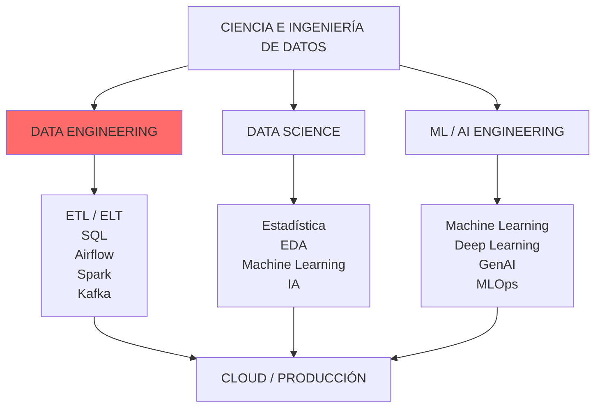
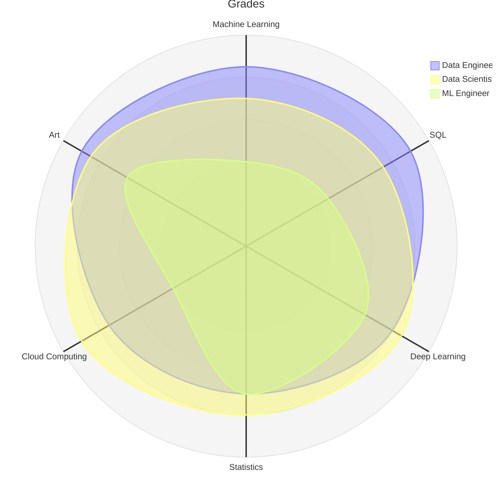

# Ciencia e Ingeniería de Datos

<figure>

<figcaption></figcaption>
</figure>

La evolución del mercado laboral ha generado una convergencia progresiva entre los perfiles de **Data Scientist, Data Engineer, Machine Learning Engineer, Analytics Engineer y AI Engineer**.

Tradicionalmente, estos perfiles se formaban de manera separada. Sin embargo, en la práctica profesional actual existe una creciente interdependencia:

* el Data Scientist necesita comprender cómo se generan, almacenan, transforman y disponibilizan los datos;
* el Data Engineer necesita comprender las características de los datasets que alimentan modelos analíticos y de Machine Learning;
* el ML Engineer necesita dominar tanto pipelines de datos como modelamiento;
* el profesional de IA necesita integrar datos, modelos, APIs, infraestructura y mecanismos de evaluación.

#### 📚 Objetivo

Formar profesionales capaces de **diseñar, desarrollar, implementar, evaluar y operar soluciones integrales de datos**, combinando fundamentos de Ciencia de Datos, Ingeniería de Datos, Machine Learning, Inteligencia Artificial, arquitectura de software, computación distribuida, cloud computing y MLOps.

No es formar especialistas aislados en herramientas, sino profesionales capaces de desarrollar el ciclo completo:

:::info[Capacidades:]
Diseñar y desarrollar soluciones de datos completas, desde la adquisición e ingestión de información hasta su procesamiento, almacenamiento, análisis, modelamiento predictivo, implementación de soluciones de inteligencia artificial y despliegue en ambientes productivos.
:::

En un entorno productivo, ambos mundos se encuentran estrechamente relacionados.

Un modelo predictivo de alto rendimiento puede ser inútil si:

* los datos no llegan correctamente;
* el pipeline no es reproducible;
* existen problemas de calidad;
* el dataset presenta data drift;
* el proceso no está automatizado;
* el modelo no puede desplegarse;
* no existe monitoreo;
* el código solamente funciona dentro de un notebook.

Por otra parte, un Data Engineer necesita comprender:

* qué variables necesita un modelo;
* cómo se genera leakage;
* cómo preparar features;
* cómo evaluar datasets;
* cómo funcionan los modelos;
* qué características debe tener un dataset analítico.

Por ello, se propone una formación **T-shaped**:

 

